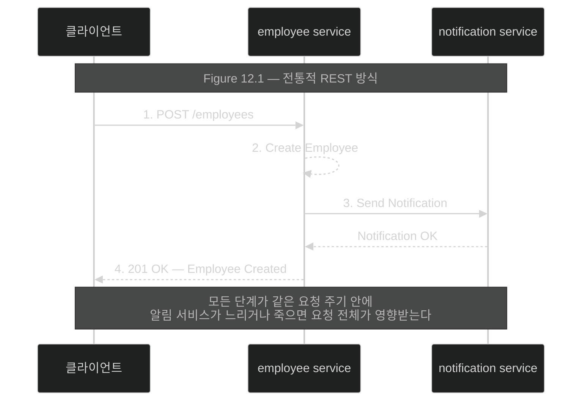
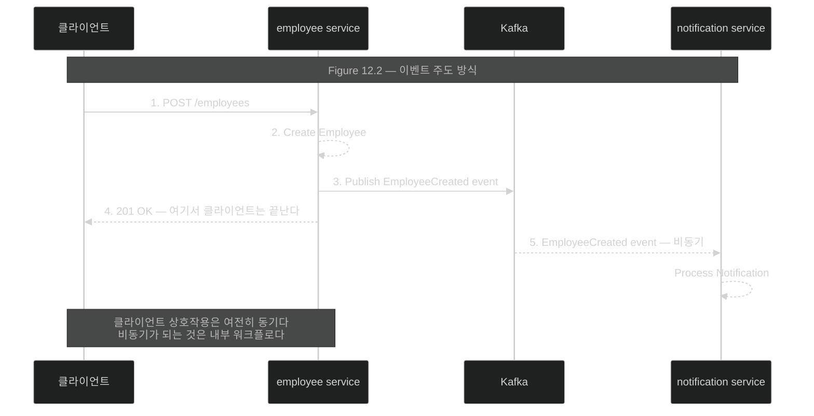

# 동기와 이벤트 주도 — 응답 전에 무엇을 끝내야 하는가

## 한눈에 보기

| | REST 방식 | 이벤트 주도 방식 |
|---|---|---|
| 알림 서비스 호출 | **응답 전에** | 응답 **후에**, 비동기로 |
| 알림 서비스가 느리면 | 요청 전체가 느려진다 | 클라이언트는 영향 없음 |
| 알림 서비스가 죽으면 | 요청이 실패한다 | 나중에 처리된다 |
| 새 소비자 추가 | producer 코드 수정 | **producer 변경 없음** |

**클라이언트 상호작용은 여전히 동기다.** 바뀌는 것은 내부 워크플로다.

## 1. 왜 이게 필요한가

지금까지 여덟 장 넘게 전통적인 request-response 모델로 애플리케이션을 만들었다. 그 방식은 많은 시나리오에서 잘 동작하고 **현대 시스템 설계의 핵심으로 남아 있다.**

그런데 애플리케이션이 커지면 서비스 간 통신이 요청을 보내고 응답을 받는 문제 이상이 된다.

**하나의 비즈니스 연산이 여러 서비스를 거칠 수 있고**, 각 서비스는 자기만의 가용성·지연·처리 시간을 갖는다. 이 서비스들이 서로 직접 의존하면 **한 부분의 실패나 지연이 전체 흐름에 영향**을 준다.

**[[비동기-통신]]**(= 보낸 쪽이 완료를 기다리지 않는 통신)과 **[[이벤트-주도]]**(= 이벤트를 발행·구독해 통신하는 아키텍처 스타일)는 **발신자의 역할을 바꿔** 이를 해결한다.

다른 서비스를 호출하고 그것이 일을 끝내기를 기다리는 대신, **무언가 일어났다는 사실을 [[이벤트]]**(= 무슨 일이 있었는지 기술하는 비즈니스 사실)**로 발행해 기록한다.** 그러면 다른 서비스들이 그 이벤트를 독립적으로 소비하고 반응할 수 있다.

## 2. 어떻게 동작하는가

### 2.1 REST 방식의 직원 생성

구체적인 시나리오로 보자. 직원을 만들고 알림을 보내는 흐름이다.

1. 클라이언트가 employee service에 직원 생성을 요청한다.
2. 직원이 생성된다.
3. employee service가 **알림을 보내려고 notification service를 호출한다.**
4. 클라이언트에 응답을 반환한다.

**이 모든 단계가 같은 요청 주기 안에서 일어난다.**

여기서 3번이 문제의 자리다. 알림 서비스가 느리거나 사용할 수 없으면 **요청 전체가 영향을 받는다.** 클라이언트는 직원이 만들어졌는지도 모른 채 타임아웃을 받는다.

그런데 생각해 보면 — **알림 발송이 직원 생성 응답의 성공 조건인가?** 대부분의 도메인에서 아니다. 직원은 이미 저장됐고, 알림은 나중에 가도 된다.

### 2.2 이벤트 주도 방식

같은 흐름을 이벤트로 바꾸면 다섯 단계가 된다.

1. 클라이언트가 employee service에 직원 생성을 요청한다.
2. 직원이 생성된다.
3. employee service가 **`EmployeeCreated` 이벤트를 [[Broker]]**(= 이벤트를 수신·저장·전달하는 중간자)**에 발행한다** — 여기서는 Kafka.
4. **클라이언트에 응답을 반환한다.**
5. notification service가 **비동기로** 이벤트를 소비해 알림을 처리한다.

핵심은 3번과 4번의 순서다. **응답이 알림 처리를 기다리지 않는다.**

그리고 중요한 사실 하나 — 이 모델에서도 **클라이언트 상호작용은 여전히 [[동기-통신]]**(= 응답이 올 때까지 기다리는 통신)**이다.** 클라이언트는 여전히 employee service로부터 응답을 받는다. **비동기가 되는 것은 내부 워크플로**다.

이 구분이 중요한 이유는, "이벤트 주도로 바꾸면 API가 비동기가 된다"는 오해가 흔하기 때문이다. 바뀌는 것은 **경계 안쪽**이다.

### 2.3 얻는 것 넷

| 이점 | 뜻 |
|---|---|
| employee service가 **누가 소비하는지 알 필요가 없다** | 이벤트를 발행할 뿐이다 |
| 소비자가 **독립적으로 진화**할 수 있다 | producer를 건드리지 않는다 |
| notification service의 실패가 **클라이언트 요청에 영향을 주지 않는다** | 경계가 갈렸다 |
| 실패가 **격리되고 전파되지 않는다** | 장애가 시스템을 타고 번지지 않는다 |

### 2.4 디커플링이 실제로 뜻하는 것

핵심 이점 하나는 이 모델이 서비스 사이의 **[[디커플링]]**(= 발행하는 쪽이 누가·몇이·언제 소비할지 몰라도 되는 상태)을 촉진한다는 점이다.

이벤트를 발행하는 서비스는 세 가지를 몰라도 된다.

- **어떤** 서비스가 소비할지
- 소비자가 **몇 개**나 있는지
- 각 소비자가 **언제** 처리할지

그래서 두 가지가 가능해진다.

**첫째, 한 서비스의 변경이 다른 서비스의 즉각적 변경을 덜 요구한다.** 기존 이벤트에 반응하는 **새 소비자를 producer 변경 없이 추가**할 수 있다. 감사 로그를 남기는 서비스를 붙이고 싶다면 그냥 구독하면 된다.

**둘째, 소비자가 일시적으로 죽어도 producer는 계속 발행한다.** 소비자는 살아난 뒤 나중에 처리한다. 이것이 REST에서는 불가능하다 — 호출 대상이 죽으면 호출이 실패한다.

### 2.5 공짜가 아니다

이 접근은 직접 의존을 줄이고 각 부분이 더 독립적으로 진화·확장·복구하게 한다. **동시에 새로운 설계 관심사를 들여온다.**

- 이벤트 구조
- 전달 보장
- 순서
- 재시도
- **[[결과적-일관성]]**(= 모든 서비스가 즉시 같은 상태를 보지는 않지만 시간이 지나면 수렴하는 성질)

이 목록이 이 장의 나머지 목차다. [[02-events-messages-and-delivery-semantics]]가 이벤트 구조와 전달 보장을, [[03-apache-kafka-fundamentals]]가 순서를, [[05-reliability-patterns-retries-dlt-idempotency]]가 재시도를 다룬다.

### 2.6 비유와 그 한계

식당 주문과 영수증에 빗댈 수 있다. REST 방식은 **주방에서 요리가 나오고 손님이 받는 것까지 확인한 뒤에야 영수증을 주는 것**이다. 이벤트 주도는 **주문을 접수하고 영수증을 바로 주고**, 주방은 주문표를 보고 알아서 만든다.

**깨지는 지점 둘.** 첫째, 식당에서는 손님이 **음식을 받아야 거래가 끝나지만**, 이벤트 주도에서는 응답을 준 뒤에 실패해도 **클라이언트가 모른다** — 그래서 실패 처리를 소비자 쪽에 설계해야 하고 그게 [[05a-dead-letter-topics]]다. 둘째, 주문표는 종이 한 장이지만 이벤트는 **여러 소비자가 각자 읽는다** — 누가 읽었는지 추적하는 문제가 새로 생기고, 그게 offset과 consumer group이다.

## 3. 그림으로 보기

Figure 12.1과 12.2(책 pp. 319–320)의 재현이다. 같은 시나리오를 두 방식으로 나란히 놓는다.

## 4. 이 노트에 나온 용어

- **[[동기-통신]]**: 응답이 올 때까지 기다리는 통신.
- **[[비동기-통신]]**: 보낸 쪽이 완료를 기다리지 않는 통신.
- **[[이벤트-주도]]**: 이벤트를 발행·구독해 통신하는 아키텍처 스타일.
- **[[디커플링]]**: 발행하는 쪽이 누가·몇이·언제 소비할지 몰라도 되는 상태.
- **[[결과적-일관성]]**: 즉시는 아니지만 시간이 지나면 상태가 수렴하는 성질.
- **[[이벤트]]**: 무슨 일이 있었는지 기술하는 비즈니스 사실.
- **[[Broker]]**: 이벤트를 수신·저장·전달하는 중간자.

## 5. 자주 헷갈리는 것

**"이벤트 주도로 바꾸면 API가 비동기가 된다"** — 아니다. 책이 명시한다. **클라이언트 상호작용은 여전히 동기**이고 클라이언트는 응답을 받는다. 바뀌는 것은 서비스 경계 **안쪽**이다.

**"REST는 낡았다"** — 책의 첫 문단이 그 반대를 말한다. request-response는 **현대 시스템 설계의 핵심으로 남아 있다.** 문제는 그것을 **모든 상호작용에 쓰는 것**이다 — [[06-choosing-between-rest-and-messaging]].

**응답을 준 뒤의 실패는 클라이언트가 모른다** — 이것이 이 모델의 근본 성질이다. "직원은 만들어졌는데 알림이 안 갔다"는 상태가 정상적으로 존재할 수 있고, 그것을 **결과적 일관성**이라 부른다. 그 상태를 감당할 수 있는 도메인에만 쓴다.

**"디커플링 = 의존이 없다"** — 코드 의존은 사라지지만 **이벤트 스키마에 대한 의존**이 생긴다. producer가 필드를 지우면 consumer가 깨진다. 그게 "스키마 진화"라는 새 관심사다.

## 6. 언제 안 쓰나 / 경계

- **응답 전에 반드시 끝나야 하는 일**에는 쓰지 않는다. 결제 승인이나 재고 차감을 이벤트로 미루면 클라이언트에게 거짓말을 하게 된다.
- **강한 일관성이 요구되는 도메인**에는 맞지 않는다.
- **서비스가 둘뿐이고 함께 배포된다면** 복잡도만 는다.
- **추적이 어려워진다는 대가**를 계산에 넣는다 — [[01a-core-components-of-event-driven-systems]].

## 7. 연결

- [[01a-core-components-of-event-driven-systems]] — 이 흐름을 이루는 네 구성 요소와 그 trade-off.
- [[02-events-messages-and-delivery-semantics]] — 발행되는 것이 정확히 무엇인지.
- [[04b-implementing-the-employee-service]] — 이 그림의 3번을 코드로 옮긴 자리.
- [[06-choosing-between-rest-and-messaging]] — 두 방식의 선택 기준.

## 8. 스스로 확인

- REST 흐름의 4단계 중 어느 지점이 문제이고, 왜 그것이 응답의 성공 조건이 아닌가?
- "클라이언트 상호작용은 여전히 동기"라는 말이 정확히 무엇을 뜻하는가?
- 디커플링이 producer에게 몰라도 되게 해 주는 세 가지는?
- 이벤트 주도가 들여오는 새 설계 관심사를 다섯 가지 들어 보라.

> 네 문항을 스스로 답한 **뒤에** [[_01-asynchronous-and-event-driven-communication]]에서 모범답안과 대조한다. 먼저 열면 이 문항들은 다시 인출 문제로 쓸 수 없다.

<!-- ==== 아래는 내 영역 · 스킬 수정 금지 ==== -->

## 내 설명 시도

## 막혔던 지점

## 리뷰 이력
