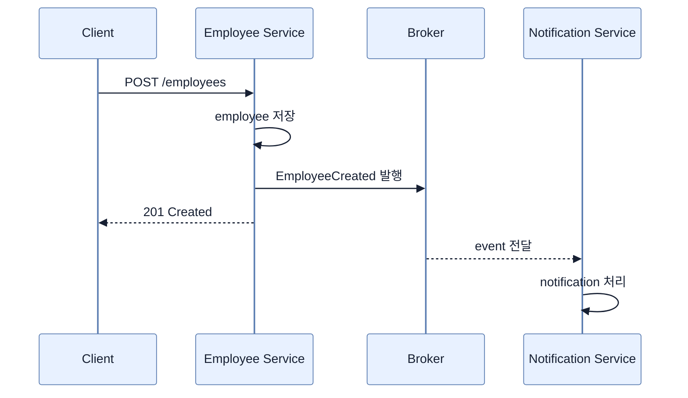

# 비동기·이벤트 기반 통신 소개

## 한눈에 보기

Event-driven communication에서는 sender가 다른 서비스를 직접 호출해 완료를 기다리지 않고 “무슨 일이 일어났는가”를 broker에 발행한다. Producer와 consumer의 시간·주소·확장 규모를 분리하지만, ordering·retry·schema evolution·eventual consistency라는 새 책임이 생긴다.

## 1. 왜 이게 필요한가

동기 직원 생성 흐름이 `employee service → notification service → client response`라면 notification의 지연·장애가 전체 요청을 늦추거나 실패시킨다. Event-driven 흐름은 직원을 저장하고 `EmployeeCreated`를 발행한 뒤 응답하며, notification service는 나중에 독립적으로 처리한다.

이 방식은 새 consumer를 producer 수정 없이 붙이고, consumer가 잠시 중단돼도 broker에 쌓인 이벤트를 복구 후 처리하게 한다. 반면 하나의 business flow가 여러 process와 시간대로 흩어져 추적과 실패 진단이 어려워진다.

## 2. 어떻게 동작하는가

- **Producer**가 의미 있는 business change를 event로 만든다.
- **Broker**가 message를 받아 저장하고 subscriber에게 전달한다.
- **Consumer**가 구독한 event에 반응한다.

Client와 employee service의 HTTP 구간은 여전히 synchronous일 수 있다. “전체 system을 async로 바꾼다”가 아니라 즉시 완료가 필요 없는 내부 후속 작업에 asynchronous boundary를 둔다. 이 경계 때문에 producer의 transaction과 publish 사이 consistency, consumer의 중복 처리, cross-service trace도 설계 대상이 된다.

## 3. 그림으로 보기

## 4. 이 노트에 나온 용어

- **producer**: business event를 만들고 broker에 발행하는 구성 요소.
- **broker**: producer와 consumer 사이에서 message를 저장·전달하는 middleware.
- **consumer**: event를 구독해 후속 업무를 수행하는 구성 요소.
- **eventual consistency**: 분산된 구성 요소의 상태가 즉시가 아니라 시간이 지나 일치하는 모델.

## 7. 연결

- [[02-events-messages-and-delivery-semantics]] — 전달되는 business fact와 기술 container를 구분한다.
- [[03-apache-kafka-fundamentals]] — 책이 broker로 선택한 Kafka의 구조다.
- [[chapter-11-virtual-threads-in-java-and-spring-boot/03-integrating-virtual-threads-with-taskexecutor|TaskExecutor]] — process 내부 background task와 broker 기반 분산 비동기의 차이다.

## 8. 스스로 확인

- 전체 1차 정리 후: 직원 생성 예로 synchronous와 event-driven 흐름의 장애 전파 차이를 설명한다.

<!-- ==== 아래는 내 영역 · 스킬 수정 금지 ==== -->

## 내 설명 시도

## 막혔던 지점

## 리뷰 이력

