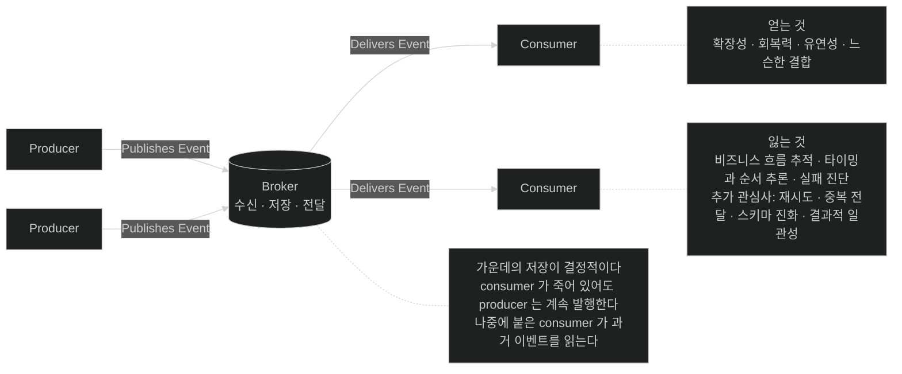

# 네 구성 요소와 그 대가 — 추적이 어려워진다

## 한눈에 보기

| 구성 요소 | 하는 일 |
|---|---|
| Producer | 의미 있는 일이 생겼을 때 이벤트를 **방출** |
| Event (message) | 무슨 일이 있었는지 기술하는 **정보** |
| Broker | 이벤트를 **수신·저장·전달**. producer와 consumer를 분리 |
| Consumer | 이벤트를 **구독하고 반응** |

| 얻는 것 | 잃는 것 |
|---|---|
| 확장성·회복력·유연성·느슨한 결합 | **비즈니스 흐름 추적**, 타이밍과 순서 추론, 실패 진단 |

## 1. 왜 이게 필요한가

[[01-asynchronous-and-event-driven-communication]]에서 이벤트 주도 흐름의 모습을 봤다. 그 흐름을 이루는 **부품이 무엇인지**를 정리해 두면, 이후의 Kafka 이야기가 어디에 대응하는지 바로 보인다.

그리고 그만큼 중요한 것이 **대가**다. 이 절은 이 장에서 유일하게 **이벤트 주도의 단점을 정면으로 나열하는 자리**다.

## 2. 어떻게 동작하는가

### 2.1 네 구성 요소

이벤트 주도 시스템은 작은 핵심 구성 요소 집합 위에 세워진다. 직접적인 요청·응답 호출에 기대는 대신, 서비스들이 **broker를 통해 이벤트를 발행하고 소비**하며 통신한다.

**[[Producer]]**(= 의미 있는 일이 생겼을 때 이벤트를 방출하는 구성 요소). 시스템에서 무언가 의미 있는 일이 일어났을 때 이벤트를 낸다.

**[[이벤트]]**(= 무슨 일이 있었는지 기술하는 비즈니스 사실). 하류 소비자에게 관련 있는 **비즈니스 데이터**를 보통 담는다. 그리고 여기서 중요한 문장이 나온다 — **일단 발행되면 이벤트는 메시징 인프라가 옮기는 [[메시지]]**(= 이벤트를 시스템 사이로 옮기는 기술적 컨테이너)**가 된다.** 이 전환이 [[02-events-messages-and-delivery-semantics]]의 주제다.

**[[Broker]]**(= 이벤트를 수신·저장·전달하는 중간자). 받고, 저장하고, 전달하는 책임을 진다. **producer를 consumer로부터 분리**해, producer가 **어떤 서비스가 처리할지 모르고도** 발행하게 한다. 널리 쓰이는 예로 Kafka와 RabbitMQ가 있다.

**[[Consumer]]**(= 이벤트를 구독하고 반응하는 구성 요소).

### 2.2 broker가 하는 세 가지 일의 무게

"수신·저장·전달"이 나란히 적혀 있지만 **가운데가 결정적**이다.

- **수신**만 한다면 그냥 중계기다.
- **저장**하기 때문에 consumer가 죽어 있어도 producer가 계속 발행할 수 있다.
- **저장**하기 때문에 나중에 붙은 새 consumer가 과거 이벤트를 읽을 수 있다.

[[01-asynchronous-and-event-driven-communication]]에서 본 **[[디커플링]]**(= 발행하는 쪽이 소비자를 몰라도 되는 상태)의 물리적 근거가 이 "저장"이다. 그리고 그것이 Kafka의 commit log로 구체화된다 — [[03-apache-kafka-fundamentals]].

### 2.3 이점

producer와 consumer가 독립적으로 동작하므로 **각 서비스가 자기 필요에 따라 진화하고 확장**할 수 있다. 그래서 쉬워지는 것 셋이다.

- 새 consumer 추가
- 여러 인스턴스에 부하 분산
- 실패 격리 — 한 부분의 문제가 전체 비즈니스 흐름을 즉시 끊지 않는다

한 단어씩 뽑으면 **확장성·회복력·유연성·느슨한 결합**이다.

### 2.4 대가

**어떤 접근이든 그렇듯 이벤트 주도 모델도 trade-off를 들여온다.** 처리가 **분산되고 비동기**이기 때문에 세 가지가 어려워진다.

| 어려워지는 것 | 왜 |
|---|---|
| **서비스를 가로지르는 비즈니스 흐름 추적** | 한 요청이 여러 서비스에서 시차를 두고 처리된다 |
| **타이밍과 순서 추론** | 언제 처리될지 보장이 없다 |
| **실패 진단** | 실패가 원래 요청과 다른 시간·다른 서비스에서 난다 |

그리고 팀이 **추가로 다뤄야 하는 관심사** 넷이 있다 — 재시도, 중복 전달, **스키마 진화**, **[[결과적-일관성]]**(= 시간이 지나면 상태가 수렴하는 성질). 이것들이 설계·운영 복잡도를 더한다.

책이 이 절을 닫는 문장이 균형 잡혀 있다.

> 실무에서 이벤트 주도 시스템은 상당한 이점을 주지만, **이해 가능하고 신뢰할 만한 상태로 남으려면 신중한 모델링·모니터링·오류 처리 전략이 필요하다.**

"모니터링"이 목록에 들어 있는 것이 우연이 아니다. 흐름 추적이 어려워졌으므로 **관측이 선택이 아니라 필수 조건**이 된다.

### 2.5 비유와 그 한계

우체국에 빗댈 수 있다. 발신인(producer)이 편지(event)를 우체국(broker)에 맡기면, 우체국이 **보관했다가** 수취인(consumer)에게 전한다. 발신인은 수취인이 지금 집에 있는지 몰라도 된다.

**깨지는 지점 셋.** 첫째, 편지는 **한 사람에게 가지만** 이벤트는 여러 consumer가 각자 읽는다. 둘째, 우체국은 배달을 완료하면 편지를 없애지만 Kafka는 **설정된 기간 동안 보관**해 재생이 가능하다. 셋째, 편지가 안 왔으면 발신인에게 물어보면 되지만, **이벤트가 처리되지 않은 것을 알아채는 일 자체가 어렵다** — 그게 위에서 말한 "추적의 어려움"이고, 이 장이 [[05a-dead-letter-topics]]에서 DLT를 도입하는 이유다.

## 3. 그림으로 보기

Figure 12.3(책 p.321)의 재현이다.

## 4. 이 노트에 나온 용어

- **[[Producer]]**: 의미 있는 일이 생겼을 때 이벤트를 방출하는 구성 요소.
- **[[Consumer]]**: 이벤트를 구독하고 반응하는 구성 요소.
- **[[Broker]]**: 이벤트를 수신·저장·전달하는 중간자.
- **[[이벤트]]**: 무슨 일이 있었는지 기술하는 비즈니스 사실.
- **[[메시지]]**: 이벤트를 시스템 사이로 옮기는 기술적 컨테이너.
- **[[디커플링]]**: 발행하는 쪽이 누가·몇이·언제 소비할지 몰라도 되는 상태.
- **[[결과적-일관성]]**: 즉시는 아니지만 시간이 지나면 상태가 수렴하는 성질.

## 5. 자주 헷갈리는 것

**"Event (message)"라는 병기가 헷갈린다** — 원문이 구성 요소 이름을 `Event (message)`로 적는데, 이 둘은 **같은 것의 두 국면**이다. 도메인에서는 이벤트, 인프라 위에서는 메시지다. [[02-events-messages-and-delivery-semantics]]가 이 구분을 따로 다룬다.

**"실패가 격리된다"와 "실패 진단이 어렵다"는 모순이 아니다** — 앞의 것은 **영향 범위**가 좁아진다는 뜻이고, 뒤의 것은 **원인 추적**이 어려워진다는 뜻이다. 장애가 덜 번지는 대신 어디서 났는지 찾기 어렵다.

**모니터링이 선택이 아니다** — 흐름 추적이 어려워졌으므로 관측이 이 아키텍처의 **전제 조건**이 된다. 이 책의 Chapter 13이 그 도구를 다루는데, 두 장이 명시적으로 연결되지는 않는다.

## 6. 언제 안 쓰나 / 경계

- **관측 체계가 없다면** 이벤트 주도로 가지 않는다. 문제가 생겨도 어디서 났는지 알 수 없다.
- **스키마를 통제할 수 없다면** 위험하다. producer가 필드를 지우면 모든 consumer가 깨진다.
- **순서가 엄격히 중요한 흐름**은 설계가 까다롭다 — [[03-apache-kafka-fundamentals]]의 partition과 key.
- **팀이 하나이고 서비스가 둘이라면** 복잡도만 는다.

## 7. 연결

- [[01-asynchronous-and-event-driven-communication]] — 이 구성 요소들이 이루는 실제 흐름.
- [[02-events-messages-and-delivery-semantics]] — 이벤트와 메시지의 구분, 그리고 전달 보장.
- [[03-apache-kafka-fundamentals]] — broker의 "저장"이 commit log로 구체화되는 자리.
- [[05a-dead-letter-topics]] — "실패 진단이 어렵다"에 대한 실무적 대응.

## 8. 스스로 확인

- broker의 세 가지 일 중 디커플링을 실제로 가능하게 하는 것은 무엇이고 왜인가?
- "실패가 격리된다"와 "실패 진단이 어렵다"가 왜 동시에 참인가?
- 이벤트 주도가 팀에 추가로 요구하는 네 가지 관심사를 들어 보라.
- 이 아키텍처에서 관측이 선택이 아닌 이유는?

> 네 문항을 스스로 답한 **뒤에** [[_01a-core-components-of-event-driven-systems]]에서 모범답안과 대조한다. 먼저 열면 이 문항들은 다시 인출 문제로 쓸 수 없다.

<!-- ==== 아래는 내 영역 · 스킬 수정 금지 ==== -->

## 내 설명 시도

## 막혔던 지점

## 리뷰 이력
