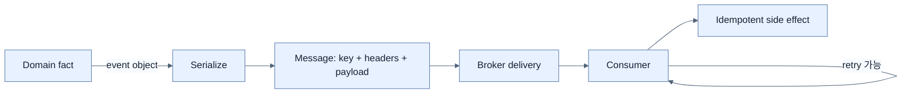

# Event·Message·전달 의미론 이해하기

## 한눈에 보기

Event는 “직원이 생성됐다” 같은 domain fact이고, message는 그 fact를 시스템 사이로 운반하는 기술 container다. 분산 시스템의 전달 보장은 손실·중복·coordination 비용 사이의 선택이며, 실무 기본값은 흔히 at-least-once와 idempotent consumer의 조합이다.

## 1. 왜 이게 필요한가

Producer가 보냈다는 사실, broker가 저장했다는 사실, consumer side effect가 끝났다는 사실은 서로 다른 시점이다. Network와 process 장애 사이에서 모두를 원자적으로 보장하려면 큰 coordination 비용이 든다. 따라서 전달 semantic을 명시하지 않으면 retry 정책과 consumer의 안전성을 올바르게 정할 수 없다.

## 2. 어떻게 동작하는가

| 의미론 | 전달 횟수 | 장점 | 대가·적합한 경우 |
|---|---:|---|---|
| at-most-once | 0 또는 1 | 빠르고 중복 없음 | 손실 가능; 일부 log·metric |
| at-least-once | 1 이상 | retry로 손실 위험 감소 | 중복 가능; idempotency 필수 |
| exactly-once | 정확히 1 | 관찰되는 중복·손실 억제 | producer·broker·consumer coordination 복잡 |

```java
public record EmployeeCreatedEvent(
    Long employeeId, String name, String email, Instant createdAt) {}
```

이 record는 domain fact의 payload다. Broker가 serialize한 header·key·payload·metadata로 감싸 운반할 때 message가 된다. Exactly-once라는 표현도 적용 범위를 확인해야 한다. Broker 내 처리 보장과 외부 DB·email side effect까지의 end-to-end 보장은 같은 문제가 아니다.

## 3. 그림으로 보기



## 4. 이 노트에 나온 용어

- **event**: domain에서 이미 일어난 의미 있는 사실.
- **message**: event를 transport하기 위한 payload와 metadata의 기술 단위.
- **at-most-once**: 재전달하지 않아 최대 한 번 처리하지만 손실될 수 있는 보장.
- **at-least-once**: 성공할 때까지 재전달할 수 있어 중복을 허용하는 보장.
- **exactly-once**: 정해진 범위에서 중복이나 손실 없이 한 번 처리된 효과를 제공하는 보장.

## 7. 연결

- [[01-asynchronous-and-event-driven-communication]] — event가 서비스 결합을 낮추는 전체 흐름이다.
- [[05-reliability-patterns-retries-dlt-idempotency]] — at-least-once를 안전하게 운영하는 패턴이다.
- [[03-apache-kafka-fundamentals]] — partition·offset이 전달과 재처리의 토대를 제공한다.

## 8. 스스로 확인

- 전체 1차 정리 후: event와 message를 구분하고 세 전달 의미론의 손실·중복 trade-off를 설명한다.

<!-- ==== 아래는 내 영역 · 스킬 수정 금지 ==== -->

## 내 설명 시도


## 막혔던 지점


## 리뷰 이력

