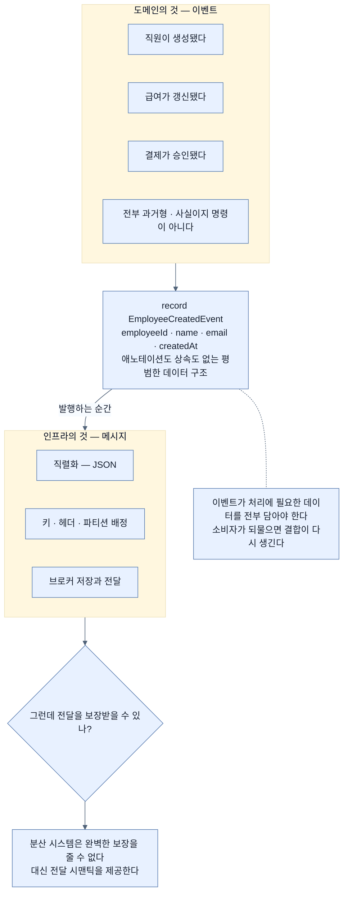

# 이벤트와 메시지 — 무슨 일이 있었나 대 어떻게 전달되나

## 한눈에 보기

> **event는 무슨 일이 있었는가. message는 그 정보가 어떻게 전달되는가.**

```java
public record EmployeeCreatedEvent(
        Long employeeId,
        String name,
        String email,
        Instant createdAt
) {}
```

**특별할 것이 하나도 없다.** 이벤트 정보를 나르는 평범한 데이터 구조일 뿐이다.

## 1. 왜 이게 필요한가

[[01a-core-components-of-event-driven-systems]]의 구성 요소 목록에서 하나가 `Event (message)`로 병기돼 있었다. 두 이름이 붙어 있으면 보통 **같은 것**이라는 뜻인데, 이 절은 그 둘을 갈라 놓는다.

Kafka로 메시징을 구현하기 전에 이 구분을 이해해 두는 것이 중요하다. 왜냐하면 **신뢰할 만한 시스템을 설계할 때 이 구분이 실제로 작동하기** 때문이다 — 무엇을 도메인 모델로 다루고 무엇을 인프라 관심사로 다룰지가 갈린다.

## 2. 어떻게 동작하는가

### 2.1 언뜻 같아 보이지만

**[[이벤트]]**(= 무슨 일이 있었는지 기술하는 비즈니스 사실)와 **[[메시지]]**(= 이벤트를 시스템 사이로 옮기는 기술적 컨테이너)는 언뜻 바꿔 써도 될 것 같다. **실제로는 목적이 조금 다르고, 그 구분을 이해하는 것이 신뢰할 만한 시스템 설계에 필수다.**

**이벤트는 비즈니스 사실을 나타낸다.**

- 직원이 생성됐다
- 직원의 급여가 갱신됐다
- 결제가 승인됐다

세 문장의 공통점이 보인다 — **전부 과거형이고, 도메인 안에서 의미를 갖는다.** 이벤트는 "무엇을 해 달라"는 명령이 아니라 **"무엇이 일어났다"는 사실**이다. 그래서 producer가 소비자를 몰라도 되고, 소비자가 그 사실로 무엇을 할지는 자기가 정한다.

**반면 메시지는 그 이벤트를 시스템 사이로 옮기는 데 쓰이는 기술적 컨테이너다.**

이렇게 생각하면 된다.

| | |
|---|---|
| **이벤트** | 무슨 일이 있었는가 |
| **메시지** | 그 정보가 **어떻게** 전달되는가 |

### 2.2 그래서 코드는 평범하다

```java
public record EmployeeCreatedEvent(
        Long employeeId,
        String name,
        String email,
        Instant createdAt
) {}
```

책이 이 코드에 붙이는 논평이 정확하다. **특별할 것이 하나도 없다! 이벤트 정보를 나르는 평범한 데이터 구조일 뿐이다.**

이 문장이 왜 중요한가. 이벤트를 만들 때 **프레임워크 애노테이션도, 상속도, 특별한 인터페이스도 필요 없다**는 뜻이기 때문이다. 이벤트는 **도메인의 것**이고, 그것을 메시지로 만드는 일(직렬화, 헤더, 키, 파티션 배정)은 **[[Broker]]**(= 이벤트를 수신·저장·전달하는 중간자)와 클라이언트 라이브러리의 몫이다.

그리고 이 구조는 **처리에 필요한 데이터를 전부** 담고 있다. `employeeId`(누구), `name`·`email`(무엇을 알림에 쓸지), `createdAt`(언제). 소비자가 employee service에 되물을 필요가 없다 — 그러면 다시 결합이 생길 테니까.

### 2.3 그다음 질문

이벤트가 메시지가 되어 broker를 지나면 근본적인 질문이 하나 떠오른다.

> **메시지가 전달된다는 것을 무엇으로 보장받는가?**

분산 시스템은 trade-off 없이 완벽한 보장을 줄 수 없다. 대신 **[[전달-시맨틱]]**(= 메시지를 어떻게 전달하고 처리하는지에 대한 보장의 종류)을 제공한다 — [[02a-delivery-semantics]].

### 2.4 비유와 그 한계

신문 기사와 신문지에 빗댈 수 있다. **기사(이벤트)**는 "어제 무슨 일이 있었다"는 내용이고, **신문지(메시지)**는 그것을 집까지 옮기는 물리적 매체다. 같은 기사가 종이로도 웹으로도 갈 수 있고, 매체가 바뀌어도 기사는 그대로다.

**깨지는 지점 둘.** 첫째, 신문지는 배달되면 역할이 끝나지만 **Kafka의 메시지는 보관돼 다시 읽힌다** — 매체가 저장소이기도 하다. 둘째, 기사는 사람이 읽고 판단하지만 **이벤트는 코드가 파싱한다** — 그래서 매체 층의 형식(JSON 직렬화)이 기사의 내용에 영향을 준다. [[04b-implementing-the-employee-service]]에서 `Instant`냐 `LocalDateTime`이냐가 문제가 되는 이유다.

## 3. 그림으로 보기



## 4. 이 노트에 나온 용어

- **[[이벤트]]**: 무슨 일이 있었는지 기술하는 비즈니스 사실.
- **[[메시지]]**: 이벤트를 시스템 사이로 옮기는 기술적 컨테이너.
- **[[전달-시맨틱]]**: 메시지를 어떻게 전달하고 처리하는지에 대한 보장의 종류.
- **[[Broker]]**: 이벤트를 수신·저장·전달하는 중간자.

## 5. 자주 헷갈리는 것

**"그냥 DTO 아닌가"** — 구조는 DTO와 같다. 다른 것은 **의미**다. DTO는 "이 데이터를 넘긴다"이고 이벤트는 "이 일이 일어났다"이다. 그래서 이벤트는 **과거형 이름**을 갖고, 한번 발행되면 **고칠 수 없다.**

**이벤트에 명령을 담지 않는다** — `SendNotificationCommand`가 아니라 `EmployeeCreatedEvent`다. 명령을 담으면 producer가 소비자의 행동을 지시하는 셈이라 [[01-asynchronous-and-event-driven-communication]]의 디커플링이 무너진다.

**이벤트를 얇게 만들면 결합이 돌아온다** — `employeeId`만 보내고 소비자가 다시 employee service를 호출하게 하면, 비동기로 만든 의미가 절반 사라진다. 처리에 필요한 데이터를 담는 것이 그래서 중요하다.

**직렬화가 도메인에 영향을 준다** — 이벤트 자체는 평범한 record지만, JSON으로 오가므로 필드 타입 선택이 호환성 문제가 된다 — [[04a-defining-the-event-and-persistence-models]].

## 6. 언제 안 쓰나 / 경계

- **이벤트에 민감 정보를 담지 않는다.** broker에 보관되고 여러 소비자가 읽는다.
- **이벤트를 너무 크게 만들지 않는다.** 전체 엔티티를 통째로 실으면 스키마 변경 위험이 커진다.
- **이벤트 이름을 명령형으로 짓지 않는다.**
- **한번 정한 필드를 함부로 지우지 않는다.** 소비자가 어떤 필드를 쓰는지 producer는 모른다.

## 7. 연결

- [[01a-core-components-of-event-driven-systems]] — `Event (message)` 병기가 처음 나온 자리.
- [[02a-delivery-semantics]] — "전달을 보장받을 수 있나"에 대한 답.
- [[04a-defining-the-event-and-persistence-models]] — 이 record가 실제 구현에서 다시 등장하는 자리.
- [[04b-implementing-the-employee-service]] — 이벤트가 메시지로 바뀌는 직렬화 지점.

## 8. 스스로 확인

- 이벤트와 메시지를 한 문장씩으로 구분해 보라.
- 이벤트 이름이 과거형인 것이 왜 디커플링과 관련이 있는가?
- `EmployeeCreatedEvent`에 `employeeId`만 담으면 무엇이 무너지는가?
- 이벤트 record에 프레임워크 애노테이션이 없는 것이 무엇을 뜻하는가?

<!-- ==== 아래는 내 영역 · 스킬 수정 금지 ==== -->

## 내 설명 시도


## 막혔던 지점


## 리뷰 이력
