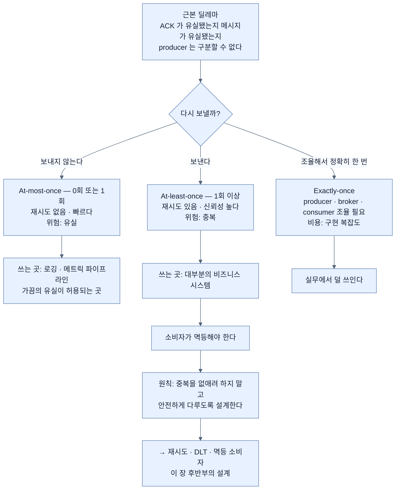

# 전달 시맨틱 셋 — 중복을 없애지 말고 안전하게 다뤄라

## 한눈에 보기

| 시맨틱 | 전달 횟수 | 재시도 | 위험 | 쓰는 곳 |
|---|---|---|---|---|
| At-most-once | 0회 또는 1회 | 없음 | **유실** | 로깅·메트릭 |
| At-least-once | 1회 이상 | 있음 | **중복** | 대부분의 비즈니스 시스템 |
| Exactly-once | 정확히 1회 | 조율 필요 | 복잡도 | 드물게 |

실무의 결론: **at-least-once + 멱등 소비자.** 중복을 없애려 하지 말고 **안전하게 다루도록** 설계한다.

## 1. 왜 이게 필요한가

[[02-events-messages-and-delivery-semantics]]가 남긴 질문이 이것이었다.

> 이벤트가 메시지가 되어 broker를 지나면 — **메시지가 전달된다는 것을 무엇으로 보장받는가?**

직관적으로는 "당연히 한 번 정확히 전달되어야지"라고 생각하기 쉽다. **그런데 분산 시스템은 trade-off 없이 완벽한 보장을 줄 수 없다.**

이유를 잠깐 생각해 보면 명확하다. producer가 broker에 메시지를 보내고 **ACK를 기다리다가 네트워크가 끊겼다.** 메시지가 도착했는데 ACK가 유실된 걸까, 아예 도착하지 않은 걸까? **producer는 구분할 수 없다.** 다시 보내면 중복이고, 안 보내면 유실이다.

그래서 분산 시스템은 완벽한 보장 대신 **[[전달-시맨틱]]**(= 메시지를 어떻게 전달하고 처리하는지에 대한 보장의 종류)을 제공한다.

## 2. 어떻게 동작하는가

### 2.1 At-most-once

**[[At-most-once]]**(= 0회 또는 1회 전달)는 메시지가 **0회 또는 1회** 전달됨을 보장한다.

- **재시도가 없다.** 그래서 빠르다.
- 대신 **데이터 유실 위험**을 진다.

위의 딜레마에서 "안 보내는" 쪽을 택한 것이다.

쓰는 곳은 명확하다 — **가끔의 데이터 유실이 허용되는 시나리오.** 로깅이나 메트릭 파이프라인이 전형적이다. 로그 한 줄이 사라져도 시스템은 돌아가고, 그 대신 처리량과 지연을 얻는다.

### 2.2 At-least-once

**[[At-least-once]]**(= 1회 이상 전달)는 메시지가 **한 번 이상** 전달됨을 보장한다.

- **[[재시도]]**(= 일시적 실패에 대해 같은 처리를 다시 시도하는 것)가 켜져 신뢰성이 오른다.
- 대신 **중복 메시지**가 생길 수 있다.

위의 딜레마에서 "다시 보내는" 쪽이다.

그래서 중요한 결론이 따라 나온다 — **소비자가 [[멱등성]]**(= 같은 이벤트를 여러 번 처리해도 한 번 처리한 것과 같은 결과가 나오는 성질)**을 갖도록 설계돼야 한다.** 같은 이벤트를 여러 번 처리해도 일관되지 않은 결과가 나오지 않게.

이 요구가 [[05b-idempotent-consumers]]의 존재 이유다.

### 2.3 Exactly-once

**[[Exactly-once]]**(= 정확히 한 번 처리)는 중복도 유실도 없이 정확히 한 번 처리됨을 보장한다.

이상적으로 들리는데 왜 기본이 아닌가. **producer·broker·consumer 사이의 조율 보장이 필요하기** 때문이다. 세 주체가 트랜잭션처럼 함께 움직여야 하고, 그래서 실무에서 구현이 더 복잡해진다.

책의 판단이 명확하다 — **그래서 대부분의 비즈니스 애플리케이션에서 덜 쓰인다. 그런 곳에서는 at-least-once와 멱등 소비자의 조합이 대개 더 낫다.**

### 2.4 실무의 결론

> 실무에서 대부분의 이벤트 주도 시스템은 **at-least-once 전달과 멱등 처리**를 채택한다. 신뢰성과 구현 복잡도 사이의 균형이 좋기 때문이다.
>
> **중복을 완전히 없애려 하기보다, 시스템이 중복을 안전하게 다루도록 설계한다.**

마지막 문장이 이 절의 핵심이자 이 장 후반부의 설계 원칙이다. 발상의 전환이 여기 있다 — **문제를 인프라에서 없애려 하지 말고 애플리케이션에서 무해하게 만든다.**

이 개념들을 이해하는 것이 중요한 이유는, 그것들이 **producer와 consumer를 어떻게 설계할지, 어떤 전달 보장을 고를지, 실제 분산 시스템에서 실패를 어떻게 다룰지**를 결정하기 때문이다.

### 2.5 비유와 그 한계

등기우편과 일반우편에 빗댈 수 있다. 일반우편(at-most-once)은 싸고 빠르지만 분실되면 끝이다. 등기우편(at-least-once)은 확인하고 필요하면 다시 보내므로 **같은 편지가 두 번 올 수도 있다.** 그래서 받는 쪽이 "이미 받은 편지인가"를 확인해야 한다.

**깨지는 지점 둘.** 첫째, 사람은 같은 편지를 두 번 받으면 **바로 알아본다.** 코드는 그러지 못하므로 **명시적인 멱등 키**가 필요하다 — [[05b-idempotent-consumers]]가 `employeeId`를 쓰는 이유다. 둘째, 우편에는 "정확히 한 번" 옵션이 없지만 Kafka에는 exactly-once가 실제로 존재한다 — 다만 **비용이 커서 안 쓸 뿐**이지 불가능해서가 아니다.

## 3. 그림으로 보기

## 4. 이 노트에 나온 용어

- **[[전달-시맨틱]]**: 메시지를 어떻게 전달하고 처리하는지에 대한 보장의 종류.
- **[[At-most-once]]**: 0회 또는 1회 전달. 재시도 없음, 유실 위험.
- **[[At-least-once]]**: 1회 이상 전달. 재시도 있음, 중복 위험.
- **[[Exactly-once]]**: 정확히 한 번 처리. 조율이 필요해 복잡하다.
- **[[멱등성]]**: 같은 이벤트를 여러 번 처리해도 결과가 같은 성질.
- **[[재시도]]**: 일시적 실패에 대해 같은 처리를 다시 시도하는 것.

## 5. 자주 헷갈리는 것

**"exactly-once가 있으면 그걸 쓰면 되지 않나"** — Kafka에 실제로 있다. 다만 producer의 트랜잭션과 consumer의 오프셋 커밋을 함께 묶어야 하고, **소비자가 하는 외부 부수효과**(이메일 발송 등)까지 그 트랜잭션에 넣을 수는 없다. 그래서 "메시지 처리는 정확히 한 번"이어도 **이메일은 두 번 갈 수 있다.** 결국 멱등성이 필요하다.

**"전달"과 "처리"는 다르다** — 시맨틱은 전달에 대한 것이고, 실제로 중요한 것은 **처리가 몇 번 일어났는가**다. 메시지가 한 번 전달돼도 consumer가 처리 중에 죽어 오프셋을 커밋하지 못하면 재처리된다.

**중복은 재시도가 없어도 생긴다** — consumer 재시작, 리밸런싱, 오프셋 커밋 실패 등 여러 경로가 있다. [[05b-idempotent-consumers]]가 이 점을 짚는다.

**at-most-once를 "성능 좋은 기본값"으로 고르지 않는다** — 유실이 허용되는 도메인인지 먼저 판단해야 한다.

## 6. 언제 안 쓰나 / 경계

- **at-most-once를 금전·주문 도메인에 쓰지 않는다.** 유실이 곧 손실이다.
- **exactly-once로 멱등성 설계를 대체하지 않는다.** 외부 부수효과는 그 보장 밖이다.
- **"중복이 안 생기게 하겠다"는 목표를 세우지 않는다.** 안전하게 다루는 쪽이 현실적이다.
- **시맨틱을 고르기 전에 도메인의 허용치를 정한다.** 기술 선택이 아니라 비즈니스 판단이 먼저다.

## 7. 연결

- [[02-events-messages-and-delivery-semantics]] — 이 질문이 나온 자리.
- [[05-reliability-patterns-retries-dlt-idempotency]] — at-least-once가 요구하는 재시도.
- [[05b-idempotent-consumers]] — 중복을 안전하게 다루는 구현.
- [[03-apache-kafka-fundamentals]] — offset 커밋이 전달 시맨틱을 실제로 결정하는 지점.

## 8. 스스로 확인

- producer가 "다시 보낼까"를 판단할 수 없는 상황을 설명해 보라.
- 세 시맨틱을 전달 횟수·재시도·위험으로 표 없이 복원해 보라.
- exactly-once가 있어도 멱등성이 필요한 이유는?
- "중복을 없애려 하지 말고 안전하게 다뤄라"가 설계에서 구체적으로 무엇을 뜻하는가?

<!-- ==== 아래는 내 영역 · 스킬 수정 금지 ==== -->

## 내 설명 시도

## 막혔던 지점

## 리뷰 이력
