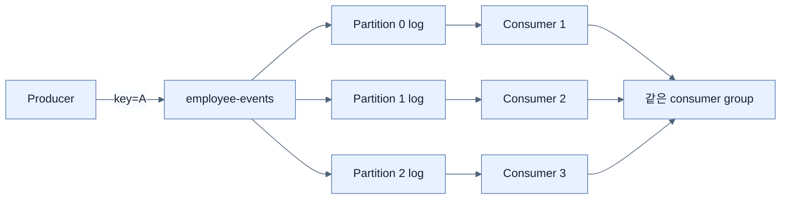

# Apache Kafka 기본 구조

## 한눈에 보기

Kafka는 event를 topic의 여러 partition에 immutable sequential log로 저장한다. Consumer group 안에서는 partition 하나를 한 consumer만 맡고, offset을 기록해 장애 후 재개·replay한다. 처리 병렬성의 실질 상한은 partition 수다.

## 1. 왜 이게 필요한가

Event-driven system은 높은 volume을 durable하게 저장하고 consumer마다 독립적으로 읽게 해야 한다. Kafka의 distributed broker, partition, replication, offset 모델은 producer와 consumer를 분리하면서 throughput·fault tolerance·replay를 제공한다.

## 2. 어떻게 동작하는가

Topic이 3 partition이면 같은 group의 consumer가 1개일 때 모두 맡고, 2개면 `2+1`, 3개면 각 1개를 맡는다. 4번째 consumer는 맡을 partition이 없어 idle이다. Consumer failure 시 rebalance로 partition을 다른 instance에 재할당한다.

Message key가 있으면 같은 key는 같은 partition으로 가므로 그 key 범위의 order를 지킬 수 있다. Key가 없으면 load를 partition에 분산한다. 각 record는 partition-local offset을 가지며 consumer는 처리 position을 commit한다. Kafka의 order 보장은 topic 전체가 아니라 partition 내부 보장임을 기억해야 한다.

## 3. 그림으로 보기

## 4. 이 노트에 나온 용어

- **topic**: 같은 종류의 event record를 모으는 Kafka 논리 channel.
- **partition**: topic을 나눈 ordered log이자 병렬 처리·분산 저장 단위.
- **offset**: partition 안에서 record의 순서를 나타내는 고유 position.
- **consumer group**: partition을 나눠 처리하는 consumer instance의 논리 집합.
- **commit log**: record를 변경하지 않고 순서대로 append하며 일정 기간 보존하는 log 구조.

## 7. 연결

- [[02-events-messages-and-delivery-semantics]] — offset commit과 retry가 전달 보장에 영향을 준다.
- [[04-building-event-driven-services]] — `KafkaTemplate`과 `@KafkaListener`로 이 구조를 사용한다.
- [[05-reliability-patterns-retries-dlt-idempotency]] — replay·재전달이 중복을 만드는 이유다.

## 8. 스스로 확인

- 전체 1차 정리 후: partition 3개에 같은 group consumer가 4개일 때 할당과 ordering 범위를 설명한다.

<!-- ==== 아래는 내 영역 · 스킬 수정 금지 ==== -->

## 내 설명 시도

## 막혔던 지점

## 리뷰 이력

