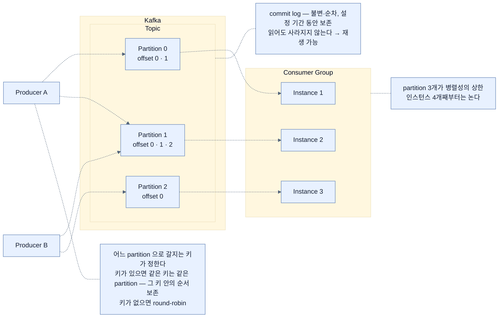

# Kafka의 다섯 개념 — partition이 병렬성과 순서를 동시에 정한다

## 한눈에 보기

| partition 3개일 때 | consumer 인스턴스 배정 |
|---|---|
| 인스턴스 1개 | 그 하나가 **3개 전부** 처리 |
| 인스턴스 2개 | 하나가 2개, 다른 하나가 1개 |
| 인스턴스 3개 | **1:1** — 완전 병렬 |
| 인스턴스 4개 이상 | **남는 인스턴스는 논다** |

**partition 수가 그룹의 병렬성 상한이다.**

## 1. 왜 이게 필요한가

[[01a-core-components-of-event-driven-systems]]에서 broker의 세 가지 일 중 **"저장"**이 결정적이라고 했다. Kafka가 그 저장을 어떻게 하는지가 이 절의 내용이다.

**[[Apache-Kafka]]**(= LinkedIn에서 개발된 분산 이벤트 스트리밍 플랫폼)는 서비스가 직접 호출 대신 이벤트로 통신하게 한다. 대량 데이터를 실시간으로 다루고, 애플리케이션의 여러 부분 사이에 **신뢰성 있고 확장 가능하며 내구성 있는** 데이터 교환 메커니즘을 제공한다.

## 2. 어떻게 동작하는가

### 2.1 분산 아키텍처

Kafka는 **[[Broker]]**(= 이벤트를 수신·저장·전달하는 중간자)·producer·consumer로 이뤄진 분산 시스템으로 설계됐다. 여러 노드에 데이터를 분산해 **수평 확장, 고가용성, 내결함성**을 얻는다.

### 2.2 Topic과 Partition

**[[Topic]]**(= 이벤트가 흐르는 채널)은 이벤트의 채널이다. 각 topic은 하나 이상의 **[[Partition]]**(= topic을 쪼갠 단위)으로 나뉜다.

partition이 있는 이유는 **병렬 처리·확장성·처리량** 때문이다. partition은 독립적으로 소비될 수 있어, 한 그룹의 여러 consumer가 **서로 다른 partition을 동시에 읽으며** 부하를 효율적으로 나눈다.

책이 구체적인 수로 설명한다. topic에 partition이 **3개**라면 —

| consumer 인스턴스 수 | 배정 |
|---:|---|
| 1 | 그 하나에 3개 전부 배정. 모든 메시지를 그 인스턴스가 처리 |
| 2 | Kafka가 셋을 나눈다. 하나가 2개, 다른 하나가 1개 |
| 3 | 각 인스턴스에 1개씩. **세 consumer에 걸쳐 병렬 처리** |
| 4 이상 | **추가 인스턴스는 논다** — 배정할 partition이 남지 않았다 |

마지막 줄이 실무에서 중요하다. **인스턴스를 늘려도 partition 수를 넘으면 처리량이 늘지 않는다.** 확장 계획을 세울 때 partition 수를 먼저 정해야 하는 이유다.

그리고 이 분배가 보장하는 것 하나 — **각 partition은 그룹 내에서 오직 하나의 consumer가 처리한다.**

### 2.3 Offset

Kafka는 **[[Offset]]**(= partition 안 각 메시지의 고유 위치)으로 각 consumer의 위치를 추적한다. partition 안의 모든 메시지가 고유한 offset을 갖고, consumer는 처리하면서 자기 위치를 **커밋**한다.

이것이 두 가지를 가능하게 한다.

- **실패 후 재개** — 어디까지 처리했는지 알므로 이어서 할 수 있다.
- **필요할 때 메시지 재생(replay)** — 오프셋을 되돌리면 과거 메시지를 다시 읽는다.

두 번째가 이벤트 주도 시스템의 강력한 성질이다. 버그를 고친 뒤 **과거 이벤트를 다시 처리**할 수 있다.

### 2.4 Consumer group

consumer는 **[[Consumer-group]]**(= 같은 `group-id`를 공유하며 partition을 나눠 처리하는 묶음)으로 조직되고, 각 consumer가 partition의 부분집합을 처리한다.

- **각 partition은 하나의 consumer에만 배정**되어 중복 처리를 막는다.
- consumer가 죽으면 **Kafka가 그 partition을 다른 consumer들에게 재분배**해 연속성을 보장한다.

두 번째가 [[01a-core-components-of-event-driven-systems]]에서 말한 "회복력"의 실체다.

### 2.5 Commit log 저장

Kafka는 메시지를 **[[Commit-log]]**(= 불변·순차 로그)로 저장하며 설정된 기간 동안 보존한다. 이것이 **내구성**을 보장하고 필요할 때 **재처리**를 가능하게 한다.

"불변·순차"라는 성질이 Kafka를 큐가 아니라 **로그**로 만든다. 전통적 큐는 소비되면 메시지가 사라지지만, Kafka는 **읽어도 남아 있다.** 그래서 여러 consumer group이 같은 topic을 각자의 속도로 읽을 수 있고, [[05a-dead-letter-topics]]에서 DLT가 "queue"가 아니라 "topic"인 이유도 여기 있다.

### 2.6 어느 partition으로 가나 — 키가 정한다

producer가 topic에 메시지를 보내면 Kafka가 **어느 partition에 저장할지 결정**한다.

| 조건 | 배정 |
|---|---|
| **[[메시지-키]]**(= partition 배정을 결정하는 값)가 있다 | **같은 키는 항상 같은 partition으로** 간다. 그 키 안의 **순서가 보존**된다 |
| 키가 없다 | round-robin으로 partition에 분산 |
| 커스텀 전략 | 필요하면 구현할 수 있다 |

이 메커니즘이 **부하 분산과 순서 보장을 동시에** 달성한다.

여기가 이 절에서 가장 실무적인 지점이다. **"직원 한 명에 대한 이벤트들의 순서"**가 중요하다면 `employeeId`를 키로 쓴다. 그러면 그 직원의 모든 이벤트가 같은 partition으로 가서 순서가 지켜진다. [[04b-implementing-the-employee-service]]가 `saved.getId().toString()`을 키로 넘기는 이유가 이것이다.

반대로 **전체 순서**는 partition이 여럿이면 보장되지 않는다. Kafka에서 순서는 **partition 단위**이지 topic 단위가 아니다.

### 2.7 종합

Kafka는 이벤트 주도 시스템의 **중추**다. producer가 topic에 이벤트를 발행하고, Kafka가 저장·분배하고, consumer가 독립적으로 읽고 처리한다.

이 아키텍처가 가능하게 하는 것 넷이다.

- 서비스 간 느슨한 결합
- **partitioning**을 통한 높은 확장성
- **복제와 consumer group**을 통한 내결함성
- **재생 가능한 이벤트 스트림**을 통한 유연한 데이터 처리

### 2.8 비유와 그 한계

도서관 대출 대장에 빗댈 수 있다. **commit log**는 지우지 않고 계속 이어 적는 대장이고, **offset**은 각 사서가 "여기까지 확인했다"고 표시한 책갈피다. 사서가 바뀌어도 책갈피부터 이어서 본다. **partition**은 대장을 여러 권으로 나눈 것이고, **키**는 "김씨 성은 항상 1권에"라는 규칙이다.

**깨지는 지점 둘.** 첫째, 대장은 무한히 쌓이지만 Kafka는 **설정된 기간만 보존**한다 — 오래된 이벤트는 사라지므로 "언제나 재생 가능"이 아니다. 둘째, 사서를 늘리면 더 빨리 볼 수 있을 것 같지만 **대장 권수를 넘으면 남는 사서는 논다** — partition 수가 병렬성의 상한이라는 사실이 그것이다.

## 3. 그림으로 보기

Figure 12.4(책 p.325)의 재현이다.

## 4. 이 노트에 나온 용어

- **[[Apache-Kafka]]**: LinkedIn에서 개발된 분산 이벤트 스트리밍 플랫폼.
- **[[Topic]]**: 이벤트가 흐르는 채널.
- **[[Partition]]**: topic을 쪼갠 단위. 병렬성과 순서의 단위다.
- **[[Offset]]**: partition 안 각 메시지의 고유 위치.
- **[[Consumer-group]]**: 같은 `group-id`를 공유하며 partition을 나눠 처리하는 묶음.
- **[[Commit-log]]**: 불변·순차 로그. Kafka가 메시지를 담는 방식.
- **[[메시지-키]]**: partition 배정을 결정하는 값.
- **[[Broker]]**: 이벤트를 수신·저장·전달하는 중간자.

## 5. 자주 헷갈리는 것

**"Kafka는 메시지 큐다"** — 정확하지 않다. 큐는 소비되면 메시지가 사라지지만 Kafka는 **commit log**라 읽어도 남는다. 그래서 여러 consumer group이 같은 topic을 각자 읽을 수 있다.

**순서는 partition 단위다** — topic 전체의 순서는 partition이 여럿이면 보장되지 않는다. **전체 순서가 필요하면 partition을 하나로** 두어야 하고, 그러면 병렬성을 포기하는 것이다. 이 trade-off가 Kafka 설계의 핵심이다.

**인스턴스를 늘려도 partition을 넘으면 소용없다** — 확장 계획은 partition 수 결정에서 시작한다. partition은 나중에 늘릴 수 있지만 **줄일 수는 없다.**

**offset은 consumer group마다 따로다** — 같은 topic을 두 그룹이 읽으면 각자의 offset을 갖는다. 그래서 notification service와 audit service가 서로 방해하지 않는다.

## 6. 언제 안 쓰나 / 경계

- **전체 순서가 절대적으로 필요하면** partition 1개를 써야 하고, 그러면 Kafka를 쓰는 이유의 절반이 사라진다.
- **보존 기간을 확인한다.** "언제나 재생 가능"이 아니다. 기간이 지나면 사라진다.
- **partition 수를 나중에 줄일 수 없다.** 초기 설계에서 신중히 정한다.
- **키를 아무거나 쓰지 않는다.** 키가 편중되면 특정 partition에 부하가 몰린다.

## 7. 연결

- [[01a-core-components-of-event-driven-systems]] — broker의 "저장"이 여기서 commit log로 구체화된다.
- [[02a-delivery-semantics]] — offset 커밋이 전달 시맨틱을 실제로 결정한다.
- [[04b-implementing-the-employee-service]] — `send(topic, key, payload)`의 key가 partition을 정하는 자리.
- [[04c-implementing-the-notification-service]] — `groupId`와 partition 배정 로그를 실제로 보는 곳.

## 8. 스스로 확인

- partition 3개짜리 topic에 consumer 인스턴스를 5개 띄우면 무슨 일이 생기는가?
- Kafka가 큐가 아니라 로그라는 사실이 실무에서 무엇을 가능하게 하는가?
- 전체 순서를 보장하려면 무엇을 포기해야 하는가?
- 특정 직원의 이벤트 순서를 지키려면 무엇을 키로 써야 하는가?

<!-- ==== 아래는 내 영역 · 스킬 수정 금지 ==== -->

## 내 설명 시도

## 막혔던 지점

## 리뷰 이력
