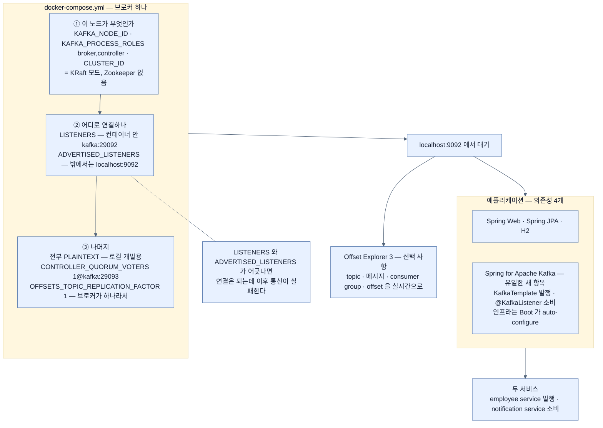

# Kafka 띄우기 — KRaft 모드 Docker Compose와 의존성 하나

## 한눈에 보기

| | |
|---|---|
| 브로커 | `confluentinc/cp-kafka:7.8.8` 컨테이너 하나, 포트 `9092` |
| 모드 | **KRaft** — `KAFKA_PROCESS_ROLES: broker,controller`, Zookeeper 없음 |
| 새 의존성 | **Spring for Apache Kafka** 하나뿐 |
| 만들 것 | employee service(발행) + notification service(소비) |

## 1. 왜 이게 필요한가

[[01-asynchronous-and-event-driven-communication]]부터 [[03-apache-kafka-fundamentals]]까지는 **이론**이었다 — 이벤트 주도 통신, 전달 보장, Kafka의 기초.

이제 그 개념들을 적용해 Spring Boot와 Kafka로 **간단한 이벤트 주도 시스템**을 만든다. 그러려면 먼저 **[[Apache-Kafka]]**(= 분산 이벤트 스트리밍 플랫폼)가 로컬에서 돌아야 한다.

## 2. 어떻게 동작하는가

### 2.1 Docker Compose

```yaml
services:
  kafka:
    image: confluentinc/cp-kafka:7.8.8
    container_name: kafka
    ports:
      - "9092:9092"
    environment:
      KAFKA_NODE_ID: 1
      KAFKA_PROCESS_ROLES: broker,controller
      KAFKA_LISTENERS: PLAINTEXT://kafka:29092,CONTROLLER://kafka:29093,PLAINTEXT_HOST://0.0.0.0:9092
      KAFKA_ADVERTISED_LISTENERS: PLAINTEXT://kafka:29092,PLAINTEXT_HOST://localhost:9092
      KAFKA_LISTENER_SECURITY_PROTOCOL_MAP: CONTROLLER:PLAINTEXT,PLAINTEXT:PLAINTEXT,PLAINTEXT_HOST:PLAINTEXT
      KAFKA_CONTROLLER_QUORUM_VOTERS: 1@kafka:29093
      KAFKA_CONTROLLER_LISTENER_NAMES: CONTROLLER
      KAFKA_INTER_BROKER_LISTENER_NAME: PLAINTEXT
      KAFKA_OFFSETS_TOPIC_REPLICATION_FACTOR: 1
      CLUSTER_ID: MkU3OEVBNTcwNTJENDM2Qk
```

환경 변수가 많은데, **세 묶음**으로 읽으면 구조가 보인다.

**① 이 노드가 무엇인가**

| 변수 | 뜻 |
|---|---|
| `KAFKA_NODE_ID: 1` | 이 노드의 고유 식별자 |
| `KAFKA_PROCESS_ROLES: broker,controller` | 이 노드가 **[[Broker]]**(= 이벤트를 수신·저장·전달하는 중간자)**이자 controller** 역할을 한다 |
| `CLUSTER_ID` | 클러스터의 고유 식별자 |

이 셋이 **[[KRaft]]**(= Zookeeper 없이 Kafka 자신이 메타데이터를 관리하는 모드)의 표시다. 예전 Kafka는 메타데이터 관리에 Zookeeper가 필요했지만, KRaft에서는 **Kafka 노드 자신이 controller 역할을 겸한다.** 그래서 이 compose 파일에 Zookeeper 서비스가 없다.

**② 어디로 연결하나**

| 변수 | 뜻 |
|---|---|
| `ports: 9092:9092` | 호스트에 노출해 Spring Boot 앱이 `localhost:9092`로 붙게 한다 |
| `KAFKA_LISTENERS` | Kafka가 연결을 받는 내부·외부 endpoint |
| `KAFKA_ADVERTISED_LISTENERS` | **클라이언트가 연결할 때 쓸 주소** |
| `KAFKA_INTER_BROKER_LISTENER_NAME` | 브로커 간 통신에 쓸 listener |
| `KAFKA_CONTROLLER_LISTENER_NAMES` | controller 통신에 쓸 listener |

`LISTENERS`와 `ADVERTISED_LISTENERS`가 나뉘어 있는 이유가 중요하다. 컨테이너 **안**에서는 `kafka:29092`로 부르고 **밖**에서는 `localhost:9092`로 불러야 하는데, 브로커가 클라이언트에게 "나한테 오려면 이 주소로 와"라고 알려 주는 것이 `ADVERTISED_LISTENERS`다. 이 둘이 어긋나면 **연결은 되는데 이후 통신이 실패하는** 전형적인 Kafka 함정이 생긴다.

**③ 나머지**

| 변수 | 뜻 |
|---|---|
| `KAFKA_LISTENER_SECURITY_PROTOCOL_MAP` | 각 listener의 보안 프로토콜. 여기서는 **전부 PLAINTEXT** — 암호화도 인증도 없다. 로컬 개발을 단순하게 유지하려는 것 |
| `KAFKA_CONTROLLER_QUORUM_VOTERS: 1@kafka:29093` | controller 쿼럼에 참여하는 노드. **ID 1인 단일 controller**가 `kafka:29093`에서 듣는다 |
| `KAFKA_OFFSETS_TOPIC_REPLICATION_FACTOR: 1` | 브로커가 하나뿐이므로 1 |

마지막 항목이 로컬 구성의 성격을 요약한다. **브로커가 하나라 복제가 불가능하다.** production에서는 이 값이 최소 3이다.

### 2.2 브로커 들여다보기

Kafka가 로컬에서 돌면 **Offset Explorer 3**(구 Kafka Tool) 같은 그래픽 클라이언트로 붙을 수 있다. topic·메시지·consumer group·offset을 **실시간으로** 확인할 수 있어 학습과 디버깅에 특히 유용하다.

연결 설정은 셋이다.

- Cluster Name: `Local Kafka`
- Bootstrap Servers: `localhost:9092`
- Security: PLAINTEXT (인증 없음)

**이 도구는 선택 사항**이지만, 애플리케이션을 만드는 동안 **이벤트가 시스템을 어떻게 흐르는지에 대한 가시성**을 준다. [[01a-core-components-of-event-driven-systems]]에서 "흐름 추적이 어려워진다"고 한 문제에 대한 가장 소박한 대응이다.

### 2.3 애플리케이션 좌표

만들 것은 **두 서비스**다.

- **employee service** — 직원을 만들면 이벤트를 발행한다
- **notification service** — 그 이벤트를 소비한다

start.spring.io에서 Maven / Java 25 / Spring Boot 4.1.x, group `com.learningspringboot4`, artifact `ch12`로 만들고 의존성 넷을 고른다.

| 의존성 | 왜 |
|---|---|
| Spring Web | REST endpoint |
| Spring JPA | 직원 영속화 |
| H2 Database | 인메모리 DB |
| **Spring for Apache Kafka** | **이 장의 유일한 새 항목** |

### 2.4 Spring for Apache Kafka

지금까지 다뤄 보지 않은 새 의존성은 하나뿐이다.

**[[Spring-for-Apache-Kafka]]**(= Spring Boot와 Kafka를 잇는 모듈)는 Spring Boot를 Kafka와 통합하며 두 추상을 제공한다.

- **[[KafkaTemplate]]**(= 메시지 발행의 주 추상) — 메시지를 발행할 때
- **[[KafkaListener]]**(= 메서드를 topic 구독자로 만드는 애노테이션) — 메시지를 소비할 때

그리고 Spring Boot가 **필요한 인프라 대부분을 auto-configure**하므로, 우리는 **저수준 Kafka API 대신 비즈니스 로직에 집중**할 수 있다.

이 문장이 이 장의 나머지가 짧은 이유다. 연결 관리, 직렬화 배선, consumer 폴링 루프를 우리가 쓰지 않는다.

### 2.5 비유와 그 한계

우체국을 직접 차리는 일에 빗댈 수 있다. Docker Compose가 **건물과 창구를 세우는 것**이고, `ADVERTISED_LISTENERS`는 **바깥에 붙이는 주소 간판**이다. 간판이 틀리면 사람들이 건물을 못 찾는다. Spring for Apache Kafka는 **우편 대행 서비스** — 우리가 봉투를 붙이고 우표를 사는 대신 물건만 넘기면 된다.

**깨지는 지점 둘.** 첫째, 진짜 우체국은 지점이 여럿이라 하나가 멈춰도 되지만 **이 구성은 브로커가 하나**다 — `REPLICATION_FACTOR: 1`이 그 사실을 말한다. 로컬 학습용이지 고가용성 구성이 아니다. 둘째, 대행 서비스가 편리한 만큼 **무슨 일이 일어나는지 안 보인다** — 그래서 Offset Explorer 같은 도구가 학습에 유용하다.

## 3. 그림으로 보기



## 4. 이 노트에 나온 용어

- **[[Apache-Kafka]]**: LinkedIn에서 개발된 분산 이벤트 스트리밍 플랫폼.
- **[[KRaft]]**: Zookeeper 없이 Kafka 자신이 메타데이터와 컨트롤러 쿼럼을 관리하는 모드.
- **[[Broker]]**: 이벤트를 수신·저장·전달하는 중간자.
- **[[Spring-for-Apache-Kafka]]**: Spring Boot와 Kafka를 잇는 모듈.
- **[[KafkaTemplate]]**: Spring이 제공하는 메시지 발행의 주 추상.
- **[[KafkaListener]]**: 메서드를 topic 구독자로 만드는 애노테이션.

## 5. 자주 헷갈리는 것

**Figure 12.5가 본문과 어긋난다** — 책 p.328의 연결 설정 화면에는 **`Enable Zookeeper access`가 체크되고 Port `2181`**이 설정돼 있으며 `Kafka Cluster Version`이 **`0.11`**로 잡혀 있다. 그런데 이 장의 `docker-compose.yml`은 **KRaft 모드**라 **Zookeeper가 아예 없고**, 이미지는 `cp-kafka:7.8.8`이다. 본문이 설명하는 세 항목(Cluster Name·Bootstrap Servers·Security)은 이 불일치를 언급하지 않는다. 화면을 그대로 따라 하면 Zookeeper 연결에서 막힌다.

**`LISTENERS`와 `ADVERTISED_LISTENERS`** — 앞의 것은 "내가 어디서 듣는가", 뒤의 것은 "클라이언트에게 어디로 오라고 알릴까"다. 컨테이너 안팎의 주소가 다르기 때문에 둘이 필요하다.

**PLAINTEXT는 로컬 전용이다** — 암호화도 인증도 없다. production에서는 SASL/SSL을 쓴다.

**브로커가 하나면 복제가 없다** — `REPLICATION_FACTOR: 1`은 브로커가 죽으면 데이터가 사라진다는 뜻이다. [[03-apache-kafka-fundamentals]]가 말한 "복제를 통한 내결함성"이 이 구성에는 없다.

## 6. 언제 안 쓰나 / 경계

- **이 compose 파일을 production에 쓰지 않는다.** 브로커 1대, 복제 없음, 인증 없음.
- **Offset Explorer 화면을 그대로 따라 하지 않는다.** Zookeeper 설정이 이 구성과 맞지 않는다.
- **`ADVERTISED_LISTENERS`를 대충 두지 않는다.** Kafka 연결 문제의 대부분이 여기서 온다.
- **Kafka가 필요한지 먼저 판단한다.** 서비스 둘 사이의 단순한 통지라면 과할 수 있다 — [[06-choosing-between-rest-and-messaging]].

## 7. 연결

- [[03-apache-kafka-fundamentals]] — 여기 띄우는 브로커가 무엇을 하는지의 개념.
- [[04a-defining-the-event-and-persistence-models]] — 이 프로젝트에서 만들 첫 코드.
- [[04b-implementing-the-employee-service]] — `KafkaTemplate`을 실제로 쓰는 자리.
- [[04c-implementing-the-notification-service]] — `@KafkaListener`를 실제로 쓰는 자리.

## 8. 스스로 확인

- `KAFKA_PROCESS_ROLES: broker,controller`와 `CLUSTER_ID`가 함께 있는 것이 무엇을 뜻하는가?
- `LISTENERS`와 `ADVERTISED_LISTENERS`가 왜 둘 다 필요한가?
- `REPLICATION_FACTOR: 1`이 이 구성의 어떤 성격을 드러내는가?
- Figure 12.5의 화면을 그대로 따라 하면 왜 막히는가?

<!-- ==== 아래는 내 영역 · 스킬 수정 금지 ==== -->

## 내 설명 시도


## 막혔던 지점


## 리뷰 이력
