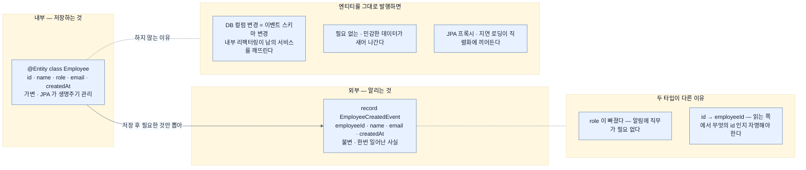

# 엔티티와 이벤트를 나누기 — 저장하는 것과 알리는 것

## 한눈에 보기

```java
@Entity
public class Employee {
    @Id @GeneratedValue(strategy = GenerationType.IDENTITY)
    private Long id;
    private String name;
    private String role;
    private String email;
    private LocalDateTime createdAt;
}
```

```java
public record EmployeeCreatedEvent(
        Long employeeId, String name, String email, LocalDateTime createdAt
) {}
```

**두 타입이 따로 있다.** 엔티티에 있는 `role`이 이벤트에는 없다.

## 1. 왜 이게 필요한가

[[04-building-event-driven-services]]에서 Kafka를 띄우고 프로젝트를 만들었다. 이제 첫 코드다.

영속성 계층은 앞 장들과 **같은 방식**이라 새로울 것이 없다. 새로운 것은 그 옆에 놓이는 **이벤트 타입**이고, 두 타입이 왜 따로인지가 이 절의 실질이다.

## 2. 어떻게 동작하는가

### 2.1 영속성 계층

`Employee` 엔티티는 `@Entity`, `@Id`, `@GeneratedValue(IDENTITY)`에 다섯 필드다. repository도 익숙하다.

```java
public interface EmployeeRepository extends JpaRepository<Employee, Long> {}
```

책이 짧게 넘어가는 이유가 명시돼 있다 — **이미 다룬 Spring Data JPA 패턴을 그대로 따르므로 더 자세히 들어가지 않는다.** Chapter 3에서 배운 것이 그대로다.

여기서 눈여겨볼 것은 **이 장이 JPA를 쓴다는 사실 자체**다. Chapter 10이 "JDBC·JPA는 블로킹이라 리액티브에 맞지 않는다"고 했는데, 이 장은 리액티브가 아니므로 JPA를 그대로 쓴다. **메시징과 리액티브는 다른 축의 선택**이라는 점이 여기서 드러난다.

### 2.2 이벤트 타입

서비스가 새 직원을 저장한 **뒤에** 발행할 이벤트 객체다.

```java
public record EmployeeCreatedEvent(
        Long employeeId,
        String name,
        String email,
        LocalDateTime createdAt
) {}
```

이 record는 **저장된 직원 데이터를 담아 Kafka에 발행**하는 데 쓰인다. **직원 생성이라는 사실을 나타내고, 그 사실을 다른 서비스에 알리는** 역할이다.

### 2.3 왜 엔티티를 그대로 보내지 않나

이 절에서 가장 중요한 질문인데 책이 명시하지 않는다. 두 타입을 나란히 놓으면 답이 보인다.

| 필드 | `Employee` 엔티티 | `EmployeeCreatedEvent` |
|---|---|---|
| id / employeeId | `id` | `employeeId` — **이름이 바뀐다** |
| name | 있음 | 있음 |
| role | **있음** | **없음** |
| email | 있음 | 있음 |
| createdAt | 있음 | 있음 |

**`role`이 빠졌다.** 알림을 보내는 데 직무가 필요 없기 때문이다. 그리고 `id`가 `employeeId`가 됐다 — **이벤트를 읽는 쪽에서는 "무엇의 id인지"가 문맥에서 자명하지 않기** 때문이다.

이 두 가지 차이가 원칙 하나를 보여 준다. **[[이벤트]]**(= 무슨 일이 있었는지 기술하는 비즈니스 사실)는 **엔티티의 복사본이 아니라 소비자를 위한 계약**이다.

엔티티를 그대로 발행하면 세 가지가 생긴다.

1. **DB 컬럼 변경이 곧 이벤트 스키마 변경**이 된다. 내부 리팩터링이 다른 팀의 서비스를 깨뜨린다.
2. 소비자가 **필요 없는 데이터**를 받는다. 급여 같은 민감 필드가 섞여 들어갈 수 있다.
3. JPA 프록시·지연 로딩 같은 것이 직렬화에 끼어들 수 있다.

[[02-events-messages-and-delivery-semantics]]에서 "이벤트가 처리에 필요한 데이터를 전부 담아야 한다"고 했는데, 그 반대편에 **"필요 없는 것은 담지 않는다"**가 있다.

### 2.4 record인 이유

엔티티는 클래스인데 이벤트는 record다. 이유가 명확하다.

- 엔티티는 JPA가 생명주기를 관리하는 **가변 객체**여야 한다.
- 이벤트는 **한번 일어난 사실**이라 바뀌지 않는다. **[[Producer]]**(= 이벤트를 방출하는 구성 요소)가 발행한 뒤 아무도 고칠 수 없어야 한다.

불변성이 이벤트의 의미와 맞아떨어진다.

### 2.5 비유와 그 한계

병원 진료 기록과 진단서에 빗댈 수 있다. **진료 기록(엔티티)**은 병원 내부용이라 온갖 정보가 들어 있고 계속 갱신된다. **진단서(이벤트)**는 외부에 내보내는 문서라 **필요한 항목만 담고, 한번 발급하면 고치지 않는다.**

**깨지는 지점 둘.** 첫째, 진단서는 요청할 때 발급하지만 **이벤트는 미리 발행해 두고 누가 언제 읽을지 모른다** — 그래서 나중에 필요할 정보까지 예상해 담아야 한다. 둘째, 진단서 양식이 바뀌면 공지하면 되지만, **이벤트 스키마는 이미 발행된 과거 메시지가 broker에 남아 있어** 새 소비자가 옛 형식을 만날 수 있다 — 그것이 [[01a-core-components-of-event-driven-systems]]가 말한 "스키마 진화"다.

## 3. 그림으로 보기



## 4. 이 노트에 나온 용어

- **[[이벤트]]**: 무슨 일이 있었는지 기술하는 비즈니스 사실.
- **[[메시지]]**: 이벤트를 시스템 사이로 옮기는 기술적 컨테이너.
- **[[Producer]]**: 의미 있는 일이 생겼을 때 이벤트를 방출하는 구성 요소.

## 5. 자주 헷갈리는 것

**`createdAt` 타입이 앞뒤로 다르다** — 책 p.323에서 개념 소개용으로 보인 `EmployeeCreatedEvent`는 **`Instant createdAt`**이고, p.330의 구현용은 **`LocalDateTime createdAt`**이다. 같은 이름의 타입이 필드 타입만 다른 두 버전으로 제시된다.

이것이 실제 문제가 되는 이유는 **JSON 표현이 다르기** 때문이다. `Instant`는 `2026-03-28T18:00:00Z`처럼 UTC 기준 시각을 내고, `LocalDateTime`은 `2026-03-28T15:00:00`처럼 **시간대 정보가 없다.** producer가 한쪽으로 직렬화하고 consumer가 다른 쪽으로 역직렬화하면 **[[메시지]]**(= 이벤트를 옮기는 기술적 컨테이너) 계층에서 깨진다.

실무에서는 **시간대가 명확한 `Instant`나 `OffsetDateTime`**을 이벤트에 쓰는 편이 안전하다 — 서비스들이 다른 시간대에서 돌 수 있기 때문이다.

**엔티티와 이벤트를 합치고 싶은 유혹** — 필드가 거의 같으니 하나로 쓰고 싶어진다. 지금은 편하지만, DB 스키마와 이벤트 계약이 묶여 **한쪽을 바꿀 때마다 다른 쪽이 인질**이 된다.

**이 장이 JPA를 쓴다** — Chapter 10이 JPA를 블로킹이라 배제했는데 여기서는 그대로 쓴다. **메시징과 리액티브는 별개 선택**이며, 이 장은 리액티브가 아니다.

## 6. 언제 안 쓰나 / 경계

- **엔티티를 이벤트로 그대로 발행하지 않는다.** 내부 구조가 외부 계약이 된다.
- **이벤트에 민감 필드를 담지 않는다.** broker에 보존되고 여러 소비자가 읽는다.
- **시간 필드에 `LocalDateTime`을 쓰지 않는다.** 서비스가 다른 시간대에 있으면 어긋난다.
- **한번 발행한 필드를 함부로 지우지 않는다.** 누가 쓰는지 producer는 모른다.

## 7. 연결

- [[02-events-messages-and-delivery-semantics]] — 이 record가 개념으로 처음 등장한 자리.
- [[04b-implementing-the-employee-service]] — 엔티티에서 이벤트를 만들어 발행하는 코드.
- [[04c-implementing-the-notification-service]] — 이 이벤트를 역직렬화해 받는 쪽.
- [[04-building-event-driven-services]] — 이 코드가 놓이는 프로젝트 구성.

## 8. 스스로 확인

- `Employee`에 있고 `EmployeeCreatedEvent`에 없는 필드는 무엇이고 왜 뺐는가?
- 엔티티를 그대로 이벤트로 발행하면 생기는 문제 세 가지를 들어 보라.
- 이벤트가 record이고 엔티티가 클래스인 이유는?
- `Instant`와 `LocalDateTime` 중 이벤트에 무엇을 써야 하고, 그 근거는?

<!-- ==== 아래는 내 영역 · 스킬 수정 금지 ==== -->

## 내 설명 시도


## 막혔던 지점


## 리뷰 이력
