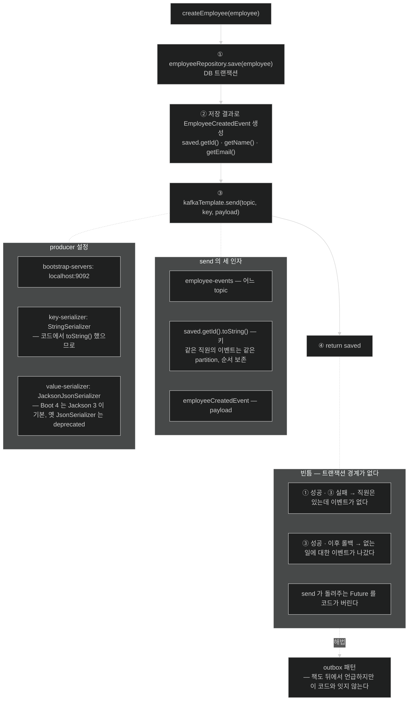

# 발행하는 쪽 — `KafkaTemplate.send`와 트랜잭션 경계의 빈틈

## 한눈에 보기

```java
Employee saved = employeeRepository.save(employee);

EmployeeCreatedEvent event = new EmployeeCreatedEvent(
        saved.getId(), saved.getName(), saved.getEmail(), LocalDateTime.now());

kafkaTemplate.send("employee-events", saved.getId().toString(), event);

return saved;
```

`send(topic, key, payload)` — **세 인자의 의미**가 이 절의 전부다. 그리고 **저장과 발행 사이에 트랜잭션 경계가 없다**는 것이 이 코드의 가장 큰 빈틈이다.

## 1. 왜 이게 필요한가

[[04a-defining-the-event-and-persistence-models]]에서 엔티티와 이벤트 타입을 갖췄다. 이제 **[[Producer]]**(= 이벤트를 방출하는 구성 요소) 쪽을 구현한다.

employee service는 두 가지를 한다 — **직원을 영속화하고, 새 직원이 생길 때마다 이벤트를 Kafka에 발행한다.**

## 2. 어떻게 동작하는가

### 2.1 서비스

```java
@Service
public class EmployeeService {

    private EmployeeRepository employeeRepository;
    private final KafkaTemplate<String, EmployeeCreatedEvent> kafkaTemplate;

    public EmployeeService(EmployeeRepository employeeRepository,
                           KafkaTemplate<String, EmployeeCreatedEvent> kafkaTemplate) {
        this.employeeRepository = employeeRepository;
        this.kafkaTemplate = kafkaTemplate;
    }

    public Employee createEmployee(Employee employee) {
        Employee saved = employeeRepository.save(employee);

        EmployeeCreatedEvent employeeCreatedEvent = new EmployeeCreatedEvent(
                saved.getId(), saved.getName(), saved.getEmail(), LocalDateTime.now());

        kafkaTemplate.send("employee-events", saved.getId().toString(), employeeCreatedEvent);

        return saved;
    }
}
```

`createEmployee`가 새 직원을 저장하고 이벤트를 Kafka에 발행해, **다른 서비스가 비동기로 반응할 수 있게** 한다.

### 2.2 KafkaTemplate

**[[KafkaTemplate]]**(= Spring이 제공하는 메시지 발행의 주 추상)이 Kafka와의 핵심 상호작용을 맡는다. 이 클래스가 **직렬화와 연결 세부를 뒤에서 처리**해 broker와의 통신을 단순하게 만든다.

제네릭 두 개가 의미를 갖는다 — `KafkaTemplate<String, EmployeeCreatedEvent>`는 **키가 `String`, 값이 `EmployeeCreatedEvent`**임을 선언한다. 이 타입이 [[04c-implementing-the-notification-service]]의 소비 쪽 설정과 맞아야 한다.

### 2.3 send의 세 인자

```java
kafkaTemplate.send("employee-events", saved.getId().toString(), employeeCreatedEvent);
```

| 인자 | 무엇 | 왜 |
|---|---|---|
| `"employee-events"` | **[[Topic]]**(= 이벤트가 흐르는 채널) 이름 | 어느 채널로 보낼지 |
| `saved.getId().toString()` | **[[메시지-키]]**(= partition 배정을 결정하는 값) | **[[03-apache-kafka-fundamentals]]에서 본 대로, 같은 키는 항상 같은 partition으로** 간다 |
| `employeeCreatedEvent` | 메시지 payload, 즉 **[[이벤트]]** 자체 | 실제로 전달할 내용 |

두 번째 인자가 중요하다. **직원 ID를 키로 쓴다**는 것은 **같은 직원에 대한 모든 이벤트가 같은 partition으로 가서 순서가 보존된다**는 뜻이다. 지금은 생성 이벤트 하나뿐이라 티가 안 나지만, `EmployeeUpdated`·`EmployeeDeleted`가 생기면 이 선택이 결정적이 된다 — 삭제가 생성보다 먼저 처리되면 안 되니까.

이 메시지를 보냄으로써 **비동기 통신이 가능해진다.** notification service 같은 다른 서비스가 **원래 요청 흐름에 영향을 주지 않고** 독립적으로 이 이벤트를 소비할 수 있다.

### 2.4 producer 설정

```yaml
spring:
  kafka:
    bootstrap-servers: localhost:9092
    producer:
      key-serializer: org.apache.kafka.common.serialization.StringSerializer
      value-serializer: org.springframework.kafka.support.serializer.JacksonJsonSerializer
```

| 설정 | 하는 일 |
|---|---|
| `bootstrap-servers` | Kafka 브로커 주소. 여기서는 `localhost:9092` |
| `key-serializer` | 메시지 키의 직렬화 방식. **직원 ID가 원래 `Long`인데 `toString()`으로 보내므로**, 실제 키 타입에 맞춰 `StringSerializer`를 쓴다 |
| `value-serializer` | payload 변환 방식. **[[JacksonJsonSerializer]]**(= Boot 4의 Jackson 3 설정과 맞물리는 직렬화기)로 `EmployeeCreatedEvent`를 JSON으로 |

키 직렬화기 설명이 세심하다. `Long`을 그대로 보냈다면 `LongSerializer`가 맞았을 텐데, **코드에서 `toString()`을 했으므로** `StringSerializer`가 맞다. 이 둘이 어긋나면 런타임에 실패한다.

### 2.5 Boot 4에서 바뀐 것

> **Spring Boot 4는 Jackson 3을 기본 JSON 라이브러리로 쓴다.** 그래서 Spring Kafka가 제공하던 옛 `JsonSerializer`와 `JsonDeserializer`는 이제 **deprecated**이며 호환성 문제를 낳을 수 있다.
>
> 제대로 된 통합과 일관된 JSON 처리를 보장하려면 **`JacksonJsonSerializer`와 `JacksonJsonDeserializer`**를 써야 한다. 이들은 Boot 4의 Jackson 기반 설정과 매끄럽게 동작하도록 설계됐다.

이것이 이 장에서 Boot 4 고유의 변화다. 인터넷의 Kafka 예제 대부분이 `JsonSerializer`를 쓰고 있으므로, **그대로 복사하면 deprecation 경고나 호환성 문제를 만난다.**

### 2.6 비유와 그 한계

우편물 접수에 빗댈 수 있다. `send`의 세 인자가 각각 **어느 우편함에**(topic), **어느 분류함으로**(key), **무엇을**(payload) 넣을지다. 키가 분류를 정하므로 같은 키의 우편물은 늘 같은 분류함에 쌓이고, 그래서 순서가 유지된다.

**깨지는 지점 하나가 결정적이다.** 우체국은 접수하면 **영수증을 준다.** 이 코드의 `send`는 실제로 `CompletableFuture`를 반환하지만 **코드가 그것을 버린다.** 발행이 실패해도 `createEmployee`는 성공한 것처럼 `saved`를 반환한다. 즉 **직원은 저장됐는데 이벤트는 안 나간** 상태가 조용히 만들어질 수 있다.

## 3. 그림으로 보기



## 4. 이 노트에 나온 용어

- **[[KafkaTemplate]]**: Spring이 제공하는 메시지 발행의 주 추상.
- **[[Producer]]**: 의미 있는 일이 생겼을 때 이벤트를 방출하는 구성 요소.
- **[[메시지-키]]**: partition 배정을 결정하는 값.
- **[[Topic]]**: 이벤트가 흐르는 채널.
- **[[JacksonJsonSerializer]]**: Boot 4의 Jackson 3 설정과 맞물리는 직렬화기.
- **[[outbox-패턴]]**: 이벤트를 비즈니스 연산과 같은 트랜잭션에 저장해 신뢰성 있는 발행을 보장하는 패턴.
- **[[이벤트]]**: 무슨 일이 있었는지 기술하는 비즈니스 사실.

## 5. 자주 헷갈리는 것

**트랜잭션 경계가 없다** — 이 코드의 가장 큰 문제다. `save()`와 `send()`가 **서로 다른 시스템**에 쓰는데 하나의 원자적 단위가 아니다.

| 시나리오 | 결과 |
|---|---|
| 저장 성공, 발행 실패 | 직원은 있는데 **이벤트가 없다** — 알림이 영영 안 간다 |
| 발행 성공, 이후 트랜잭션 롤백 | **없는 직원에 대한 이벤트**가 나갔다 |

책 자신이 p.341–342 Note에서 **[[outbox-패턴]]**(= 이벤트를 비즈니스 연산과 같은 트랜잭션 안에 저장하는 producer 쪽 패턴)이 정확히 이 문제의 해법이라고 말한다. **그런데 그 Note와 이 코드를 연결하지 않는다** — 멱등성 이야기 끝에 지나가듯 언급될 뿐이다. [[05b-idempotent-consumers]]에서 다시 만난다.

**`final`이 빠졌다** — `private EmployeeRepository employeeRepository;`는 나란히 선언된 `kafkaTemplate`과 달리 `final`이 없다. 생성자에서만 대입하므로 `final`이어야 일관된다. 사소하지만 같은 클래스 안의 불일치다.

**`send`의 반환값을 버린다** — `KafkaTemplate.send`는 `CompletableFuture`를 반환해 성공·실패를 알 수 있다. 이 코드는 무시하므로 **발행 실패가 조용히 지나간다.**

**키를 `Long`으로 보내면** `StringSerializer`가 아니라 `LongSerializer`가 맞다. 설정과 코드가 짝이어야 한다.

## 6. 언제 안 쓰나 / 경계

- **저장과 발행을 이 형태로 production에 두지 않는다.** outbox 패턴이나 최소한 발행 실패 처리를 넣는다.
- **`send`의 결과를 버리지 않는다.** 실패를 로깅하거나 재시도한다.
- **키를 아무거나 쓰지 않는다.** 키가 편중되면 특정 partition에 부하가 몰린다.
- **인터넷 예제의 `JsonSerializer`를 그대로 복사하지 않는다.** Boot 4에서는 `JacksonJsonSerializer`다.

## 7. 연결

- [[04a-defining-the-event-and-persistence-models]] — 여기서 만드는 이벤트 타입의 정의.
- [[04c-implementing-the-notification-service]] — 이 메시지를 받는 반대편과 짝이 되는 설정.
- [[03-apache-kafka-fundamentals]] — 키가 partition을 정하는 원리.
- [[05b-idempotent-consumers]] — 책이 outbox 패턴을 언급하는 자리.

## 8. 스스로 확인

- `send`의 세 인자를 각각 설명하고, 두 번째가 왜 중요한지 말해 보라.
- 저장은 성공하고 발행이 실패하면 시스템은 어떤 상태가 되는가? 반대는?
- `key-serializer`로 `StringSerializer`를 고른 근거는 코드의 어느 줄에 있는가?
- Boot 4에서 `JsonSerializer` 대신 `JacksonJsonSerializer`를 써야 하는 이유는?


> 네 문항을 스스로 답한 **뒤에** [[_04b-implementing-the-employee-service]]에서 모범답안과 대조한다. 먼저 열면 이 문항들은 다시 인출 문제로 쓸 수 없다.

<!-- ==== 아래는 내 영역 · 스킬 수정 금지 ==== -->

## 내 설명 시도


## 막혔던 지점


## 리뷰 이력
