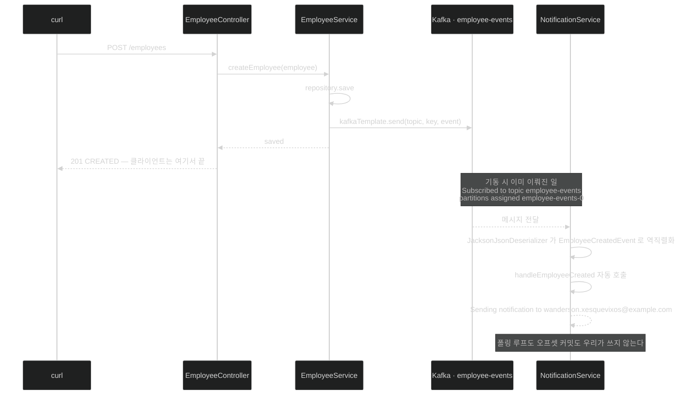

# 소비하는 쪽 — `@KafkaListener` 한 줄과 `trusted.packages`의 함정

## 한눈에 보기

```java
@KafkaListener(topics = "employee-events", groupId = "notification-group")
public void handleEmployeeCreated(EmployeeCreatedEvent event) {
    System.out.println("Sending notification to: " + event.email());
}
```

메서드 하나. **이미 역직렬화된 객체**를 받는다. 폴링 루프도, 오프셋 커밋도 우리가 쓰지 않는다.

## 1. 왜 이게 필요한가

[[04b-implementing-the-employee-service]]가 `employee-events` topic에 이벤트를 발행한다. 이제 **[[Consumer]]**(= 이벤트를 구독하고 반응하는 구성 요소) 쪽이다.

Kafka를 직접 쓰면 consumer 루프를 우리가 돌려야 한다 — `poll()`을 반복하고, 레코드를 꺼내고, 역직렬화하고, 오프셋을 커밋하고, 리밸런싱을 다루고. Spring Kafka가 그 전부를 가져간다.

## 2. 어떻게 동작하는가

### 2.1 리스너

```java
@Service
public class NotificationService {

    @KafkaListener(topics = "employee-events", groupId = "notification-group")
    public void handleEmployeeCreated(EmployeeCreatedEvent event) {
        System.out.println("Sending notification to: " + event.email());
    }
}
```

핵심은 **[[KafkaListener]]**(= 메서드를 topic 구독자로 만드는 애노테이션) 한 줄이다. `handleEmployeeCreated`를 `employee-events` topic에 구독시킨다.

새 메시지가 발행될 때마다 **Spring Kafka가 자동으로 이 메서드를 호출**한다.

`groupId`가 여러 인스턴스가 **메시지 소비를 나눠 가지고 부하를 분산**하게 한다 — [[03-apache-kafka-fundamentals]]의 **[[Consumer-group]]**(= 같은 `group-id`를 공유하며 partition을 나눠 처리하는 묶음)이 여기서 코드에 나타난다.

그리고 메서드는 **이미 `EmployeeCreatedEvent` 객체로 역직렬화된** 이벤트를 받는다. 바이트 배열도, JSON 문자열도 아니다.

구현이 의도적으로 단순하다 — **Kafka로 메시지를 비동기 소비한다는 핵심 개념에 집중하기 위해서**다.

### 2.2 consumer 설정

```yaml
spring:
  kafka:
    bootstrap-servers: localhost:9092
    consumer:
      group-id: notification-group
      auto-offset-reset: earliest
      key-deserializer: org.apache.kafka.common.serialization.StringDeserializer
      value-deserializer: org.springframework.kafka.support.serializer.JacksonJsonDeserializer
      properties:
        spring.json.trusted.packages: "*"
```

| 설정 | 하는 일 |
|---|---|
| `group-id` | 이 서비스가 속한 consumer group. **같은 group ID를 가진 모든 인스턴스가 소비를 나눠** 확장성과 부하 분산을 얻는다 |
| **[[auto-offset-reset]]**(= 커밋된 offset이 없을 때의 동작) | `earliest`는 **topic 처음부터** 읽어 메시지 누락이 없게 한다 |
| `key-deserializer` | 키를 바이트에서 Java 객체로. 키가 문자열이므로 `StringDeserializer` |
| `value-deserializer` | payload를 바이트에서 객체로. `JacksonJsonDeserializer`가 들어오는 JSON을 `EmployeeCreatedEvent`로 |
| **[[trusted-packages]]**(= JSON 역직렬화를 허용할 패키지 목록) | `"*"`는 **어느 패키지의 클래스든** 신뢰하고 역직렬화한다 |

`auto-offset-reset: earliest`의 의미가 실무에서 중요하다. 커밋된 **[[Offset]]**(= partition 안 각 메시지의 고유 위치)이 없는 상황 — 즉 이 consumer group이 처음 뜰 때 — topic의 처음부터 읽는다. `latest`였다면 **뜨기 전에 발행된 메시지를 전부 건너뛴다.**

마지막 항목에 대해 책이 스스로 단서를 단다 — **더 나은 보안을 위해, 특히 production에서는 애플리케이션의 기본 패키지 같은 특정 패키지로 제한해 예상 밖 클래스의 역직렬화를 막을 수 있다.**

### 2.3 트리거할 endpoint

```java
@PostMapping
public ResponseEntity<Employee> create(@RequestBody Employee employee) {
    Employee saved = service.createEmployee(employee);
    return ResponseEntity.status(HttpStatus.CREATED).body(saved);
}
```

요청 본문의 `Employee`를 받아 service에 생성을 위임하고, service가 영속화와 이벤트 발행을 한 뒤, 저장된 직원을 응답으로 돌려준다.

**여기가 [[01-asynchronous-and-event-driven-communication]]의 그림에서 4번**이다 — 클라이언트는 여기서 응답을 받고 끝난다.

### 2.4 기동 로그가 알려 주는 것

애플리케이션을 띄우면 로그에서 세 가지를 확인할 수 있다.

```text
o.a.kafka.common.config.AbstractConfig : ConsumerConfig values:
    auto.offset.reset = earliest
    bootstrap.servers = [localhost:9092]
...
o.a.k.c.c.i.ClassicKafkaConsumer : [Consumer clientId=consumer-notification-group-1,
    groupId=notification-group] Subscribed to topic(s): employee-events
...
o.s.k.l.KafkaMessageListenerContainer : notification-group: partitions assigned: [employee-events-0]
```

| 로그 | 확인되는 것 |
|---|---|
| `ConsumerConfig values` | 우리 `application.yml` 설정이 실제로 반영됐다 |
| `Subscribed to topic(s): employee-events` | 브로커에 연결됐고 topic을 구독했다 |
| **`partitions assigned: [employee-events-0]`** | **[[Partition]]**(= topic을 쪼갠 단위) 0이 이 인스턴스에 배정됐다 |

마지막 줄이 [[03-apache-kafka-fundamentals]]의 partition 배정 규칙이 실제로 도는 증거다. `employee-events-0`은 "`employee-events` topic의 partition 0"이라는 뜻이고, **인스턴스가 하나라 그 하나가 전부를 받았다.**

### 2.5 확인

```bash
curl -X POST http://localhost:8080/employees \
  -H "Content-Type: application/json" \
  -d '{"name":"Wanderson Xesquevixos","role":"Software Engineer",
       "email":"wanderson.xesquevixos@example.com","createdAt":"2026-03-28T15:00:00"}'
```

콘솔에 이렇게 찍힌다.

```text
o.a.k.c.p.internals.TransactionManager : [Producer clientId=producer-1] ProducerId set to 0 with epoch 0
Sending notification to: wanderson.xesquevixos@example.com
```

**이벤트가 성공적으로 발행됐고 notification service가 소비했다.** 두 줄이 나란히 찍히는 것이 producer와 consumer가 같은 프로세스 안에 있기 때문이라는 점은 짚어 둘 만하다 — **실제 배포에서는 다른 프로세스, 다른 머신이다.**

### 2.6 비유와 그 한계

구독 신문에 빗댈 수 있다. `@KafkaListener`가 **구독 신청서**이고, `groupId`는 **가구 이름**이다. 같은 가구의 여러 사람이 신문을 나눠 읽는다. `auto-offset-reset: earliest`는 "지난 호부터 다 보내 주세요"이고 `latest`는 "오늘 자부터"다.

**깨지는 지점 둘.** 첫째, 신문은 읽는 사람이 바뀌어도 내용이 그대로지만 **`trusted.packages: "*"`는 발신자가 임의의 내용물을 보낼 수 있게 열어 둔 것**과 같다 — 신뢰할 수 없는 producer가 있는 환경에서는 위험하다. 둘째, 신문 배달은 실패하면 눈에 띄지만 **리스너 메서드에서 예외가 나면 기본적으로 어떻게 되는지** 이 코드만 봐서는 알 수 없다 — 그게 [[05-reliability-patterns-retries-dlt-idempotency]]의 주제다.

## 3. 그림으로 보기



## 4. 이 노트에 나온 용어

- **[[KafkaListener]]**: 메서드를 topic 구독자로 만드는 애노테이션.
- **[[Consumer]]**: 이벤트를 구독하고 반응하는 구성 요소.
- **[[Consumer-group]]**: 같은 `group-id`를 공유하며 partition을 나눠 처리하는 묶음.
- **[[auto-offset-reset]]**: 커밋된 offset이 없을 때의 동작을 정하는 설정.
- **[[trusted-packages]]**: JSON 역직렬화를 허용할 패키지 목록.
- **[[Partition]]**: topic을 쪼갠 단위.
- **[[Offset]]**: partition 안 각 메시지의 고유 위치.

## 5. 자주 헷갈리는 것

**`spring.json.trusted.packages: "*"`가 예제 그대로 남아 있다** — 책이 "production에서는 특정 패키지로 제한하라"고 덧붙이지만 **제시된 설정은 그대로 `*`**다. 이 값은 신뢰할 수 없는 메시지가 **임의의 클래스를 역직렬화하게 허용**하는 잘 알려진 취약점 경로다. 역직렬화 대상이 되는 클래스의 생성자나 setter가 부수효과를 갖는다면 그것이 실행된다. 실제로는 `com.learningspringboot4` 같은 자기 패키지로 좁혀야 한다.

**`auto-offset-reset`은 "커밋된 offset이 없을 때"에만 적용된다** — 이미 커밋된 offset이 있으면 이 설정과 무관하게 거기서 이어 읽는다. "매번 처음부터 읽는다"는 뜻이 아니다.

**producer와 consumer가 같은 프로세스에 있다** — 이 예제는 한 애플리케이션 안에 둘 다 있다. 학습에는 편하지만 **실제 이벤트 주도 아키텍처의 모습이 아니다.** 두 서비스가 같은 프로세스라면 애초에 Kafka가 필요 없다.

**리스너에서 예외가 나면?** — 이 코드만 봐서는 알 수 없다. 기본 동작과 그것을 바꾸는 방법이 [[05-reliability-patterns-retries-dlt-idempotency]]의 내용이다.

## 6. 언제 안 쓰나 / 경계

- **`trusted.packages: "*"`를 production에 두지 않는다.**
- **리스너 메서드에서 오래 걸리는 작업을 하지 않는다.** 그 partition의 다음 메시지가 밀린다.
- **`latest`를 무심코 고르지 않는다.** 배포 중에 발행된 메시지를 놓칠 수 있다.
- **producer와 consumer를 같은 프로세스에 두지 않는다.** 예제 편의일 뿐이다.

## 7. 연결

- [[04b-implementing-the-employee-service]] — 이 리스너가 받는 메시지를 보내는 쪽.
- [[03-apache-kafka-fundamentals]] — `groupId`와 partition 배정의 원리.
- [[05-reliability-patterns-retries-dlt-idempotency]] — 이 리스너가 실패하면 어떻게 되는가.
- [[04a-defining-the-event-and-persistence-models]] — 역직렬화 대상 타입의 정의.

## 8. 스스로 확인

- `@KafkaListener` 한 줄이 대신해 주는 저수준 작업을 세 가지 이상 들어 보라.
- `auto-offset-reset: earliest`가 적용되는 조건은 정확히 무엇인가?
- `trusted.packages: "*"`가 왜 취약점 경로인가?
- `partitions assigned: [employee-events-0]` 로그가 확인해 주는 것은?


> 네 문항을 스스로 답한 **뒤에** [[_04c-implementing-the-notification-service]]에서 모범답안과 대조한다. 먼저 열면 이 문항들은 다시 인출 문제로 쓸 수 없다.

<!-- ==== 아래는 내 영역 · 스킬 수정 금지 ==== -->

## 내 설명 시도


## 막혔던 지점


## 리뷰 이력
