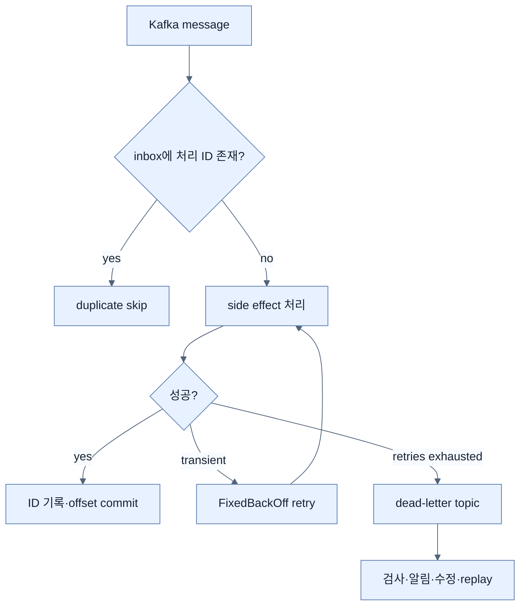

# 신뢰성 패턴: Retry·DLT·Idempotency

## 한눈에 보기

Retry는 일시 장애를 다시 시도하고, dead-letter topic(DLT)은 계속 실패하는 message를 격리하며, idempotent consumer는 재전달된 message의 side effect를 한 번처럼 만든다. 세 패턴은 서로 다른 실패를 해결하므로 함께 설계한다.

## 1. 왜 이게 필요한가

SMTP timeout 같은 transient failure는 재시도로 회복할 수 있지만, email이 없는 invalid payload는 같은 입력을 반복해도 성공하지 않는다. Retry는 reliability를 높이는 동시에 duplicate 가능성을 높인다. 실패 유형 분류·격리·중복 안전성이 모두 필요한 이유다.

## 2. 어떻게 동작하는가

```java
FixedBackOff backOff = new FixedBackOff(2_000L, 3L);
var recoverer = new DeadLetterPublishingRecoverer(kafkaTemplate);
return new DefaultErrorHandler(recoverer, backOff);
```

책의 설정은 2초 간격으로 3회 retry한 뒤 원래 `employee-events`에 `-dlt` suffix를 붙인 `employee-events-dlt`로 보낸다. DLT listener는 deserialization 자체가 실패한 payload도 조사할 수 있도록 `ConsumerRecord<String, byte[]>`로 raw bytes와 topic·partition·offset을 받는 방식이 안전하다.

Consumer는 event ID를 이미 처리했는지 확인하고 처리 후 기록한다. 책의 in-memory `Set`은 restart 시 사라지고 instance 간 공유되지 않으며 무한히 커질 수 있어 demonstration 전용이다. Production의 inbox는 consumed message ID를 persistent store의 unique constraint로 보호한다. Producer의 outbox는 business DB change와 event record를 같은 transaction에 저장한 뒤 별도 publisher가 broker로 보내 “DB 저장 성공, publish 누락” 틈을 줄인다.

## 3. 그림으로 보기



## 4. 이 노트에 나온 용어

- **FixedBackOff**: 일정 interval과 횟수로 retry timing을 정하는 Spring utility.
- **DefaultErrorHandler**: listener exception의 retry와 recovery 경로를 정하는 Spring Kafka handler.
- **dead-letter topic**: 반복 처리에 실패한 message를 원본 흐름에서 격리해 보관하는 topic.
- **idempotent consumer**: 같은 event를 여러 번 받아도 business effect가 한 번과 같도록 만든 consumer.
- **outbox pattern**: business state와 발행할 event를 같은 DB transaction에 기록하는 producer reliability 패턴.

## 7. 연결

- [[02-events-messages-and-delivery-semantics]] — at-least-once가 중복 안전성을 요구하는 이유다.
- [[04-building-event-driven-services]] — 기본 listener container에 error handler를 붙인다.
- [[chapter-13-observing-spring-boot-4-applications/06-correlating-logs-metrics-and-traces|관측성]] — DLT 증가와 retry 폭증을 탐지해야 한다.

## 8. 스스로 확인

- 전체 1차 정리 후: retry, DLT, idempotency, inbox, outbox가 각각 어떤 실패 지점을 막는지 설명한다.

<!-- ==== 아래는 내 영역 · 스킬 수정 금지 ==== -->

## 내 설명 시도


## 막혔던 지점


## 리뷰 이력


