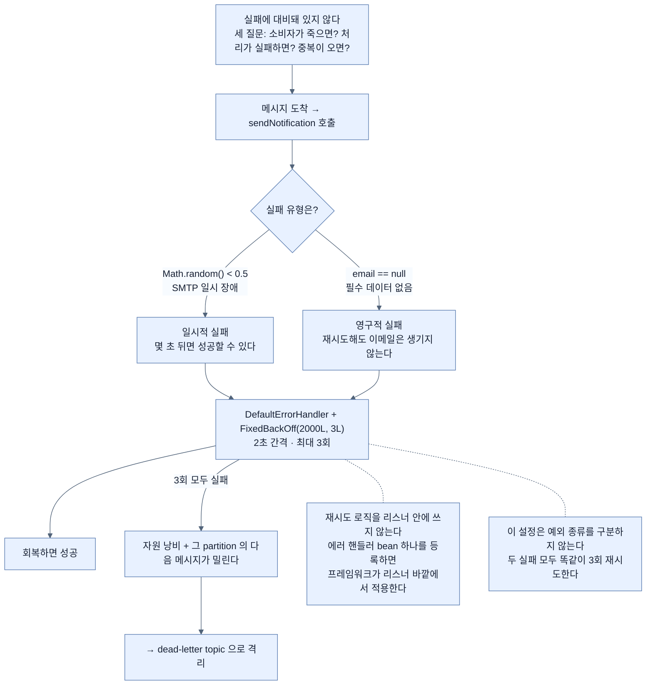

# 재시도 — 일시적 실패와 영구적 실패를 가르기

## 한눈에 보기

```java
@Bean
public DefaultErrorHandler errorHandler() {
    FixedBackOff fixedBackOff = new FixedBackOff(2000L, 3L);
    return new DefaultErrorHandler(fixedBackOff);
}
```

**2초 간격, 최대 3회.** 그리고 이 절의 진짜 내용은 명령이 아니라 **분류**다 — 어떤 실패가 재시도할 만한가.

## 1. 왜 이게 필요한가

[[04c-implementing-the-notification-service]]까지 오면 employee service가 이벤트를 발행하고 notification service가 비동기로 소비한다. **기능은 완성됐다.**

**그런데 실패에 대비돼 있지 않다.** 이벤트를 잃거나 전체 처리 흐름을 끊지 않으면서 실패를 우아하게 다루도록 설계되지 않았다.

책이 던지는 세 질문이 이 절과 다음 두 절의 목차다.

- notification service가 **일시적으로 사용 불가**면?
- **잘못된 데이터나 일시적 네트워크 오류**로 처리가 실패하면?
- **같은 메시지가 두 번 이상** 전달되면?

이것들은 이벤트 주도 시스템의 흔한 시나리오이고 **의도적인 설계**를 요구한다. 여기가 신뢰성 패턴이 필수가 되는 지점이다.

## 2. 어떻게 동작하는가

### 2.1 어떤 실패는 일시적이다

**[[일시적-실패]]**(= 몇 초 뒤 재시도하면 성공할 수 있는 실패)의 예가 셋이다.

- Kafka 서버가 몇 초 사용 불가
- 데이터베이스 연결 타임아웃
- 서드파티 API의 간헐적 오류

이런 경우 **즉시 실패시키는 것이 최선이 아니다.** 연산을 **[[재시도]]**(= 같은 처리를 다시 시도하는 것)하면 성공 가능성이 올라간다.

[[02a-delivery-semantics]]에서 본 **[[At-least-once]]**(= 1회 이상 전달) 시맨틱이 여기서 실제 동작으로 나타난다.

### 2.2 두 실패를 시뮬레이션

```java
private void sendNotification(EmployeeCreatedEvent event) {
    if (Math.random() < 0.5) {
        throw new IllegalStateException("Temporary SMTP server failure");
    }
    if (event.email() == null || event.email().isBlank()) {
        throw new IllegalStateException("Employee email is missing");
    }
    System.out.println("Sending notification to: " + event.email());
}
```

두 실패 시나리오를 만든다.

| 코드 | 나타내는 것 | 재시도하면 |
|---|---|---|
| `Math.random() < 0.5` | **일시적 실패** — 일시적 Kafka나 네트워크 문제 | **몇 초 뒤 성공할 수 있다** |
| `email == null \|\| isBlank()` | **[[영구적-실패]]**(= 재시도해도 절대 성공하지 않는 실패) — 잘못된 데이터 | **없는 이메일은 재시도해도 생기지 않는다** |

이 구분이 이 절의 핵심이다. **재시도가 도움이 되는 실패와 자원만 낭비하는 실패는 다르다.**

### 2.3 재시도 설정

일시적 실패가 나면 메시지를 곧바로 잃고 싶지 않다. **consumer가 회복해 이벤트를 성공적으로 처리할 기회**를 주도록 재시도를 설정한다.

```java
@Configuration
public class KafkaConsumerConfig {

    @Bean
    public DefaultErrorHandler errorHandler() {
        FixedBackOff fixedBackOff = new FixedBackOff(2000L, 3L);
        return new DefaultErrorHandler(fixedBackOff);
    }
}
```

| 요소 | 하는 일 |
|---|---|
| `@Configuration` | Spring 설정을 정의하고 애플리케이션 컨텍스트가 관리할 bean을 선언 |
| **[[DefaultErrorHandler]]**(= 메시지 처리 실패를 어떻게 다룰지 정하는 구성 요소) bean | 메시지 처리 실패 처리를 커스터마이즈 |
| **[[FixedBackOff]]**(= 고정 간격 재시도 전략) `(2000L, 3L)` | **2초마다, 최대 3회** 재시도 |

일시적 실패에 유용한 이유가 명확하다 — **이벤트를 버리지 않고 consumer에게 회복할 기회를 준다.**

여기서 Spring Kafka의 설계가 드러난다. 우리는 **재시도 로직을 리스너 안에 쓰지 않는다.** `try-catch`도, 루프도 없다. **에러 핸들러 bean 하나**를 등록하면 프레임워크가 리스너 바깥에서 그 정책을 적용한다.

### 2.4 그런데 모든 실패가 일시적이지 않다

**어떤 메시지는 몇 번을 재시도해도 절대 성공하지 않는다.**

- 이벤트 payload가 잘못됐을 수 있다
- 필수 필드가 없을 수 있다

이런 상황에서 반복 재시도는 **자원만 낭비한다.** 게다가 그 partition의 다음 메시지들이 그동안 밀린다.

더 나은 방법은 실패한 메시지를 **[[DLT]]**(= 처리에 실패한 메시지의 격리 구역)로 보내는 것이고, 그것이 [[05a-dead-letter-topics]]다.

### 2.5 비유와 그 한계

전화 재발신에 빗댈 수 있다. 통화 중 신호(일시적 실패)라면 잠시 뒤 다시 걸어 볼 만하다. 그런데 **번호가 아예 없는 번호**(영구적 실패)라면 세 번을 걸어도 똑같다. 재시도는 **왜 실패했는지에 따라** 가치가 달라진다.

**깨지는 지점 둘.** 첫째, 사람은 "없는 번호입니다" 안내를 듣고 **재시도를 포기하지만**, 이 코드의 `DefaultErrorHandler`는 **예외의 종류를 구분하지 않는다** — 두 실패 모두 똑같이 3회 재시도한다. 실제로는 예외 타입별로 재시도 여부를 나눌 수 있고, 그게 실무의 다음 단계다. 둘째, 전화는 내가 다시 거는 동안 **다른 일을 할 수 있지만**, Kafka consumer는 재시도 중에 **그 partition의 다음 메시지를 처리하지 못한다** — 2초 × 3회 = 6초 동안 뒤가 막힌다.

## 3. 그림으로 보기



## 4. 이 노트에 나온 용어

- **[[재시도]]**: 일시적 실패에 대해 같은 처리를 다시 시도하는 것.
- **[[일시적-실패]]**: 몇 초 뒤 재시도하면 성공할 수 있는 실패.
- **[[영구적-실패]]**: 재시도해도 절대 성공하지 않는 실패.
- **[[DefaultErrorHandler]]**: 메시지 처리 실패를 어떻게 다룰지 정하는 Spring Kafka 구성 요소.
- **[[FixedBackOff]]**: 고정 간격 재시도 전략.
- **[[DLT]]**: 처리에 실패한 메시지의 격리 구역.
- **[[At-least-once]]**: 1회 이상 전달. 재시도가 이 시맨틱을 만든다.

## 5. 자주 헷갈리는 것

**시뮬레이션 코드의 순서가 의도와 어긋난다** — `Math.random() < 0.5`가 **메서드 맨 앞**에 있다. 그러면 `email` 검사에 닿기 전에 **절반이 일시적 실패로 빠진다.** 그래서 이메일이 없는 메시지도 재시도 3회를 다 쓰기 전에 **우연히 "성공"할 수 있다** — 두 번째 검사에 도달하려면 세 번의 `random()`이 모두 0.5 이상이어야 하는데, 그럴 확률이 1/8이다. 두 실패 유형을 대비해 보여 주려는 의도와 실행이 어긋난다. 영구 실패 경로를 확실히 보려면 `Math.random()` 줄을 잠시 빼야 한다.

**재시도는 예외 종류를 구분하지 않는다** — 이 설정은 **모든 예외**에 대해 3회 재시도한다. 영구 실패도 3회 도는 것이다. `DefaultErrorHandler`에는 특정 예외를 재시도 없이 바로 실패시키는 설정이 있지만 책은 다루지 않는다.

**재시도 중에는 그 partition이 막힌다** — 2초 × 3회면 6초 동안 뒤 메시지가 대기한다. 재시도 간격과 횟수를 늘릴 때 이 비용을 계산해야 한다.

**재시도가 중복을 만든다** — 처리가 절반쯤 진행된 뒤 실패해 재시도하면 **앞부분이 두 번 실행된다.** 이메일이 두 번 갈 수 있다는 뜻이고, 그래서 [[05b-idempotent-consumers]]가 필요하다.

## 6. 언제 안 쓰나 / 경계

- **영구적 실패에 재시도를 걸지 않는다.** 자원 낭비이고 뒤를 막는다.
- **재시도 횟수를 크게 잡지 않는다.** partition이 그만큼 막힌다.
- **재시도만으로 신뢰성을 확보했다고 보지 않는다.** DLT와 멱등성이 함께 있어야 한다.
- **부수효과가 있는 처리에 재시도를 걸 때는** 멱등성을 먼저 확보한다.

## 7. 연결

- [[05a-dead-letter-topics]] — 재시도가 다 실패한 뒤의 목적지.
- [[05b-idempotent-consumers]] — 재시도가 만드는 중복을 다루는 방법.
- [[02a-delivery-semantics]] — 재시도가 at-least-once를 만드는 원리.
- [[04c-implementing-the-notification-service]] — 재시도가 적용되는 리스너.

## 8. 스스로 확인

- 일시적 실패와 영구적 실패를 가르는 기준을 한 문장으로 말해 보라.
- 재시도 로직을 리스너 안에 쓰지 않는 것이 왜 나은 설계인가?
- `FixedBackOff(2000L, 3L)` 동안 그 partition에서 무슨 일이 생기는가?
- 시뮬레이션 코드에서 `Math.random()` 줄의 위치가 왜 문제인가?

<!-- ==== 아래는 내 영역 · 스킬 수정 금지 ==== -->

## 내 설명 시도


## 막혔던 지점


## 리뷰 이력
