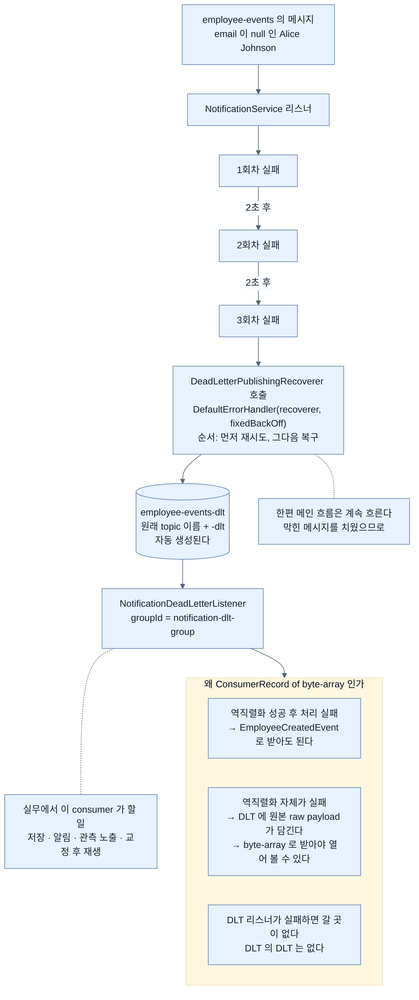

# Dead-letter topic — 못 고칠 메시지를 격리하기

## 한눈에 보기

```java
@Bean
public DefaultErrorHandler errorHandler(KafkaTemplate<Object, Object> kafkaTemplate) {
    FixedBackOff fixedBackOff = new FixedBackOff(2000L, 3L);
    DeadLetterPublishingRecoverer recoverer = new DeadLetterPublishingRecoverer(kafkaTemplate);
    return new DefaultErrorHandler(recoverer, fixedBackOff);
}
```

`employee-events` → **`employee-events-dlt`**. 이름 규칙은 **원래 topic 이름 + `-dlt`**다.

## 1. 왜 이게 필요한가

[[05-reliability-patterns-retries-dlt-idempotency]]가 남긴 문제다. **어떤 메시지는 몇 번을 재시도해도 절대 성공하지 않는다** — 잘못된 payload, 없는 필수 필드.

이런 **[[영구적-실패]]**(= 재시도해도 절대 성공하지 않는 실패)에 반복 재시도는 자원만 낭비하고, 더 나쁘게는 **그 partition의 뒤 메시지를 계속 막는다.**

메시지 하나 때문에 전체 소비가 멈추는 상태를 흔히 **poison pill**이라 부른다. 그 상태를 푸는 것이 이 절이다.

## 2. 어떻게 동작하는가

### 2.1 격리 구역

**[[DLT]]**(= 처리에 실패한 메시지의 격리 구역)는 **성공적으로 처리할 수 없었던 메시지의 격리 구역** 역할을 한다.

이 한 문장에 두 가지가 들어 있다.

- **메인 consumer 흐름은 계속된다** — 막힌 메시지를 치웠으니 뒤가 흐른다.
- **문제 메시지는 나중 조사를 위해 보존된다** — 버리지 않는다.

이 둘을 동시에 얻는 것이 DLT의 존재 이유다.

### 2.2 이름 규칙

Spring Kafka는 기본적으로 **[[DeadLetterPublishingRecoverer]]**(= 재시도 후에도 실패한 레코드를 재발행하는 구성 요소)로 모든 재시도 후에도 실패한 레코드를 다룬다. 이것이 실패한 레코드를 **원래 topic 이름에 `-dlt` 접미를 붙인** dead-letter topic으로 재발행한다.

우리의 경우 원래 **[[Topic]]**(= 이벤트가 흐르는 채널)이 `employee-events` — consumer가 처리에 실패하기 전에 메시지를 받은 그 topic — 이므로, dead-letter topic은 **`employee-events-dlt`**가 된다.

**실패 메시지는 잃지 않는다.** 나중의 분석, 재생, 수동 교정을 위해 격리될 뿐이다.

### 2.3 설정

```java
@Bean
public DefaultErrorHandler errorHandler(KafkaTemplate<Object, Object> kafkaTemplate) {
    FixedBackOff fixedBackOff = new FixedBackOff(2000L, 3L);
    DeadLetterPublishingRecoverer recoverer = new DeadLetterPublishingRecoverer(kafkaTemplate);
    return new DefaultErrorHandler(recoverer, fixedBackOff);
}
```

[[05-reliability-patterns-retries-dlt-idempotency]]의 설정과 **딱 한 가지**가 다르다 — **[[DefaultErrorHandler]]**(= 처리 실패를 어떻게 다룰지 정하는 구성 요소)에 **recoverer가 하나 더 들어갔다.**

| 조각 | 하는 일 |
|---|---|
| `FixedBackOff(2000L, 3L)` | 2초 간격 3회 재시도 |
| `DeadLetterPublishingRecoverer(kafkaTemplate)` | 실패 레코드를 주어진 `KafkaTemplate`으로 DLT에 발행 |
| `DefaultErrorHandler(recoverer, fixedBackOff)` | **재시도 후에도 실패하면 recoverer를 부른다** |

두 인자의 순서가 의미를 갖는다 — **먼저 재시도, 그다음 복구.** 3회가 모두 실패해야 DLT로 간다.

`KafkaTemplate<Object, Object>`인 것도 눈여겨볼 만하다. DLT에는 **어떤 타입의 실패 메시지든** 올 수 있으므로 구체 타입을 못 박지 않는다.

이 설정이 얻는 것 — **실패 메시지가 소비를 막지 않으면서 분석이나 재처리를 위해 보존된다.**

### 2.4 DLT를 들여다보는 리스너

```java
@Service
public class NotificationDeadLetterListener {

    @KafkaListener(topics = "employee-events-dlt", groupId = "notification-dlt-group")
    public void handleDeadLetter(ConsumerRecord<String, byte[]> record) {
        byte[] payload = record.value();
        System.err.println("Message sent to dead-letter topic.");
        System.err.println("Topic: " + record.topic());
        System.err.println("Partition: " + record.partition());
        System.err.println("Offset: " + record.offset());
        System.err.println("Payload: " + new String(payload, StandardCharsets.UTF_8));
    }
}
```

**왜 `EmployeeCreatedEvent`가 아니라 `ConsumerRecord<String, byte[]>`인가?** 이것이 이 절에서 가장 실용적인 지식이다.

| 상황 | `EmployeeCreatedEvent`로 받으면 |
|---|---|
| 역직렬화는 성공했고 **이후 애플리케이션 처리**에서 실패 (알림 발송 실패 등) | **잘 동작한다** |
| 잘못된 JSON·비호환 스키마·예상 밖 포맷으로 **역직렬화 자체가 실패** | **DLT 리스너도 같은 이유로 실패한다** |

두 번째 경우 DLT에는 **원본 raw payload**가 담길 수 있다. 그래서 **[[ConsumerRecord]]**(= 레코드를 topic·partition·offset·key·value와 함께 담는 타입)`<String, byte[]>`로 소비하는 것이 **더 안전하다** — 원본 바이트를 들여다보고 실패 원인을 진단할 수 있기 때문이다.

이 판단이 중요한 이유는, **DLT 리스너가 실패하면 갈 곳이 없기** 때문이다. DLT의 DLT를 만들 수는 없다.

`groupId`가 `notification-dlt-group`으로 원래 그룹과 다른 것도 의도적이다. **DLT는 별개의 소비 흐름**이다.

### 2.5 실제로 확인하기

`email` 없이 요청을 보낸다.

```bash
curl -X POST http://localhost:8080/employees \
  -H "Content-Type: application/json" \
  -d '{"name":"Alice Johnson","role":"Software Engineer"}'
```

3회 재시도 후 DLT로 넘어가고 `NotificationDeadLetterListener`가 그것을 소비한다.

![[_assets/lsb4-p340-fig12-6-dead-letter-topic-in-kafka-client.png]]

화면에서 확인되는 것이 셋이다.

| 위치 | 보이는 것 | 뜻 |
|---|---|---|
| 좌측 트리 | `employee-events`와 **`employee-events-dlt`** | **DLT가 자동으로 생성됐다.** 우리가 만들지 않았다 |
| 우측 상단 | offset `0`, key `1`, value에 JSON | 메시지가 실제로 DLT에 들어왔다 |
| 하단 payload | `{"employeeId":1,"name":"Alice Johnson",`**`"email":null`**`,"createdAt":"..."}` (93 bytes) | **실패 원인이 payload에 그대로 남아 있다** |

마지막 줄이 DLT의 가치를 보여 준다. `email`이 `null`인 것이 눈에 보이므로, **왜 실패했는지 바로 알 수 있고 교정 후 재생할 수 있다.**

### 2.6 실무에서 이 consumer가 할 일

실제 애플리케이션에서 DLT consumer는 로그를 남기는 것 이상을 할 수 있다.

- 실패 이벤트를 **운영 검토용으로 저장**
- **알림 발생**
- 관측 도구에 **실패 노출**
- **교정 후 재생 지원**

이것이 DLT가 가치 있는 이유다 — **메인 처리 흐름을 끊지 않으면서 회복 가능한 실패와 불가능한 실패를 분리한다.**

### 2.7 비유와 그 한계

공항 수하물의 미해결 구역에 빗댈 수 있다. 주소가 잘못돼 배달할 수 없는 짐을 **컨베이어에서 치워 별도 구역에 둔다.** 그래야 뒤 짐들이 흐른다. 그리고 버리지 않으니 나중에 주인을 찾아 줄 수 있다.

**깨지는 지점 둘.** 첫째, 공항은 **누군가 그 구역을 정기적으로 살펴보지만**, DLT는 **아무도 안 보면 그냥 쌓인다** — 그래서 알림과 관측이 목록에 들어 있는 것이다. 둘째, 짐은 열어 보면 내용을 알 수 있지만 **역직렬화가 실패한 메시지는 열 수 없다** — 그래서 `byte[]`로 받아 원본 바이트를 보는 것이다.

## 3. 그림으로 보기



## 4. 이 노트에 나온 용어

- **[[DLT]]**: 처리에 실패한 메시지의 격리 구역.
- **[[DeadLetterPublishingRecoverer]]**: 재시도 후에도 실패한 레코드를 `-dlt` topic으로 재발행하는 구성 요소.
- **[[DefaultErrorHandler]]**: 메시지 처리 실패를 어떻게 다룰지 정하는 구성 요소.
- **[[ConsumerRecord]]**: 레코드를 topic·partition·offset·key·value와 함께 담는 타입.
- **[[영구적-실패]]**: 재시도해도 절대 성공하지 않는 실패.
- **[[Topic]]**: 이벤트가 흐르는 채널.
- **[[Commit-log]]**: 불변·순차 로그. Kafka가 메시지를 담는 방식.

## 5. 자주 헷갈리는 것

**제목은 DLQ, 본문은 DLT** — 이 장의 제목과 목차는 **DLQ**(dead-letter **queue**)를 쓰는데 본문은 **DLT**(dead-letter **topic**)를 쓴다. Kafka에는 queue가 아니라 topic이 있으므로 **본문 쪽이 정확하다.** [[03-apache-kafka-fundamentals]]에서 본 대로 Kafka는 **[[Commit-log]]**(= 불변·순차 로그)이고, DLT의 메시지도 읽어도 사라지지 않는다. 제목은 메시징 일반에서 널리 쓰이는 용어를 따른 것이다.

**DLT는 자동으로 생성된다** — 우리가 topic을 만들지 않았는데 Figure 12.6에 `employee-events-dlt`가 있다. Kafka의 `auto.create.topics.enable`이 켜져 있어 가능한 것이고, **production에서는 이 설정이 꺼져 있을 수 있다** — 그러면 DLT를 미리 만들어 둬야 한다.

**DLT 리스너를 만들지 않아도 DLT는 채워진다** — 리스너는 **들여다보기 위한 것**이지 DLT 동작의 조건이 아니다. 다만 아무도 안 보면 메시지가 쌓이기만 한다.

**`byte[]`로 받는 판단이 방어적이다** — 역직렬화 실패까지 다루려면 원본 바이트여야 한다. 이걸 놓치면 **DLT 리스너 자체가 실패하는** 상황이 생긴다.

## 6. 언제 안 쓰나 / 경계

- **DLT를 만들어 두고 방치하지 않는다.** 알림이나 대시보드로 연결한다.
- **DLT 리스너에서 다시 원래 처리를 시도하지 않는다.** 무한 루프가 된다.
- **`auto.create.topics.enable`을 전제하지 않는다.** production에서는 topic을 미리 만든다.
- **DLT가 재시도를 대체하지 않는다.** 일시적 실패는 재시도가, 영구적 실패는 DLT가 맡는다.

## 7. 연결

- [[05-reliability-patterns-retries-dlt-idempotency]] — DLT 앞에 서는 재시도 단계.
- [[05b-idempotent-consumers]] — 함께 써야 완성되는 세 번째 패턴.
- [[03-apache-kafka-fundamentals]] — DLT가 queue가 아니라 topic인 이유.
- [[04c-implementing-the-notification-service]] — DLT로 보내지는 메시지를 원래 처리하던 리스너.

## 8. 스스로 확인

- DLT가 동시에 달성하는 두 가지는 무엇인가?
- `DefaultErrorHandler(recoverer, fixedBackOff)`에서 두 인자의 순서가 뜻하는 것은?
- DLT 리스너를 `ConsumerRecord<String, byte[]>`로 받는 이유를 두 상황으로 나눠 설명해 보라.
- Figure 12.6의 payload에서 실패 원인을 어떻게 알아볼 수 있는가?

<!-- ==== 아래는 내 영역 · 스킬 수정 금지 ==== -->

## 내 설명 시도


## 막혔던 지점


## 리뷰 이력
