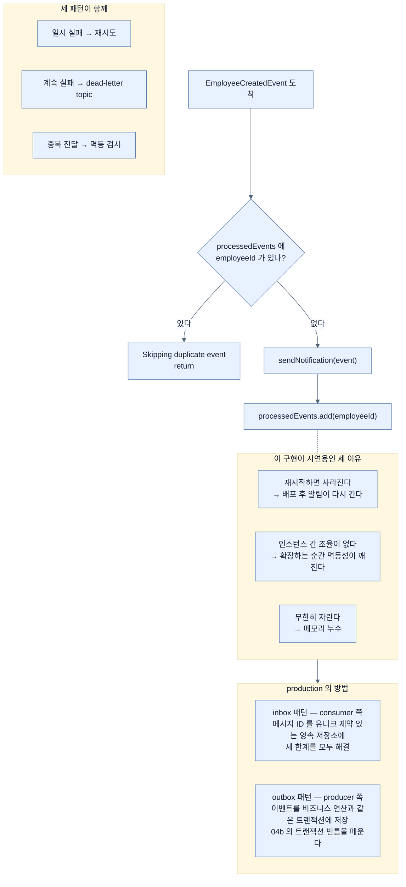

# 멱등 소비자 — 인메모리 Set이 시연용인 세 가지 이유

## 한눈에 보기

```java
private final Set<Long> processedEvents = ConcurrentHashMap.newKeySet();

@KafkaListener(topics = "employee-events", groupId = "notification-group")
public void handleEmployeeCreated(EmployeeCreatedEvent event) {
    if (processedEvents.contains(event.employeeId())) {
        System.out.println("Skipping duplicate event. Employee ID: " + event.employeeId());
        return;
    }
    sendNotification(event);
    processedEvents.add(event.employeeId());
}
```

**시연용이다.** 재시작하면 사라지고, 인스턴스 간 조율이 없고, 무한히 자란다.

## 1. 왜 이게 필요한가

[[05-reliability-patterns-retries-dlt-idempotency]]에서 재시도를 켰다. 신뢰성이 올라갔다. **그런데 중복 처리 위험도 함께 올라갔다.**

그리고 책이 덧붙이는 문장이 중요하다 — **재시도가 없어도 중복은 여전히 생길 수 있다.**

왜 그런가. [[02a-delivery-semantics]]에서 본 **[[At-least-once]]**(= 1회 이상 전달)의 성질 때문이다. consumer가 메시지를 처리하고 **offset을 커밋하기 직전에 죽으면**, 다시 뜬 뒤 같은 메시지를 또 받는다. 리밸런싱 중에도 같은 일이 생긴다.

그래서 소비자 서비스는 **[[멱등성]]**(= 같은 이벤트를 여러 번 처리해도 한 번 처리한 것과 같은 결과가 나오는 성질)을 갖도록 설계돼야 한다.

## 2. 어떻게 동작하는가

### 2.1 멱등 소비자란

**멱등 [[Consumer]]**(= 이벤트를 구독하고 반응하는 구성 요소)는 같은 이벤트를 여러 번 처리해도 **일관되지 않은 결과를 만들지 않는다.** 달리 말해, **중복 이벤트를 처리하는 것이 한 번 처리하는 것과 같은 효과여야 한다.**

이것이 특히 중요한 때는 consumer가 **부수효과**를 낼 때다.

- 이메일 발송
- 레코드 삽입이나 갱신
- 감사 항목 생성
- 외부 시스템 호출

목록을 보면 우리 `NotificationService`가 정확히 첫 번째 경우임이 드러난다. **같은 알림이 두 번 가면 사용자가 알아챈다.**

### 2.2 멱등 키

예제는 **`employeeId`를 멱등 키**로 쓴다. notification service가 이벤트를 받으면 employee ID를 저장해 두고, 이후 메시지와 대조해 **이미 처리된 이벤트인지** 판단한다.

```java
private final Set<Long> processedEvents = ConcurrentHashMap.newKeySet();

@KafkaListener(topics = "employee-events", groupId = "notification-group")
public void handleEmployeeCreated(EmployeeCreatedEvent event) {
    if (processedEvents.contains(event.employeeId())) {
        System.out.println("Skipping duplicate event. Employee ID: " + event.employeeId());
        return;
    }
    sendNotification(event);
    processedEvents.add(event.employeeId());
}
```

동작은 단순하다. **`employeeId`가 이미 처리됐는지 확인한다.** Set에 ID가 없으면 추가하고 메시지를 처리한다. 있으면 **중복으로 판정하고 건너뛴다.**

`ConcurrentHashMap.newKeySet()`을 쓴 것은 **[[KafkaListener]]**(= 메서드를 topic 구독자로 만드는 애노테이션)가 붙은 메서드가 **여러 스레드에서 동시에 호출될 수 있기** 때문이다. partition이 여럿이면 리스너 컨테이너가 병렬로 돈다.

### 2.3 책 자신이 인정하는 세 한계

> **이 인메모리 접근은 시연용으로만 유용하다.** 애플리케이션이 재시작하면 사라지고, 여러 consumer 인스턴스 사이에서 조율되지 않으며, Set이 시간이 지나며 무한히 자랄 수 있다.

세 가지를 각각 따져 보면 왜 실무에서 못 쓰는지가 명확해진다.

| 한계 | 결과 |
|---|---|
| **재시작하면 사라진다** | 배포 직후 과거 이벤트가 재전달되면 **알림이 다시 간다** |
| **인스턴스 간 조율이 없다** | 인스턴스 A가 처리한 것을 인스턴스 B는 모른다. **확장하는 순간 멱등성이 깨진다** |
| **무한히 자란다** | 직원이 백만 명이면 Set에 백만 개. **메모리 누수** |

두 번째가 가장 치명적이다. [[03-apache-kafka-fundamentals]]에서 본 consumer group의 요점이 **인스턴스를 늘려 확장하는 것**인데, 이 구현은 **인스턴스를 늘리면 멱등성을 잃는다.**

### 2.4 production의 방법

> production 시스템에서 멱등성과 신뢰성은 보통 **inbox와 outbox 패턴**으로 구현한다.
>
> **inbox 패턴**은 소비한 메시지 ID(예: `employeeId`)를 **유니크 제약이 있는 영속 저장소**에 담는다. 멱등성을 구현해 각 이벤트가 **한 번만 처리되게** 보장한다.
>
> **outbox 패턴**은 producer 쪽에 구현한다. 이벤트를 **비즈니스 연산과 같은 트랜잭션의 일부로** 데이터베이스에 저장해 **신뢰성 있는 발행**을 보장한다.
>
> 이 패턴들이 분산 시스템에 일관성·내결함성·멱등성을 제공한다.

**[[inbox-패턴]]**(= 소비한 메시지 ID를 유니크 제약이 있는 영속 저장소에 담아 멱등성을 구현하는 패턴)이 위 세 한계를 어떻게 푸는지 보자.

| 한계 | inbox 패턴의 해결 |
|---|---|
| 재시작하면 사라진다 | **영속 저장소**라 남는다 |
| 인스턴스 간 조율이 없다 | 모든 인스턴스가 **같은 DB**를 본다 |
| 무한히 자란다 | 오래된 항목을 **정리할 수 있다** |

그리고 **유니크 제약**이 핵심이다. `contains` 확인 후 `add`하는 두 단계는 **경합 조건**이 있지만, DB 유니크 제약은 **원자적**이라 중복 삽입이 실패로 드러난다.

**[[outbox-패턴]]**(= 이벤트를 비즈니스 연산과 같은 트랜잭션에 저장해 신뢰성 있는 발행을 보장하는 패턴)은 [[04b-implementing-the-employee-service]]에서 본 **트랜잭션 경계의 빈틈**을 정확히 메운다. 저장과 발행이 하나의 트랜잭션이 되어, "직원은 있는데 이벤트가 없는" 상태가 생기지 않는다.

**책이 이 Note를 멱등성 절 끝에 두면서, 정작 outbox가 푸는 문제(§4의 producer 코드)와 연결하지 않는다는 점**이 아쉽다.

### 2.5 세 패턴이 함께 작동한다

**재시도, dead-letter topic, 멱등성은 서로 다른 문제를 풀고, 함께 쓸 때 가장 좋다.**

전체 흐름이 이렇게 완성된다.

1. employee service가 직원 생성 이벤트를 발행한다.
2. notification service가 소비해 알림 발송을 시도한다.
3. 처리가 **일시적으로 실패하면** Spring Kafka가 **재시도**한다.
4. 실패가 계속되면 이벤트가 **dead-letter topic**으로 간다.
5. 같은 이벤트가 두 번 이상 전달되면 **멱등 검사**가 중복 알림을 막는다.

**이것이 실제 환경의 이벤트 주도 시스템에 필요한 수준의 신뢰성이다.**

### 2.6 비유와 그 한계

투표소 명부에 빗댈 수 있다. 유권자가 오면 **이미 투표했는지 명부에서 확인**하고, 안 했으면 투표시킨 뒤 이름에 표시한다. 같은 사람이 두 번 와도 두 번 투표하지 못한다.

**깨지는 지점 셋.** 첫째, 명부가 **종이 한 장이면 투표소가 여러 곳일 때 소용없다** — 인메모리 Set이 인스턴스가 여럿일 때 그렇다. 둘째, 명부를 **선거가 끝나면 보관하지만** 이 Set은 재시작하면 사라진다. 셋째, 확인과 기표 사이에 **틈이 있다** — 두 창구에서 동시에 확인하면 둘 다 통과할 수 있고, 그래서 DB 유니크 제약 같은 **원자적 수단**이 필요하다.

## 3. 그림으로 보기



## 4. 이 노트에 나온 용어

- **[[멱등성]]**: 같은 이벤트를 여러 번 처리해도 결과가 같은 성질.
- **[[At-least-once]]**: 1회 이상 전달. 중복이 생기는 근본 원인.
- **[[재시도]]**: 일시적 실패에 대해 같은 처리를 다시 시도하는 것.
- **[[inbox-패턴]]**: 메시지 ID를 유니크 제약 있는 영속 저장소에 담아 멱등성을 구현하는 패턴.
- **[[outbox-패턴]]**: 이벤트를 비즈니스 연산과 같은 트랜잭션에 저장해 신뢰성 있는 발행을 보장하는 패턴.
- **[[Consumer]]**: 이벤트를 구독하고 반응하는 구성 요소.
- **[[KafkaListener]]**: 메서드를 topic 구독자로 만드는 애노테이션.

## 5. 자주 헷갈리는 것

**재시도와 멱등 검사가 이 구현에서 맞물리지 않는다** — ID를 Set에 추가하는 것이 `sendNotification` **성공 뒤**다. 그런데 [[05-reliability-patterns-retries-dlt-idempotency]]의 재시도는 `sendNotification`이 **실패했을 때** 도는 것이라, 재시도가 도는 동안에는 **아직 Set에 없다.** 즉 재시도가 만드는 중복은 이 검사가 막지 못한다.

막는 것은 **다른 종류의 중복**이다 — offset 커밋 실패나 리밸런싱으로 **이미 성공적으로 처리한 메시지가 다시 온** 경우. 그것도 중요하지만, 절의 도입이 "재시도가 중복 위험을 높인다"로 시작하는 것과는 어긋난다.

**확인과 추가 사이에 경합이 있다** — `contains` 후 `add`는 원자적이지 않다. 두 스레드가 동시에 같은 ID를 확인하면 **둘 다 통과**한다. `ConcurrentHashMap.newKeySet()`이 각 연산은 스레드 안전하게 만들지만 **두 연산의 조합은 아니다.** `add`가 `true`/`false`를 반환한다는 점을 이용하면 한 번에 해결된다.

**멱등 키 선택이 도메인 판단이다** — `employeeId`를 쓰면 "한 직원에게 알림은 평생 한 번"이 된다. 직원 정보가 갱신돼 다시 알려야 한다면 이 키로는 안 된다. **이벤트 ID**를 쓰는 편이 일반적으로 안전하다.

**책이 outbox를 여기에 둔다** — outbox는 producer 쪽 패턴인데 **멱등성 절의 Note**에 있다. 정작 그것이 푸는 문제는 [[04b-implementing-the-employee-service]]의 코드에 있는데 두 자리가 연결되지 않는다.

## 6. 언제 안 쓰나 / 경계

- **인메모리 Set을 production에 쓰지 않는다.** 세 한계 중 하나만으로도 충분한 이유다.
- **`contains` 후 `add` 패턴을 쓰지 않는다.** 원자적 수단을 쓴다.
- **멱등 키를 도메인 ID로만 정하지 않는다.** 이벤트 ID가 더 안전한 경우가 많다.
- **멱등성만으로 신뢰성을 확보했다고 보지 않는다.** 재시도·DLT와 함께여야 한다.

## 7. 연결

- [[05-reliability-patterns-retries-dlt-idempotency]] — 중복 위험을 만드는 재시도.
- [[05a-dead-letter-topics]] — 함께 쓰이는 세 번째 패턴.
- [[02a-delivery-semantics]] — 멱등성이 필요해지는 근본 이유.
- [[04b-implementing-the-employee-service]] — outbox 패턴이 실제로 푸는 문제가 있는 코드.

## 8. 스스로 확인

- 재시도가 없어도 중복이 생기는 경로를 두 가지 들어 보라.
- 인메모리 Set의 세 한계 중 확장과 관련해 가장 치명적인 것은 무엇이고 왜인가?
- inbox 패턴의 "유니크 제약"이 왜 `contains` + `add`보다 나은가?
- 세 패턴(재시도·DLT·멱등성)이 각각 푸는 문제를 한 문장씩으로 구분해 보라.

<!-- ==== 아래는 내 영역 · 스킬 수정 금지 ==== -->

## 내 설명 시도


## 막혔던 지점


## 리뷰 이력
