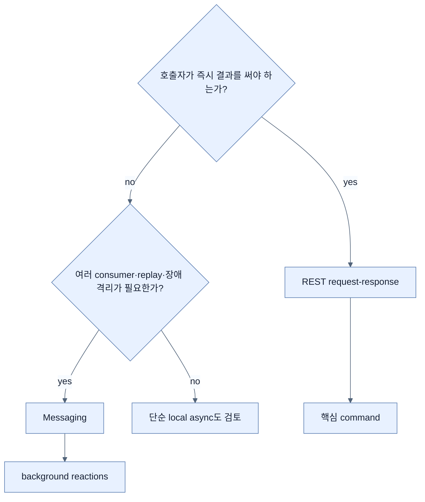

# REST와 Messaging 사이에서 선택하기

## 한눈에 보기

REST는 호출자가 즉시 결과를 필요로 하는 직접적인 request-response에, messaging은 producer가 consumer 완료를 기다리지 않아도 되는 background reaction과 fan-out에 적합하다. 둘 중 하나로 통일하기보다 한 business flow 안에서 경계별로 조합한다.

## 1. 왜 이게 필요한가

REST는 단순하고 결과·오류를 호출자에게 바로 돌려주지만 양쪽 서비스가 동시에 살아 있어야 하는 temporal coupling이 있다. Messaging은 availability와 scale을 분리하지만 결과가 늦게 수렴하고, broker 운영·중복·순서·추적 복잡성을 감수한다.

## 2. 어떻게 동작하는가

| 질문 | REST가 맞는 신호 | Messaging이 맞는 신호 |
|---|---|---|
| 응답 | 다음 단계 전에 결과가 필요 | 후속 결과를 기다리지 않음 |
| 수신자 | 명확한 단일 service | 여러 독립 consumer 가능 |
| 장애 | 즉시 실패를 전달해야 함 | producer와 consumer 장애를 격리 |
| 일관성 | 즉시 확인이 중요 | eventual consistency 허용 |
| 운영 | 단순 호출·debug 우선 | retry·replay·fan-out 필요 |

책의 employee 예에서는 `POST /employees`와 201 응답은 REST로 처리하고, 저장 후 notification·audit reaction은 Kafka event로 분리한다. Command가 성공했다는 것과 모든 downstream reaction이 완료됐다는 것을 API contract에서 구분해야 한다.

## 3. 그림으로 보기

## 4. 이 노트에 나온 용어

- **request-response**: caller가 요청을 보내고 callee의 결과를 같은 interaction에서 기다리는 방식.
- **temporal coupling**: 통신하는 구성 요소가 같은 시간에 가용해야 하는 결합.
- **asynchronous messaging**: sender와 receiver가 broker의 message를 사이에 두고 독립된 시간에 처리하는 통신.

## 7. 연결

- [[01-asynchronous-and-event-driven-communication]] — 두 방식으로 구현한 employee flow를 비교한다.
- [[05-reliability-patterns-retries-dlt-idempotency]] — messaging 선택 시 함께 떠안는 신뢰성 설계다.
- [[chapter-11-virtual-threads-in-java-and-spring-boot/04-using-virtual-threads-with-restclient|RestClient]] — synchronous HTTP를 scalable하게 실행하는 선택지다.

## 8. 스스로 확인

- 전체 1차 정리 후: 직원 생성·알림 flow를 REST와 messaging으로 나누고 선택 이유를 설명한다.

<!-- ==== 아래는 내 영역 · 스킬 수정 금지 ==== -->

## 내 설명 시도

## 막혔던 지점

## 리뷰 이력

