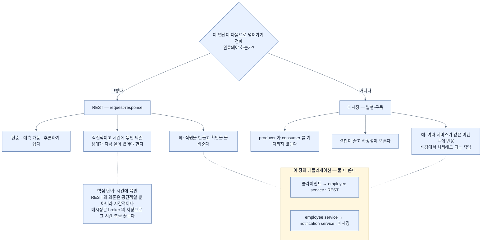

# REST와 메시징 — 시간에 묶인 의존을 만들 것인가

## 한눈에 보기

> **REST는 서비스 사이에 직접적이고 시간에 묶인 의존을 만들고, 메시징은 이벤트를 통해 그들을 분리한다.**

| | REST | 메시징 |
|---|---|---|
| 모델 | request-response | 발행-구독 |
| 호출자 | **결과를 기다린다** | 기다리지 않는다 |
| 성격 | 단순·예측 가능·추론하기 쉽다 | 결합이 줄고 확장성이 오른다 |
| 맞는 곳 | **다음으로 넘어가기 전에 끝나야 하는 연산** | 배경 처리, 여러 서비스가 같은 이벤트에 반응 |

**핵심은 하나를 고르는 것이 아니라 각각이 어디에 맞는지 아는 것이다.**

## 1. 왜 이게 필요한가

이 장에서 두 통신 스타일을 살펴봤다 — **[[동기-통신]]**(= 응답이 올 때까지 기다리는 통신)인 REST와 Kafka를 쓴 **[[비동기-통신]]**(= 완료를 기다리지 않는 통신).

여기까지 오면 자연스럽게 드는 질문이 있다. **언제 REST를 쓰고 언제 메시징을 써야 하나?**

책의 답이 서두에 나온다 — **핵심은 하나를 다른 것보다 고르는 것이 아니라, 각각이 어디에 가장 잘 맞는지 이해하는 것이다.**

## 2. 어떻게 동작하는가

### 2.1 REST

REST는 **request-response**다. 클라이언트가 요청을 보내고 **즉각적인 결과를 기다린다.**

그래서 상호작용이 **단순하고, 예측 가능하고, 추론하기 쉽다.**

이 세 형용사가 REST의 진짜 가치다. 요청 하나에 응답 하나이고, 실패하면 그 자리에서 알고, 로그를 보면 흐름이 한 줄로 이어진다. [[01a-core-components-of-event-driven-systems]]가 말한 "흐름 추적이 어려워진다"는 문제가 **애초에 없다.**

맞는 곳도 명확하다 — **다음으로 넘어가기 전에 연산이 완료돼야 할 때.** 예컨대 **직원을 만들고 클라이언트에 확인을 돌려주는 것**이다.

이 예가 흥미로운 이유는, 이 장의 애플리케이션이 **바로 그것을 REST로 유지**했기 때문이다. [[04c-implementing-the-notification-service]]의 `POST /employees`는 REST이고, 알림만 이벤트로 뺐다.

### 2.2 메시징

메시징은 **비동기**다. 한 서비스가 이벤트를 발행하고 다른 서비스들이 **독립적으로** 처리한다.

**[[Producer]]**(= 이벤트를 방출하는 구성 요소)가 소비자를 기다리지 않으므로 결합이 줄고 확장성이 오른다 — [[01-asynchronous-and-event-driven-communication]]의 **[[디커플링]]**(= 발행하는 쪽이 소비자를 몰라도 되는 상태)이다.

유용한 곳 둘이다.

- **여러 서비스가 같은 이벤트에 반응해야 할 때**
- **작업이 배경에서 일어나도 될 때**

첫 번째가 특히 중요하다. REST로 알림·감사·통계 세 서비스를 부르려면 employee service가 **셋을 다 알아야** 하고, 넷째가 생기면 코드를 고쳐야 한다. 이벤트로는 그냥 구독하면 된다.

### 2.3 한 문장으로 줄이면

> **차이는 단순하다 — REST는 서비스 사이에 직접적이고 시간에 묶인(time-bound) 의존을 만들고, 메시징은 이벤트를 통해 그들을 분리한다.**

**"시간에 묶인"**이 이 문장의 핵심 단어다. REST의 의존은 **공간적**(누구를 부르는지)일 뿐 아니라 **시간적**이다 — 상대가 **지금 이 순간** 살아 있고 응답할 수 있어야 한다.

메시징은 그 시간 축을 끊는다. 소비자가 지금 죽어 있어도 **나중에** 처리하면 된다. [[01a-core-components-of-event-driven-systems]]에서 broker의 "저장"이 결정적이라고 한 이유가 이것이다.

### 2.4 실무에서는 둘 다 쓴다

**실무에서 애플리케이션은 둘을 결합한다.**

| 쓰는 곳 | 방식 |
|---|---|
| 즉각적이고 **클라이언트 주도**인 연산 | REST |
| **배경 처리**와 서비스 간 반응 | 메시징 |

이 장의 애플리케이션이 정확히 그 형태다. 클라이언트 → employee service는 REST, employee service → notification service는 메시징.

즉 **경계마다 다른 선택**을 하는 것이지 시스템 전체를 한쪽으로 통일하는 것이 아니다.

### 2.5 비유와 그 한계

전화와 문자에 빗댈 수 있다. **전화(REST)**는 상대가 받아야 하고 그 자리에서 답을 얻는다 — 급한 확인에 맞다. **문자(메시징)**는 상대가 지금 못 받아도 되고, 여러 명에게 같은 내용을 보낼 수 있다 — 알림에 맞다.

**깨지는 지점 둘.** 첫째, 사람은 문자를 **읽었는지 확인**할 수 있지만 producer는 consumer가 처리했는지 알 수 없다 — 그것이 [[01a-core-components-of-event-driven-systems]]의 "추적의 어려움"이다. 둘째, 전화와 문자는 **같은 사람이 고르지만**, REST와 메시징은 **아키텍처 결정**이라 나중에 바꾸기가 훨씬 비싸다. 그래서 "둘 다 쓴다"는 결론이 회피가 아니라 **실제 설계 지침**이다.

## 3. 그림으로 보기

## 4. 이 노트에 나온 용어

- **[[동기-통신]]**: 응답이 올 때까지 기다리는 통신.
- **[[비동기-통신]]**: 보낸 쪽이 완료를 기다리지 않는 통신.
- **[[디커플링]]**: 발행하는 쪽이 누가·몇이·언제 소비할지 몰라도 되는 상태.
- **[[이벤트-주도]]**: 이벤트를 발행·구독해 통신하는 아키텍처 스타일.
- **[[Producer]]**: 의미 있는 일이 생겼을 때 이벤트를 방출하는 구성 요소.

## 5. 자주 헷갈리는 것

**"메시징이 더 발전된 방식"** — 아니다. REST의 "단순·예측 가능·추론하기 쉽다"는 실제 가치이고, 메시징은 그것을 **내주고** 결합 감소를 산다. [[01a-core-components-of-event-driven-systems]]가 나열한 대가(추적·순서·진단의 어려움)가 그 값이다.

**"시간에 묶인"이 곧 "느리다"가 아니다** — 상대가 **지금 응답할 수 있어야 한다**는 뜻이다. 빠르냐 느리냐가 아니라 **가용성 의존**의 문제다.

**시스템 전체를 한쪽으로 통일하지 않는다** — 경계마다 판단한다. 이 장의 애플리케이션 자체가 두 방식을 함께 쓴다.

**메시징을 골랐다고 REST가 사라지지 않는다** — 클라이언트와의 접점은 여전히 REST다. [[01-asynchronous-and-event-driven-communication]]이 "클라이언트 상호작용은 여전히 동기"라고 한 그대로다.

## 6. 언제 안 쓰나 / 경계

- **결과를 즉시 알아야 하는 연산에 메시징을 쓰지 않는다.** 클라이언트에게 거짓 확인을 주게 된다.
- **서비스가 둘뿐이고 함께 배포된다면** 메시징의 이득이 작다.
- **관측 체계 없이 메시징으로 가지 않는다.** 추적이 어려워진 만큼 도구가 필요하다.
- **"둘 다 쓴다"를 결정 회피로 쓰지 않는다.** 경계마다 근거를 갖고 고른다.

## 7. 연결

- [[01-asynchronous-and-event-driven-communication]] — 두 방식의 흐름을 나란히 그린 자리.
- [[01a-core-components-of-event-driven-systems]] — 메시징을 고를 때 감수하는 대가.
- [[04c-implementing-the-notification-service]] — 이 장의 애플리케이션이 두 방식을 함께 쓰는 모습.
- [[05b-idempotent-consumers]] — 메시징을 골랐을 때 추가로 해야 하는 일.

## 8. 스스로 확인

- "시간에 묶인 의존"이 정확히 무엇을 뜻하는가? 그것이 없어지면 무엇이 가능해지는가?
- REST가 가진 세 가지 장점을 말하고, 메시징이 그것을 어떻게 내주는지 설명해 보라.
- 이 장의 애플리케이션에서 REST 구간과 메시징 구간을 각각 짚어 보라.
- 알림·감사·통계 세 서비스가 직원 생성에 반응해야 한다면 어느 쪽을 고르고 왜인가?

<!-- ==== 아래는 내 영역 · 스킬 수정 금지 ==== -->

## 내 설명 시도

## 막혔던 지점

## 리뷰 이력
