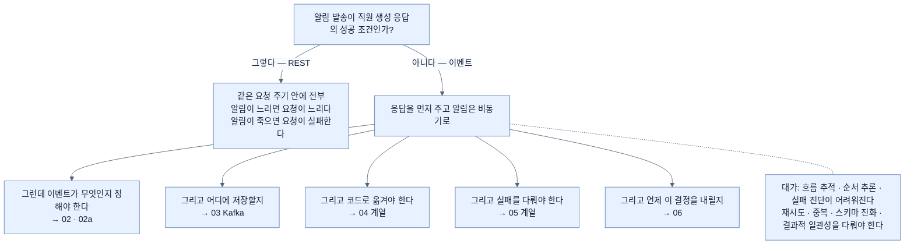
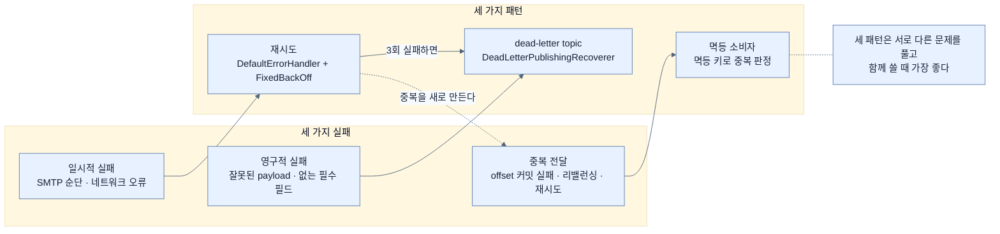

# Chapter 12 개념 지도 — Messaging and Asynchronous Communication in Spring Boot 4

> *Learning Spring Boot 4*, Ch. 12 (책 pp. 317–343 / PDF pp. 342–368). 노트 13개를 네 축으로 엮는다. 축 1은 **"무엇을 응답 전에 끝낼 것인가"**, 축 2는 **"이론이 코드의 어느 줄이 되는가"**, 축 3은 **"세 가지 실패에 세 가지 패턴"**, 축 4는 **"책이 잇지 않은 두 자리"**다.

## 축 1 — 하나의 결정에서 전부가 갈린다

이 장 전체가 **한 가지 결정**에서 파생된다 — **알림 발송이 직원 생성 응답의 성공 조건인가?**

이 축이 알려 주는 것은 **이벤트 주도가 기술 선택이 아니라 도메인 판단**이라는 점이다. "응답 전에 무엇이 끝나야 하는가"는 아키텍트가 아니라 도메인이 답한다.

## 축 2 — 이론이 코드의 어느 줄이 되는가

앞 절반(§1–§3)의 개념이 뒤 절반(§4)의 어느 줄로 나타나는지 짚으면 이 장이 하나로 묶인다.

| 개념 | 노트 | 코드의 어느 줄 |
|---|---|---|
| producer / consumer | [[01a-core-components-of-event-driven-systems]] | `EmployeeService` / `NotificationService` |
| 이벤트 ≠ 메시지 | [[02-events-messages-and-delivery-semantics]] | `EmployeeCreatedEvent` record ↔ `JacksonJsonSerializer` |
| at-least-once | [[02a-delivery-semantics]] | `FixedBackOff(2000L, 3L)` |
| topic | [[03-apache-kafka-fundamentals]] | `send("employee-events", ...)` |
| **키가 partition을 정한다** | [[03-apache-kafka-fundamentals]] | `saved.getId().toString()` |
| consumer group | [[03-apache-kafka-fundamentals]] | `groupId = "notification-group"` |
| offset | [[03-apache-kafka-fundamentals]] | `auto-offset-reset: earliest` |
| partition 배정 | [[03-apache-kafka-fundamentals]] | 기동 로그 `partitions assigned: [employee-events-0]` |
| 멱등성 | [[02a-delivery-semantics]] | `processedEvents.contains(...)` |

두 번째 줄과 다섯 번째 줄이 특히 값이 있다. **키를 `employeeId`로 고른 것**이 [[03-apache-kafka-fundamentals]]의 "같은 키는 같은 partition"을 실제로 활용한 것이고, 그래야 한 직원의 이벤트 순서가 지켜진다.

## 축 3 — 세 가지 실패에 세 가지 패턴

화살표 중 **`P1 → F3`(점선)**이 이 축의 통찰이다. **재시도가 신뢰성을 사는 대가로 중복을 만든다.** 그래서 셋이 세트다.

## 축 4 — 책이 잇지 않은 두 자리

이 장에는 **같은 문제를 다루면서 서로 연결되지 않은 자리**가 둘 있다. 노트에서 이었다.

| 문제가 있는 곳 | 해법이 언급된 곳 | 연결 |
|---|---|---|
| [[04b-implementing-the-employee-service]] — `save()`와 `send()` 사이에 **트랜잭션 경계가 없다** | [[05b-idempotent-consumers]]의 Note — **outbox 패턴** | outbox가 정확히 그 빈틈을 메운다. 책은 멱등성 절 끝에 지나가듯 적는다 |
| [[04-building-event-driven-services]] — Figure 12.5가 **Zookeeper 설정**을 보여 준다 | 같은 절의 `docker-compose.yml` — **KRaft 모드** | 화면과 구성이 어긋난다. 그대로 따라 하면 막힌다 |

## 축 5 — 이 장에서 헷갈리는 쌍들

| 쌍 | 구분 |
|---|---|
| 이벤트 ↔ 메시지 | **무슨 일이 있었나** ↔ **어떻게 전달되나** — [[02-events-messages-and-delivery-semantics]] |
| DLQ ↔ DLT | 제목은 queue, 본문은 topic. **Kafka에는 topic이 있다** — [[05a-dead-letter-topics]] |
| 엔티티 ↔ 이벤트 타입 | 저장하는 것 ↔ 알리는 것. **`role`이 이벤트에는 없다** — [[04a-defining-the-event-and-persistence-models]] |
| `JsonSerializer` ↔ `JacksonJsonSerializer` | 옛 것(deprecated) ↔ **Boot 4의 Jackson 3에 맞는 것** — [[04b-implementing-the-employee-service]] |
| inbox ↔ outbox | **consumer 쪽 멱등성** ↔ **producer 쪽 신뢰성 발행** — [[05b-idempotent-consumers]] |
| 일시적 실패 ↔ 영구적 실패 | 재시도가 도움 ↔ 자원 낭비 — [[05-reliability-patterns-retries-dlt-idempotency]] |
| `Instant` ↔ `LocalDateTime` | 책이 같은 record를 두 버전으로 제시한다. **JSON 표현이 다르다** — [[04a-defining-the-event-and-persistence-models]] |

## 노트 목록

| # | 노트 | 한 줄 |
|---|---|---|
| 01 | [[01-asynchronous-and-event-driven-communication]] | 응답 전에 무엇을 끝낼 것인가 |
| 01a | [[01a-core-components-of-event-driven-systems]] | 네 구성 요소와 추적이 어려워지는 대가 |
| 02 | [[02-events-messages-and-delivery-semantics]] | 무슨 일이 있었나 대 어떻게 전달되나 |
| 02a | [[02a-delivery-semantics]] | 중복을 없애지 말고 안전하게 다뤄라 |
| 03 | [[03-apache-kafka-fundamentals]] | partition이 병렬성과 순서를 동시에 정한다 |
| 04 | [[04-building-event-driven-services]] | KRaft 모드 Compose와 의존성 하나 |
| 04a | [[04a-defining-the-event-and-persistence-models]] | 저장하는 것과 알리는 것을 나눈다 |
| 04b | [[04b-implementing-the-employee-service]] | `send`의 세 인자와 트랜잭션 빈틈 |
| 04c | [[04c-implementing-the-notification-service]] | `@KafkaListener` 한 줄과 `trusted.packages` 함정 |
| 05 | [[05-reliability-patterns-retries-dlt-idempotency]] | 일시적 실패와 영구적 실패 가르기 |
| 05a | [[05a-dead-letter-topics]] | 못 고칠 메시지를 격리하기 |
| 05b | [[05b-idempotent-consumers]] | 인메모리 Set이 시연용인 세 이유 |
| 06 | [[06-choosing-between-rest-and-messaging]] | 시간에 묶인 의존을 만들 것인가 |

## 다른 Chapter와의 연결

- **Ch. 13 관측** — [[01a-core-components-of-event-driven-systems]]가 "비즈니스 흐름 추적이 어려워진다"고 진단하는데, 그 처방이 다음 장이다. `part-5-observing-spring-boot-4-applications/chapter-13-observing-spring-boot-4-applications/05-tracing-with-opentelemetry-and-tempo`의 분산 추적과 같은 폴더의 `05b-enabling-trace-export-and-kafka-propagation`이 **Kafka를 넘는 trace 전파**를 다룬다. 이 장이 만든 문제를 그 노트가 정확히 겨냥한다.
- **Ch. 3 데이터** — [[04a-defining-the-event-and-persistence-models]]의 `@Entity`와 `JpaRepository`는 `part-2-creating-an-application-with-spring-boot/chapter-3-querying-for-data-with-spring-boot/03-creating-repositories-and-declarative-queries`에서 배운 것 그대로다. 이 장이 리액티브가 아니므로 JPA를 그대로 쓴다.
- **Ch. 10 리액티브 데이터** — 대비가 유익하다. `chapter-10-working-with-data-reactively/01-what-reactive-data-access-requires`가 "JPA는 블로킹이라 못 쓴다"고 하는데 이 장은 JPA를 쓴다. **메시징과 리액티브는 다른 축의 선택**이라는 사실이 두 장을 나란히 놓으면 드러난다.
- **Ch. 11 가상 스레드** — `chapter-11-virtual-threads-in-java-and-spring-boot/03-integrating-virtual-threads-with-taskexecutor`가 **같은 프로세스 안에서** 작업을 배경으로 미루는 방법을 다룬다. 이 장은 **프로세스 밖으로** 미룬다. "HTTP 응답을 지연시키면 안 되는 작업"이라는 동기가 같고 경계가 다르다.
- **Ch. 9 리액티브 웹** — `chapter-9-writing-reactive-web-controllers/01-reactive-programming-and-backpressure`의 **배압**과 이 장의 **전달 시맨틱**이 같은 문제(생산자가 소비자보다 빠를 때)를 다른 층에서 푼다. 리액티브는 흐름을 조절하고, Kafka는 저장해 두고 소비자 속도에 맡긴다.
