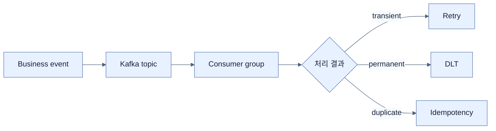

# Chapter 12 — Messaging and Asynchronous Communication in Spring Boot 4

## 학습 경로

1. [[01-asynchronous-and-event-driven-communication|비동기·이벤트 기반 통신]]
2. [[02-events-messages-and-delivery-semantics|Event·message·전달 의미론]]
3. [[03-apache-kafka-fundamentals|Kafka 기본 구조]]
4. [[04-building-event-driven-services|Spring Kafka 서비스 구현]]
5. [[05-reliability-patterns-retries-dlt-idempotency|Retry·DLT·idempotency]]
6. [[06-choosing-between-rest-and-messaging|REST와 messaging 선택]]

## 책의 범위

- 본문: pp. 317–343
- PDF: pp. 342–368
- 구현 축: `KafkaTemplate` producer → topic/partition → `@KafkaListener` consumer

