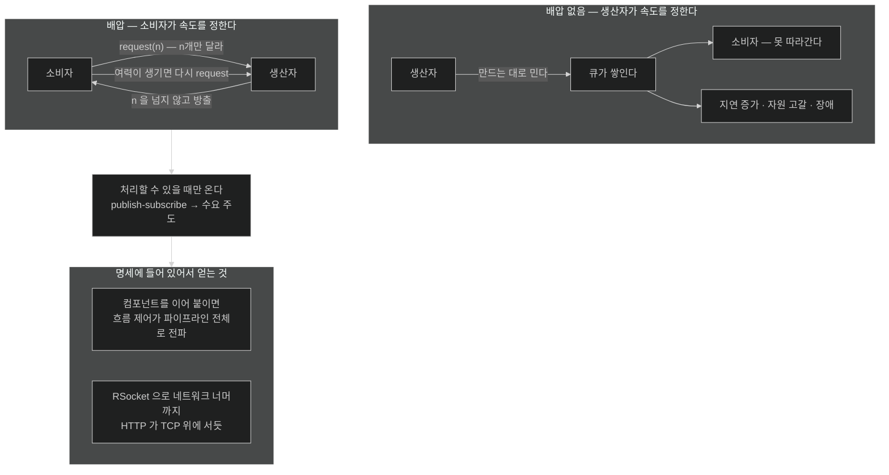

# 배압 — 소비자가 속도를 정하는 모델

## 한눈에 보기

| | 전통적 publish-subscribe | 배압이 있는 모델 |
|---|---|---|
| 누가 속도를 정하나 | **생산자** — 만드는 대로 민다 | **소비자** — "n개 달라"고 요청한다 |
| 소비자가 못 따라가면 | 큐가 쌓이고 메모리가 터진다 | 요청하지 않으면 **애초에 안 온다** |
| 전파 범위 | 없음 | 파이프라인 **전체**로 전파 |

## 1. 왜 이게 필요한가

여덟 장을 거치며 애플리케이션을 다 만들고, 컨테이너에 넣고, 네이티브로도 돌렸다. 그런데 이런 상황이라면?

> 애플리케이션이 여전히 **idle time**으로 가득하다. 지금의 부하를 감당하려고 인스턴스를 잔뜩 띄웠고 클라우드 청구서가 타고 있다.

수십 년간 이걸 풀려는 도구가 있었다 — thread pool, `synchronized` 블록, 그 밖의 **[[컨텍스트-스위칭]]**(= 실행 중인 스레드를 바꿀 때 상태를 저장·복원하는 비용) 기법들. 코드 사본을 안전하게 더 많이 돌리려는 장치들이다.

**강력했지만 규모에서 올바로 쓰기가 어려웠다.** 약속은 컸고 구현은 까다로웠으며 결과는 빈약했다. 그래서 사람들은 여전히 꼭 필요한 서비스를 수백~수천 개씩 돌리고, Azure나 AWS의 월 청구서는 거대해진다.

그런데 힌트가 엉뚱한 데서 왔다. **브라우저의 리액티브 JavaScript 툴킷**이다. 브라우저에는 **스레드가 하나뿐인데도** 논블로킹·이벤트 기반으로 접근하면 얼마나 잘 확장되는지를 보여 줬다.

즉 확장의 열쇠가 "스레드를 더 많이"가 아닐 수 있다는 뜻이다.

## 2. 어떻게 동작하는가

### 2.1 리액티브란 무엇인가

이 맥락에서 리액티브는 **[[리액티브-스트림]]**(= 논블로킹 배압을 갖춘 비동기 스트림 처리의 표준)을 가리킨다. 공식 정의는 이렇다.

> "Reactive Streams is an initiative to provide a standard for asynchronous stream processing with **non-blocking back pressure**. This encompasses efforts aimed at runtime environments (JVM and JavaScript) as well as network protocols."
>
> — Reactive Streams 공식 사이트

이 한 문장에 세 가지가 들어 있다 — 비동기 스트림 처리, **논블로킹 배압**, 그리고 JVM·JavaScript·네트워크 프로토콜까지 걸치는 범위.

### 2.2 핵심 특성 — 빠른 스트림이 목적지를 압도하면 안 된다

리액티브 시스템의 결정적 특성은 이것이다. **빠른 데이터 스트림이 목적지를 압도해서는 안 된다.**

생산자가 소비자가 처리할 수 있는 속도보다 빠르게 방출하면 시스템이 불안정해진다. 결과가 셋이다.

- 지연 증가
- 자원 고갈
- 심하면 장애

이건 이론이 아니라 흔한 장애 시나리오다. Kafka 컨슈머가 밀린다, 큐가 무한히 자란다, `OutOfMemoryError`가 난다 — 전부 같은 이야기다.

### 2.3 배압 — 방향을 뒤집는다

**[[배압]]**(= 소비자가 처리할 수 있는 만큼만 받도록 흐름을 통제하는 메커니즘)이 이 문제를 정면으로 다룬다.

데이터를 무작정 하류로 미는 대신, **생산자와 소비자 사이에 조율을 넣는다.**

이 모델에서 **소비자가 흐름을 통제한다.** 무한정 밀려오는 스트림을 받는 대신, 자기가 다룰 준비가 된 양을 **명시적으로 알린다** — 1개, 10개, 또는 그 이상.

그러면 전통적 publish-subscribe가 **수요 주도 상호작용(demand-driven)**으로 바뀐다. 처리할 여력이 있을 때만 데이터가 간다.

여기가 발상의 전환이다. "밀려오는 것을 어떻게 견딜까"가 아니라 **"오지 않게 하려면 무엇을 안 해야 하나"**로 문제가 바뀐다.

### 2.4 왜 파이프라인 전체로 전파되나

조율은 수요를 관리하고, 오류를 전파하고, 완료를 알리는 **잘 정의된 [[시그널]]**(= 데이터 처리·동작에 따라오는 신호) 집합으로 일어난다.

배압이 **명세의 일부**라서 여러 컴포넌트를 걸쳐 보존된다. 리액티브 컴포넌트를 이어 붙이면 이 흐름 제어가 **파이프라인 전체로 전파**되어 어느 부분도 압도되지 않는다.

이게 왜 중요한가 하면, 흐름 제어를 컴포넌트마다 손으로 짜면 **한 군데만 빠져도 그 지점에서 터지기** 때문이다. 명세에 들어 있으면 이어 붙이는 것만으로 유지된다.

### 2.5 애플리케이션 경계도 넘는다

이 모델은 한 애플리케이션 안에 갇히지 않는다. **[[RSocket]]**(= 배압을 내장한 리액티브 통신용 전송 프로토콜) 같은 프로토콜이 같은 원리를 네트워크에 적용한다.

HTTP가 TCP 위에 서듯, RSocket은 배압이 내장된 리액티브 통신의 전송 계층을 제공해 **분산 시스템끼리도 완전히 흐름 제어된 방식으로** 데이터를 주고받게 한다.

### 2.6 비유와 그 한계

수도꼭지와 컵에 빗대는 설명이 흔하다. 배압 없는 모델은 수도를 최대로 틀고 컵을 갖다 대는 것이고, 배압은 **컵이 "지금 200ml만"이라고 말할 수 있는** 상태다.

**깨지는 지점 둘.** 첫째, 실제 수도는 잠그면 물이 파이프에 그대로 남지만, 리액티브에서 요청하지 않은 데이터는 **애초에 생성되지 않을 수도 있다** — 게으른 평가 덕에 상류가 아예 일을 시작하지 않는다. 둘째, 컵은 넘치면 눈에 보이지만, 배압 없는 시스템의 붕괴는 **메모리 그래프가 천천히 오르다가 갑자기** 온다. 그래서 [[01a-blocking-vs-non-blocking]]에서 볼 자원 소비의 구조를 이해해야 한다.

## 3. 그림으로 보기

## 4. 이 노트에 나온 용어

- **[[리액티브-스트림]]**: 논블로킹 배압을 갖춘 비동기 스트림 처리의 표준.
- **[[배압]]**: 소비자가 처리 가능한 만큼만 받도록 흐름을 통제하는 메커니즘.
- **[[컨텍스트-스위칭]]**: 실행 중인 스레드를 바꿀 때 드는 저장·복원 비용.
- **[[RSocket]]**: 배압을 내장한 리액티브 통신용 전송 프로토콜.
- **[[시그널]]**: 데이터 처리나 동작에 따라오는 신호.
- **[[스레드-per-요청]]**: 요청마다 전용 스레드를 배정하는 전통적 모델.

## 5. 자주 헷갈리는 것

**"리액티브 = 비동기"** — 비동기는 리액티브의 일부일 뿐이다. 비동기이면서 배압이 없으면 그냥 **더 빨리 터지는 시스템**이다. 리액티브의 정의에 "non-blocking **back pressure**"가 들어간 이유가 그것이다.

**"배압은 큐 크기를 제한하는 것"** — 비슷하지만 다르다. 큐 제한은 넘친 것을 **버리거나 막는** 사후 대응이고, 배압은 **애초에 그만큼만 보내게** 하는 사전 조율이다.

**브라우저 비유의 범위** — 단일 스레드 JavaScript가 잘 확장된다는 사실이 "스레드 하나면 충분하다"는 뜻은 아니다. 요점은 **스레드 수가 아니라 기다림을 없애는 것**이며, [[01a-blocking-vs-non-blocking]]이 그 구조를 다룬다.

## 6. 언제 안 쓰나 / 경계

- **CPU 바운드 작업**에는 이득이 없다. 기다림이 없으므로 없앨 낭비도 없다.
- **부하가 낮고 단순한 CRUD**라면 명령형이 읽기 쉽고 디버깅도 쉽다.
- **스택 전체가 리액티브가 아니면** 이득이 사라진다. 한 군데의 블로킹이 이벤트 루프를 잡는다 — [[04b-java-concurrency-history]].
- **배압은 마법이 아니다.** 소비자가 느리면 시스템은 여전히 느리다. 다만 **터지지 않고** 느려질 뿐이다.

## 7. 연결

- [[01a-blocking-vs-non-blocking]] — 왜 적은 스레드로 많은 요청을 다룰 수 있는지의 구조.
- [[01b-reactive-streams-details]] — 배압을 실제로 구현하는 네 인터페이스와 시그널 순서.
- [[02-creating-a-webflux-application]] — 이 모델을 Spring Boot 프로젝트로 옮기는 첫걸음.
- [[04a-scaling-with-project-reactor]] — Reactor가 이 원리로 확장을 만드는 두 가지 방법.

## 8. 스스로 확인

- 배압이 있는 모델과 없는 모델에서 "소비자가 느릴 때" 벌어지는 일을 각각 설명해 보라.
- 배압이 명세의 일부라는 사실이 컴포넌트를 이어 붙일 때 어떤 이득을 주는가?
- 단일 스레드 JavaScript가 잘 확장된다는 관찰에서 끌어낼 수 있는 결론과 끌어낼 수 없는 결론은?
- RSocket이 HTTP와 다른 층에서 하는 일은 무엇인가?

> 네 문항을 스스로 답한 **뒤에** [[_01-reactive-programming-and-backpressure]]에서 모범답안과 대조한다. 먼저 열면 이 문항들은 다시 인출 문제로 쓸 수 없다.

<!-- ==== 아래는 내 영역 · 스킬 수정 금지 ==== -->

## 내 설명 시도

## 막혔던 지점

## 리뷰 이력
