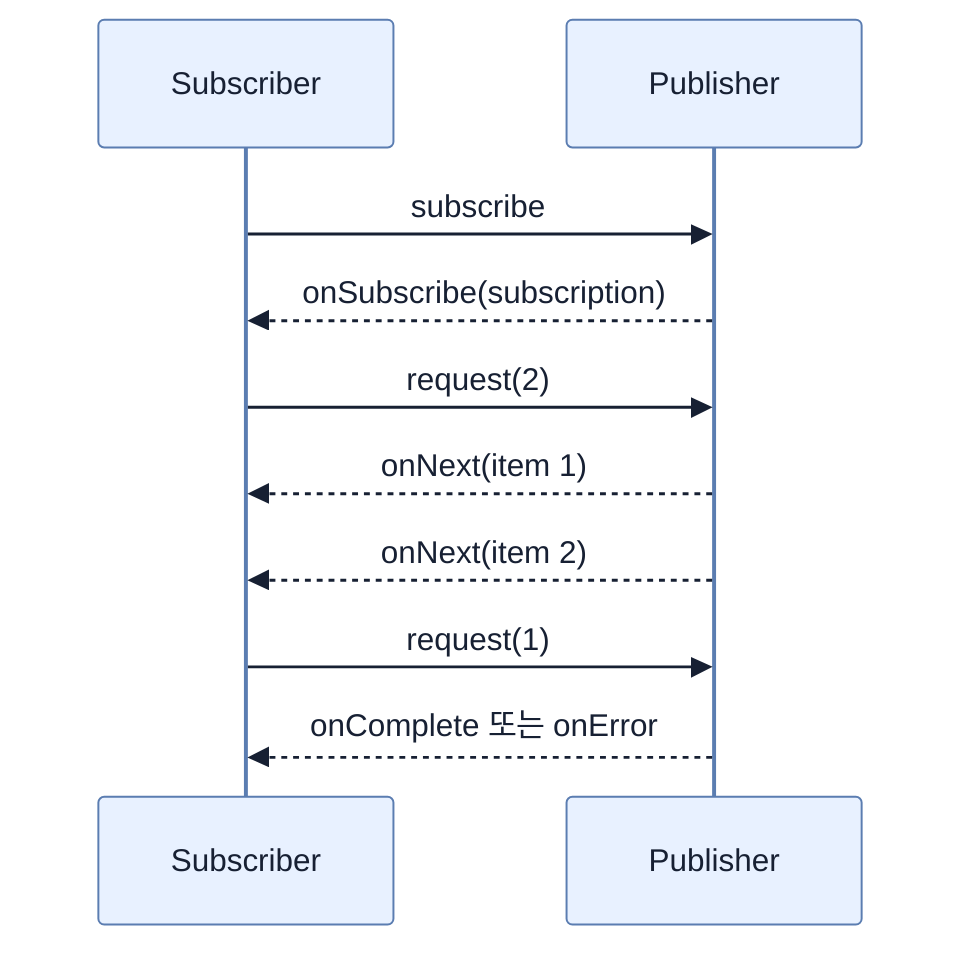

# Reactive Programming과 Backpressure

## 한눈에 보기

Reactive Streams는 asynchronous stream을 non-blocking으로 처리하면서 consumer demand로 producer 속도를 제한하는 표준이다. `Publisher`, `Subscriber`, `Subscription`, `Processor` 네 interface와 `onSubscribe/request/onNext/onComplete/onError` signal이 기본 protocol을 이룬다.

## 1. 왜 이게 필요한가

Thread-per-request가 DB·HTTP I/O를 기다리는 동안 thread memory와 context switch 비용은 남는다. 동시 연결이 많으면 pool이 커지고 대기열이 불어난다. Non-blocking model은 기다리는 thread를 놓아주고 결과 signal이 올 때 pipeline을 이어가며, backpressure는 느린 consumer가 무한 data에 압도되지 않게 한다.

## 2. 어떻게 동작하는가

Subscriber가 subscribe하면 Subscription을 받고 `request(n)`으로 처리 가능한 수를 알린다. Publisher는 최대 n개의 `onNext`만 보내고 완료나 error를 signal한다. Processor는 upstream의 Subscriber이면서 downstream Publisher로 변환 단계를 잇는다. Reactor의 `Flux`는 0..N, `Mono`는 0..1 결과를 higher-level operator로 표현한다.

Pipeline assembly는 recipe 작성이고 subscription이 실제 조리를 시작한다. Lazy라서 subscribe 전에는 HTTP call·DB connection도 실행되지 않는다. 단, pipeline 중간에 blocking call을 넣으면 적은 event-loop thread를 막아 전체 이점을 잃는다.

## 3. 그림으로 보기

## 4. 이 노트에 나온 용어

- **non-blocking**: I/O 완료를 thread가 기다리지 않고 callback/signal로 이후 처리를 재개하는 실행.
- **backpressure**: consumer가 처리 가능한 demand를 upstream에 전달하는 flow control.
- **Publisher/Subscriber**: data signal 생산자와 소비자.
- **Subscription**: demand와 cancel을 조절하는 둘 사이의 계약.

## 7. 연결

- [[02-creating-a-webflux-application]] — 이 protocol을 Reactor Netty web runtime에 적용한다.
- [[03-serving-data-with-reactive-get]] — Flux 반환을 WebFlux가 자동 subscribe한다.
- [[chapter-11-virtual-threads-in-java-and-spring-boot/01-understanding-virtual-threads|Virtual threads]] — blocking style을 유지하는 다른 concurrency 선택이다.

## 8. 스스로 확인

- 전체 1차 정리 후: non-blocking과 backpressure가 각각 어떤 자원 문제를 해결하는지 구분한다.

<!-- ==== 아래는 내 영역 · 스킬 수정 금지 ==== -->

## 내 설명 시도

## 막혔던 지점

## 리뷰 이력

