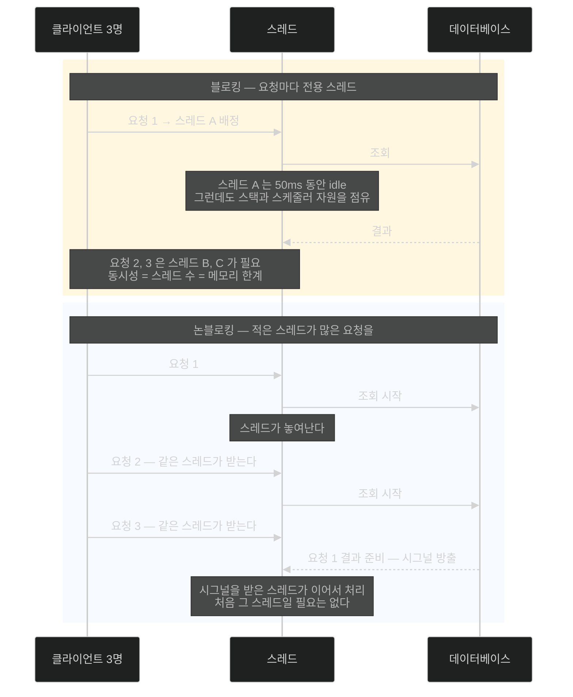

# 블로킹과 논블로킹 — 스레드를 놀리지 않는다는 것

## 한눈에 보기

| | 블로킹 모델 | 논블로킹 모델 |
|---|---|---|
| 요청과 스레드 | 요청 1개 = 스레드 1개 | 스레드 하나가 요청 여러 개 |
| DB 호출 중 스레드 | **놀면서 자원을 점유** | 놓여나서 **다른 일**을 한다 |
| 동시 요청이 늘면 | 스레드를 더 만든다 → 메모리·스위칭 비용 | 스레드 수는 그대로 |
| 결과가 오면 | 기다리던 스레드가 이어서 처리 | **시그널**이 방출돼 처리가 이어진다 |

목표는 "한 스레드로 더 많은 일을 동시에"가 아니라 **"기다리며 시간을 낭비하지 않는 것"**이다.

## 1. 왜 이게 필요한가

[[01-reactive-programming-and-backpressure]]에서 배압이 데이터 흐름을 조율한다는 것을 봤다. 그런데 아직 답하지 않은 질문이 남는다.

> **왜 스레드가 하나뿐인 브라우저가 잘 확장되나?** 스레드가 적으면 일을 적게 하는 것 아닌가?

이 질문에 답하려면 스레드가 실제로 **무엇을 하며 시간을 보내는지** 봐야 한다. 그리고 그 답이 뜻밖이다 — 웹 애플리케이션의 스레드는 대부분의 시간을 **일하지 않고 기다리며** 보낸다.

## 2. 어떻게 동작하는가

### 2.1 블로킹 모델에서 벌어지는 일

전통적 **[[블로킹]]**(= 연산이 끝날 때까지 스레드가 기다리는 실행 방식) 모델에서는 들어오는 요청마다 **전용 스레드**가 배정된다 — **[[스레드-per-요청]]**(= 요청마다 전용 스레드를 두는 모델)이다.

그 스레드가 DB 호출이나 HTTP 요청 같은 연산을 수행하면 **결과를 기다린다.** 그동안 스레드는 이런 상태다.

- 아무 일도 하지 않는다 (idle)
- **그런데도 시스템 자원을 소비한다**

두 번째 줄이 핵심이다. 스레드는 존재만으로 비용이다 — 스택 메모리를 잡고, 스케줄러의 관리 대상이고, OS의 자원이다.

DB 응답이 50ms 걸린다면, 그 50ms 동안 스레드는 **비싼 자리를 차지한 채 아무 가치도 만들지 않는다.**

### 2.2 그래서 스레드를 늘리면

동시 요청이 많이 들어오면 시스템은 스레드를 더 배정해야 한다. 그 결과가 셋이다.

| 결과 | 왜 문제인가 |
|---|---|
| 큰 thread pool | 스레드마다 스택 메모리가 든다 |
| 메모리 사용 증가 | 인스턴스당 감당할 수 있는 동시성이 메모리에 갇힌다 |
| 비싼 **[[컨텍스트-스위칭]]**(= 스레드를 바꿀 때의 저장·복원 비용) | 코어보다 스레드가 많을수록 CPU가 일 대신 전환에 시간을 쓴다 |

여기서 [[01-reactive-programming-and-backpressure]]가 말한 "수백~수천 인스턴스"의 이유가 드러난다. 인스턴스 하나가 감당하는 동시성이 스레드 수에 묶여 있고, 스레드 수는 메모리와 스위칭 비용에 묶여 있다. **그래서 인스턴스를 늘리는 것 말고 방법이 없어진다.**

### 2.3 논블로킹 모델

**[[논블로킹]]**(= 연산이 끝나기를 기다리지 않는 실행 방식) 모델은 기다리지 않는다.

DB 호출 같은 연산이 **시작되면 스레드가 놓여나** 다른 일을 하러 간다. 결과가 준비되면 **[[시그널]]**(= 데이터 처리·동작에 따라오는 신호)이 방출되고 거기서 처리가 이어진다.

단계마다 이유가 있다.

1. 연산을 **시작만** 한다 — 결과를 붙들고 있을 이유가 없기 때문이다.
2. 스레드를 반납한다 — 놀 바에 다른 요청을 처리하는 편이 낫다.
3. 결과가 오면 시그널로 알린다 — 어느 스레드든 이어받을 수 있어야 한다.
4. 남은 처리가 이어진다 — 처음 그 스레드일 필요는 없다.

그래서 **적은 수의 스레드가 많은 수의 동시 요청을 다룰 수 있다.**

### 2.4 오해를 정확히 짚기

책이 이 지점에서 못 박는 문장이 중요하다.

> **목표는 한 스레드로 동시에 더 많은 일을 하는 것이 아니라, I/O 연산이 끝나기를 기다리며 시간을 낭비하지 않는 것이다.**

즉 리액티브는 CPU를 더 빠르게 만들지 않는다. **낭비를 없앨 뿐이다.** 그래서 I/O 바운드 작업에서만 이득이 나오고, CPU 바운드 작업에서는 아무것도 개선되지 않는다.

리액티브 프로그래밍은 이 아이디어 위에 선다 — **논블로킹 실행 + [[배압]] + 비동기 데이터 스트림**을 결합해, 시스템 자원이 효율적으로 쓰이고 처리할 여력이 있을 때만 작업이 진행되게 한다.

### 2.5 비유와 그 한계

식당 종업원에 빗댈 수 있다. 블로킹 모델의 종업원은 주문을 받은 뒤 **주방 앞에 서서 그 음식이 나올 때까지 기다린다.** 손님이 열 테이블이면 종업원이 열 명 필요하다. 논블로킹 모델의 종업원은 주문을 주방에 넘기고 **바로 다음 테이블로 간다.** 음식이 나오면 벨이 울리고(시그널) 그때 가져다준다. 한 명이 열 테이블을 본다.

**깨지는 지점 둘.** 첫째, 종업원은 **어느 음식이 어느 테이블 것인지 기억**하지만, 논블로킹에서는 그 문맥을 프레임워크가 들고 다녀야 한다 — 그래서 스택 트레이스가 끊기고 디버깅이 어려워진다. 둘째, 종업원 하나가 **직접 요리를 시작하면** 다시 모두가 멈춘다. 그게 [[04b-java-concurrency-history]]가 경고하는 "이벤트 루프에서 블로킹"이다.

## 3. 그림으로 보기

## 4. 이 노트에 나온 용어

- **[[블로킹]]**: 연산이 끝날 때까지 스레드가 기다리는 실행 방식.
- **[[논블로킹]]**: 연산이 끝나기를 기다리지 않고 스레드를 놓아주는 실행 방식.
- **[[스레드-per-요청]]**: 요청마다 전용 스레드를 배정하는 전통적 모델.
- **[[컨텍스트-스위칭]]**: 스레드를 바꿀 때 드는 저장·복원 비용.
- **[[배압]]**: 소비자가 처리 가능한 만큼만 받도록 흐름을 통제하는 메커니즘.
- **[[시그널]]**: 데이터 처리나 동작에 따라오는 신호.

## 5. 자주 헷갈리는 것

**"논블로킹이면 더 빠르다"** — 개별 요청의 응답 시간은 **오히려 조금 느려질 수도** 있다. 빨라지는 것은 **같은 자원으로 감당하는 동시 요청 수**다. 처리량과 지연은 다른 축이다.

**"스레드가 적으니 CPU를 덜 쓴다"** — 반대에 가깝다. 스레드가 놀지 않으므로 **CPU 사용률은 올라간다.** 그게 목표다 — 자원을 놀리지 않는 것.

**비동기 ≠ 논블로킹** — 별도 스레드에 던져 놓고 거기서 블로킹으로 기다리면 호출자는 안 막히지만 **그 스레드는 여전히 막혀 있다.** 자원 관점에서는 아무것도 개선되지 않는다.

**디버깅 비용은 실재한다** — 스레드가 요청을 따라가지 않으므로 스택 트레이스가 한 요청의 전체 흐름을 보여 주지 않는다. 이건 학습 곡선이 아니라 **영구적인 운영 비용**이다.

## 6. 언제 안 쓰나 / 경계

- **CPU 바운드**에는 이득이 없다. 없앨 기다림이 없다.
- **동시성이 낮으면** 스레드 수가 애초에 병목이 아니므로 복잡도만 는다.
- **스택 전체가 논블로킹이 아니면** 한 지점의 블로킹이 이벤트 루프를 잡는다 — [[04a-scaling-with-project-reactor]].
- **명령형을 유지하면서 같은 목표**를 노리는 길도 있다. 가상 스레드가 그것이다 — [[05b-crafting-a-thymeleaf-template]]의 마지막 Note.

## 7. 연결

- [[01-reactive-programming-and-backpressure]] — 흐름 제어 쪽 원리. 이 노트는 실행 자원 쪽 원리다.
- [[01b-reactive-streams-details]] — 시그널이 실제로 어떤 순서로 오가는지.
- [[04a-scaling-with-project-reactor]] — Reactor가 이 원리를 Scheduler와 work stealing으로 구현하는 방법.
- [[04b-java-concurrency-history]] — 블로킹 API가 왜 리액티브에 치명적인지.

## 8. 스스로 확인

- 웹 애플리케이션 스레드가 대부분의 시간을 무엇을 하며 보내는가? 그 사실이 왜 중요한가?
- "한 스레드로 더 많은 일을 동시에"가 왜 틀린 요약인가?
- 스레드를 늘려 동시성을 올리는 방식이 부딪히는 세 가지 한계는?
- 별도 스레드에 던져 놓고 거기서 블로킹하면 왜 자원 관점에서 개선이 없는가?

> 네 문항을 스스로 답한 **뒤에** [[_01a-blocking-vs-non-blocking]]에서 모범답안과 대조한다. 먼저 열면 이 문항들은 다시 인출 문제로 쓸 수 없다.

<!-- ==== 아래는 내 영역 · 스킬 수정 금지 ==== -->

## 내 설명 시도

## 막혔던 지점

## 리뷰 이력
