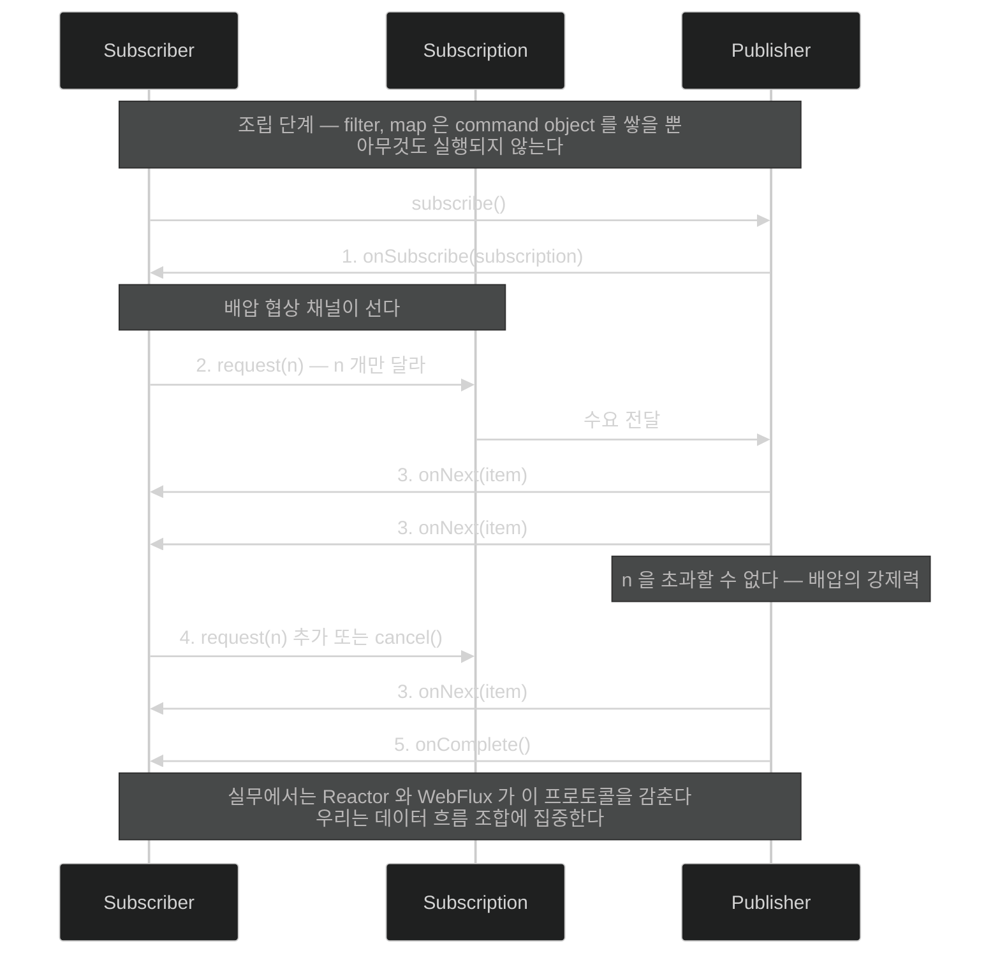

# 인터페이스 넷과 시그널 다섯 — 명세가 실제로 정하는 것

## 한눈에 보기

| 인터페이스 | 역할 |
|---|---|
| `Publisher` | 출력을 만든다 — 하나든 무한이든 |
| `Subscriber` | `Publisher`로부터 받는다 |
| `Subscription` | 소비를 시작하는 데 필요한 세부를 담는다 |
| `Processor` | `Subscriber`이자 `Publisher` |

넷뿐이라 **너무 단순하다.** 그래서 실무에서는 명세를 구현한 툴킷을 쓴다 — 이 책은 Project Reactor.

## 1. 왜 이게 필요한가

[[01-reactive-programming-and-backpressure]]가 "소비자가 n개를 요청한다"고 했다. 그 요청이 **어떤 타입의 어떤 메서드로** 일어나는가?

[[01a-blocking-vs-non-blocking]]이 "결과가 오면 시그널이 방출된다"고 했다. 그 시그널의 **이름과 순서**는 무엇인가?

**[[리액티브-스트림]]**(= 논블로킹 배압을 갖춘 비동기 스트림 처리의 표준)이 그것을 정한다. 그리고 놀랍도록 작다.

## 2. 어떻게 동작하는가

### 2.1 인터페이스 넷

명세는 **인터페이스 4개뿐**이다.

- **[[Publisher]]**(= 출력을 만들어 내는 쪽): 출력 하나일 수도, 무한일 수도 있다.
- **[[Subscriber]]**(= `Publisher`로부터 받는 쪽).
- **[[Subscription]]**(= 소비 시작에 필요한 세부를 담는 연결): `request(n)`과 `cancel`이 여기 산다.
- **[[Processor]]**(= `Subscriber`이자 `Publisher`인 컴포넌트): 받아서 변환해 다시 내보낸다.

Java 9부터 **같은 넷이 JDK에도** 있다 — **[[Flow-API]]**(= `java.util.concurrent.Flow`의 네 인터페이스)이며 Reactive Streams와 **1:1 호환**으로 설계됐다. 즉 표준이 언어 안으로 들어왔다.

### 2.2 그런데 너무 단순하다

책이 솔직하게 짚는다. **"단순하지만 솔직히 너무 단순하다."**

명세는 인터페이스와 규칙만 정하지 실용적인 도구를 주지 않는다. 그래서 **명세를 구현하고 더 많은 구조와 지원을 주는 툴킷을 찾는 편이 권장된다.**

이 책은 **[[Project-Reactor]]**(= Spring 팀이 만든 리액티브 스트림 구현 툴킷)를 쓴다. 여기서 중요한 사실 하나 — **Reactor 자체에는 Spring 의존성이 없다.** Spring Framework·Spring Boot·나머지 포트폴리오가 core 의존성으로 집어 쓸 뿐, Reactor는 그 자체로 독립 툴킷이다.

명세가 표준이라는 사실 덕에 **[[RxJava]]**(= 리액티브 스트림의 또 다른 구현) 같은 다른 구현과도 통합할 수 있다.

### 2.3 시그널 — void 메서드가 없는 이유

명세의 다른 핵심은 **[[시그널]]**(= 데이터 처리·동작에 따라오는 신호)이다.

데이터가 다뤄지거나 동작이 일어날 때마다 시그널이 따라붙는다. **데이터 교환이 없어도 시그널은 처리된다.**

여기서 리액티브 프로그래밍의 독특한 성질이 나온다 — **근본적으로 void 메서드가 없다.** 데이터 결과가 없어도 시그널을 주고받을 필요가 남기 때문이다. 그래서 "아무것도 반환하지 않는" 리액티브 연산은 `Mono<Void>`가 된다.

### 2.4 조립과 실행은 다르다

Reactor는 Java 함수형 모델 위에 세워졌고, **람다를 많이 써 데이터 처리 파이프라인**을 정의한다.

```java
Flux<String> sample = Flux.just("learning", "spring", "boot")
        .filter(s -> s.contains("spring"))
        .map(s -> {
            System.out.println(s);
            return s.toUpperCase();
        });
```

| 조각 | 하는 일 |
|---|---|
| **[[Flux]]**(= 0개 이상이 시간에 걸쳐 도착하는 흐름) | Reactor의 리액티브 데이터 흐름 타입 |
| `just()` | 초기 컬렉션을 만드는 Reactor의 방식 |
| `filter()` | Java 8 Stream의 `filter()`와 비슷하게 조건을 만족하는 것만 통과 |
| `map()` | Java 8 Stream의 `map()`처럼 각 요소를 다른 것으로, 다른 타입으로도 변환 |

이 코드 덩어리는 **flow 또는 리액티브 레시피**라고 부를 수 있다. 그리고 여기가 결정적이다 — 각 줄이 **[[어셈블리]]**(= 연산자를 이어 쓰는 동안 command object로 조립되는 과정)에서 command object로 포착된다.

**어셈블리는 실행이 아니다.** 위 코드를 실행해도 `System.out.println`은 **찍히지 않는다.**

### 2.5 구독하기 전에는 아무 일도 없다

리액티브 스트림의 철칙이다. **[[구독]]**(= 조립된 흐름을 실제로 시작시키는 행위)이 일어나야 비로소 상호작용이 시작되고, 그 뒤는 잘 정의된 순서를 따른다.

| # | 시그널 | 하는 일 | 왜 이 단계가 있나 |
|---:|---|---|---|
| 1 | **[[onSubscribe]]**(= 첫 시그널) | 하류가 상류 이벤트를 소비할 준비가 됐다는 표시 | 배압 협상의 채널(`Subscription`)이 먼저 서야 한다 |
| 2 | **[[request]]**(= n개를 요구하는 호출) | `Subscriber`가 n개를 요청 | **소비자가 속도를 정하는** 지점 |
| 3 | **[[onNext]]**(= 항목 하나를 내보내는 시그널) | `Publisher`가 항목을 방출 | **n을 초과할 수 없다** — 이게 배압의 강제력 |
| 4 | 추가 `request` 또는 `cancel` | 더 요구하거나 구독을 끊는다 | 소비자가 언제든 흐름을 조절·중단할 수 있어야 한다 |
| 5 | **[[onComplete]]**(= 끝났음을 알리는 시그널) | 더 보낼 것이 없음 | 스트림의 끝을 명시적으로 알려야 하류가 정리할 수 있다 |

3번의 "n을 초과할 수 없다"가 [[01-reactive-programming-and-backpressure]]의 배압이 코드 수준에서 성립하는 방식이다.

### 2.6 그런데 이걸 직접 쓰지는 않는다

책이 곧바로 덧붙인다. 지금 본 것은 **저수준 프로토콜**이다.

실무 개발자는 이 시그널을 거의 직접 다루지 않는다. **[[Project-Reactor]]**와 **[[Spring-WebFlux]]**(= Spring의 리액티브 웹 프레임워크) 같은 상위 라이브러리가 세부를 추상화해, 우리는 **메커니즘 관리가 아니라 데이터 흐름 조합에 집중**한다.

그래도 알아 둘 값은 있다 — 어딘가에서 `request(n)`이 안 오면 스트림이 멈추고, 그때 이 그림 없이는 원인을 짚을 수 없다.

### 2.7 비유와 그 한계

주문형 인쇄에 빗댈 수 있다. 조립(`filter`·`map`)은 **원고를 편집하는 단계**다. 편집을 아무리 해도 종이는 나오지 않는다. 구독은 **인쇄 버튼**이고, `request(10)`은 "10부만"이다. 인쇄기는 10부를 넘겨 찍을 수 없다.

**깨지는 지점 둘.** 첫째, 원고는 편집이 끝나야 인쇄하지만 리액티브 스트림은 **무한할 수 있다** — 끝나지 않는 원고를 계속 찍는 셈이다. 둘째, 인쇄 실수는 종이만 버리지만 **구독하지 않은 리액티브 흐름은 조용히 아무것도 안 한다.** 에러도 로그도 없이 그냥 동작하지 않는 것이 리액티브 초심자가 가장 자주 만나는 함정이다.

## 3. 그림으로 보기



## 4. 이 노트에 나온 용어

- **[[리액티브-스트림]]**: 논블로킹 배압을 갖춘 비동기 스트림 처리의 표준.
- **[[Publisher]]**: 출력을 만들어 내는 쪽.
- **[[Subscriber]]**: `Publisher`로부터 받는 쪽.
- **[[Subscription]]**: 소비 시작에 필요한 세부를 담는 연결.
- **[[Processor]]**: `Subscriber`이자 `Publisher`인 컴포넌트.
- **[[Flow-API]]**: Java 9부터 JDK에 들어온, 1:1 호환 네 인터페이스.
- **[[시그널]]**: 데이터 처리나 동작에 따라오는 신호.
- **[[onSubscribe]]**: 소비 준비를 알리는 첫 시그널.
- **[[request]]**: n개를 요구하는 호출.
- **[[onNext]]**: 항목 하나를 내보내는 시그널.
- **[[onComplete]]**: 더 보낼 것이 없음을 알리는 시그널.
- **[[Project-Reactor]]**: Spring 팀이 만든, Spring 의존성 없는 리액티브 스트림 구현 툴킷.
- **[[RxJava]]**: 리액티브 스트림의 또 다른 구현.
- **[[Flux]]**: 0개 이상이 시간에 걸쳐 도착하는 Reactor 타입.
- **[[어셈블리]]**: 연산자를 이어 쓰는 동안 command object로 조립되는 과정.
- **[[구독]]**: 조립된 흐름을 실제로 시작시키는 행위.
- **[[Spring-WebFlux]]**: Spring의 리액티브 웹 프레임워크.

## 5. 자주 헷갈리는 것

**"인터페이스 4개뿐이라 명세가 단순하다"** — 인터페이스는 넷이 맞지만 명세의 본체는 **TCK와 규칙 문서**다. `request(n)`이 누적된다는 것, 취소 후에는 시그널을 보내면 안 된다는 것, `onNext`가 동시에 호출되면 안 된다는 것 — 이런 규칙이 구현의 실제 난이도를 만든다. "인터페이스 넷"은 겉모습이다.

**Reactor는 Spring이 아니다** — Spring 팀이 만들지만 Spring에 의존하지 않는다. 그래서 Spring 없는 프로젝트에서도 쓸 수 있고, 반대로 Reactor 개념을 Spring 개념과 섞어 이해하면 혼란이 생긴다.

**조립과 실행의 구분이 실전에서 물린다** — `flux.map(...)`을 호출해 놓고 반환값을 버리면 아무 일도 일어나지 않는다. 명령형에서는 부수효과가 발생하지만 리액티브에서는 **조용히 무시된다.**

**`Mono<Void>`가 나오는 이유** — void 메서드가 없기 때문이다. "값은 없지만 완료 시그널은 있어야 한다"를 타입으로 표현한 것이다.

## 6. 언제 안 쓰나 / 경계

- **명세를 직접 구현하지 않는다.** 규칙이 많고 TCK를 통과하기 어렵다. 툴킷을 쓴다.
- **저수준 시그널을 직접 다루지 않는다.** `subscribe(Subscriber)`를 손으로 구현하는 것은 대부분 설계 실수의 신호다.
- **`Flow` API로 직접 가지 않는다.** JDK에 있지만 연산자가 없어 실용성이 떨어진다.
- **조립만 하고 구독을 잊지 않는다.** 웹 메서드에서는 프레임워크가 구독해 주지만, 그 밖에서는 우리 책임이다 — [[03-serving-data-with-reactive-get]].

## 7. 연결

- [[01-reactive-programming-and-backpressure]] — `request(n)`이 구현하는 배압의 개념.
- [[01a-blocking-vs-non-blocking]] — 시그널 기반 처리가 스레드를 놓아주는 이유.
- [[03-serving-data-with-reactive-get]] — 이 프로토콜을 프레임워크가 대신 밟아 주는 첫 예제.
- [[04a-scaling-with-project-reactor]] — 조립된 command object가 실제로 실행되는 방식.

## 8. 스스로 확인

- 네 인터페이스의 역할을 각각 한 문장으로 말해 보라. `Processor`가 왜 따로 필요한가?
- `onSubscribe` → `request(n)` → `onNext` 순서에서 배압이 강제되는 지점은 어디인가?
- 리액티브에 void 메서드가 없는 이유는?
- `flux.map(x -> save(x))`를 호출하고 반환값을 버리면 무슨 일이 생기는가?


> 네 문항을 스스로 답한 **뒤에** [[_01b-reactive-streams-details]]에서 모범답안과 대조한다. 먼저 열면 이 문항들은 다시 인출 문제로 쓸 수 없다.

<!-- ==== 아래는 내 영역 · 스킬 수정 금지 ==== -->

## 내 설명 시도


## 막혔던 지점


## 리뷰 이력
