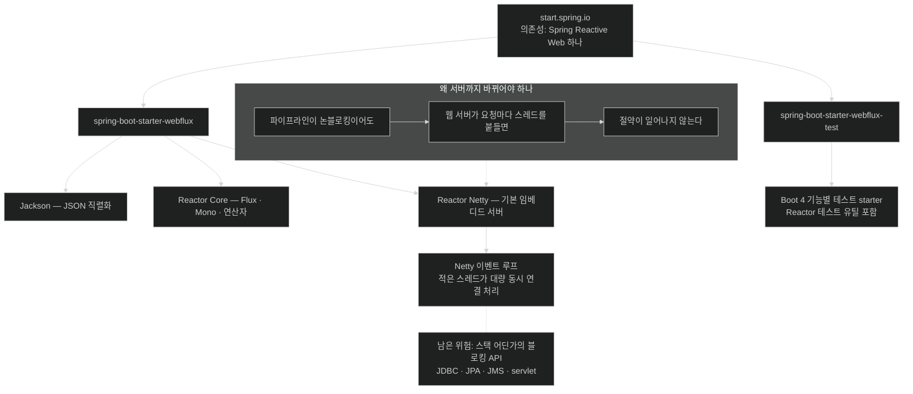

# WebFlux 프로젝트 — 의존성 하나로 바뀌는 런타임

## 한눈에 보기

의존성 **하나**만 고른다.

- **Spring Reactive Web (Spring WebFlux)**

그러면 `spring-boot-starter-webflux`가 들어오고, 그 안에 Jackson·Reactor Core가 딸려 오며 **Reactor Netty가 기본 임베디드 서버로 구성**된다. Tomcat이 아니다.

## 1. 왜 이게 필요한가

지금까지의 장들은 기존 애플리케이션에 의존성을 **더했다.** 이 장은 다르다 — **완전히 새 애플리케이션**을 만든다.

이유가 있다. 리액티브 웹 앱은 기존 프로젝트에 얹는 기능이 아니라 **런타임 자체가 다른 것**이기 때문이다. Servlet 스택 위에 리액티브 컨트롤러를 얹는다고 리액티브가 되지 않는다.

## 2. 어떻게 동작하는가

### 2.1 프로젝트 좌표

start.spring.io에서 Maven / Java 25 / Spring Boot 4.1.x, group `com.learningspringboot4`, artifact `ch9`로 만든다.

그리고 의존성은 **딱 하나** — Spring Reactive Web(**[[Spring-WebFlux]]**(= Spring의 리액티브 웹 프레임워크)).

**그게 전부다.** 리액티브 웹 애플리케이션을 시작하는 데 필요한 것은 이것뿐이다. 이 장 뒤쪽과 다음 장에서 모듈을 더 붙인다.

### 2.2 pom에 들어오는 것

| 좌표 | 하는 일 |
|---|---|
| `spring-boot-starter-webflux` | JSON 지원용 Jackson과 **[[Project-Reactor]]**(= Spring 팀의 리액티브 스트림 구현) Core를 포함하고, **Reactor Netty를 기본 임베디드 리액티브 웹 서버로 구성**한다 |
| `spring-boot-starter-webflux-test` | Boot 4는 **기능별 테스트 starter**를 제공한다. WebFlux 앱에는 짝이 되는 WebFlux 테스트 starter를 쓰며, 여기에 Reactor의 테스트 유틸 같은 리액티브 테스트 지원이 들어 있다 |

두 번째 줄이 Boot 4의 변화다. 예전의 만능 `spring-boot-starter-test` 대신 **웹 스택에 맞는 테스트 starter**를 고른다. MVC 쪽 짝은 `spring-boot-starter-webmvc-test`다.

### 2.3 왜 서버가 바뀌어야 하나

여기가 이 절의 핵심 주장이다.

리액티브 프로그래밍의 근본 요구 하나는 **끝에서 끝까지 논블로킹 실행을 지원하는 런타임**이다.

지금까지는 데이터가 리액티브 파이프라인을 어떻게 흐르는지를 봤다. 그런데 파이프라인이 아무리 **[[논블로킹]]**(= 연산 완료를 기다리지 않는 실행 방식)이어도, **밑에 깔린 웹 서버가 블로킹하면 이점이 사라진다.**

왜 그런가. Servlet 컨테이너는 요청 하나에 스레드 하나를 붙들고 그 스레드가 응답을 다 쓸 때까지 잡고 있다. 그 위에서 아무리 `Flux`로 흘려도, **바깥에서 스레드가 묶여 있으면** [[01a-blocking-vs-non-blocking]]에서 본 절약이 일어나지 않는다.

### 2.4 Reactor Netty

그 자리에 오는 것이 **[[Reactor-Netty]]**(= Netty 위에 Reactor를 통합한 완전 논블로킹 웹 서버)다.

- Netty 위에 세워졌다 — 검증된 논블로킹 네트워크 라이브러리다.
- Project Reactor와 통합됐다 — 웹 계층의 이벤트가 그대로 리액티브 타입으로 이어진다.
- **대량의 동시 연결을 효율적으로** 다룬다.

Netty가 쓰는 실행 모델이 **[[이벤트-루프]]**(= 적은 스레드가 큐의 이벤트를 돌아가며 처리하는 모델)이고, 그래서 [[04b-java-concurrency-history]]에서 볼 "코어당 스레드 하나" 이야기가 여기서 실체를 갖는다.

### 2.5 그래서 다음은

이 능력을 활용하기 전에 **리액티브 웹 메서드를 쓰는 법**에 익숙해져야 한다. [[03-serving-data-with-reactive-get]]가 그 첫걸음이다.

### 2.6 비유와 그 한계

수도 배관 교체에 빗댈 수 있다. 집 안의 수전(컨트롤러)을 아무리 좋은 것으로 바꿔도, **건물로 들어오는 주 배관(웹 서버)이 좁으면** 수압이 안 나온다. WebFlux 의존성을 고르는 것은 수전이 아니라 주 배관을 바꾸는 일이다.

**깨지는 지점 둘.** 첫째, 배관은 굵기가 눈에 보이지만 **웹 서버 교체는 겉으로 티가 안 난다** — 같은 `@GetMapping`이 그대로 동작하므로, 실수로 Servlet 스택이 딸려 와도 코드가 컴파일되고 돌아간다. 둘째, 주 배관을 바꿔도 **집 안 어딘가에 좁은 관이 하나 남아 있으면** 거기가 병목이 된다 — 그게 **[[블로킹-API]]**(= JDBC·JPA·JMS·servlet처럼 블로킹 위에 세워진 명세)이며 [[04b-java-concurrency-history]]가 다룬다.

## 3. 그림으로 보기

## 4. 이 노트에 나온 용어

- **[[Spring-WebFlux]]**: Spring의 리액티브 웹 프레임워크.
- **[[Reactor-Netty]]**: Netty 위에 Reactor를 통합한 완전 논블로킹 웹 서버.
- **[[Project-Reactor]]**: Spring 팀이 만든 리액티브 스트림 구현 툴킷.
- **[[논블로킹]]**: 연산이 끝나기를 기다리지 않는 실행 방식.
- **[[이벤트-루프]]**: 적은 스레드가 큐의 이벤트를 돌아가며 처리하는 실행 모델.
- **[[블로킹-API]]**: JDBC·JPA·JMS·servlet처럼 블로킹 패러다임 위에 세워진 명세.

## 5. 자주 헷갈리는 것

**`spring-boot-starter-web`과 함께 넣으면** — Servlet 스택이 딸려 오고 Spring Boot는 기본적으로 **MVC로 뜬다.** WebFlux 의존성이 있어도 Reactor Netty가 아니라 Tomcat이 뜨는 것이다. 리액티브 프로젝트를 새로 만드는 이유가 여기 있다. [[06-building-reactive-hypermedia-apis]]에서 HATEOAS starter를 피하는 이유도 같은 문제다.

**테스트 starter가 바뀌었다** — Boot 4는 기능별 테스트 starter로 나뉘었다. WebFlux에는 `spring-boot-starter-webflux-test`를 쓴다. 예전 습관대로 `spring-boot-starter-test`만 넣으면 리액티브 테스트 유틸이 빠질 수 있다.

**"WebFlux를 넣었으니 리액티브다"** — 웹 계층만 리액티브가 된 것이다. 데이터 접근이 JDBC면 거기서 스레드가 막힌다 — 다음 장의 주제다.

## 6. 언제 안 쓰나 / 경계

- **기존 MVC 앱에 얹지 않는다.** 두 스택을 섞으면 어느 쪽으로 뜨는지 예측이 어려워진다.
- **동시성이 낮으면** Netty로 바꿔도 체감 이득이 없고 디버깅만 어려워진다.
- **팀이 명령형에 익숙하면** 학습 곡선과 운영 비용을 계산에 넣는다.
- **데이터 계층 계획 없이 시작하지 않는다.** 웹만 리액티브로 만들면 병목이 아래로 이동할 뿐이다.

## 7. 연결

- [[01a-blocking-vs-non-blocking]] — 웹 서버까지 논블로킹이어야 하는 이유.
- [[03-serving-data-with-reactive-get]] — 이 프로젝트에서 쓰는 첫 리액티브 웹 메서드.
- [[04b-java-concurrency-history]] — 블로킹 API가 이 런타임에서 왜 치명적인지.
- [[05-rendering-reactive-templates]] — 같은 프로젝트에 Thymeleaf를 더하는 단계.

## 8. 스스로 확인

- 리액티브 앱을 기존 프로젝트에 얹지 않고 새로 만드는 이유를 런타임 관점에서 설명해 보라.
- 파이프라인이 논블로킹인데 서버가 블로킹이면 정확히 무엇이 낭비되는가?
- `spring-boot-starter-web`과 `spring-boot-starter-webflux`를 같이 넣으면 무엇이 뜨는가?
- Boot 4에서 WebFlux 앱의 테스트 의존성으로 무엇을 골라야 하는가?

> 네 문항을 스스로 답한 **뒤에** [[_02-creating-a-webflux-application]]에서 모범답안과 대조한다. 먼저 열면 이 문항들은 다시 인출 문제로 쓸 수 없다.

<!-- ==== 아래는 내 영역 · 스킬 수정 금지 ==== -->

## 내 설명 시도

## 막혔던 지점

## 리뷰 이력
