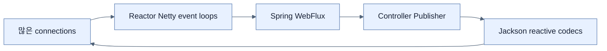

# Spring WebFlux 애플리케이션 만들기

## 한눈에 보기

Initializr에서 Spring Reactive Web을 선택하면 `spring-boot-starter-webflux`가 Reactor Core, Jackson, 기본 embedded server인 Reactor Netty를 제공한다. 대응 WebFlux test starter도 reactive test utility를 맞춰 준다.

## 1. 왜 이게 필요한가

Controller가 Flux를 반환해도 underlying server나 data client가 blocking이면 end-to-end non-blocking chain이 끊긴다. WebFlux starter는 servlet thread-per-request 대신 event-loop 기반 HTTP runtime과 reactive adapter를 한 구성으로 제공한다.

## 2. 어떻게 동작하는가

Reactor Netty event loop의 소수 thread가 많은 connection의 ready event를 처리한다. WebFlux는 request body와 response body를 Publisher로 adapter하고 Jackson codec으로 JSON을 encode/decode한다. Controller는 signal pipeline만 반환하며 framework가 HTTP lifecycle에 맞춰 subscribe와 demand를 관리한다.

MVC와 WebFlux를 무심코 같은 application에 섞으면 classpath에 따라 web application type과 server 선택이 의도와 달라질 수 있다. Architecture가 reactive인 이유와 blocking dependency inventory를 먼저 정한다.

## 3. 그림으로 보기

## 4. 이 노트에 나온 용어

- **Spring WebFlux**: Reactor 기반 non-blocking Spring web framework.
- **Reactor Netty**: Netty와 Reactor를 결합한 non-blocking network runtime.
- **event loop**: ready I/O event를 반복 처리하는 소수 thread 실행 model.

## 7. 연결

- [[01-reactive-programming-and-backpressure]] — event-loop가 사용하는 signal/demand model이다.
- [[03-serving-data-with-reactive-get]] — 첫 WebFlux controller response를 만든다.
- [[chapter-10-working-with-data-reactively/01-choosing-a-reactive-data-store|Reactive data store]] — web 아래까지 non-blocking을 유지한다.

## 8. 스스로 확인

- 전체 1차 정리 후: WebFlux controller에서 blocking JDBC를 호출할 때 생기는 문제를 설명한다.

<!-- ==== 아래는 내 영역 · 스킬 수정 금지 ==== -->

## 내 설명 시도

## 막혔던 지점

## 리뷰 이력

