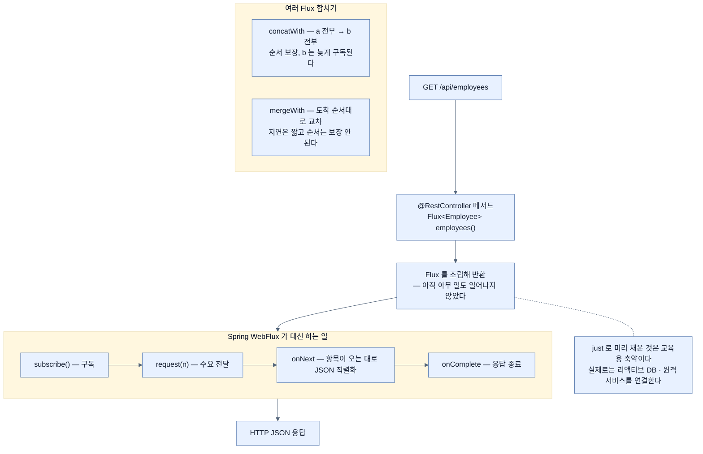

# `Flux`를 반환하는 GET — 프레임워크가 구독을 대신한다

## 한눈에 보기

```java
@RestController
public class ApiController {
    @GetMapping("/api/employees")
    Flux<Employee> employees() {
        return Flux.just(
            new Employee("alice", "management"),
            new Employee("bob", "payroll"));
    }
}
```

애노테이션은 지금까지와 **똑같다.** 바뀐 것은 반환 타입 하나뿐이다.

## 1. 왜 이게 필요한가

웹 컨트롤러가 하는 일은 보통 둘 중 하나다 — **데이터를 내주거나 HTML을 내주거나.** 리액티브 방식을 감 잡으려면 **더 단순한 쪽**부터 보는 게 낫다. 그래서 데이터부터다.

[[01b-reactive-streams-details]]에서 `Flux.just(...).filter(...).map(...)`을 봤다. 그 **[[Flux]]**(= 0개 이상이 시간에 걸쳐 도착하는 흐름)를 웹 컨트롤러에 그대로 쓸 수 있다.

**[[Flux]]**는 Reactor의 **[[Publisher]]**(= 출력을 만들어 내는 쪽) 구현이며 풍부한 리액티브 연산자를 제공한다.

## 2. 어떻게 동작하는가

### 2.1 컨트롤러

| 요소 | 하는 일 |
|---|---|
| `@RestController` | 이 컨트롤러가 템플릿이 아니라 **데이터**를 다룬다는 Spring Web 애노테이션 |
| `@GetMapping` | HTTP `GET /api/employees`를 이 메서드에 매핑 |
| `Flux<Employee>` | 반환 타입이 `Employee` record의 `Flux` |

**앞의 둘은 MVC에서 쓰던 것과 같은 애노테이션이다.** 이것이 WebFlux의 설계 의도다 — 프로그래밍 모델을 새로 배우게 하지 않는다.

### 2.2 `Flux`는 List도 Future도 아니다

책이 조심스럽게 짚는 부분이다. "`Flux`는 고전적인 `List`와 `Future`를 합친 것 같다. **그런데 사실 아니다.**"

| 비교 대상 | 닮은 점 | 결정적 차이 |
|---|---|---|
| `List` | 여러 항목을 담는다 | `List`는 **한꺼번에** 갖지만 `Flux`는 아니다. 반복문으로 소비하지 않고 `map`·`filter`·`flatMap` 같은 **스트림 연산**을 쓴다 |
| `Future` | 형성될 때 내용이 아직 없고 **미래에 도착**한다 | Java 8 이전의 `Future`는 **`get` 하나뿐**이지만 `Flux`는 연산자가 풍부하다 |

이 구분이 중요한 이유는, `List`처럼 다루려는 순간(`for` 루프, `.size()`) 리액티브의 이점이 사라지기 때문이다.

### 2.3 여러 Flux 합치기

```java
Flux<String> a = Flux.just("alpha", "bravo");
Flux<String> b = Flux.just("charlie", "delta");
a.concatWith(b);
a.mergeWith(b);
```

| 연산자 | 결과 |
|---|---|
| **[[concatWith]]**(= 앞의 것을 전부 방출한 뒤 뒤의 것을 방출) | `alpha, bravo, charlie, delta` — **순서 보장** |
| **[[mergeWith]]**(= 도착하는 실시간 순서대로 방출) | 실제 도착 순서대로, **교차 가능** |

둘의 차이가 실무에서 갈리는 지점은 명확하다. **순서가 의미를 가지면 `concatWith`, 지연을 줄이는 것이 중요하면 `mergeWith`**다. `concatWith`는 앞 스트림이 완료될 때까지 뒤 스트림을 **구독조차 하지 않는다.**

### 2.4 `just`로 미리 채운 것의 정직한 고백

> "웹 메서드에서 `Flux`를 하드코딩 데이터로 미리 채우지 않았나요?"
>
> 그렇다. 이 예제는 실제 애플리케이션에서의 `Flux`의 미래적 성격을 다소 거스른다. 실제로는 `just`로 미리 채우지 않고 **리액티브 데이터베이스나 원격 네트워크 서비스** 같은 데이터 소스를 연결한다. `Flux`의 더 정교한 API를 쓰면 값이 준비되는 대로 하류 소비를 위해 방출할 수 있다.

이 Note가 중요한 이유는 **`just`가 리액티브의 본질이 아니라 교육용 축약**임을 알려 주기 때문이다. 실제 `Flux`는 [[04a-scaling-with-project-reactor]]에서 볼 Scheduler 위에서 값이 도착하는 대로 흘러야 한다.

### 2.5 프레임워크가 대신하는 것

웹 메서드에서 `Flux`는 **[[Spring-WebFlux]]**(= Spring의 리액티브 웹 프레임워크)에 넘겨지고, **프레임워크가 직렬화와 JSON 응답 반환을 책임진다.**

그리고 그 뒤에서 프레임워크가 **리액티브 스트림 생명주기 전체**를 관리한다.

- **[[구독]]**(= 흐름을 실제로 시작시키는 행위)
- 수요(**[[request]]**)
- 데이터 방출(**[[onNext]]**)
- 완료(**[[onComplete]]**)

[[01b-reactive-streams-details]]에서 본 5단계 프로토콜을 우리가 한 줄도 쓰지 않는 이유가 이것이다.

### 2.6 게으름이 기본이다

책이 여기서 다시 못 박는다. **리액티브 프로그래밍에서는 구독하기 전에 아무 일도 일어나지 않는다.**

- 웹 호출이 나가지 않는다.
- DB 연결이 열리지 않는다.
- 자원이 할당되지 않는다.

시스템 전체가 밑바닥부터 **[[게으른-평가]]**(= 필요해진 순간에 실행하는 성질)로 설계됐다.

웹 메서드에서는 이 구독을 프레임워크가 자동으로 해 준다. 그래서 우리는 **실행 관리가 아니라 데이터 흐름 정의**에 집중한다.

여기서 실무적 함의가 하나 나온다 — **컨트롤러가 `Flux`를 반환하지 않고 내부에서 조용히 만들기만 하면 아무 일도 일어나지 않는다.**

### 2.7 비유와 그 한계

주문서와 주방에 빗댈 수 있다. 컨트롤러가 반환하는 `Flux`는 **완성된 요리가 아니라 주문서**다. 주문서를 홀에 넘기면(프레임워크에 반환) 주방이 요리를 시작하고, 완성되는 대로 손님에게 나간다.

**깨지는 지점 둘.** 첫째, 주문서를 서랍에 넣어 두면 **아무 일도 안 일어난다** — 반환하지 않은 `Flux`가 정확히 그렇다. 둘째, 실제 주방은 주문서를 받는 순간 재료를 꺼내지만, `Flux.just(...)`는 **이미 재료를 손에 들고 있다** — 그래서 이 예제가 리액티브의 미래적 성격을 보여 주지 못하고, 책 자신이 Note로 그 점을 인정한다.

## 3. 그림으로 보기



## 4. 이 노트에 나온 용어

- **[[Flux]]**: 0개 이상이 시간에 걸쳐 도착하는 Reactor 타입.
- **[[Publisher]]**: 출력을 만들어 내는 쪽.
- **[[구독]]**: 조립된 흐름을 실제로 시작시키는 행위.
- **[[게으른-평가]]**: 필요해진 순간에 실행하는 성질.
- **[[concatWith]]**: 앞의 Flux를 전부 방출한 뒤 뒤의 것을 방출하는 연산자.
- **[[mergeWith]]**: 도착하는 실시간 순서대로 방출해 교차를 허용하는 연산자.
- **[[Spring-WebFlux]]**: Spring의 리액티브 웹 프레임워크.
- **[[onNext]]**: 항목 하나를 내보내는 시그널.
- **[[onComplete]]**: 더 보낼 것이 없음을 알리는 시그널.
- **[[request]]**: n개를 요구하는 호출.

## 5. 자주 헷갈리는 것

**`Flux`를 `List`처럼 다루려는 충동** — `.collectList().block()`으로 꺼내 쓰면 컴파일도 되고 동작도 한다. 그런데 `block()`은 **이벤트 루프 스레드를 막는** 행위라 [[01a-blocking-vs-non-blocking]]에서 얻으려던 것을 통째로 반납한다.

**`concatWith`의 숨은 성질** — 순서를 보장하려면 뒤 스트림을 **늦게 구독**해야 한다. 그래서 두 원격 호출을 `concatWith`로 이으면 **직렬로** 나가고, `mergeWith`로 이으면 **병렬로** 나간다. 성능 차이가 여기서 생긴다.

**반환하지 않으면 실행되지 않는다** — 명령형 습관대로 메서드 안에서 `flux.subscribe()` 없이 조립만 하고 다른 값을 반환하면 조용히 아무 일도 안 일어난다.

**`@RestController`는 그대로다** — MVC와 같은 애노테이션이라 코드만 보면 리액티브인지 구분이 안 된다. 구분은 **반환 타입**에 있다.

## 6. 언제 안 쓰나 / 경계

- **응답이 항상 작고 하나라면** `Flux`의 이점이 없다. `Mono`나 평범한 타입이 읽기 쉽다 — [[04-consuming-data-with-reactive-post]].
- **`block()`을 컨트롤러에서 부르지 않는다.** 리액티브 스택에서 이건 자해다.
- **`just`로 채운 `Flux`를 실전 코드의 본보기로 삼지 않는다.** 데이터 소스를 연결해야 진짜다.
- **순서가 중요한데 `mergeWith`를 쓰지 않는다.** 두 연산자를 헷갈리면 조용히 잘못된 순서가 나간다.

## 7. 연결

- [[01b-reactive-streams-details]] — 프레임워크가 대신 밟아 주는 5단계 프로토콜.
- [[04-consuming-data-with-reactive-post]] — 같은 컨트롤러에 데이터를 **받는** 메서드를 더한다.
- [[02-creating-a-webflux-application]] — 이 컨트롤러가 도는 런타임.
- [[05a-creating-a-reactive-web-controller]] — 같은 원리를 HTML 렌더링에 적용한 형태.
- [[../chapter-10-working-with-data-reactively/02-choosing-r2dbc-and-a-reactive-data-store]] — `just` 대신 실제 리액티브 데이터 소스를 연결하는 곳.

## 8. 스스로 확인

- `Flux`가 `List`와도 `Future`와도 다른 점을 각각 한 가지씩 말해 보라.
- `concatWith`와 `mergeWith`를 두 원격 API 호출에 각각 쓰면 네트워크 요청은 어떻게 나가는가?
- 컨트롤러가 `Flux`를 반환할 때 프레임워크가 대신 하는 네 가지 일은?
- `Flux.just(...)` 예제가 리액티브의 본질을 보여 주지 못하는 이유는?

<!-- ==== 아래는 내 영역 · 스킬 수정 금지 ==== -->

## 내 설명 시도


## 막혔던 지점


## 리뷰 이력
