# Reactive POST로 데이터 소비

## 한눈에 보기

`@RequestBody Mono<Employee>`는 request body decoding 결과를 0..1 asynchronous value로 받는다. `map`/`flatMap`으로 validation·저장·응답을 이어 반환하며 controller 안에서 직접 `subscribe()`하지 않는다.

## 1. 왜 이게 필요한가

Request body가 network에서 아직 도착 중일 수 있는데 blocking read로 모두 기다리면 event-loop를 멈춘다. Body Publisher를 transformation pipeline에 연결하면 framework가 network demand와 backpressure를 유지한다.

## 2. 어떻게 동작하는가

Mono가 Employee를 emit할 때 `map`은 동기 변환을, `flatMap`은 또 다른 Mono를 반환하는 asynchronous operation을 평탄화한다. 저장 source도 reactive이면 `flatMap(repository::save)`처럼 이어야 한다. In-memory map 변경은 예제용 side effect이며 thread safety와 error handling이 필요하다. Empty Mono, validation error, duplicate key도 signal로 모델링한다.

Reactor의 programming style은 intermediate imperative variable보다 data flow를 선언한다. WebFlux가 최종 Publisher를 subscribe하므로 controller가 중간에서 subscribe하면 lifecycle·error propagation·testability를 깨뜨린다.

## 3. 그림으로 보기

```mermaid
%%{init: {'theme': 'base', 'themeVariables': {'background': '#ffffff', 'primaryColor': '#e8f1ff', 'primaryTextColor': '#172033', 'primaryBorderColor': '#5b7db1', 'lineColor': '#52647a', 'secondaryColor': '#f7fbff', 'tertiaryColor': '#fff7df'}}}%%
flowchart LR
    B[HTTP body chunks] --> D[Jackson decode]
    D --> M[Mono<Employee>]
    M --> V[validate/map]
    V --> S[flatMap reactive save]
    S --> R[Mono response]
    R --> W[WebFlux subscribe/write]
```

## 4. 이 노트에 나온 용어

- **Mono**: Reactor의 0..1 asynchronous result.
- **map/flatMap**: 값을 동기 변환하는 operator와 nested Publisher를 이어 평탄화하는 operator.
- **side effect**: pipeline 밖의 mutable state·I/O에 변화를 주는 동작.

## 7. 연결

- [[03-serving-data-with-reactive-get]] — outbound Flux와 inbound Mono의 대칭이다.
- [[05-rendering-reactive-templates]] — HTML form binding도 Mono pipeline으로 처리한다.
- [[chapter-10-working-with-data-reactively/03-creating-reactive-repositories-and-r2dbc-access|Reactive repository]] — 실제 non-blocking save를 제공한다.

## 8. 스스로 확인

- 전체 1차 정리 후: `map`과 `flatMap`을 선택하는 기준과 controller에서 직접 subscribe하지 않는 이유를 설명한다.

<!-- ==== 아래는 내 영역 · 스킬 수정 금지 ==== -->

## 내 설명 시도

## 막혔던 지점

## 리뷰 이력

