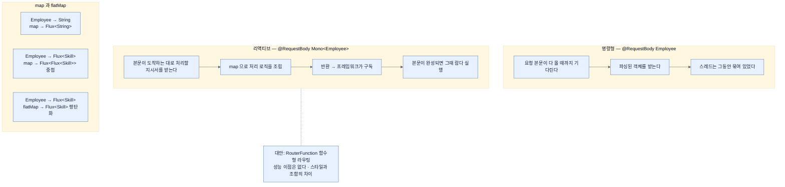

# `Mono`를 받는 POST — 들어오는 데이터도 컨테이너 안에 있다

## 한눈에 보기

```java
@PostMapping("/api/employees")
Mono<Employee> add(@RequestBody Mono<Employee> newEmployee) {
    return newEmployee
        .map(employee -> {
            DATABASE.put(employee.name(), employee);
            return employee;
        });
}
```

`@RequestBody`가 `Employee`가 아니라 **`Mono<Employee>`**를 받는다. 요청 본문도 **아직 도착하지 않았을 수 있기** 때문이다.

## 1. 왜 이게 필요한가

직원 목록을 내주는 사이트라면 **새 직원을 넣을 방법**도 있어야 한다. [[03-serving-data-with-reactive-get]]에서 시작한 `ApiController`에 메서드를 더한다.

그런데 여기서 리액티브의 방향이 뒤집힌다. GET에서는 우리가 데이터를 **내보냈고**, 프레임워크가 구독했다. POST에서는 데이터가 **들어온다.** 그러면 그 데이터는 어떤 모습으로 우리 손에 오는가?

명령형이라면 `@RequestBody Employee newEmployee`다 — 이미 파싱이 끝난 객체. 그런데 리액티브에서는 **요청 본문이 아직 다 오지 않았을 수 있다.** 큰 본문이라면 네트워크에서 조각조각 도착한다. 그것을 다 기다렸다가 객체를 만들면, 기다리는 동안 [[01a-blocking-vs-non-blocking]]에서 없애려던 그 낭비가 다시 생긴다.

## 2. 어떻게 동작하는가

### 2.1 요소별로

| 요소 | 하는 일 |
|---|---|
| `@PostMapping` | HTTP `POST /api/employees`를 이 메서드에 매핑 |
| `@RequestBody` | 들어오는 HTTP 요청 본문을 `Employee` 타입으로 역직렬화하라는 지시 |
| **[[Mono]]**(= 0개 또는 1개 값을 다루는 Reactor 타입) | `Flux`의 **단일 항목 대응물** |
| `DATABASE` | 임시 데이터 저장소인 Java `Map` |

`Mono<Employee>`가 인자 타입이라는 것이 핵심이다. **들어오는 데이터도 리액티브 컨테이너 안에 감싸여** 온다. 그래서 `map`으로 그 안에 접근한다.

### 2.2 `map` 안에서 하는 일

내용을 변환할 수도 있지만, 여기서는 **변환 없이** `DATABASE`에 저장하고 그대로 돌려준다.

그런데 이 코드에 숨은 성질이 하나 있다 — **람다 안의 `DATABASE.put`은 컨트롤러 메서드가 호출될 때 실행되지 않는다.** 조립될 뿐이고, 실제 저장은 프레임워크가 **[[구독]]**(= 흐름을 실제로 시작시키는 행위)할 때 일어난다. [[04a-scaling-with-project-reactor]]가 이 구조를 다룬다.

### 2.3 `map`은 1:1, `flatMap`은 평탄화까지

책이 여기서 중요한 Note를 붙인다.

**매핑은 일대일 연산이다.** 10개짜리 `Flux`를 `map`하면 새 `Flux`도 10개다.

그런데 문자열 하나를 **그 글자들의 리스트**로 map하면 어떻게 되나? 변환된 타입은 **리스트의 리스트**가 된다. 대개는 그 중첩을 걷어내고 모든 글자가 든 하나의 `Flux`를 원한다.

그게 **flattening**이고, **[[flatMap]]**(= map한 결과가 다시 컨테이너일 때 중첩을 한 단계로 걷어내는 연산자)은 **그것을 한 번에** 한다.

| 상황 | 연산자 | 결과 |
|---|---|---|
| `Employee` → `String` | `map` | `Flux<String>` |
| `Employee` → `Flux<Skill>` | `map` | `Flux<Flux<Skill>>` — 대개 원치 않는 것 |
| `Employee` → `Flux<Skill>` | `flatMap` | `Flux<Skill>` — 평탄화됨 |

실무에서 `flatMap`이 자주 나오는 진짜 이유는 두 번째 행이다. **리액티브 메서드를 호출하면 반환값이 또 리액티브 타입**이므로, `map`을 쓰면 중첩이 계속 쌓인다. [[06-building-reactive-hypermedia-apis]]의 집합 루트 구현이 그 대표 사례다.

### 2.4 다른 길 — 함수형 라우팅

> WebFlux는 **`RouterFunction`과 `HandlerFunction`**을 중심으로 한 함수형 라우팅 모델도 지원한다. 라우트를 설정 코드에서 명시적으로 선언하고 핸들러 메서드에 매핑하는 방식으로, 지금까지 써 온 애노테이션 기반 컨트롤러의 대안이다.
>
> 애노테이션 주도 요청 매핑을 피하고 더 함수형인 스타일을 받아들이며, 라우트를 함수형 구성으로 조합·중첩·필터링해 요청 처리를 세밀하게 제어한다.
>
> **애노테이션 기반보다 성능 이점이 있는 것은 아니다.** 둘 다 리액티브이며 차이는 스타일·명시성·조합에 있다.
>
> 이 장의 주 목적이 HTTP 계층 재설계가 아니라 리액티브 웹 개발 소개이므로, 명료함과 집중을 위해 애노테이션 모델을 계속 쓴다. Boot 4는 두 스타일을 완전히 지원하며 아키텍처 취향에 맞는 쪽을 고를 수 있다.

**[[RouterFunction]]**(= 설정 코드에서 라우트를 선언하는 WebFlux의 함수형 라우팅 구성 요소)에서 눈여겨볼 문장은 "성능 이점이 없다"는 것이다. 함수형 라우팅을 성능 최적화로 오해하는 경우가 흔한데, **선택 기준은 스타일**이다.

### 2.5 비유와 그 한계

택배 수령에 빗댈 수 있다. 명령형 `@RequestBody Employee`는 **문 앞에 서서 택배가 도착할 때까지 기다렸다가** 상자를 뜯어 내용을 확인하는 것이다. 리액티브 `@RequestBody Mono<Employee>`는 **"도착하면 이렇게 처리해 주세요"라는 지시서를 붙여 두고** 다른 일을 하러 가는 것이다.

**깨지는 지점 둘.** 첫째, 택배는 도착하면 알아서 처리되지만 **지시서를 아무도 읽지 않으면**(구독하지 않으면) 상자는 그대로 있다 — 그래서 반환하는 것이 중요하다. 둘째, 택배 상자는 한 덩어리로 오지만 HTTP 본문은 **조각으로 온다** — `Mono`가 감추는 것이 그 조립 과정이다.

## 3. 그림으로 보기



## 4. 이 노트에 나온 용어

- **[[Mono]]**: 0개 또는 1개 값을 다루는 Reactor 타입.
- **[[Flux]]**: 0개 이상이 시간에 걸쳐 도착하는 Reactor 타입.
- **[[flatMap]]**: map 결과의 중첩을 한 단계로 걷어내는 연산자.
- **[[RouterFunction]]**: 설정 코드에서 라우트를 선언하는 WebFlux의 함수형 라우팅 구성 요소.
- **[[Spring-WebFlux]]**: Spring의 리액티브 웹 프레임워크.
- **[[구독]]**: 조립된 흐름을 실제로 시작시키는 행위.

## 5. 자주 헷갈리는 것

**`@RequestBody Employee`도 WebFlux에서 동작한다** — 컴파일되고 돌아간다. 다만 프레임워크가 본문을 다 모을 때까지 기다렸다가 넘겨주므로 **리액티브의 이점이 그만큼 줄어든다.** 작은 본문에서는 실용적 선택이고, 큰 본문이나 스트리밍에서는 `Mono`가 낫다.

**함수형 라우팅은 성능 최적화가 아니다** — 책이 명시적으로 못 박는다. 둘 다 리액티브이고 차이는 스타일이다.

**`map` 안의 부수효과** — `DATABASE.put`처럼 부수효과가 있는 코드를 `map`에 넣는 것은 이 예제의 단순화다. 실제로는 부수효과가 **몇 번 실행될지**(재시도·재구독 시) 보장이 다르므로 조심해야 한다.

**`flatMap`을 쓸 때가 언제인지** — 판단 기준은 하나다. **map할 함수의 반환 타입이 또 리액티브 타입인가?** 그렇다면 `flatMap`이다.

## 6. 언제 안 쓰나 / 경계

- **본문이 항상 작고 단순하면** `Mono<T>` 대신 `T`를 받아도 실질 차이가 없다.
- **`map` 안에서 블로킹 호출을 하지 않는다.** 그 자리가 이벤트 루프 스레드다 — [[04a-scaling-with-project-reactor]].
- **함수형 라우팅을 성능 때문에 고르지 않는다.**
- **`flatMap`의 동시성 기본값을 의식한다.** 기본적으로 여러 내부 스트림을 동시에 구독하므로, 외부 API 호출에 쓰면 예상보다 많은 요청이 동시에 나갈 수 있다.

## 7. 연결

- [[03-serving-data-with-reactive-get]] — 같은 컨트롤러의 데이터를 **내보내는** 쪽.
- [[04a-scaling-with-project-reactor]] — 람다가 컨트롤러 호출 시점에 실행되지 않는 이유.
- [[01b-reactive-streams-details]] — `Mono`도 결국 `Publisher`라는 사실.
- [[06-building-reactive-hypermedia-apis]] — `flatMap`이 실제로 필요해지는 대표 사례.

## 8. 스스로 확인

- `@RequestBody Employee`와 `@RequestBody Mono<Employee>`의 차이를 스레드 관점에서 설명해 보라.
- `map`과 `flatMap` 중 무엇을 쓸지 정하는 한 문장짜리 기준은?
- 함수형 라우팅을 고르는 정당한 이유와 정당하지 않은 이유를 각각 하나씩 들어 보라.
- `map` 안의 `DATABASE.put`이 언제 실행되는가?

<!-- ==== 아래는 내 영역 · 스킬 수정 금지 ==== -->

## 내 설명 시도


## 막혔던 지점


## 리뷰 이력
