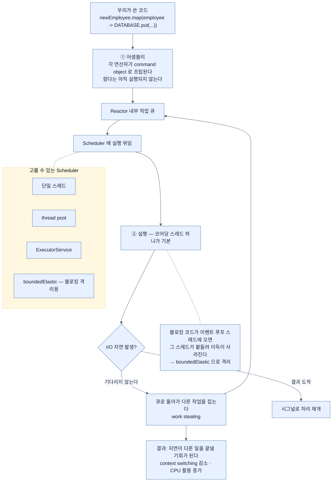

# Reactor가 확장을 만드는 두 가지 — 지연 조립과 코어당 한 스레드

## 한눈에 보기

| # | Reactor가 뒤에서 하는 일 | 그래서 얻는 것 |
|---|---|---|
| 1 | 각 연산자를 **command object로 조립**하고 Scheduler에 실행을 위임 | I/O 대기 중 스레드가 **다른 작업을 집는다** — work stealing |
| 2 | 200개짜리 거대 pool 대신 **코어당 스레드 하나** | context switching 감소, CPU 활용 증가 |

> "리액티브 프로그래밍은 **자원 가용성에 반응하는 것**에 기반한다." — Mark Paluch, Spring Data 팀 리드

## 1. 왜 이게 필요한가

여기까지 **[[Project-Reactor]]**(= Spring 팀의 리액티브 스트림 구현 툴킷)가 함수형 프로그래밍 스타일을 준다는 것은 봤다. 그런데 **확장성이 정확히 어디에서 나오는지**는 아직 불분명하다.

`map`과 `filter`를 쓴다고 서버가 더 많은 요청을 감당하게 되지는 않는다. 그렇다면 무엇이?

Reactor는 우리가 보지 못하는 곳에서 **두 가지**를 매끄럽게 처리한다.

## 2. 어떻게 동작하는가

### 2.1 첫 번째 — 쓰는 것과 도는 것이 다르다

이 작은 flow들의 각 단계는 **곧바로 수행되지 않는다.** `map`이든 `filter`든 다른 Reactor 연산자든, 쓸 때마다 우리가 하는 것은 **[[어셈블리]]**(= 연산자를 이어 쓰는 동안 command object로 조립되는 과정)다. **실행이 아니다.**

각 연산은 우리 동작을 수행하는 데 필요한 세부를 담은 **작은 command object**를 조립한다.

[[04-consuming-data-with-reactive-post]]의 코드를 다시 보면 이 말이 구체화된다.

```java
return newEmployee
    .map(employee -> {
        DATABASE.put(employee.name(), employee);
        return employee;
    });
```

`DATABASE`에 저장하고 값을 반환하는 문장 전체가 **Java 8 람다 안에** 있다. 그리고 **컨트롤러 메서드가 호출될 때 그 안쪽 람다가 같이 호출돼야 할 이유가 없다.**

이 한 문장이 리액티브 코드를 읽을 때 가장 자주 걸리는 지점이다. 코드의 **작성 순서**와 **실행 시점**이 분리된다.

### 2.2 그래서 Scheduler에 위임한다

Reactor는 우리 동작을 표현하는 command object들을 모아 **내부 작업 큐**에 쌓는다. 그리고 실행을 내장 **[[Scheduler]]**(= 조립된 작업을 실제로 실행할 때 쓰는 실행 자원)에 위임한다.

이 구조가 왜 필요한가 — **Reactor가 "어떻게 수행할지"를 결정할 수 있게 되기 때문이다.** 고를 수 있는 Scheduler가 여럿이다.

| Scheduler | 성격 |
|---|---|
| 단일 스레드 | 순서가 보장되는 작업 |
| thread pool | 고정 크기 |
| Java `ExecutorService` | 기존 실행 자원 재사용 |
| **[[boundedElastic]]**(= 블로킹 작업을 격리하는, 상한 있는 탄력 Scheduler) | 블로킹을 격리 |

### 2.3 work stealing

고른 Scheduler는 시스템 자원이 나는 대로 backlog를 처리한다.

Reactor flow의 **모든 단계가 게으르고 논블로킹으로** 동작하므로, I/O 바운드 지연이 생기면 **현재 스레드가 응답을 기다리며 붙들리지 않는다.** 대신 Scheduler가 내부 작업 큐로 돌아가 **다른 작업을 집는다.**

이것이 **[[작업-훔치기]]**(= 한 작업이 멈춰 있을 때 스레드가 큐에서 다른 작업을 집어 오는 방식)이고, 그 결과가 이 절에서 가장 인상적인 문장이다.

> **전통적인 지연 문제가 다른 일을 끝낼 기회로 바뀐다.**

[[01a-blocking-vs-non-blocking]]에서 "기다리며 낭비하지 않는다"고 한 것의 구현이 이것이다.

### 2.4 그 대가 — 블로킹은 절대 금지

이 구조는 곧바로 제약을 낳는다. **[[블로킹]]**(= 연산 완료까지 스레드가 기다리는 방식) 작업 — 블로킹 DB 호출, 파일 접근, 원격 HTTP 호출 — 은 **리액티브 [[이벤트-루프]]**(= 적은 스레드가 큐의 이벤트를 처리하는 모델) **스레드에서 돌면 안 된다.**

블로킹 연산은 그 스레드를 붙들어 Reactor가 제공하려는 확장성 이득을 깎아 먹는다.

블로킹 코드가 불가피하면 **적절한 Scheduler로 격리**한다 — `boundedElastic`이 그 자리다. "격리"라는 표현이 정확하다. 없애는 게 아니라 **피해가 이벤트 루프에 닿지 않게 가둔다.**

### 2.5 두 번째 — 코어당 스레드 하나

Reactor가 하는 두 번째 일은 더 단순하다. **200개짜리 거대 thread pool 대신, 코어당 스레드 하나를 쓰는 Scheduler가 기본**이다.

이 접근이 주는 것 둘.

- **[[컨텍스트-스위칭]]**(= 스레드를 바꿀 때의 저장·복원 비용) 오버헤드 감소
- 가용 CPU 자원의 더 나은 활용 — 특히 **스레드가 기다리며 시간을 보냈을 I/O 바운드 워크로드**에서

왜 코어당 하나인가. 코어가 4개인데 스레드가 200개면, CPU는 실제 계산보다 **스레드를 갈아 끼우는 데** 시간을 쓴다. 그런데 스레드가 기다리지 않는다면(논블로킹) **애초에 많이 필요하지 않다.** 코어 수만큼만 있으면 CPU를 꽉 채울 수 있다.

이 판단의 역사적 배경이 [[04b-java-concurrency-history]]다.

### 2.6 비유와 그 한계

주방의 요리사 배치에 빗댈 수 있다. 전통적 모델은 **주문마다 요리사 한 명**을 붙이고, 오븐이 도는 20분 동안 그 요리사는 오븐 앞에 서 있다. Reactor 모델은 **화구 수만큼만 요리사**를 두고, 오븐에 넣은 뒤 곧바로 다음 주문의 손질로 넘어간다. 오븐 타이머가 울리면(시그널) 누구든 손이 빈 사람이 꺼낸다.

**깨지는 지점 둘.** 첫째, 요리사는 **자기가 무엇을 하고 있었는지 기억**하지만 리액티브에서는 그 문맥을 Reactor가 command object에 담아 다녀야 한다 — 그래서 스택 트레이스가 요청 흐름을 보여 주지 않는다. 둘째, 요리사 하나가 **설거지를 시작하면**(블로킹) 화구 하나가 통째로 멈춘다. 4명 중 1명이면 **25%가 날아간다** — [[04b-java-concurrency-history]]가 그 계산을 한다.

## 3. 그림으로 보기



## 4. 이 노트에 나온 용어

- **[[어셈블리]]**: 연산자를 이어 쓰는 동안 command object로 조립되는 과정.
- **[[Scheduler]]**: 조립된 작업을 실제로 실행할 때 쓰는 실행 자원.
- **[[boundedElastic]]**: 블로킹 작업을 격리하기 위한, 상한 있는 탄력 Scheduler.
- **[[작업-훔치기]]**: 한 작업이 멈춰 있을 때 스레드가 다른 작업을 집어 오는 방식.
- **[[이벤트-루프]]**: 적은 스레드가 큐의 이벤트를 돌아가며 처리하는 실행 모델.
- **[[게으른-평가]]**: 필요해진 순간에 실행하는 성질.
- **[[컨텍스트-스위칭]]**: 스레드를 바꿀 때 드는 저장·복원 비용.
- **[[블로킹]]**: 연산이 끝날 때까지 스레드가 기다리는 실행 방식.
- **[[Project-Reactor]]**: Spring 팀이 만든 리액티브 스트림 구현 툴킷.

## 5. 자주 헷갈리는 것

**이 절의 위치가 어색하다** — 원문은 이 내용을 **POST 절 뒤**에 배치했지만, 다루는 것은 §1의 연장인 "리액티브가 어떻게 확장을 만드나"다. POST 예제와 직접적 관련이 없어 읽는 흐름이 끊긴다. [[01a-blocking-vs-non-blocking]] 다음에 읽으면 더 자연스럽다.

**"조립은 실행이 아니다"의 실전 결과** — 디버거로 컨트롤러 메서드에 중단점을 걸면 **람다 안에는 멈추지 않는다.** 람다는 나중에, 다른 스레드에서 실행되기 때문이다.

**`boundedElastic`이 만능이 아니다** — 블로킹을 거기로 옮기면 이벤트 루프는 지키지만 **그 Scheduler의 스레드는 여전히 막힌다.** 상한에 닿으면 대기가 생긴다. 근본 해법은 논블로킹 드라이버로 바꾸는 것이다 — 다음 장의 R2DBC.

**"코어당 하나"는 기본값이지 규칙이 아니다** — Scheduler를 바꾸면 달라진다. 요점은 숫자가 아니라 **스레드를 늘려 동시성을 사지 않는다**는 방향이다.

## 6. 언제 안 쓰나 / 경계

- **이벤트 루프에서 블로킹 호출을 하지 않는다.** 이것 하나가 리액티브 운영 사고의 대부분이다.
- **`block()`을 파이프라인 안에서 부르지 않는다.** 격리 없이 부르면 이벤트 루프가 멈춘다.
- **CPU 바운드 작업을 이벤트 루프에 두지 않는다.** 기다림이 아니라 계산도 스레드를 붙든다.
- **Scheduler를 임의로 바꾸지 않는다.** 기본값에는 이유가 있고, 바꿀 때는 측정이 먼저다.

## 7. 연결

- [[01a-blocking-vs-non-blocking]] — 이 절이 구현하는 원리. 읽는 순서상 이쪽이 먼저다.
- [[04b-java-concurrency-history]] — "코어당 스레드 하나"라는 판단의 역사적 배경.
- [[01b-reactive-streams-details]] — 조립과 구독의 구분이 처음 나온 자리.
- [[04-consuming-data-with-reactive-post]] — 여기서 분석하는 람다가 나온 코드.

## 8. 스스로 확인

- `map` 안의 람다가 컨트롤러 메서드 호출 시점에 실행되지 않는 이유는?
- work stealing이 "지연을 기회로 바꾼다"는 말을 구체적인 예로 설명해 보라.
- 코어가 8개인 서버에서 Reactor가 스레드를 200개 만들지 않는 이유는?
- 블로킹 코드를 `boundedElastic`으로 옮기면 무엇이 해결되고 무엇이 남는가?

<!-- ==== 아래는 내 영역 · 스킬 수정 금지 ==== -->

## 내 설명 시도


## 막혔던 지점


## 리뷰 이력
