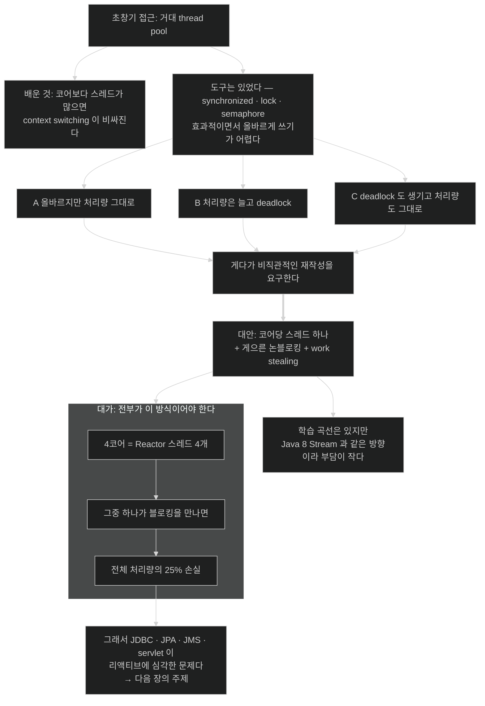

# 거대 thread pool이 실패한 이유 — 그리고 25%가 날아가는 계산

## 한눈에 보기

옛 Java 동시성이 자주 도달한 세 결말이다.

| 결말 | 설명 |
|---|---|
| A | 올바르게 했지만 **처리량은 그대로** |
| B | 처리량은 늘었지만 **deadlock을 들여왔다** |
| C | **deadlock도 생기고 처리량도 그대로** |

게다가 셋 다 **비직관적인 재작성**을 요구했다.

## 1. 왜 이게 필요한가

[[04a-scaling-with-project-reactor]]가 "코어당 스레드 하나가 기본"이라고 했다. 200개짜리 pool을 쓰지 않는다고.

그런데 왜? 스레드가 많으면 일을 많이 하는 것 아닌가?

이 질문은 Java 동시성의 20년 역사가 답한 것이다. 그 역사를 알아야 리액티브가 **새 유행이 아니라 학습의 결과**임이 보인다.

## 2. 어떻게 동작하는가

### 2.1 거대 pool의 실패

초창기 Java 동시 프로그래밍에서 사람들은 **거대한 thread pool**을 만들었다.

그리고 배웠다 — **코어보다 스레드가 많아지면 [[컨텍스트-스위칭]]**(= 스레드를 바꿀 때의 저장·복원 비용)**이 비싸진다.**

CPU가 계산 대신 스레드를 갈아 끼우는 데 시간을 쓰기 시작한다. 스레드를 늘릴수록 각 스레드가 실제로 일하는 비율이 떨어진다. 어느 지점부터는 **더 넣을수록 전체가 느려진다.**

### 2.2 도구는 있었지만 쓰기 어려웠다

Java 코어에는 **깨지기 쉬운 API가 많이 박혀 있다.** 초창기부터 `synchronized` 메서드와 블록, lock, semaphore 같은 도구가 주어졌지만, **효과적이면서 동시에 올바르게** 쓰기가 정말 어렵다.

그 어려움의 결과가 위 표의 세 결말이다. 그리고 마지막 문장이 아프다 — 이 전술들은 **애플리케이션을 비직관적인 방식으로 다시 쓰기를** 요구하곤 했다.

즉 어려운 것이 두 가지였다. 올바르게 만드는 것, 그리고 **그렇게 만든 코드를 나중에 읽는 것.**

### 2.3 대안이 더 나은 이유

**코어당 스레드 하나 + [[게으른-평가]]**(= 필요해진 순간에 실행) **[[논블로킹]]**(= 완료를 기다리지 않는 실행) **+ [[작업-훔치기]]**(= 멈춘 사이 다른 작업을 집는 방식)의 조합은 상당히 더 효율적일 수 있다.

물론 공짜는 아니다. Reactor로 코딩하는 것도 **익혀야 할 스타일**이 있다. 다만 그 스타일이 **널리 채택된 Java 8 Stream과 같은 방향**으로 크게 기울어 있어, 초창기 Java 동시 프로그래밍만큼 큰 요구는 아니다.

이 비교가 이 절의 논지다 — **어려움의 총량이 줄었다**는 것이지 없어졌다는 것이 아니다.

### 2.4 그래서 전부가 이 방식이어야 한다

여기서 이 장에서 가장 실질적인 제약이 나온다.

**애플리케이션의 절대적으로 모든 부분이 이 방식으로 작성돼야 한다.**

책이 드는 계산이 명료하다.

> 4코어 머신에 Reactor 스레드가 **4개**뿐이라고 상상해 보라. 그중 하나가 블로킹 코드를 만나 기다리게 되면 **전체 처리량의 25%를 날려 버린다.**

**[[이벤트-루프]]**(= 적은 스레드가 큐의 이벤트를 처리하는 모델)의 스레드는 소수 정예다. 하나가 멈추면 그 몫이 통째로 사라진다. 200개 중 하나가 막히는 것과는 무게가 다르다.

> **이 계산이 성립하는 전제.** 여기서 말하는 "Reactor 스레드 4개"는 [[04a-scaling-with-project-reactor]] §2.2에서 짚었듯 **Scheduler가 아니라 Reactor Netty 이벤트 루프 워커**다. 그 구분이 중요한 이유는 **아무도 스레드를 자동으로 바꿔 주지 않기 때문**이다 — Reactor는 기본적으로 직전 연산자가 돌던 스레드에서 계속 실행하므로, 블로킹 호출은 이벤트 루프 스레드 **위에서 그대로** 돈다. "Scheduler가 알아서 옮겨 주겠지"라고 믿으면 이 25%가 왜 날아가는지 설명할 수 없다.
>
> 25%라는 수치 자체는 **낙관적 하한**으로 읽어야 한다. 막힌 스레드가 처리하던 연결들이 함께 지연되고, 큐가 밀리면 손실은 산술적 비율보다 커진다.

### 2.5 그래서 JDBC·JPA·JMS·servlet이 문제다

이것이 **JDBC, JPA, JMS, servlet** 같은 곳에 있는 **[[블로킹-API]]**(= 블로킹 패러다임 위에 세워진 명세)가 리액티브 프로그래밍에 심각한 문제인 이유다.

이 명세들은 **전부 블로킹 패러다임 위에 세워졌다.** 그래서 리액티브 애플리케이션에 적합하지 않다.

목록을 보면 범위가 얼마나 넓은지 드러난다.

| 명세 | 무엇이 막히나 |
|---|---|
| JDBC | DB 질의 — 거의 모든 애플리케이션이 쓴다 |
| JPA | JDBC 위에 서므로 함께 막힌다 |
| JMS | 메시지 수신 |
| Servlet | 요청 처리 자체 |

즉 **평범한 Spring Boot 앱의 데이터 계층 전체**가 리액티브와 맞지 않는다. 이것이 다음 장 *Working with Data Reactively*가 존재하는 이유다.

### 2.6 비유와 그 한계

고속도로 차선에 빗댈 수 있다. 옛 방식은 **차선을 200개로 넓히는 것**이었다. 그런데 합류 지점과 차선 변경(context switching)이 늘어 오히려 막혔다. 새 방식은 차선을 **코어 수만큼만** 두되 **차가 멈추지 않게** 하는 것이다.

**깨지는 지점 둘.** 첫째, 고속도로는 차 한 대가 서면 그 차선만 막히지만, 4차선 중 1차선이 막히면 **정확히 25%가 아니라 그 이상**이 영향을 받는다 — 그 차선에 배정된 모든 연결이 함께 멈추고, 재배치가 자유롭지 않다. 둘째, 고속도로는 사고 차량을 견인할 수 있지만 **블로킹 호출은 끝날 때까지 방법이 없다.** 그래서 사후 대응이 아니라 **애초에 들이지 않는 것**이 유일한 전략이다.

## 3. 그림으로 보기

## 4. 이 노트에 나온 용어

- **[[컨텍스트-스위칭]]**: 스레드를 바꿀 때 드는 저장·복원 비용.
- **[[블로킹-API]]**: JDBC·JPA·JMS·servlet처럼 블로킹 패러다임 위에 세워진 명세.
- **[[이벤트-루프]]**: 적은 스레드가 큐의 이벤트를 돌아가며 처리하는 실행 모델.
- **[[작업-훔치기]]**: 한 작업이 멈춰 있을 때 스레드가 다른 작업을 집어 오는 방식.
- **[[논블로킹]]**: 연산이 끝나기를 기다리지 않는 실행 방식.
- **[[게으른-평가]]**: 필요해진 순간에 실행하는 성질.

## 5. 자주 헷갈리는 것

**"25%"는 낙관적 하한이다** — 산술적으로는 4분의 1이 맞지만, 블로킹이 이벤트 루프를 잡으면 **그 스레드에 배정된 모든 연결이 함께 멈춘다.** Netty는 연결을 이벤트 루프에 고정 배정하므로, 실제 영향은 요청이 어떻게 분배됐느냐에 따라 25%를 크게 넘을 수 있다. 책의 숫자는 감을 주는 값으로 읽어야 한다.

**"블로킹을 없앨 수 없으면 리액티브를 못 쓴다"** — 아니다. `boundedElastic`으로 격리하는 길이 있다 — [[04a-scaling-with-project-reactor]]. 다만 격리한 만큼 이득이 줄어드므로 **어디까지 감수할지**의 문제가 된다.

**이 절의 결론이 다음 장을 예고한다** — JDBC/JPA가 문제라는 진단은 R2DBC라는 처방으로 이어진다. 이 절만 읽으면 "리액티브는 DB를 못 쓴다"로 오해하기 쉽다.

**가상 스레드라는 다른 답** — 같은 문제(블로킹 API와 스레드 비용)에 Java 21은 다른 답을 내놨다. 블로킹 코드를 그대로 두고 스레드를 싸게 만드는 것이다 — [[05b-crafting-a-thymeleaf-template]]의 마지막 Note가 짚는다.

## 6. 언제 안 쓰나 / 경계

- **데이터 계층 계획 없이 리액티브 웹만 도입하지 않는다.** 병목이 아래로 이동할 뿐이다.
- **레거시 블로킹 라이브러리가 많은 코드베이스**라면 전환 비용을 먼저 계산한다.
- **`synchronized`를 리액티브 파이프라인 안에서 쓰지 않는다.** 이벤트 루프를 막는 또 다른 경로다.
- **동시성이 낮은 서비스**라면 옛 모델의 문제가 애초에 발생하지 않는다.

## 7. 연결

- [[04a-scaling-with-project-reactor]] — "코어당 스레드 하나"를 실제로 구현하는 Scheduler.
- [[01a-blocking-vs-non-blocking]] — 스레드가 기다리며 자원을 태우는 구조.
- [[02-creating-a-webflux-application]] — Reactor Netty가 이벤트 루프를 제공하는 자리.
- [[../chapter-10-working-with-data-reactively/01-what-reactive-data-access-requires]] — JDBC·JPA 문제에 대한 처방.

## 8. 스스로 확인

- 거대 thread pool이 어느 지점부터 오히려 느려지는 이유는?
- 옛 동시성 도구가 자주 도달한 세 결말을 말해 보라. 공통으로 요구한 것은?
- "4코어에서 25% 손실"이라는 계산이 왜 낙관적 하한인가?
- JDBC·JPA·JMS·servlet이 한 목록에 묶이는 공통점은?

> 네 문항을 스스로 답한 **뒤에** [[_04b-java-concurrency-history]]에서 모범답안과 대조한다. 먼저 열면 이 문항들은 다시 인출 문제로 쓸 수 없다.

<!-- ==== 아래는 내 영역 · 스킬 수정 금지 ==== -->

## 내 설명 시도

## 막혔던 지점

## 리뷰 이력
