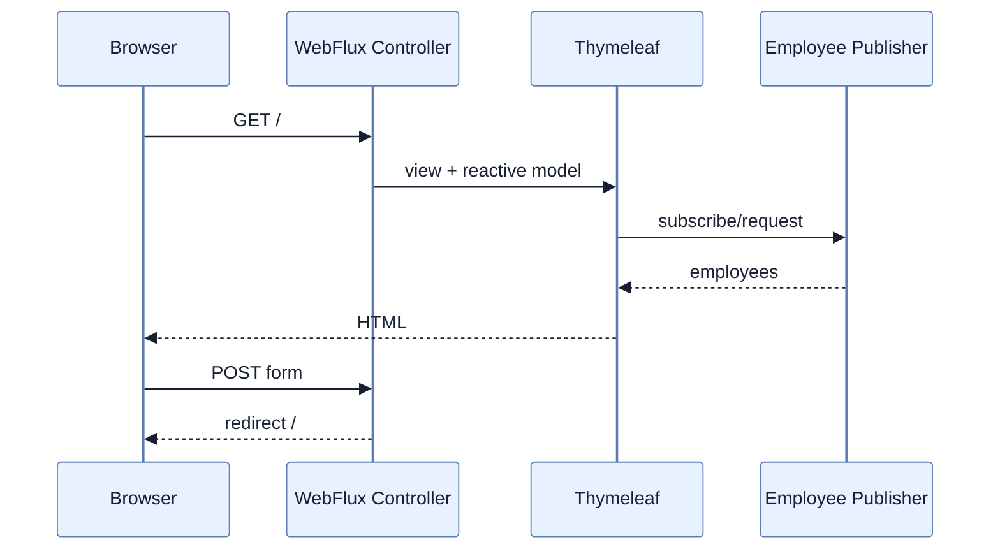

# Reactive Template과 Form 처리

## 한눈에 보기

WebFlux는 Thymeleaf와 결합해 reactive source를 server-rendered HTML에 전달한다. GET controller가 Model에 Employee sequence를 넣어 table을 렌더링하고, POST form은 `@ModelAttribute Mono<Employee>`를 map해 저장 후 `redirect:/`을 반환한다.

## 1. 왜 이게 필요한가

Reactive application도 JSON API만 제공하는 것은 아니다. Server-side HTML을 유지하면서 DB/remote data source의 Publisher를 연결할 수 있다. 그러나 template engine이 결과를 모두 모아야 렌더할 경우 true streaming benefit이 줄 수 있다.

## 2. 어떻게 동작하는가

Reactive Thymeleaf integration은 model attribute의 Publisher를 구독하고 HTML 반복 영역에 element를 공급한다. Reactive data driver context variable을 사용하면 지정 buffer 단위로 처리할 수 있다. Form POST는 WebFlux binder가 body를 Mono로 만들고 `map`에서 side effect와 redirect view name을 생성한다.

Template는 presentation boundary이며 blocking template helper나 blocking repository를 넣지 않는다. Spring MVC+virtual thread가 더 단순한 요구라면 reactive syntax 자체가 추가 복잡도일 수 있다.

## 3. 그림으로 보기

## 4. 이 노트에 나온 용어

- **server-side rendering**: server가 data와 template을 결합해 완성 HTML을 보내는 방식.
- **ModelAttribute**: form field를 handler argument object로 binding하는 애노테이션.
- **reactive data driver**: template rendering에 Publisher data를 buffer 단위로 공급하는 model wrapper.

## 7. 연결

- [[04-consuming-data-with-reactive-post]] — JSON body와 HTML form의 reactive input 차이를 보여준다.
- [[06-building-reactive-hypermedia-apis]] — HTML link 대신 API representation에 action link를 담는다.
- [[chapter-2-creating-web-and-api-applications-with-spring-boot/04-leveraging-templates-to-create-content|MVC Mustache]] — imperative server rendering과 비교 기준이다.

## 8. 스스로 확인

- 전체 1차 정리 후: reactive model을 template에 넣었다고 항상 response가 element별 streaming되는 것은 아닌 이유를 설명한다.

<!-- ==== 아래는 내 영역 · 스킬 수정 금지 ==== -->

## 내 설명 시도

## 막혔던 지점

## 리뷰 이력

