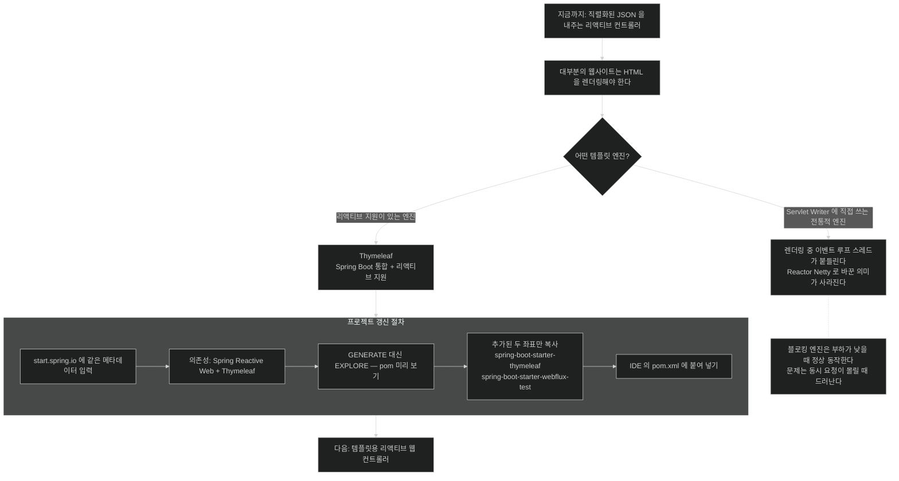

# 리액티브 템플릿 — 블로킹하지 않는 템플릿 엔진 고르기

## 한눈에 보기

의존성 두 개를 고르고 pom에 붙인다.

- Spring Reactive Web
- **Thymeleaf**

새 프로젝트를 만들지 않고, 같은 메타데이터로 **EXPLORE만 눌러** pom을 보고 필요한 것만 복사한다.

## 1. 왜 이게 필요한가

여기까지 만든 것은 **직렬화된 JSON을 내주는 리액티브 컨트롤러**다. [[03-serving-data-with-reactive-get]]와 [[04-consuming-data-with-reactive-post]]가 그것이다.

그런데 **대부분의 웹사이트는 HTML을 렌더링해야 한다.** 그리고 그것은 템플릿의 영역이다.

여기서 리액티브 특유의 고려가 하나 생긴다.

## 2. 어떻게 동작하는가

### 2.1 템플릿 엔진 선택이 성능 결정이 되는 이유

책의 판단 기준이 한 줄이다.

> 리액티브 프로그래밍을 얘기하고 있으니 **블로킹하지 않는 템플릿 엔진**을 고르는 것이 이치에 맞다.

왜 템플릿 엔진이 블로킹할 수 있나. 템플릿 렌더링은 이런 일을 한다 — 파일에서 템플릿을 읽고, 모델 데이터를 채워 넣고, 결과 문자열을 응답 스트림에 쓴다.

이 중 **파일 읽기와 응답 쓰기**가 I/O다. 템플릿 엔진이 이걸 블로킹 방식으로 하면, [[04b-java-concurrency-history]]에서 본 그대로 **[[이벤트-루프]]**(= 적은 스레드가 큐의 이벤트를 처리하는 모델) 스레드가 붙들린다.

전통적인 템플릿 엔진 상당수는 Servlet API의 `Writer`에 직접 쓰도록 설계됐고, 그건 곧 블로킹이다. 그래서 **[[Spring-WebFlux]]**(= Spring의 리액티브 웹 프레임워크)에서는 아무 템플릿 엔진이나 쓸 수 없다.

### 2.2 Thymeleaf

이 장이 고르는 것이 **[[Thymeleaf]]**(= Spring Boot와 잘 통합되고 리액티브 지원을 갖춘 서버 사이드 템플릿 엔진)다. 이유가 둘이다.

- Spring Boot와 매끄럽게 통합된다.
- **리액티브 지원이 들어 있다.**

두 번째가 이 절의 이유 전부다.

### 2.3 프로젝트 갱신 방법

이 장 앞에서 만든 애플리케이션을 **갱신**한다. 새 프로젝트를 처음부터 만들지 않는다.

start.spring.io로 돌아가 [[02-creating-a-webflux-application]]에서 쓴 것과 **똑같은 프로젝트 메타데이터**를 넣는다. 다만 이번엔 의존성을 둘로 한다.

- Spring Reactive Web
- Thymeleaf

그리고 GENERATE 대신 **EXPLORE** 버튼을 누른다. 그러면 이 프로젝트의 `pom.xml`을 웹에서 미리 볼 수 있다.

설정은 앞서 내려받은 것과 동일하고 **의존성 두 개만 추가**된다 — `spring-boot-starter-thymeleaf`와 `spring-boot-starter-webflux-test`.

우리가 할 일은 셋이다.

1. 그 Maven 의존성을 선택한다.
2. 클립보드에 복사한다.
3. IDE의 `pom.xml`에 붙여 넣는다.

**왜 이 방식인가** — 프로젝트를 다시 만들면 그동안 쓴 코드가 사라진다. Initializr를 **의존성 좌표 조회 도구**로 쓰는 것이 이 절차의 요점이고, 앞선 장들에서 반복해 온 방식이다.

### 2.4 그다음

이 starter가 Thymeleaf를 내려받는다. 그러면 템플릿용 리액티브 웹 컨트롤러를 쓸 준비가 된 것이고, 그것이 [[05a-creating-a-reactive-web-controller]]다.

### 2.5 비유와 그 한계

수도관에 필터를 다는 일에 빗댈 수 있다. [[02-creating-a-webflux-application]]에서 주 배관을 논블로킹(**[[Reactor-Netty]]**)으로 바꿨는데, 여기에 **물을 한 번에 한 컵씩만 통과시키는 필터**를 달면 배관을 바꾼 의미가 없다. 템플릿 엔진 선택이 그 필터를 고르는 일이다.

**깨지는 지점 하나.** 필터는 물이 안 나오면 **바로 알 수 있지만**, 블로킹 템플릿 엔진은 **부하가 낮을 때 아무 문제 없이 동작한다.** 문제가 드러나는 것은 동시 요청이 몰릴 때이고, 그때는 원인을 짚기 어렵다. 그래서 **선택 시점에** 결정해야 한다.

## 3. 그림으로 보기

## 4. 이 노트에 나온 용어

- **[[Thymeleaf]]**: Spring Boot와 잘 통합되고 리액티브 지원을 갖춘 템플릿 엔진.
- **[[Spring-WebFlux]]**: Spring의 리액티브 웹 프레임워크.
- **[[논블로킹]]**: 연산이 끝나기를 기다리지 않는 실행 방식.
- **[[이벤트-루프]]**: 적은 스레드가 큐의 이벤트를 돌아가며 처리하는 실행 모델.
- **[[Reactor-Netty]]**: Netty 위에 Reactor를 통합한 완전 논블로킹 웹 서버.

## 5. 자주 헷갈리는 것

**EXPLORE는 프로젝트를 만들지 않는다** — 미리 보기다. 이 절차의 목적은 **좌표를 확인해 복사**하는 것이지 프로젝트를 다시 받는 것이 아니다. GENERATE를 누르면 기존 코드가 든 프로젝트와 별개의 새 ZIP이 생긴다.

**`spring-boot-starter-webflux-test`가 함께 추가된다** — 앞서 넣지 않았다면 이때 들어온다. Boot 4의 기능별 테스트 starter다 — [[02-creating-a-webflux-application]].

**"Thymeleaf니까 리액티브다"** — 엔진이 지원한다는 것과 우리가 리액티브하게 쓴다는 것은 다르다. 컨트롤러가 `Mono<Rendering>`을 반환해야 흐름이 이어진다 — [[05a-creating-a-reactive-web-controller]].

## 6. 언제 안 쓰나 / 경계

- **JSON API만 제공하는 서비스**라면 템플릿 엔진 자체가 필요 없다.
- **템플릿 안에서 블로킹 호출을 하지 않는다.** 엔진이 논블로킹이어도 우리가 넣은 코드가 막을 수 있다.
- **MVC용 템플릿 설정을 그대로 옮기지 않는다.** 리액티브 뷰 리졸버는 별개다.
- **서버 렌더링 자체를 재검토할 수도 있다.** 프런트엔드가 별도 앱이라면 [[06-building-reactive-hypermedia-apis]] 쪽이 더 맞을 수 있다.

## 7. 연결

- [[02-creating-a-webflux-application]] — 여기에 의존성을 더하는 기반 프로젝트.
- [[05a-creating-a-reactive-web-controller]] — Thymeleaf를 실제로 부르는 컨트롤러.
- [[05b-crafting-a-thymeleaf-template]] — 템플릿 파일 자체와 폼 바인딩.
- [[04b-java-concurrency-history]] — 블로킹 컴포넌트 하나가 왜 치명적인지.

## 8. 스스로 확인

- 템플릿 엔진 선택이 왜 성능 결정이 되는가? 어느 지점이 I/O인가?
- GENERATE 대신 EXPLORE를 쓰는 이유는?
- 블로킹 템플릿 엔진의 문제가 개발 중에 잘 드러나지 않는 이유는?
- 이 절에서 추가되는 두 좌표는 각각 무엇을 위한 것인가?

> 네 문항을 스스로 답한 **뒤에** [[_05-rendering-reactive-templates]]에서 모범답안과 대조한다. 먼저 열면 이 문항들은 다시 인출 문제로 쓸 수 없다.

<!-- ==== 아래는 내 영역 · 스킬 수정 금지 ==== -->

## 내 설명 시도

## 막혔던 지점

## 리뷰 이력
