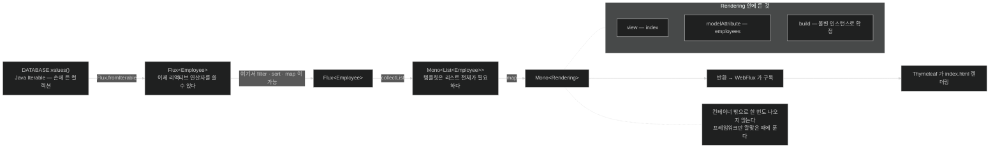

# `Mono<Rendering>` — 컨테이너 안에서 뷰 이름까지 만들기

## 한눈에 보기

```java
@Controller
public class HomeController {
    @GetMapping("/")
    public Mono<Rendering> index() {
        return Flux.fromIterable(DATABASE.values())
            .collectList()
            .map(employees -> Rendering
                    .view("index")
                    .modelAttribute("employees", employees)
                    .build());
    }
}
```

`Flux` → `Mono<List>` → `Mono<Rendering>`. **한 번도 컨테이너 밖으로 나오지 않는다.**

## 1. 왜 이게 필요한가

[[03-serving-data-with-reactive-get]]의 컨트롤러는 `Flux<Employee>`를 반환하고 끝이었다. 프레임워크가 직렬화했다.

템플릿은 다르다. 프레임워크에게 **두 가지**를 줘야 한다.

1. 어떤 뷰를 렌더링할지 — `"index"`
2. 그 뷰에 넘길 모델 데이터 — `employees`

명령형 MVC라면 `Model`에 넣고 `String`으로 뷰 이름을 반환했다. 리액티브에서는 **둘 다 아직 준비되지 않았을 수 있다.** 데이터가 미래에 도착하면, 뷰 이름과 모델을 묶는 일도 미래에 일어나야 한다.

그 자리를 채우는 것이 **[[Rendering]]**(= 렌더링할 뷰 이름과 모델 속성을 함께 담는 WebFlux 값 타입)이다.

## 2. 어떻게 동작하는가

### 2.1 요소별로

| 요소 | 하는 일 | 왜 필요한가 |
|---|---|---|
| `@Controller` | 이 클래스가 **템플릿을 렌더링**하는 웹 메서드를 담는다 | `@RestController`가 아니다 — 데이터가 아니라 뷰다 |
| `@GetMapping("/")` | `GET /`를 이 메서드에 매핑 | MVC와 같은 애노테이션 |
| **[[Mono]]**`<`**[[Rendering]]**`>` | 단일 값 리액티브 타입 안에 뷰 이름 + 모델 | 렌더링 지시 자체가 미래에 만들어진다 |
| **[[fromIterable]]**(= Java `Iterable`을 `Flux`로 감싸는 헬퍼) | 아무 Java `Iterable`이나 감싸 리액티브 API를 쓰게 한다 | 손에 든 컬렉션을 파이프라인에 들여온다 |
| `DATABASE.values()` | 임시 데이터 소스 | Chapter 10 전까지의 자리표시자 |
| **[[collectList]]**(= `Flux`를 모아 `Mono<List<T>>`로) | 항목 스트림을 하나로 모은다 | 템플릿은 리스트 전체를 한 번에 받아야 한다 |
| `map()` | `Mono` 안의 리스트에 접근해 `Rendering`으로 변환 | 뷰 이름 `"index"`와 모델 속성 `employees`를 싣는다 |
| `build()` | builder를 불변 인스턴스로 확정 | `map()` 안에서 나오므로 결과는 `Mono<Rendering>` |

### 2.2 map이 실제로 하는 일

체인 끝의 `map()`은 **`Mono` 안에 든 타입을 변환**한다. 여기서는 `List<Employee>`를 `Rendering`으로 바꾸되 **모든 것을 `Mono` 안에 유지**한다.

방식은 이렇다 — 원래의 `Mono<List<Employee>>`를 풀어 그 결과로 **완전히 새로운 `Mono<Rendering>`**을 만든다.

> 컨테이너(`Flux`든 `Mono`든)를 갖고 그 **안**의 것을 map하며 **계속 안에 두는 것**이 함수형 프로그래밍의 기본이다. 새 `Mono` 인스턴스를 만드는 걱정은 할 필요가 없다 — Reactor API가 알아서 처리한다. 우리는 데이터를 변환하는 데 집중하면 된다. 리액티브 컨테이너 타입 안에 매끄럽게 담겨 있는 한, 프레임워크가 **알맞은 때에 풀어** 제대로 렌더링한다.

이 Note가 리액티브 코드를 읽는 자세를 알려 준다. **`.block()`으로 꺼내고 싶은 충동을 참는 것**이 전부다.

### 2.3 감쌌다 도로 푸는 것이 이상해 보이는 이유

책이 스스로 짚는 지점이다.

실제 데이터 소스가 아니라 기본 Java `Map`에 담긴 통조림 데이터다. 그래서 Java `Employee` 리스트를 `fromIterable`로 **`Flux`에 감쌌다가** `collectList`로 **도로 빼내는** 것이 다소 이상해 보인다.

그런데 이건 **`Iterable` 컬렉션을 건네받는 현실 상황을 보여 주기 위한 것**이다. 올바른 대처가 코드에 나온 그대로다 — **`Flux`로 감싸고, 각종 변환과 필터를 실행한 뒤, WebFlux 웹 핸들러에 넘겨 Thymeleaf로 렌더링한다.**

즉 요점은 "감쌌다 푸는 낭비"가 아니라 **중간에 리액티브 연산자를 쓸 수 있게 되는 것**이다. 필터링이나 정렬이 들어가면 이 구조가 값을 한다.

### 2.4 비유와 그 한계

포장을 뜯지 않는 배송에 빗댈 수 있다. 물건이 상자(`Mono`) 안에 있고, 라벨을 바꾸거나 내용물을 다른 것으로 교체할 때도 **상자를 뜯지 않고** 상자째 처리한다. 최종 수령인(프레임워크)만 뜯는다.

**깨지는 지점 둘.** 첫째, 실제 배송은 상자를 뜯어야 내용을 바꿀 수 있지만 `map`은 **상자를 유지한 채 내용을 바꾼 새 상자**를 만든다 — 정확히는 교체지 수정이 아니다. 둘째, 상자를 뜯는 시점이 정해져 있지만 리액티브에서는 **아무도 안 뜯을 수도 있다** — 반환하지 않으면 프레임워크가 구독하지 않고, 그러면 `DATABASE.values()`조차 읽히지 않는다.

## 3. 그림으로 보기



## 4. 이 노트에 나온 용어

- **[[Rendering]]**: 뷰 이름과 모델 속성을 함께 담는 WebFlux 값 타입.
- **[[Mono]]**: 0개 또는 1개 값을 다루는 Reactor 타입.
- **[[Flux]]**: 0개 이상이 시간에 걸쳐 도착하는 Reactor 타입.
- **[[fromIterable]]**: Java `Iterable`을 `Flux`로 감싸는 static 헬퍼.
- **[[collectList]]**: `Flux`의 항목을 모아 `Mono<List<T>>`로 만드는 연산자.
- **[[Thymeleaf]]**: 리액티브 지원을 갖춘 서버 사이드 템플릿 엔진.
- **[[Spring-WebFlux]]**: Spring의 리액티브 웹 프레임워크.

## 5. 자주 헷갈리는 것

**`@Controller`와 `@RestController`** — 앞의 것은 뷰 이름을 해석해 템플릿을 렌더링하고, 뒤의 것은 반환값을 본문에 직접 쓴다. 템플릿 컨트롤러에 `@RestController`를 붙이면 **`"index"`라는 문자열이 그대로 응답**된다.

**`collectList`는 스트리밍을 포기한다** — 모든 항목을 모아야 하나의 `Mono`가 나오므로, 그 지점에서 **점진적 처리가 끊긴다.** 템플릿 렌더링은 리스트 전체가 필요하므로 불가피하지만, 무한 스트림에는 쓸 수 없다.

**`fromIterable`은 이미 있는 데이터를 감쌀 뿐** — 없던 비동기성을 만들어 주지 않는다. `DATABASE.values()`는 이미 메모리에 있고 즉시 완료된다. 진짜 이득은 실제 리액티브 데이터 소스로 바꿀 때 나온다 — 다음 장.

**`build()`를 빼먹으면** — builder가 그대로 남아 타입이 맞지 않는다. `Rendering`은 불변 타입이고 builder는 그 조립 단계다.

## 6. 언제 안 쓰나 / 경계

- **`.block()`으로 꺼내지 않는다.** 컨테이너 안에 두는 것이 이 절의 요점 전부다.
- **무한 스트림에 `collectList`를 쓰지 않는다.** 영원히 완료되지 않는다.
- **`Iterable`을 감싸는 것이 항상 이득은 아니다.** 중간 연산자가 없다면 그냥 리스트를 모델에 넣어도 된다.
- **데이터 소스가 블로킹이면** 이 파이프라인이 아무리 예뻐도 이벤트 루프가 막힌다 — [[04b-java-concurrency-history]].

## 7. 연결

- [[05-rendering-reactive-templates]] — 이 컨트롤러를 가능하게 한 의존성 설정.
- [[05b-crafting-a-thymeleaf-template]] — 여기서 지정한 `"index"` 뷰의 실제 파일과 폼 바인딩.
- [[03-serving-data-with-reactive-get]] — 같은 원리를 JSON에 적용한 형태.
- [[04-consuming-data-with-reactive-post]] — `map`으로 컨테이너 안을 다루는 같은 패턴.

## 8. 스스로 확인

- `Mono<Rendering>`이 `String` 뷰 이름 + `Model` 조합을 대신하는 이유는?
- `fromIterable` → `collectList`가 왕복처럼 보이는데도 올바른 처리인 이유는?
- "컨테이너 안에 두고 map한다"는 원칙을 어기면 무슨 일이 생기는가?
- `collectList`가 쓸 수 없는 상황은 언제인가?


> 네 문항을 스스로 답한 **뒤에** [[_05a-creating-a-reactive-web-controller]]에서 모범답안과 대조한다. 먼저 열면 이 문항들은 다시 인출 문제로 쓸 수 없다.

<!-- ==== 아래는 내 영역 · 스킬 수정 금지 ==== -->

## 내 설명 시도


## 막혔던 지점


## 리뷰 이력
