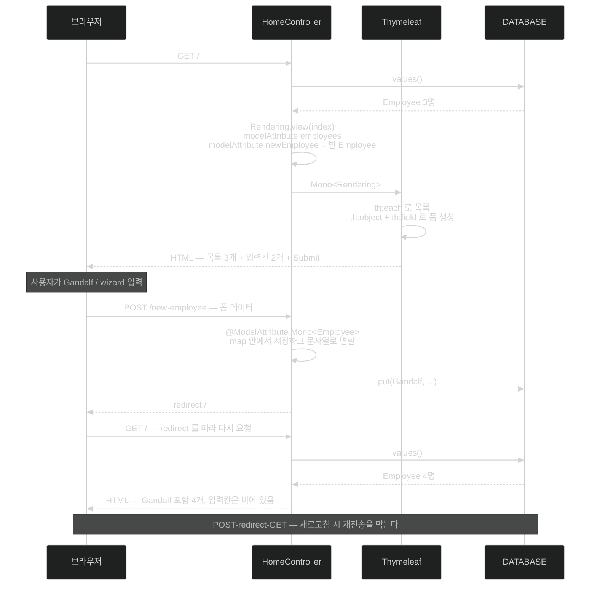

# Thymeleaf 템플릿과 폼 바인딩 — POST 하려면 GET에서 빈 객체를 준다

## 한눈에 보기

| 단계 | 코드 | 왜 |
|---|---|---|
| GET | `.modelAttribute("newEmployee", new Employee("", ""))` | 폼이 바인딩할 **빈 객체**가 먼저 있어야 한다 |
| 템플릿 | `th:object="${newEmployee}"` + `th:field="*{name}"` | 폼과 객체 필드를 잇는다 |
| POST | `@ModelAttribute Mono<Employee>` | JSON 본문이 아니라 **HTML 폼**을 소비한다 |
| 응답 | `return "redirect:/"` | POST-redirect-GET |

## 1. 왜 이게 필요한가

[[05a-creating-a-reactive-web-controller]]에서 `Mono<Rendering>`으로 `"index"` 뷰를 지정했다. 이제 그 파일이 있어야 한다.

그런데 목록만 보여 주는 페이지는 반쪽이다. **직원을 추가할 수 있어야** 웹사이트다. 그리고 그것이 **[[폼-바인딩]]**(= HTML 폼의 입력값을 객체 필드에 자동 대응시키는 것)의 세계다.

## 2. 어떻게 동작하는가

### 2.1 템플릿

`src/main/resources/templates/index.html`을 만든다.

```html
<html xmlns:th="http://www.thymeleaf.org">
<head>
    <title>Writing a Reactive Web Controller</title>
</head>
<body>
<h2>Employees</h2>
<ul>
    <li th:each="employee : ${employees}">
        <div th:text="${employee.name + ' (' + employee.role + ')'}"></div>
    </li>
</ul>
</body>
</html>
```

**[[Thymeleaf-디렉티브]]**(= `th:` 접두를 갖는 템플릿 처리 지시자) 셋이 등장한다.

| 디렉티브 | 하는 일 |
|---|---|
| `xmlns:th="http://www.thymeleaf.org"` | XML 네임스페이스 — 이게 있어야 `th:` 지시자를 쓸 수 있다 |
| `th:each` | for-each. `employees` 모델 속성의 항목마다 `<li>` 하나. `employee`가 대역 변수 |
| `th:text` | 노드에 텍스트를 삽입. 여기서는 record의 두 속성과 문자열을 이어 붙인다 |

**눈에 잘 안 보이는 규칙 하나** — 이 템플릿의 **모든 HTML 태그가 닫혀 있다.** **[[Thymeleaf]]**(= 리액티브 지원을 갖춘 템플릿 엔진)의 **DOM 기반 파서** 때문에 열린 채로 둘 수 있는 태그가 없다. 대부분의 태그는 여닫이 쌍이 있지만 `` 같은 것은 없다. 그런 태그도 **`</IMG>`를 붙이거나 `` 축약**을 써야 한다.

애플리케이션을 띄우고 `http://localhost:8080`으로 가면 `Employees` 제목 아래에 `Frodo Baggins (ring bearer)`처럼 **이름 (역할)** 형태의 목록이 렌더링된다.

### 2.2 POST를 하려면 GET에서 준비해야 한다

새 객체를 POST하려면 일반적으로 **GET 단계에서 빈 객체를 먼저 제공**해야 한다. 그래서 `index` 메서드를 고친다.

```java
@GetMapping("/")
Mono<Rendering> index() {
    return Flux.fromIterable(DATABASE.values())
        .collectList()
        .map(employees -> Rendering
                .view("index")
                .modelAttribute("employees", employees)
                .modelAttribute("newEmployee", new Employee("", ""))
                .build());
}
```

앞 버전과 **딱 한 줄** 다르다 — 빈 `Employee`를 담은 `newEmployee` 모델 속성이 추가됐다.

**왜 빈 객체가 필요한가.** Thymeleaf가 `th:field`로 입력 칸을 만들려면 **어떤 필드가 있는지 알아야** 하고, 그 정보는 실제 객체 인스턴스에서 온다. 그리고 수정 폼이라면 그 객체의 현재 값이 입력 칸의 초기값이 된다. 새로 만드는 경우이므로 빈 값이다.

이 한 줄이 **HTML 폼을 만들기 시작하는 데 필요한 전부**다.

### 2.3 폼

```html
<form th:action="@{/new-employee}" th:object="${newEmployee}" method="post">
    <input type="text" th:field="*{name}" />
    <input type="text" th:field="*{role}" />
    <input type="submit" />
</form>
```

| 디렉티브 | 하는 일 |
|---|---|
| `th:action` | 새 `Employee`를 처리할 라우트로 가는 URL을 만든다 |
| `th:object` | 이 폼을 모델 속성으로 제공된 `newEmployee` record에 **바인딩**한다 |
| `th:field="*{name}"` | 첫 `<input>`을 record의 `name`에 연결 |
| `th:field="*{role}"` | 둘째 `<input>`을 record의 `role`에 연결 |

`*{...}` 문법이 `${...}`와 다른 것에 주목할 만하다. `*{...}`는 **`th:object`가 정한 객체를 기준으로 한 상대 경로**다. 그래서 폼 안에서는 객체 이름을 반복하지 않는다.

나머지는 표준 HTML5 `<form>`이다. 설명한 부분이 **HTML 폼 처리를 [[Spring-WebFlux]]에 물리는 접착제**다.

### 2.4 POST 핸들러

```java
@PostMapping("/new-employee")
Mono<String> newEmployee(@ModelAttribute Mono<Employee> newEmployee) {
    return newEmployee
        .map(employee -> {
            DATABASE.put(employee.name(), employee);
            return "redirect:/";
        });
}
```

| 요소 | 하는 일 |
|---|---|
| `@PostMapping` | `POST /new-employee`를 이 메서드에 매핑 |
| **[[ModelAttribute]]**(= HTML 폼을 소비한다는 신호) | `application/json` 본문 같은 것이 **아니라** HTML 폼을 받는다는 표시 |
| **[[Mono]]**`<Employee>` | HTML 폼에서 들어온 데이터를 Reactor 타입에 감싼 것 |
| `map()` | 결과 위를 map해 데이터를 꺼내고, `DATABASE`에 저장하고, `/`로의 HTTP redirect로 **변환**한다 |

마지막 항목이 이 메서드의 성격을 말해 준다. 반환 타입이 `Mono<String>`인 이유는 **`map`의 결과가 문자열**이기 때문이다.

책이 정리하는 문장이 정확하다 — 이 메서드가 취하는 동작 전체가 **들어오는 데이터에서 시작해 나가는 동작으로 변환되는 Reactor flow**다. 중간 변수를 만지작거리는 고전적 명령형과 대비된다.

### 2.5 왕복 확인

실행하면 이렇게 된다.

1. `/`에서 직원 3명(Frodo·Samwise·Bilbo)이 목록으로 뜨고 아래에 입력 칸 두 개와 Submit이 있다.
2. `Gandalf`와 `wizard`를 입력하고 Submit을 누른다.
3. POST 처리기가 저장하고 `/`로 redirect한다.
4. 갱신된 `DATABASE`가 다시 조회되어 **Gandalf (wizard)가 목록에 추가된 채** 렌더링되고 입력 칸은 비어 있다.

3~4번이 **POST-redirect-GET** 패턴이다. redirect 없이 POST 응답으로 페이지를 그리면 새로고침 때 재전송 경고가 뜨고 중복 저장이 일어난다.

### 2.6 그래서 WebFlux는 값을 하나

책이 이 대목에서 솔직한 Note를 붙인다.

> WebFlux가 도입한 리액티브 모델은 처음에 낯설고 예상보다 어려워 보일 수 있다. 고전적인 thread-per-request와 달리 논블로킹·비동기 접근을 채택하며 **웹 요청의 모든 단계를 신중히 고려**해야 한다.
>
> **Spring MVC는 여전히 유효하고 웹 애플리케이션에는 더 단순하다.** 그러나 I/O 바운드 고동시성 시스템(스트리밍 서비스, API 게이트웨이, 수천 개의 동시 연결을 허용하는 애플리케이션)에서는 리액티브 모델이 **스레드 사용을 극적으로 줄이고 자원 효율을 높인다.**
>
> Java 21과 Spring Boot 3.2 이후로는 **[[가상-스레드]]**(= JVM이 관리하는 경량 스레드)가 **명령형 Spring MVC 모델을 유지하면서** 고동시성으로 가는 또 다른 길을 준다.
>
> 요점은 WebFlux가 본질적으로 더 낫다는 것이 아니라, **특정 시나리오에 더 낫다**는 것이다.

이 문단이 이 장 전체에서 가장 균형 잡힌 서술이다. 리액티브는 도구이지 승급이 아니다.

### 2.7 비유와 그 한계

우편 주문서에 빗댈 수 있다. GET 단계의 빈 `Employee`는 **빈 주문 양식**이고, `th:field`는 양식의 각 칸이 어느 항목에 대응하는지 정한 것이며, `@ModelAttribute`는 **접수 창구가 이 봉투를 주문서로 취급하라**는 표시다. redirect는 접수 후 손님을 안내 데스크로 돌려보내는 것이다.

**깨지는 지점 둘.** 첫째, 종이 양식은 칸이 비어 있어도 존재하지만, **모델 속성을 빼먹으면 폼이 아예 렌더링되지 않고 예외가 난다** — 빈 객체가 선택이 아니라 필수인 이유다. 둘째, 창구 직원은 양식을 받는 즉시 처리하지만 `Mono<Employee>`는 **폼 데이터가 다 도착한 뒤 나중에** 처리된다 — 그래서 `map` 안에 로직을 넣는 것이다.

## 3. 그림으로 보기



## 4. 이 노트에 나온 용어

- **[[Thymeleaf]]**: 리액티브 지원을 갖춘 서버 사이드 템플릿 엔진.
- **[[Thymeleaf-디렉티브]]**: `th:` 접두를 갖는 템플릿 처리 지시자.
- **[[폼-바인딩]]**: HTML 폼의 입력값을 객체 필드에 자동 대응시키는 것.
- **[[ModelAttribute]]**: JSON 본문이 아니라 HTML 폼을 소비한다는 신호.
- **[[Mono]]**: 0개 또는 1개 값을 다루는 Reactor 타입.
- **[[Rendering]]**: 뷰 이름과 모델 속성을 함께 담는 WebFlux 값 타입.
- **[[가상-스레드]]**: JVM이 관리하는 경량 스레드. 명령형을 유지하며 고동시성으로 가는 다른 길.
- **[[Spring-WebFlux]]**: Spring의 리액티브 웹 프레임워크.

## 5. 자주 헷갈리는 것

**redirect에 타입 있는 대안이 있다** — 책은 `Mono<String>`에 `"redirect:/"` 문자열을 담는다. 동작하지만, WebFlux에는 **`Rendering.redirectTo(String)`**이라는 타입 있는 방법이 있다(`spring-webflux` 7.0.9에서 확인). 같은 장에서 `Rendering`을 이미 쓰고 있는데 redirect만 문자열 규약으로 돌아가는 것이 일관되지 않는다.

**`${...}`와 `*{...}`** — 전자는 모델 전체 기준의 절대 경로, 후자는 `th:object`가 정한 객체 기준의 상대 경로다. 폼 안에서 `${newEmployee.name}`으로 써도 되지만 `*{name}`이 관례다.

**`@ModelAttribute`와 `@RequestBody`** — 폼(`application/x-www-form-urlencoded`)이냐 JSON 본문이냐로 갈린다. 폼에 `@RequestBody`를 쓰면 파싱에 실패한다.

**닫히지 않은 태그가 조용한 실패를 만든다** — DOM 파서라 `<br>` 하나 때문에 템플릿 전체가 파싱에 실패할 수 있다. HTML5 문법으로는 유효한데 Thymeleaf에서는 아니다.

**모델 속성 이름과 `th:object`가 어긋나면** — 렌더링 시점에 예외가 난다. 컴파일이 잡아 주지 않는 영역이다.

## 6. 언제 안 쓰나 / 경계

- **템플릿 안에서 블로킹 호출을 하지 않는다.** 엔진이 논블로킹이어도 우리가 넣은 표현식이 막을 수 있다.
- **POST 응답으로 페이지를 직접 그리지 않는다.** redirect 없이 두면 새로고침에서 중복 저장이 난다.
- **프런트엔드가 별도 앱이라면** 서버 렌더링 대신 API를 낸다 — [[06-building-reactive-hypermedia-apis]].
- **WebFlux를 기본값으로 삼지 않는다.** 책 자신이 MVC가 더 단순하다고 말한다. 고동시성 I/O 바운드가 아니면 명령형이 낫고, 그 중간에 가상 스레드라는 선택지가 있다 — 이 책 Chapter 11이 다루지만 **두 선택지의 결정 기준은 어느 장에서도 정면으로 비교되지 않는다.**

## 7. 연결

- [[05a-creating-a-reactive-web-controller]] — 여기 렌더링되는 `"index"` 뷰를 지정한 컨트롤러.
- [[04-consuming-data-with-reactive-post]] — 같은 저장 로직을 JSON API로 하는 형태.
- [[05-rendering-reactive-templates]] — Thymeleaf를 고른 이유.
- [[06-building-reactive-hypermedia-apis]] — HTML 대신 링크로 안내하는 방식.

## 8. 스스로 확인

- POST를 하려면 GET에서 빈 객체를 줘야 하는 이유를 Thymeleaf 관점에서 설명해 보라.
- `${...}`와 `*{...}`의 차이는?
- POST-redirect-GET을 쓰지 않으면 어떤 사고가 생기는가?
- 이 책이 WebFlux와 가상 스레드를 어떻게 자리매김하는가? 결정 기준을 스스로 세워 보라.


> 네 문항을 스스로 답한 **뒤에** [[_05b-crafting-a-thymeleaf-template]]에서 모범답안과 대조한다. 먼저 열면 이 문항들은 다시 인출 문제로 쓸 수 없다.

<!-- ==== 아래는 내 영역 · 스킬 수정 금지 ==== -->

## 내 설명 시도


## 막혔던 지점


## 리뷰 이력
