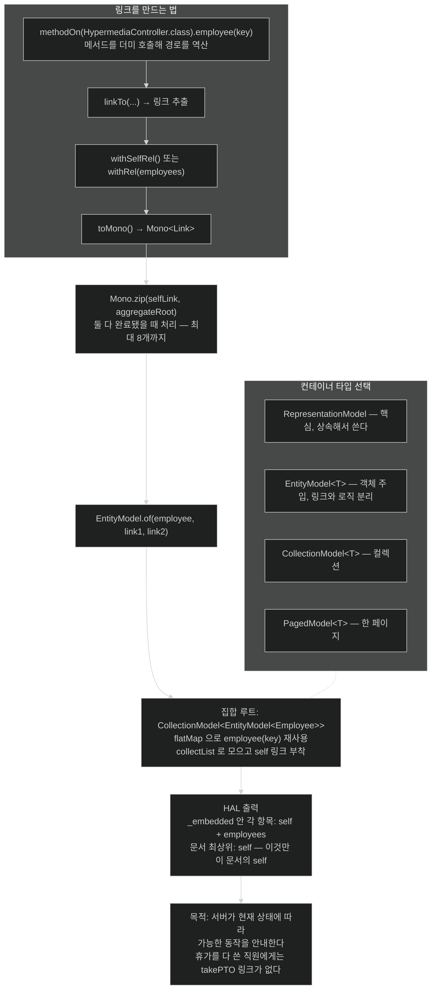

# 하이퍼미디어 — 서버가 다음에 할 수 있는 일을 알려 준다

## 한눈에 보기

| 컨테이너 타입 | 언제 |
|---|---|
| `RepresentationModel` | 데이터와 링크의 핵심 타입. 상속해 업무 값과 합칠 때 |
| `EntityModel<T>` | 업무 객체를 **주입**해 링크와 업무 로직을 분리할 때 |
| `CollectionModel<T>` | `T` 하나가 아니라 컬렉션일 때 |
| `PagedModel<T>` | 한 페이지 분량일 때 |

풍부한 컬렉션은 **`CollectionModel<EntityModel<T>>`**로 표현한다 — 컬렉션과 각 항목이 **서로 다른 링크 집합**을 갖기 때문이다.

## 1. 왜 이게 필요한가

이 장 앞부분에서 만든 API는 아주 단순했다. 기본적인 JSON을 내줬을 뿐이다. 그런데 그런 벌거벗은 API에 빠진 것이 하나 있다 — **controls**다.

클라이언트가 직원 목록을 받았다. 그래서 이제 뭘 할 수 있나? 개별 조회 URL은? 수정은? 삭제는? **클라이언트가 전부 하드코딩해야 한다.**

**[[하이퍼미디어]]**(= API가 콘텐츠와 메타데이터를 함께 내주어 무엇을 할 수 있는지 알려 주는 방식)는 콘텐츠와 메타데이터를 함께 내주어, 그 데이터로 **무엇을 할 수 있고 관련 데이터를 어디서 찾는지** 알려 준다.

사실 우리는 이걸 매일 본다. 웹 페이지의 다른 페이지로 가는 내비게이션 링크, CSS 링크, 변경을 일으키는 링크. Amazon에서 상품을 주문할 때 **우리가 링크를 제공하지 않는다.** 웹 페이지가 준다.

JSON에서의 하이퍼미디어는 **같은 개념을 시각적 페이지가 아니라 API에 적용**한 것이다.

## 2. 어떻게 동작하는가

### 2.1 의존성 — starter를 쓰면 안 된다

> start.spring.io에서 Spring HATEOAS를 고르면 `spring-boot-starter-hateoas`가 프로젝트에 추가된다. 그런데 **이 starter는 Spring MVC 전용으로 설계됐고 Spring WebFlux 애플리케이션에 쓰면 안 된다.** Spring MVC 지원을 포함한 **servlet 기반 웹 스택을 끌어와** Reactor Netty에서 도는 리액티브 애플리케이션과 충돌한다.
>
> Spring HATEOAS 자체는 WebFlux를 지원하지만, **Boot의 HATEOAS starter가 의도적으로 MVC 스택에 정렬**돼 있다. 따라서 WebFlux로 리액티브 애플리케이션을 만들 때는 Boot starter 대신 `spring-hateoas` 의존성을 직접 추가하는 것이 권장된다.

[[02-creating-a-webflux-application]]에서 "웹 스택을 섞으면 안 된다"고 한 것의 구체적 사례다. starter가 편의를 주는 대신 **웹 스택을 함께 결정한다**는 사실을 알아야 이런 함정을 피한다.

**책이 HATEOAS 사례로만 말한 것에는 그보다 일반적인 규칙이 깔려 있다.** Spring Boot 공식 문서가 못박는다 — *"`spring-boot-starter-web`과 `spring-boot-starter-webflux` 모듈을 애플리케이션에 **둘 다** 추가하면 Spring Boot는 **WebFlux가 아니라 Spring MVC를 자동 구성한다.** 많은 Spring 개발자가 리액티브 `WebClient`를 쓰려고 MVC 애플리케이션에 `spring-boot-starter-webflux`를 추가하기 때문에 이렇게 정해졌다."*

이 규칙이 함정의 정체다. 서블릿 스택이 클래스패스에 **들어오기만 하면 조용히 이긴다.** HATEOAS starter는 그것을 끌고 오는 여러 경로 중 하나일 뿐이며, 같은 일이 다른 starter에서도 일어난다.

증상은 알아채기 쉽다 — 시작 로그에 Reactor Netty 대신 **Tomcat이 뜬다.** 그때 의존성 트리에서 `spring-boot-starter-web`이 어디서 딸려 왔는지 찾으면 된다.

정말로 둘 다 필요하면 문서가 우회로도 준다 — *"`SpringApplication.setWebApplicationType(WebApplicationType.REACTIVE)`로 원하는 애플리케이션 타입을 강제할 수 있다."* 다만 이 장의 상황(HATEOAS)에서는 `spring-hateoas`를 직접 넣는 쪽이 더 깨끗하다. 서블릿 스택을 아예 안 들이는 것이 강제로 무시하는 것보다 낫기 때문이다.

```xml
<dependency>
    <groupId>org.springframework.hateoas</groupId>
    <artifactId>spring-hateoas</artifactId>
</dependency>
```

Boot의 의존성 관리 덕에 **버전은 적지 않는다.**

### 2.2 컨트롤러 골격

```java
@RestController
@EnableHypermediaSupport(type = HAL)
public class HypermediaController {
}
```

| 애노테이션 | 하는 일 |
|---|---|
| `@RestController` | 템플릿이 아니라 JSON 직렬화에 집중한다는 표시 |
| `@EnableHypermediaSupport` | **[[Spring-HATEOAS]]**(= 데이터와 하이퍼링크를 결합하는 툴킷)의 하이퍼미디어 지원 활성화 — 여기서는 **[[HAL]]**(= 하이퍼미디어를 JSON으로 표현하는 형식) |

Boot starter를 썼다면 HAL이 자동 활성화됐겠지만, **수동으로 꽂았으니 직접 켜야 한다.** 편의를 포기한 대가가 이 한 줄이다.

> `@EnableHypermediaSupport`는 **한 번만** 쓰면 된다. 이 책은 간결함을 위해 하이퍼미디어 컨트롤러에 붙였지만, 실제 애플리케이션에서는 `@SpringBootApplication`이 붙은 클래스에 두는 편이 나을 수 있다.

### 2.3 단일 항목 endpoint

```java
@GetMapping("/hypermedia/employees/{key}")
Mono<EntityModel<Employee>> employee(@PathVariable String key) {
    Mono<Link> selfLink = linkTo(
        methodOn(HypermediaController.class).employee(key))
        .withSelfRel()
        .toMono();
    Mono<Link> aggregateRoot = linkTo(
        methodOn(HypermediaController.class).employees())
        .withRel(LinkRelation.of("employees"))
        .toMono();
    Mono<Tuple2<Link, Link>> links = Mono.zip(selfLink, aggregateRoot);
    return links.map(objects ->
        EntityModel.of(DATABASE.get(key), objects.getT1(), objects.getT2()));
}
```

요소별로 본다.

| 요소 | 하는 일 |
|---|---|
| `Mono<EntityModel<Employee>>` | **[[EntityModel]]**(= 업무 객체를 주입해 링크와 함께 담는 컨테이너)을 `Mono`로 감싼 반환 타입 |
| **[[linkTo]]**(= 컨트롤러 메서드 호출에서 링크를 뽑는 헬퍼) | WebFlux 메서드 호출로부터 링크를 추출 |
| **[[methodOn]]**(= 링크 생성을 위해 메서드를 더미 호출하는 헬퍼) | 컨트롤러 웹 메서드를 **가짜로 호출**해 링크 정보를 모은다 |
| `withSelfRel()` | 이 링크에 `self` 관계를 붙인다 |
| `withRel(LinkRelation.of("employees"))` | 임의의 `employees` 관계를 붙인다 |
| `toMono()` | 링크 설정을 `Mono<Link>`로 만든다 |
| **[[Mono-zip]]**(= 여러 `Mono`를 합쳐 전부 완료됐을 때 처리) | 두 링크가 **모두 준비됐을 때** 결과를 처리 |
| `links.map(...)` | `Tuple2`에서 링크를 꺼내 조회한 employee와 함께 `EntityModel`로 묶는다 |

`methodOn`이 흥미롭다. **메서드를 실제로 실행하지 않고** 호출 기록만 남겨 URL을 역산한다. 그래서 `@GetMapping` 경로를 문자열로 중복해 쓰지 않아도 되고, **경로를 바꾸면 링크도 따라 바뀐다.**

`Mono.zip()`은 둘 이상의 `Mono` 연산을 합쳐 **전부 완료됐을 때** 결과를 처리한다. 가장 흔한 형태는 둘이고, 더 큰 집합에는 combinator `Function`을 받는 변형이 있어 **최대 8개까지** 직접 지원한다. 오류를 전파하기 전에 여러 연산이 끝나기를 허용하려면 `Mono.zipDelayError()`가 있다.

### 2.4 컨테이너 타입 넷

Spring HATEOAS가 하는 일은 **데이터와 하이퍼링크를 결합하는 것**이다. 하이퍼링크는 **[[Link]]**(= relation 이름과 URI를 갖는 타입)로 표현되고, 툴킷에 `Link` 생성과 데이터 병합을 쉽게 하는 연산이 가득하다.

하이퍼미디어 응답은 **[[RepresentationModel]]**(= 데이터와 링크를 담는 핵심 타입) 또는 그 하위 타입으로 감싸야 한다.

| 타입 | 성격 |
|---|---|
| `RepresentationModel` | 핵심 타입. **상속**해 업무 값과 합치는 방식 |
| **[[EntityModel]]**`<T>` | 제네릭 확장. 업무 객체를 static 생성 메서드에 **주입**해 링크와 업무 로직을 **분리** |
| **[[CollectionModel]]**`<T>` | `T` 하나가 아니라 **컬렉션**을 표현 |
| **[[PagedModel]]**`<T>` | `CollectionModel` 확장. **한 페이지** 분량 |

핵심 통찰은 이것이다 — **단일 항목과 컬렉션은 서로 다른 링크 집합을 가질 수 있다.** 그래서 풍부한 컬렉션은 `CollectionModel<EntityModel<T>>`로 표현한다.

그러면 컬렉션 전체는 하나의 링크 집합(예: **[[집합-루트]]**(= 개별 리소스를 모아 대표하는 컬렉션 endpoint)로 가는 링크)을 갖고, 각 항목은 자기 단일 리소스 메서드를 가리키는 링크와 집합 루트로 돌아가는 링크를 갖는다.

### 2.5 집합 루트 endpoint

```java
@GetMapping("/hypermedia/employees")
Mono<CollectionModel<EntityModel<Employee>>> employees() {
    Mono<Link> selfLink = linkTo(
        methodOn(HypermediaController.class).employees())
        .withSelfRel()
        .toMono();
    return selfLink
        .flatMap(self -> Flux.fromIterable(DATABASE.keySet())
            .flatMap(key -> employee(key))
            .collectList()
            .map(entityModels -> CollectionModel.of(entityModels, self)));
}
```

앞과 다른 점 넷이다.

1. `selfLink`가 `employees()` 자신을 가리켜 **집합 루트 리소스의 self 관계**를 만든다.
2. `selfLink` 위를 **[[flatMap]]**(= map 결과의 중첩을 한 단계로 걷어내는 연산자)하고, `DATABASE` 항목을 순회하며 **`employee(String key)` 메서드를 재사용**해 각각을 링크가 붙은 `EntityModel<Employee>`로 변환한다.
3. **[[collectList]]**(= `Flux`를 모아 `Mono<List<T>>`로)로 모든 `EntityModel<Employee>`를 `Mono<List<...>>`에 모은다.
4. 그 결과를 `Mono<CollectionModel<EntityModel<Employee>>>`로 map하며 집합 루트의 `selfLink`를 컬렉션에 붙인다.

`flatMap`이 두 번 나오는 것에 주목할 만하다. 첫 번째는 `Mono<Link>` 안에서 또 다른 `Mono`를 만들기 때문이고, 두 번째는 `employee(key)`가 **`Mono`를 반환**하기 때문이다 — [[04-consuming-data-with-reactive-post]]에서 본 "함수 반환 타입이 리액티브면 `flatMap`" 규칙 그대로다.

앞 메서드들보다 훨씬 복잡해 보이는 것이 맞다. 그래도 **웹 컨트롤러 메서드를 하이퍼미디어 렌더링에 직접 물리면**, 나중에 메서드를 조정해도 링크가 알아서 따라온다.

### 2.6 HAL 출력

```json
{
  "_embedded": {
    "employeeList": [
      { "name": "Frodo Baggins", "role": "ring bearer",
        "_links": {
          "self":      { "href": "http://localhost:8080/hypermedia/employees/Frodo%20Baggins" },
          "employees": { "href": "http://localhost:8080/hypermedia/employees" } } }
    ]
  },
  "_links": { "self": { "href": "http://localhost:8080/hypermedia/employees" } }
}
```

- `_links`가 HAL의 하이퍼미디어 링크 형식이다. **link relation**(예: `self`)과 **href**를 담는다.
- 컬렉션의 self 링크는 **맨 아래**에 있고, 각 Employee는 자기를 가리키는 `self`와 집합 루트를 가리키는 `employees` 링크를 갖는다.

> 하이퍼미디어에서 거의 모든 표현에 **[[self-링크]]**(= "this"를 가리키는 링크)가 들어간다. **문맥이 중요하다.** 위 HAL 출력에는 self가 **세 개**인데, **마지막 것만 이 문서의 self**다. 나머지는 개별 레코드를 조회하는 canonical link다. 링크는 본질적으로 불투명하므로 그것을 따라 해당 레코드로 이동할 수 있다.

### 2.7 그래서 왜 하는가

**하이퍼미디어는 장식용 링크를 더하는 것이 아니다.** 진짜 목적은 서버가 **리소스의 현재 상태에 따라 클라이언트가 할 수 있는 동작을 안내**하는 것이다.

직원 데이터를 담당하면서 `takePTO`, `fileExpenseReport`, `contactManager` 같은 동작을 지원하는 시스템을 생각해 보자. **모든 동작이 항상 유효한 것은 아니다.** 남은 휴가를 다 쓴 직원에게 `takePTO`는 적용돼서는 안 된다.

업무 규칙에 따라 **하이퍼미디어 링크가 나타나거나 사라지면**, 서버가 현재 가능한 동작을 알려 주는 셈이다. 클라이언트는 작업을 하드코딩하거나 어떤 동작이 적절한지 추론할 필요가 없다. **응답에 있는 링크를 따라가면 된다.**

이 접근이 가능하게 하는 것 넷이다.

- 런타임 주도 워크플로
- 클라이언트와 서버 책임의 더 깔끔한 분리
- 클라이언트를 깨뜨리지 않는 **안전한 API 진화**
- 문맥 인식 UI 동작 (예: 버튼을 동적으로 활성화·비활성화)

요컨대 하이퍼미디어는 애플리케이션의 **내비게이션 로직 일부를 클라이언트에서 API 안으로 옮긴다.**

### 2.8 비유와 그 한계

박물관 안내판에 빗댈 수 있다. 지도를 미리 외우고 오는 대신(하드코딩), 각 전시실에 **"다음 전시실은 이쪽", "출구는 저쪽"** 안내판이 있다. 공사 중인 방은 안내판이 사라지므로 관람객은 그쪽으로 가지 않는다.

**깨지는 지점 둘.** 첫째, 사람은 안내판이 없어도 **다른 길을 찾아보지만** 하이퍼미디어 클라이언트는 링크가 없으면 **그 동작이 불가능하다고 받아들여야** 한다 — 그러려면 클라이언트가 처음부터 그렇게 만들어져야 하고, 대부분의 실제 클라이언트는 URL을 하드코딩한다. 둘째, 안내판은 공짜지만 **링크 생성은 비용이다** — 위 집합 루트 코드가 보여 주듯, 항목 수만큼 링크를 만들어야 한다.

## 3. 그림으로 보기



## 4. 이 노트에 나온 용어

- **[[하이퍼미디어]]**: 콘텐츠와 메타데이터를 함께 내주어 가능한 동작을 알려 주는 방식.
- **[[Spring-HATEOAS]]**: 데이터와 하이퍼링크를 결합하는 Spring 툴킷.
- **[[HAL]]**: 하이퍼미디어를 JSON으로 표현하는 형식.
- **[[Link]]**: relation 이름과 URI를 갖는 하이퍼링크 타입.
- **[[RepresentationModel]]**: 데이터와 링크를 담는 하이퍼미디어 응답의 핵심 타입.
- **[[EntityModel]]**: 업무 객체를 주입해 링크와 함께 담는 컨테이너.
- **[[CollectionModel]]**: 컬렉션을 표현하는 `RepresentationModel` 확장.
- **[[PagedModel]]**: 한 페이지 분량을 표현하는 `CollectionModel` 확장.
- **[[self-링크]]**: "this"를 가리키는 링크. 문맥에 따라 대상이 다르다.
- **[[집합-루트]]**: 개별 리소스를 모아 대표하는 컬렉션 endpoint.
- **[[linkTo]]**: 컨트롤러 메서드 호출에서 링크를 뽑는 static 헬퍼.
- **[[methodOn]]**: 링크 생성을 위해 메서드를 더미 호출하는 static 헬퍼.
- **[[Mono-zip]]**: 여러 `Mono`를 합쳐 전부 완료됐을 때 처리하는 연산자.
- **[[flatMap]]**: map 결과의 중첩을 한 단계로 걷어내는 연산자.
- **[[collectList]]**: `Flux`의 항목을 모아 `Mono<List<T>>`로 만드는 연산자.

## 5. 자주 헷갈리는 것

**원문의 오타** — 책 p.275의 집합 루트 설명에 **`InIn this case,`**가 있다. `In this case,`의 오타다.

**`@EnableHypermediaSupport(type = HAL)`을 그대로 붙여 넣으면 컴파일되지 않는다** — `HAL`은 `HypermediaType.HAL`의 static import를 전제한다. 책이 import 목록을 보이지 않으므로 `import static org.springframework.hateoas.config.EnableHypermediaSupport.HypermediaType.HAL;`이 필요하다.

**starter와 라이브러리는 다르다** — `spring-boot-starter-hateoas`(MVC 스택을 끌어옴)와 `spring-hateoas`(라이브러리 자체)의 구분이 이 절의 실무적 핵심이다. 리액티브에서는 후자만 쓴다.

**self 링크가 여러 개인 것은 정상이다** — 컬렉션 응답에는 문서의 self와 각 항목의 self가 함께 있다. **어느 것이 "이 문서"인지**는 위치로 판단한다.

**`methodOn`은 실제 호출이 아니다** — 프록시가 호출을 가로채 경로만 기록한다. 그래서 그 안에 부수효과가 있는 코드를 두면 안 된다.

## 6. 언제 안 쓰나 / 경계

- **클라이언트가 링크를 따라가도록 만들어지지 않았다면** 링크는 그냥 응답 크기만 늘린다. 하이퍼미디어의 이득은 **양쪽이 함께** 구현해야 나온다.
- **항목 수가 많은 컬렉션**에서는 항목마다 링크를 만드는 비용이 실재한다. `PagedModel`로 나누는 것을 검토한다.
- **내부 전용 API**라면 과할 수 있다. 클라이언트와 서버가 함께 배포된다면 링크의 이득이 작다.
- **WebFlux에서 Boot HATEOAS starter를 쓰지 않는다.** 웹 스택이 통째로 바뀐다.

## 7. 연결

- [[03-serving-data-with-reactive-get]] — controls가 없던 원래의 단순한 API.
- [[04-consuming-data-with-reactive-post]] — `flatMap`을 쓰는 판단 기준이 나온 자리.
- [[02-creating-a-webflux-application]] — 웹 스택을 섞으면 안 되는 이유.
- [[05b-crafting-a-thymeleaf-template]] — HTML로 안내하는 방식과의 대비.

## 8. 스스로 확인

- 하이퍼미디어가 "장식용 링크가 아니다"라는 말을 `takePTO` 예로 설명해 보라.
- `spring-boot-starter-hateoas`를 WebFlux 앱에 넣으면 무슨 일이 생기는가?
- `CollectionModel<EntityModel<T>>`라는 중첩이 필요한 이유는?
- HAL 출력에 self 링크가 셋인데 어느 것이 이 문서의 self인가? 판단 근거는?


> 네 문항을 스스로 답한 **뒤에** [[_06-building-reactive-hypermedia-apis]]에서 모범답안과 대조한다. 먼저 열면 이 문항들은 다시 인출 문제로 쓸 수 없다.

<!-- ==== 아래는 내 영역 · 스킬 수정 금지 ==== -->

## 내 설명 시도


## 막혔던 지점


## 리뷰 이력
