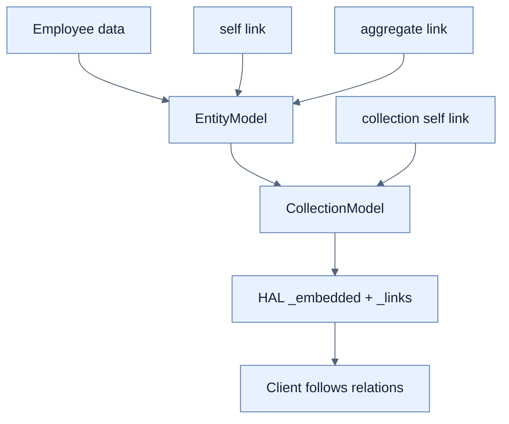

# Reactive Hypermedia API 만들기

## 한눈에 보기

Hypermedia는 resource data와 현재 가능한 navigation/action link를 함께 제공한다. WebFlux에서는 MVC용 Boot HATEOAS starter 대신 `spring-hateoas`를 직접 추가하고 HAL support를 켜며 `Mono<EntityModel<T>>`, `CollectionModel`로 표현한다.

## 1. 왜 이게 필요한가

Client가 URL과 가능한 action을 hardcode하면 server route·business state 변화에 취약하다. Server가 `self`, collection, `takePTO` 같은 link를 현재 state에 맞춰 포함·제거하면 client는 주어진 affordance를 따라간다.

## 2. 어떻게 동작하는가

`linkTo(methodOn(...))`은 controller mapping에서 URI를 만들어 refactoring과 link를 연결한다. Single resource는 `EntityModel<Employee>`에 self와 aggregate-root link를 넣는다. `Mono.zip`으로 여러 asynchronous Link를 결합한다. Collection endpoint는 각 item model Flux를 `collectList`한 뒤 collection self link와 `CollectionModel`로 감싼다. HAL JSON은 `_embedded`와 `_links`로 관계를 표현한다.

Reactive app에 MVC-aligned `spring-boot-starter-hateoas`를 넣으면 servlet stack이 끌려올 수 있으므로 direct dependency를 사용한다는 책의 경고가 중요하다. Hypermedia는 link 장식이 아니라 runtime workflow contract여야 추가 복잡도의 가치가 있다.

## 3. 그림으로 보기

## 4. 이 노트에 나온 용어

- **HATEOAS**: representation link가 application state transition을 안내하는 REST constraint.
- **HAL**: `_links`와 `_embedded` convention을 쓰는 hypermedia format.
- **EntityModel/CollectionModel**: 단일 resource와 collection data에 link를 붙이는 Spring HATEOAS model.
- **link relation**: link가 가리키는 의미를 나타내는 이름.

## 7. 연결

- [[03-serving-data-with-reactive-get]] — plain JSON Flux를 richer representation으로 확장한다.
- [[05-rendering-reactive-templates]] — browser HTML navigation과 API link navigation을 비교한다.
- [[chapter-2-creating-web-and-api-applications-with-spring-boot/08-versioning-apis-with-spring-boot-4|API versioning]] — client coupling을 줄이는 또 다른 계약 전략이다.

## 8. 스스로 확인

- 전체 1차 정리 후: reactive app에서 Boot HATEOAS starter 대신 direct library를 쓰는 이유와 self link의 context를 설명한다.

<!-- ==== 아래는 내 영역 · 스킬 수정 금지 ==== -->

## 내 설명 시도

## 막혔던 지점

## 리뷰 이력

