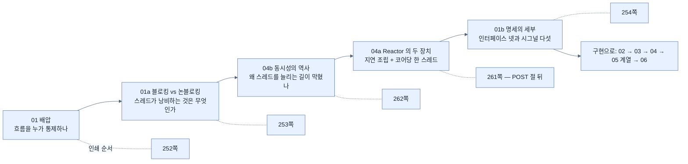
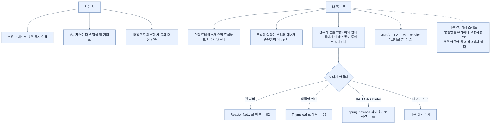

# Chapter 9 개념 지도 — Writing Reactive Web Controllers

> *Learning Spring Boot 4*, Ch. 9 (책 pp. 251–278 / PDF pp. 276–303). 노트 12개를 세 축으로 엮는다. 축 1은 **"낭비를 없애는 원리"**, 축 2는 **"같은 컨트롤러, 바뀌는 반환 타입"**, 축 3은 **"무엇을 감수해야 하는가"**다.

## 축 1 — 읽는 순서는 인쇄 순서와 다르다

이 장의 원리 부분은 **네 노트에 흩어져 있고, 인쇄 순서가 이해 순서와 어긋난다.** `04a`·`04b`는 POST 절 뒤에 인쇄됐지만 내용은 §1의 연장이다. 원리를 먼저 잡으려면 이렇게 읽는다.

원리를 한 줄로 압축하면 이렇다 — **웹 애플리케이션의 스레드는 대부분의 시간을 기다리며 보낸다. 그 기다림을 없애면 같은 자원으로 훨씬 많은 요청을 감당한다.** 배압은 그 과정에서 시스템이 터지지 않게 하는 장치다.

## 축 2 — 같은 애노테이션, 바뀌는 반환 타입

이 장에서 반복해서 확인되는 사실이 있다. **`@RestController`·`@GetMapping`·`@PostMapping`은 MVC와 똑같다.** 리액티브인지 아닌지는 **타입**이 결정한다.

| 하는 일 | 명령형 | 리액티브 | 노트 |
|---|---|---|---|
| 목록 내주기 | `List<Employee>` | `Flux<Employee>` | [[03-serving-data-with-reactive-get]] |
| 하나 받기 | `@RequestBody Employee` | `@RequestBody Mono<Employee>` | [[04-consuming-data-with-reactive-post]] |
| 템플릿 렌더링 | `String` + `Model` | `Mono<Rendering>` | [[05a-creating-a-reactive-web-controller]] |
| 폼 받기 | `@ModelAttribute Employee` | `@ModelAttribute Mono<Employee>` | [[05b-crafting-a-thymeleaf-template]] |
| 하이퍼미디어 | `EntityModel<T>` | `Mono<EntityModel<T>>` | [[06-building-reactive-hypermedia-apis]] |

여기서 두 가지가 따라 나온다.

- **좋은 소식**: 프로그래밍 모델을 새로 배우지 않는다. [[02-creating-a-webflux-application]]에서 의존성 하나만 바꾸면 시작할 수 있다.
- **나쁜 소식**: 코드만 봐서는 리액티브인지 구분이 안 된다. `@RequestBody Employee`를 WebFlux에 써도 **컴파일되고 돌아간다** — 이점만 조용히 줄어든다.

그리고 컨테이너 안에 머무는 원칙이 전 구간을 관통한다. **`Flux` → `Mono<List>` → `Mono<Rendering>`처럼 타입은 바뀌어도 컨테이너 밖으로 나오지 않는다.** `.block()`을 부르는 순간 이 장 전체가 무의미해진다.

## 축 3 — 얻는 것과 내주는 것

세 번째 축이 알려 주는 것은, **리액티브가 부분 적용이 안 되는 기술**이라는 점이다. 웹 서버·템플릿 엔진·HATEOAS starter·데이터 접근 — 이 장이 그 각각에서 "블로킹한 것을 골라내는" 작업을 반복한다.

## 축 4 — 이 장에서 헷갈리는 쌍들

| 쌍 | 구분 |
|---|---|
| `Flux` ↔ `Mono` | 0개 이상 ↔ 0개 또는 1개. 둘 다 `Publisher`다 |
| `map` ↔ `flatMap` | map할 함수의 반환 타입이 **또 리액티브면 `flatMap`** — [[04-consuming-data-with-reactive-post]] |
| `concatWith` ↔ `mergeWith` | 순서 보장(직렬 구독) ↔ 도착 순서(병렬 구독) — [[03-serving-data-with-reactive-get]] |
| 어셈블리 ↔ 구독 | 조립은 command object를 쌓을 뿐, **구독해야 실행된다** — [[01b-reactive-streams-details]] |
| `${...}` ↔ `*{...}` | 모델 절대 경로 ↔ `th:object` 기준 상대 경로 — [[05b-crafting-a-thymeleaf-template]] |
| `spring-boot-starter-hateoas` ↔ `spring-hateoas` | MVC 스택을 끌어옴 ↔ 라이브러리만 — [[06-building-reactive-hypermedia-apis]] |
| 애노테이션 라우팅 ↔ `RouterFunction` | **성능 차이 없음.** 스타일·명시성·조합의 차이 — [[04-consuming-data-with-reactive-post]] |

## 노트 목록

| # | 노트 | 한 줄 |
|---|---|---|
| 01 | [[01-reactive-programming-and-backpressure]] | 소비자가 속도를 정하는 모델 |
| 01a | [[01a-blocking-vs-non-blocking]] | 스레드가 낭비하는 것은 시간이 아니라 자리 |
| 01b | [[01b-reactive-streams-details]] | 인터페이스 넷과 시그널 다섯 |
| 02 | [[02-creating-a-webflux-application]] | 의존성 하나로 런타임이 Netty로 바뀐다 |
| 03 | [[03-serving-data-with-reactive-get]] | `Flux` 반환과 프레임워크의 자동 구독 |
| 04 | [[04-consuming-data-with-reactive-post]] | 들어오는 데이터도 컨테이너 안에 |
| 04a | [[04a-scaling-with-project-reactor]] | 지연 조립과 코어당 한 스레드 |
| 04b | [[04b-java-concurrency-history]] | 거대 pool이 실패한 이유와 25% 계산 |
| 05 | [[05-rendering-reactive-templates]] | 템플릿 엔진 선택이 성능 결정이 되는 이유 |
| 05a | [[05a-creating-a-reactive-web-controller]] | `Mono<Rendering>`으로 뷰까지 감싸기 |
| 05b | [[05b-crafting-a-thymeleaf-template]] | 폼 바인딩과 POST-redirect-GET |
| 06 | [[06-building-reactive-hypermedia-apis]] | 서버가 가능한 동작을 링크로 안내 |

## 다른 Chapter와의 연결

- **Ch. 10 리액티브 데이터** — 이 장이 진단한 "JDBC·JPA는 블로킹"의 처방이 다음 장이다. [[04b-java-concurrency-history]]가 남긴 문제를 `chapter-10-working-with-data-reactively/01-what-reactive-data-access-requires`가 이어받고, [[03-serving-data-with-reactive-get]]·[[04-consuming-data-with-reactive-post]]·[[05b-crafting-a-thymeleaf-template]]의 `DATABASE` Map이 실제 저장소로 교체된다.
- **Ch. 11 가상 스레드** — [[05b-crafting-a-thymeleaf-template]]의 마지막 Note가 언급하고 지나가는 "다른 길"이 `chapter-11-virtual-threads-in-java-and-spring-boot/01-understanding-virtual-threads`다. 같은 목표(고동시성)에 명령형을 유지하는 접근이며, **두 선택지의 결정 기준은 이 책 어디에서도 정면으로 비교되지 않는다.**
- **Ch. 2 웹·API** — `@RestController`·`@GetMapping`·`@PostMapping`이 그대로 재사용된다는 사실이 이 장의 전제다. `part-2-creating-an-application-with-spring-boot/chapter-2-creating-web-and-api-applications-with-spring-boot/05-creating-json-based-apis`와 같은 폴더의 `04-leveraging-templates-to-create-content`가 명령형 짝이다.
- **Ch. 8 네이티브** — 같은 "효율을 짜낸다"는 동기의 다른 층이다. `part-3-releasing-an-application-with-spring-boot/chapter-8-going-native-with-spring-boot/01-why-graalvm-native-image`가 **시작 시간**을, 이 장이 **동시 처리량**을 다룬다. 장 도입부의 "클라우드 청구서" 문제의식이 같다.
- **Ch. 13 관측** — 리액티브 전환의 효과는 측정해야 확인된다. `part-5-observing-spring-boot-4-applications/chapter-13-observing-spring-boot-4-applications/04-metrics-with-micrometer-prometheus-and-grafana`의 metric으로 스레드 수와 처리량을 봐야 [[04b-java-concurrency-history]]가 말하는 손실을 실제로 잡아낼 수 있다.
