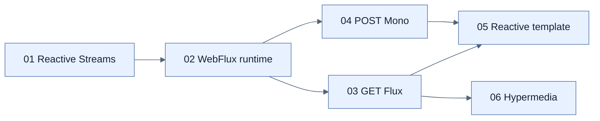

# Chapter 9 지도 — Reactive Web Controllers

## 동시성 모델 축

| 모델 | 기다림 처리 | Programming style |
|---|---|---|
| MVC platform threads | thread가 block | imperative |
| MVC virtual threads | 값싼 virtual thread가 block | imperative |
| WebFlux | event loop가 I/O signal로 재개 | Publisher pipeline |

## 완전한 chain 원칙

Web server만 reactive여서는 부족하다. Controller → client → database가 모두 non-blocking이고 backpressure를 전달해야 event-loop 확장성이 유지된다.

