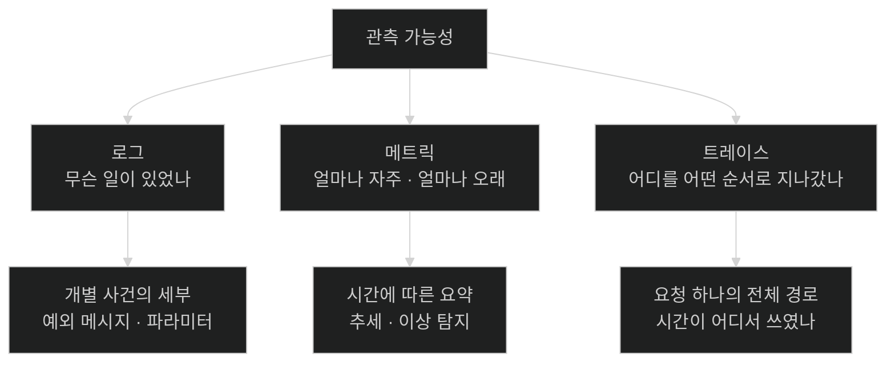

# 지켜보기에서 이해하기로 — 로그·메트릭·트레이스

## 한눈에 보기

| 질문 | 핵심 답 |
|---|---|
| 모니터링의 한계 | **무엇을 볼지 미리 알아야** 한다. 예상 못 한 문제에는 답이 없다 |
| 관측 가능성의 정의 | **외부 출력만 보고 내부 상태를 이해할 수 있는 능력** |
| 재료 | 텔레메트리 데이터 |
| 세 기둥 | 로그(무슨 일이 있었나) · 메트릭(얼마나 자주·오래) · 트레이스(어디를 지나갔나) |
| 셋의 관계 | 대체가 아니라 **상호 보완**. 하나만으로는 답이 안 나온다 |
| 네 번째 후보 | 지속적 프로파일링 — 이 책에서는 선택적 확장 |
| 얻는 것 | "떠 있는가"가 아니라 **"왜 느린가, 어디서 실패하나, 무엇이 바뀌었나"**를 물을 수 있게 된다 |

## 1. 왜 이게 필요한가

### 출발 장면: 증상이 원인에서 멀리 떨어져 나타난다

Chapter 12까지 만든 Employee 애플리케이션이 운영에 올라갔다. 어느 날 `POST /employees`의 응답이 느려졌다는 신고가 들어온다.

이 요청 하나가 지나가는 경로를 떠올려 보자.

```text
HTTP 요청 → 컨트롤러 → 서비스 → 데이터베이스 저장
                              → Kafka 이벤트 발행
                                  → (비동기) 컨슈머 → 알림 발송 → (실패 시) DLT
```

느려진 원인이 어디일까. 후보가 최소 다섯이다.

| 후보 | 겉으로 보이는 증상 |
|---|---|
| 느린 DB 쿼리 | HTTP 응답 지연 |
| 다운스트림 서비스 다운 | HTTP 응답 지연 |
| Kafka 컨슈머 정체 | **아무 증상 없음** (요청은 이미 끝났다) |
| 다른 컴포넌트의 설정 문제 | 엉뚱한 곳에서 오류 |
| 재시도 폭주 | CPU 상승 |

책의 표현이 정확하다 — **"눈에 보이는 증상은 종종 진짜 원인에서 멀리 떨어진 곳에 나타난다."**

### 모니터링으로는 왜 부족한가

**[[모니터링]]**(= 미리 정해 둔 신호를 지속적으로 지켜보는 일)은 이런 대시보드를 준다.

```text
CPU 42%   메모리 3.1GB   가동시간 14일   요청/초 120
```

유용하다. 하지만 위의 다섯 후보 중 어느 것도 이 화면으로는 구분되지 않는다. 이유는 구조적이다.

**모니터링은 "무엇을 볼지 미리 알고 있다"를 전제한다.** CPU 그래프를 그리려면 CPU를 재기로 미리 정했어야 한다. 그런데 책의 지적대로 **문제는 예측 가능하지 않다.** 어떤 서비스의 지연 급증이 느린 쿼리 때문인지, 실패한 다운스트림 호출 때문인지, 다른 곳의 큐 적체 때문인지는 미리 알 수 없다.

### 관측 가능성은 다른 질문을 허용한다

**[[관측-가능성]]**(= 외부 출력만 보고 내부 상태를 이해할 수 있는 능력)이 바꾸는 것은 데이터 양이 아니라 **질문할 수 있는 범위**다.

| | 모니터링 | 관측 가능성 |
|---|---|---|
| 질문 시점 | 미리 정한다 | **실행 중에 떠오른 것을 묻는다** |
| 답할 수 있는 것 | 예상한 실패 | 예상 못 한 실패 |
| 대표 질문 | "떠 있는가?" | "왜 느린가? 어디서 실패하나? 무엇이 바뀌었나?" |
| 필요한 재료 | 고정된 지표 몇 개 | **[[텔레메트리]]**(= 시스템이 자기 상태에 대해 내보내는 데이터 전체) |

책의 요약이 이 절의 핵심이다 — **"추측에서 이해로(from guessing to understanding)."**

## 2. 어떻게 동작하는가

### 2.1 세 기둥

**[[시그널]]**(= 텔레메트리의 한 종류) 세 가지가 각각 다른 질문에 답한다.



**[[로그]]**(= 사건의 기록)는 "무언가가 일어났다"를 말한다. 요청이 시작됐다, 예외가 던져졌다, DB 연산이 실패했다. **특정 시점의 구체적 세부를 보존**하는 것이 강점이다. 예외의 스택 트레이스나 실패한 이메일 주소 같은 것은 로그에만 있다.

**[[메트릭]]**(= 시간에 따라 수집되는 수치 측정값)은 "얼마나"를 말한다. 요청 수, 오류율, 응답 시간, CPU·메모리. **개별 사건이 아니라 집계된 추세**를 본다.

**[[트레이스]]**(= 요청 하나가 시스템을 지나간 경로)는 "어디를"을 말한다. 들어온 HTTP 요청이 다른 서비스를 부르고, 그것이 DB를 조회하고, 외부 API를 호출했다는 흐름을 **인과 순서로** 잇는다. 느렸다면 어느 구간에서 시간이 쓰였는지 보여 준다.

### 2.2 왜 셋이 다 필요한가 — 50밀리초 요청

책이 드는 예가 이 관계를 정확히 보여 준다. **50밀리초 만에 끝난 요청 하나**를 각 신호가 어떻게 다루는지 보자.

| 신호 | 이 요청에 대해 말해 주는 것 | 말해 주지 못하는 것 |
|---|---|---|
| 로그 | 요청이 시작됐고 끝났다 | 50ms가 **정상인지** |
| 메트릭 | 응답 시간 50ms, 다른 요청들과 비교해 정상인지 이상인지 | 그 50ms가 **어디서** 쓰였는지 |
| 트레이스 | 컨트롤러 5ms · 서비스 8ms · DB 30ms · 외부 호출 7ms | 왜 DB가 30ms였는지의 **세부** |

각 신호가 다음 신호의 질문을 만든다.

1. **메트릭**이 "p99가 어제보다 3배"라고 알린다 → *어느 요청이?*
2. **트레이스**가 "그 요청의 78%가 알림 처리에서 쓰였다"고 답한다 → *알림 처리에서 무슨 일이?*
3. **로그**가 "재시도 3회 후 타임아웃"이라고 답한다.

**혼자서는 어느 것도 조사를 끝내지 못한다.** 그래서 책은 셋을 **하나의 상관된 텔레메트리 스트림에서 파생시켜 통합적으로 분석해야 한다**고 못 박는다. 그 "하나에서 파생"이 [[02-designing-an-observability-architecture]]의 주제이고, "오갈 수 있게 만드는 것"이 [[06-correlating-logs-metrics-and-traces]]의 주제다.

### 2.3 네 번째 축

책은 Note로 범위를 밝힌다. 현대의 관측 가능성에는 **[[지속적-프로파일링]]**(= 실행 중 성능 데이터를 계속 수집·분석해 코드 수준 병목을 찾는 방법)이 포함될 수 있다.

세 기둥과 무엇이 다른가.

| | 세 기둥 | 프로파일링 |
|---|---|---|
| 해상도 | 요청·연산 단위 | **코드 라인·메서드 단위** |
| 답하는 것 | 어느 구간이 느린가 | **그 구간의 어느 코드가** 시간을 쓰는가 |
| 필요한 것 | 라이브러리·설정 | 전용 백엔드 + **프로파일러 에이전트** |

트레이스가 "알림 처리 span이 2.18초"까지 좁혀 주면, 프로파일링은 그 안에서 어떤 메서드가 CPU를 태웠는지 말해 준다. 다루지 않는 이유는 순전히 **비용** — 별도 백엔드와 에이전트가 필요해 이 책은 선택적 확장으로 남긴다. Grafana Pyroscope와 OpenTelemetry profiling 스펙을 참고 링크로 준다.

## 3. 그림으로 보기


| 축 | 로그 | 메트릭 | 트레이스 |
|---|---|---|---|
| 단위 | 사건 하나 | 시간 구간의 집계 | 요청 하나의 경로 |
| 답하는 질문 | 무슨 일이 있었나 | 얼마나 자주·오래 | 어디를 지나갔나 |
| 데이터 양 | **많다** | 적다 | 중간(샘플링으로 조절) |
| 잘 하는 것 | 세부 보존 | 추세·이상 탐지 | 구간별 시간 배분 |
| 이 장의 백엔드 | Loki | Prometheus | Tempo |
| 담당 노트 | [[03-structured-logging-with-loki-and-grafana]] | [[04-metrics-with-micrometer-prometheus-and-grafana]] | [[05-tracing-with-opentelemetry-and-tempo]] |

## 4. 이 노트에 나온 용어

| 용어 | 한 줄 뜻 | 정의 위치 |
|---|---|---|
| 모니터링 | 미리 정한 신호를 지켜보는 일 | [[_glossary#모니터링]] |
| 관측 가능성 | 외부 출력으로 내부 상태를 이해하는 능력 | [[_glossary#관측-가능성]] |
| 텔레메트리 | 시스템이 내보내는 상태 데이터 전체 | [[_glossary#텔레메트리]] |
| 시그널 | 텔레메트리의 한 종류 | [[_glossary#시그널]] |
| 로그 | 사건의 기록 | [[_glossary#로그]] |
| 메트릭 | 시간에 따른 수치 측정값 | [[_glossary#메트릭]] |
| 트레이스 | 요청 하나가 지나간 경로 | [[_glossary#트레이스]] |
| 지속적 프로파일링 | 코드 수준 병목을 찾는 상시 성능 분석 | [[_glossary#지속적-프로파일링]] |

## 5. 자주 헷갈리는 것

**"모니터링과 관측 가능성은 같은 말이다"** — 모니터링은 **미리 정한 질문**에 답하고, 관측 가능성은 **나중에 떠오른 질문**에 답할 수 있는 성질이다. 모니터링은 관측 가능성 위에서 하는 활동에 가깝다.

**"로그를 많이 남기면 관측 가능성이 생긴다"** — 양이 아니라 **상관 가능성**이 관건이다. 로그가 아무리 많아도 traceId가 없으면 요청 하나의 흐름을 재구성할 수 없다.

**"트레이스가 있으면 로그는 필요 없다"** — 트레이스는 "어느 구간이 느렸나"까지다. **왜** 느렸는지의 세부는 로그에만 있다.

**"메트릭이 정상이면 문제가 없다"** — 평균은 개별 실패를 숨긴다. 그리고 이 장의 예제처럼 **비동기 구간의 실패는 HTTP 응답 시간에 전혀 나타나지 않는다.**

## 6. 언제 안 쓰나 / 경계

- **세 신호 모두 비용이 있다.** 로그는 저장 비용, 메트릭은 [[_glossary#고-카디널리티|카디널리티]] 폭발, 트레이스는 데이터 양이 문제가 된다. 그래서 [[05b-enabling-trace-export-and-kafka-propagation]]에서 샘플링을 다룬다.
- **관측 가능성이 설계를 대신하지 않는다.** 관측은 무슨 일이 일어났는지 보여 줄 뿐이고, 그 일이 일어나지 않게 하는 것은 별개다.
- **비유의 한계.** 세 기둥은 흔히 "의료 검사"에 비유된다 — 로그는 진료 기록, 메트릭은 체온·혈압 같은 활력징후, 트레이스는 조영술로 본 혈류다. 다만 이 비유는 **셋이 같은 순간에서 파생된다**는 점을 담지 못한다. 병원에서는 검사를 따로 받지만, 여기서는 하나의 관측이 세 신호를 동시에 만들어 낸다. 그래서 서로를 가리키는 링크가 자동으로 성립하고, [[06-correlating-logs-metrics-and-traces]]가 가능해진다.

## 7. 연결

- [[02-designing-an-observability-architecture]] — 세 신호를 **하나의 진실 원천에서 파생**시키는 구조를 다룬다. 이 노트가 "왜 통합해야 하는가"를 말했다면 그쪽은 "어떻게"를 말한다.
- [[03-structured-logging-with-loki-and-grafana]] — 첫 번째 기둥인 로그를 실제로 구현한다.
- [[06-correlating-logs-metrics-and-traces]] — 이 노트가 든 "메트릭 → 트레이스 → 로그" 조사 흐름을 클릭 몇 번으로 만들 수 있게 한다.

## 8. 스스로 확인

1. 모니터링이 답하지 못하는 질문의 예를 이 장의 애플리케이션에서 하나 들 수 있는가?
2. 관측 가능성의 정의에서 "외부 출력"이 뜻하는 것은 무엇인가?
3. 50밀리초 요청 하나에 대해 세 신호가 각각 무엇을 말하고 무엇을 말하지 못하는가?
4. 조사가 "메트릭 → 트레이스 → 로그" 순서로 흐르는 이유를 각 단계가 만드는 질문으로 설명할 수 있는가?
5. 비동기 구간의 실패가 HTTP 응답 시간 메트릭에 나타나지 않는 이유는?
6. 프로파일링이 트레이스보다 더 좁혀 주는 것은 무엇이며, 이 책이 다루지 않는 이유는?
7. 의료 검사 비유가 깨지는 지점은 어디인가?


> 일곱 문항을 스스로 답한 **뒤에** [[_01-three-pillars-of-observability]]에서 모범답안과 대조한다. 먼저 열면 이 문항들은 다시 인출 문제로 쓸 수 없다.

<!-- ==== 아래는 내 영역 · 스킬 수정 금지 ==== -->

## 내 설명 시도


## 막혔던 지점


## 리뷰 이력
