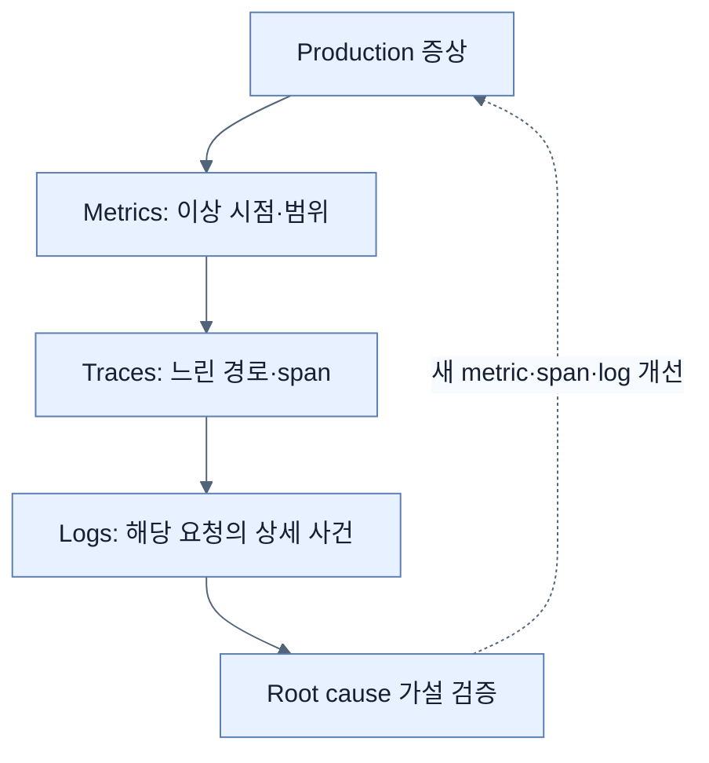

# 관측성의 세 축

## 한눈에 보기

Observability는 외부로 드러난 telemetry를 통해 running system의 내부 상태를 이해하는 능력이다. Logs는 특정 사건의 세부 정보, metrics는 시간에 따른 수치적 경향, traces는 한 요청의 end-to-end 인과 경로를 보여준다. 세 signal은 경쟁하지 않고 서로의 빈칸을 채운다.

## 1. 왜 이게 필요한가

CPU·memory·uptime 같은 미리 정한 지표를 보는 monitoring만으로는 예상하지 못한 장애 원인을 충분히 설명하지 못한다. 한 서비스의 latency spike가 느린 query, downstream 장애, Kafka backlog 중 무엇 때문인지 production에서 내부를 직접 들여다볼 수는 없다. 다양한 output을 연관 지어 질문할 수 있어야 한다.

## 2. 어떻게 동작하는가

| Signal | 답하는 질문 | 강점 | 한계 |
|---|---|---|---|
| Logs | 정확히 무슨 일이 있었나? | 한 시점의 문맥·오류 세부 | volume이 크고 전체 경향 파악이 약함 |
| Metrics | 얼마나 자주·얼마나 오래인가? | 집계·추세·alert에 효율적 | 개별 요청의 원인은 생략됨 |
| Traces | 요청이 어디를 거쳐 시간을 썼나? | service 간 인과·latency 분해 | sampling과 instrumentation 필요 |

예를 들어 50ms request에서 log는 시작·완료 사건을, metric은 50ms가 평소보다 느린지를, trace는 controller·DB·외부 API 중 어디에 시간이 쓰였는지를 말한다. Continuous profiling은 CPU·memory의 code-level 비용을 지속 수집하는 확장 signal이지만 책의 구현 범위는 세 축이다.

## 3. 그림으로 보기

## 4. 이 노트에 나온 용어

- **observability**: system output을 분석해 내부 상태와 원인을 추론할 수 있는 성질.
- **logs**: 특정 시점에 일어난 event를 문맥과 함께 기록한 signal.
- **metrics**: 시간에 따라 집계되는 수치형 measurement.
- **traces**: 한 operation이 여러 component를 지나는 path와 timing의 집합.
- **telemetry**: 관측을 위해 application과 infrastructure가 내보내는 log·metric·trace 데이터.

## 7. 연결

- [[02-designing-an-observability-architecture]] — 세 signal이 한 pipeline을 통과하는 구조다.
- [[03-structured-logging-with-loki-and-grafana]] — 구체적인 log 구현이다.
- [[06-correlating-logs-metrics-and-traces]] — 세 signal을 실제 진단 workflow로 연결한다.

## 8. 스스로 확인

- 전체 1차 정리 후: 50ms 요청 사례로 logs·metrics·traces가 각각 알려주는 것을 구분한다.

<!-- ==== 아래는 내 영역 · 스킬 수정 금지 ==== -->

## 내 설명 시도

## 막혔던 지점

## 리뷰 이력

