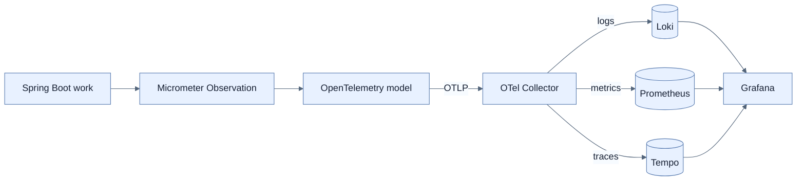

# Spring Boot 4 관측성 아키텍처 설계

## 한눈에 보기

Spring Boot 애플리케이션의 unit of work를 Micrometer `Observation`으로 계측하고, OpenTelemetry가 vendor-neutral telemetry로 표준화해 OTLP로 Collector에 보낸다. Collector는 batch·enrich·route한 뒤 Loki, Prometheus, Tempo로 분배하고 Grafana가 한 UI에서 시각화한다.

## 1. 왜 이게 필요한가

애플리케이션이 각 backend의 protocol과 SDK에 직접 묶이면 저장소를 바꾸거나 signal pipeline을 확장할 때 business service까지 수정해야 한다. 공통 instrumentation model과 중간 Collector를 두면 application은 telemetry 생성에, 운영 pipeline은 routing·processing에 집중한다.

## 2. 어떻게 동작하는가

1. HTTP, DB, external call, message 처리에서 work가 시작된다.
2. Micrometer가 이를 observation으로 표현하고 metric, trace, log correlation context를 만든다.
3. OpenTelemetry가 resource·semantic convention을 적용한다.
4. OTLP exporter가 telemetry를 Collector로 전송한다.
5. Collector receiver → processor → exporter pipeline이 batch·attribute 보강·분배를 수행한다.
6. Loki(log), Prometheus(metric), Tempo(trace)가 저장하고 Grafana가 조회한다.

Collector 없이 app이 backend로 직접 보내는 단순 구성도 가능하다. Production에서는 중앙에서 sampling·filtering·batching·routing하고 backend 교체를 격리하는 Collector가 유리하다. Collector가 새 single point of failure가 되지 않도록 buffer, retry, horizontal scale, health monitoring도 함께 설계한다.

## 3. 그림으로 보기

## 4. 이 노트에 나온 용어

- **Micrometer Observation**: 한 unit of work에서 metric·trace·correlation context를 파생시키는 공통 abstraction.
- **OpenTelemetry**: telemetry 생성·전파·export를 위한 vendor-neutral 표준과 도구 집합.
- **OTLP**: OpenTelemetry signal을 전송하는 표준 protocol.
- **OpenTelemetry Collector**: telemetry를 수신·가공·batching·routing하는 독립 service.

## 7. 연결

- [[01-three-pillars-of-observability]] — 이 pipeline이 운반하는 세 signal이다.
- [[03-structured-logging-with-loki-and-grafana]] — logs pipeline의 구체 설정이다.
- [[05-tracing-with-opentelemetry-and-tempo]] — Kafka 경계를 포함한 traces pipeline이다.

## 8. 스스로 확인

- 전체 1차 정리 후: application에서 Grafana까지 telemetry가 거치는 단계를 순서대로 설명한다.

<!-- ==== 아래는 내 영역 · 스킬 수정 금지 ==== -->

## 내 설명 시도

## 막혔던 지점

## 리뷰 이력

