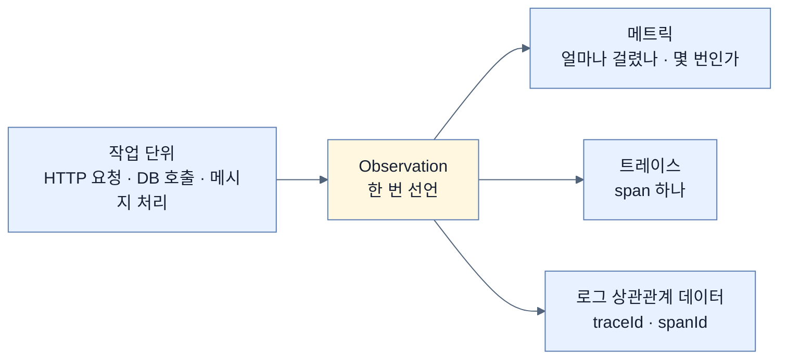
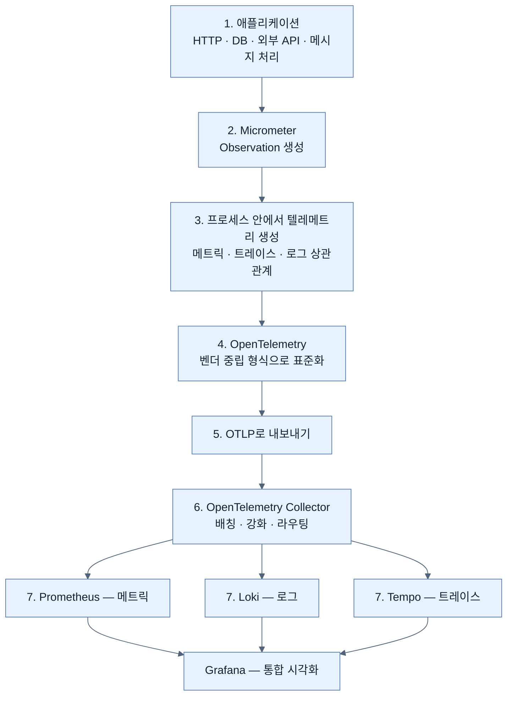
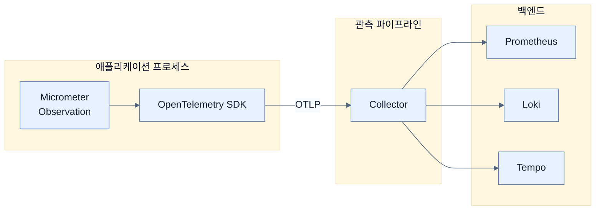

# 하나의 관측에서 세 신호가 갈라진다 — 파이프라인 설계

## 한눈에 보기

| 질문 | 핵심 답 |
|---|---|
| 단일 진실 원천 | **Micrometer의 Observation API** |
| 한 번의 관측에서 나오는 것 | 메트릭 · 트레이스 · 로그 상관관계 데이터 **세 가지 모두** |
| 표준화 | OpenTelemetry가 벤더 중립 형식으로 변환 |
| 전송 | OTLP (gRPC 4317 / HTTP 4318) |
| 중간 처리 | OpenTelemetry Collector — 배칭·필터링·강화·라우팅 |
| 저장·시각화 | Prometheus(메트릭) · Loki(로그) · Tempo(트레이스) · Grafana(통합 뷰) |
| 애플리케이션이 얻는 것 | **비즈니스 로직에만 집중** + 백엔드로부터 독립 |
| Collector는 | 선택이지만 **강력히 권장** |

## 1. 왜 이게 필요한가

### 출발 장면: 세 신호를 따로 만들면 이어 붙일 수 없다

[[01-three-pillars-of-observability]]에서 조사가 "메트릭 → 트레이스 → 로그"로 흐른다는 것을 봤다. 그 흐름이 성립하려면 조건이 하나 있다. **세 신호가 같은 요청에서 나왔음을 알 수 있어야 한다.**

각 신호를 따로 만드는 구조를 상상해 보자.

```java
// 로그: 로깅 라이브러리가 만든다
log.info("employee created");
// 메트릭: 메트릭 라이브러리가 만든다
meterRegistry.counter("employee.created").increment();
// 트레이스: 트레이싱 라이브러리가 만든다
tracer.spanBuilder("create").startSpan();
```

문제가 셋이다.

| 문제 | 결과 |
|---|---|
| 세 라이브러리가 서로를 모른다 | 로그에 traceId가 안 들어간다 → 상관관계 불가 |
| 같은 일을 세 번 선언한다 | 하나를 빠뜨리면 그 신호만 조용히 사라진다 |
| 각각 다른 백엔드 SDK에 묶인다 | 저장소를 바꾸면 애플리케이션 코드를 고쳐야 한다 |

Spring Boot 4의 답은 **선언을 하나로 합치는 것**이다.

## 2. 어떻게 동작하는가

### 2.1 Observation이라는 단일 추상

**[[Micrometer]]**(= 특정 모니터링 시스템에 묶이지 않고 계측할 수 있게 해 주는 Spring 생태계의 파사드)의 **[[Observation-API]]**(= "작업 단위 하나"를 나타내는 추상)가 이 구조의 뿌리다.

핵심 아이디어를 한 줄로 쓰면 이렇다. **작업 단위 하나를 한 번 선언하면, 거기서 세 신호가 파생된다.**



이것이 앞의 세 문제를 어떻게 푸는지 보자.

| 문제 | 해결 |
|---|---|
| 신호들이 서로를 모른다 | **같은 관측에서 나오므로** traceId가 자동으로 로그에 실린다 |
| 세 번 선언한다 | 한 번만 선언한다. 빠뜨릴 여지가 없다 |
| 백엔드 SDK에 묶인다 | 관측은 추상이고, 실제 형식 변환은 아래 계층이 맡는다 |

[[05b-enabling-trace-export-and-kafka-propagation]]에서 `Observation.createNotStarted("employee.create", ...)`를 쓰는 것이 이 API를 직접 부르는 모습이다.

### 2.2 표준화와 전송

관측이 만든 신호는 아직 Micrometer의 것이다. 이것을 **[[OpenTelemetry]]**(= 텔레메트리의 데이터 모델·의미 규약·API를 정의하는 벤더 중립 표준)가 표준 형식으로 바꾼다.

왜 이 단계가 필요한가. **[[벤더-중립]]**(= 특정 제품에 종속되지 않는 성질)을 얻기 위해서다. 애플리케이션이 Prometheus의 형식으로 직접 내보내면 나중에 다른 시계열 DB로 바꿀 때 애플리케이션을 고쳐야 한다. 표준 형식으로 내보내면 **바꿀 곳이 파이프라인 설정뿐**이다.

표준화된 데이터는 **[[OTLP]]**(= OpenTelemetry가 정의한 전송 프로토콜)로 나간다. gRPC(4317)와 HTTP(4318) 두 방식이 있고, 이 장의 예제는 HTTP를 쓴다.

### 2.3 Collector라는 중간 계층

**[[OpenTelemetry-Collector]]**(= 애플리케이션과 백엔드 사이에서 텔레메트리를 받고 가공해 내보내는 독립 프로세스)가 다음 정거장이다.

책은 Note로 이것이 **선택 사항**임을 분명히 한다. 간단한 구성에서는 애플리케이션이 백엔드로 직접 보내도 된다. 그런데도 **강력히 권장**하는 이유가 네 가지다.

| Collector가 하는 일 | 없으면 |
|---|---|
| **배칭** | 애플리케이션이 매 신호마다 네트워크 왕복을 한다 |
| **필터링** | 불필요한 데이터까지 저장 비용을 낸다 |
| **강화** | 서비스 이름·환경 같은 공통 메타데이터를 애플리케이션마다 설정해야 한다 |
| **라우팅** | 백엔드가 바뀌면 **모든 애플리케이션의 설정**을 고쳐야 한다 |

마지막 줄이 결정적이다. Collector가 있으면 애플리케이션은 "Collector로 보낸다"만 알면 되고, 그 뒤가 Loki든 Elasticsearch든 상관하지 않는다. **결합을 한 지점으로 모은 것**이다.

책의 표현대로 신호와 백엔드가 여러 개일 때 이 유연성이 특히 커진다.

### 2.4 백엔드 네 개

| 컴포넌트 | 맡는 신호 | 하는 일 |
|---|---|---|
| **[[Prometheus]]**(= 메트릭을 시계열로 저장·질의하는 시스템) | 메트릭 | 시계열 저장, PromQL 질의 |
| **[[Loki]]**(= 라벨만 색인하는 로그 저장 시스템) | 로그 | 로그 저장·색인, LogQL 질의 |
| **[[Tempo]]**(= 분산 트레이스 저장·질의 백엔드) | 트레이스 | 트레이스 저장, ID 조회 |
| **[[Grafana]]**(= 여러 데이터 소스를 한 화면에서 탐색하는 도구) | — | **셋을 하나의 인터페이스로 묶는다** |

Grafana가 별도로 있는 이유가 중요하다. 저장소 셋은 각자 자기 신호만 안다. **셋을 오갈 수 있게 만드는 층이 따로 필요하고**, 그것이 [[06-correlating-logs-metrics-and-traces]]의 주제다.

### 2.5 전체 흐름 7단계

책의 Figure 13.2를 개념 관계도로 다시 그렸다.



1–3단계는 **애플리케이션 프로세스 안**, 4–5단계는 **나가는 경계**, 6–7단계는 **밖의 파이프라인**이다.

이 경계가 책이 강조하는 결론을 만든다 — **애플리케이션은 비즈니스 로직에 집중하고, 계측 계층과 파이프라인이 텔레메트리 생성·표준화·내보내기를 맡는다.** 그리고 그 결과로 **애플리케이션이 관측 백엔드로부터 독립적**이 된다.

## 3. 그림으로 보기



| 계층 | 바뀌면 고쳐야 하는 곳 |
|---|---|
| 비즈니스 로직 | 애플리케이션 코드 |
| 계측 방식 | Observation 선언부 (소수) |
| 전송 대상 | **애플리케이션 설정 한 줄** (Collector 주소) |
| 저장 백엔드 | **Collector 설정만** — 애플리케이션은 그대로 |
| 시각화 | Grafana 설정만 |

## 4. 이 노트에 나온 용어

| 용어 | 한 줄 뜻 | 정의 위치 |
|---|---|---|
| Micrometer | 벤더 중립 계측 파사드 | [[_glossary#Micrometer]] |
| Observation API | 작업 단위 하나를 나타내는 추상 | [[_glossary#Observation-API]] |
| OpenTelemetry | 텔레메트리 표준 | [[_glossary#OpenTelemetry]] |
| OTLP | OpenTelemetry의 전송 프로토콜 | [[_glossary#OTLP]] |
| OpenTelemetry Collector | 텔레메트리를 받아 가공·라우팅하는 중간 프로세스 | [[_glossary#OpenTelemetry-Collector]] |
| 벤더 중립 | 특정 제품에 종속되지 않는 성질 | [[_glossary#벤더-중립]] |
| Prometheus | 메트릭 시계열 저장·질의 시스템 | [[_glossary#Prometheus]] |
| Loki | 라벨만 색인하는 로그 저장 시스템 | [[_glossary#Loki]] |
| Tempo | 분산 트레이스 백엔드 | [[_glossary#Tempo]] |
| Grafana | 통합 탐색·시각화 도구 | [[_glossary#Grafana]] |
| 텔레메트리 | 시스템이 내보내는 상태 데이터 | [[_glossary#텔레메트리]] |
| 시그널 | 텔레메트리의 한 종류 | [[_glossary#시그널]] |

## 5. 자주 헷갈리는 것

**"Micrometer는 메트릭 전용이다"** — 이름은 그렇지만 Observation API를 통해 **트레이스와 로그 상관관계까지** 파생시킨다. 그것이 Spring Boot 4 관측 모델의 핵심이다.

**"OpenTelemetry가 Micrometer를 대체한다"** — 층이 다르다. Micrometer는 **애플리케이션이 선언하는 층**, OpenTelemetry는 **표준 형식과 전송 층**이다. 둘이 겹쳐 동작한다.

**"Collector가 없으면 관측이 안 된다"** — 된다. 애플리케이션이 백엔드로 직접 보낼 수 있다. Collector는 운영에서의 유연성을 위한 선택이다.

**"Grafana가 데이터를 저장한다"** — 저장하지 않는다. Loki·Prometheus·Tempo에 **질의를 던지고 결과를 그린다.**

## 6. 언제 안 쓰나 / 경계

- **Collector는 운영 부담을 만든다.** 프로세스 하나가 더 늘고, 그것이 죽으면 텔레메트리가 통째로 끊긴다. 단일 서비스 규모에서는 직접 전송이 단순하다.
- **표준화에는 손실이 있을 수 있다.** 벤더 고유 기능(특정 백엔드만의 집계 방식 등)은 벤더 중립 형식으로 표현되지 않는다.
- **비유의 한계.** 이 구조는 "취재 → 통신사 → 각 신문사"에 비유할 수 있다. 기자(Observation)가 한 번 취재하면 통신사(Collector)가 표준 형식으로 배포하고 각 신문(백엔드)이 자기 지면에 싣는다. 다만 이 비유는 **한 취재에서 성격이 다른 세 기사가 나온다**는 점을 담지 못한다. 여기서는 관측 하나가 숫자(메트릭)·경로(트레이스)·사건(로그)이라는 서로 다른 종류의 산출물로 동시에 갈라지고, 그 셋이 같은 ID를 공유하기 때문에 나중에 다시 이어 붙일 수 있다.

## 7. 연결

- [[01-three-pillars-of-observability]] — 그 노트가 "셋을 통합적으로 분석해야 한다"고 말한 이유를 이 노트가 구조로 실현한다.
- [[03-structured-logging-with-loki-and-grafana]] — 이 파이프라인을 로그 신호 하나에 대해 처음부터 끝까지 구축한다.
- [[06-correlating-logs-metrics-and-traces]] — 여기서 나뉜 세 백엔드를 Grafana 설정으로 다시 이어 붙인다.

## 8. 스스로 확인

1. 세 신호를 각각 다른 라이브러리로 만들 때 생기는 문제 세 가지는?
2. "하나의 관측에서 세 신호가 파생된다"가 상관관계 문제를 어떻게 푸는가?
3. 표준화 단계(OpenTelemetry)가 없으면 무엇이 어려워지는가?
4. Collector가 선택 사항인데도 권장되는 네 가지 이유는?
5. 백엔드를 Loki에서 다른 것으로 바꿀 때 고쳐야 하는 곳은 어디인가?
6. Grafana가 별도 컴포넌트로 있어야 하는 이유는?
7. 통신사 비유가 깨지는 지점은 어디인가?

<!-- ==== 아래는 내 영역 · 스킬 수정 금지 ==== -->

## 내 설명 시도


## 막혔던 지점


## 리뷰 이력
