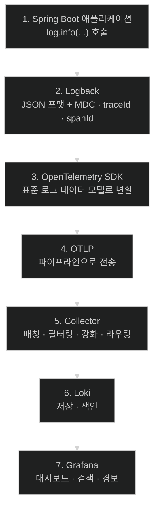
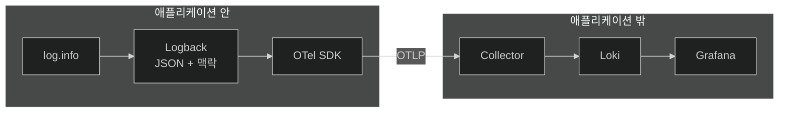

# 로그가 파이프라인을 지나는 일곱 정거장

## 한눈에 보기

| 정거장 | 하는 일 |
|---|---|
| 1. Spring Boot 애플리케이션 | 비즈니스 로직을 실행하며 로그 이벤트를 만든다 |
| 2. Logback | **JSON으로 포맷**하고 MDC·traceId·spanId로 맥락을 붙인다 |
| 3. OpenTelemetry (Logs) | 표준 로그 데이터 모델로 변환 |
| 4. OTLP (Logs) | 파이프라인으로 내보낸다 |
| 5. OpenTelemetry Collector | 배칭·필터링·강화 후 라우팅 |
| 6. Loki | 저장·색인, 질의에 맞게 최적화 |
| 7. Grafana | 대시보드·검색·경보로 시각화 |

| 질문 | 핵심 답 |
|---|---|
| 왜 JSON인가 | 기계가 파싱해야 색인·검색·집계가 된다 |
| 왜 traceId·spanId를 로그에 넣나 | 나중에 트레이스와 이어 붙이기 위해 |
| 이 절의 위치 | [[02-designing-an-observability-architecture]]의 일반 흐름을 **로그 하나에** 적용한 것 |

## 1. 왜 이게 필요한가

### 출발 장면: 로그가 세 대의 서버에 흩어져 있다

Employee 애플리케이션이 인스턴스 세 대로 돌고 있다. 사용자가 "직원 등록이 실패했다"고 신고한다.

로그가 각 인스턴스의 파일에 있다면 조사는 이렇게 흘러간다.

1. 어느 인스턴스가 그 요청을 받았는지 모른다 → **세 대에 다 접속한다**
2. 각각 `grep`으로 시간대를 찾는다
3. 로그 형식이 문장이라 `grep`이 부정확하다 (`"failed"`가 다른 맥락에도 등장한다)
4. Kafka 컨슈머는 또 다른 인스턴스라 **거기도 봐야 한다**
5. 찾아낸 줄들이 정말 같은 요청인지 확신할 수 없다

로그를 남기고 있는데도 답이 안 나온다. 문제는 양이 아니라 **형태와 위치**다.

| 문제 | 필요한 것 |
|---|---|
| 흩어져 있다 | **중앙 수집** |
| 사람이 읽는 문장이다 | **구조화** — 필드로 나뉜 형태 |
| 같은 요청인지 모른다 | **상관관계 키** — traceId |

이 절은 셋을 한꺼번에 해결하는 파이프라인을 세운다.

## 2. 어떻게 동작하는가

### 2.1 일곱 정거장

책의 Figure 13.3을 개념 관계도로 다시 그렸다.



정거장마다 "이 단계가 없으면 무엇이 깨지는가"를 붙여 보면 구조가 필연으로 읽힌다.

| 정거장 | 없으면 |
|---|---|
| 1 | 로그가 없다 |
| 2 **[[Logback]]**(= Spring Boot의 기본 로깅 구현체) | 형식이 자유 문장이라 파싱이 불가능하다 |
| 3 **[[OpenTelemetry]]** | 백엔드마다 다른 형식으로 내보내야 한다 |
| 4 **[[OTLP]]** | 전송 방식을 직접 만들어야 한다 |
| 5 **[[OpenTelemetry-Collector]]** | 애플리케이션이 백엔드 주소를 직접 안다 |
| 6 **[[Loki]]**(= 라벨만 색인하는 로그 저장 시스템) | 흩어진 채로 남는다 |
| 7 **[[Grafana]]** | 저장돼 있지만 사람이 볼 수 없다 |

### 2.2 2번 정거장이 하는 두 가지 일

Logback이 이 파이프라인에서 특히 중요하다. 두 가지를 동시에 한다.

**첫째, 형식을 바꾼다.** 기본 로그는 이렇게 생겼다.

```text
2026-04-20 01:25:08.172  INFO 12345 --- [nio-8080-exec-1] c.l.NotificationService : Received employee-created event for employee 2
```

사람은 읽기 쉽지만 기계는 이 줄에서 "어느 서비스", "어느 레벨", "어느 클래스"를 안정적으로 뽑아낼 수 없다. 정규식으로 하면 형식이 조금만 바뀌어도 깨진다.

**[[구조화-로깅]]**(= 로그를 기계가 파싱할 수 있는 필드 집합으로 쓰는 방식)은 같은 내용을 이렇게 만든다.

```json
{"body":"Received employee-created event for employee 2","severity":"INFO","resources":{"service.version":"1.0.0"},"instrumentation_scope":{"name":"com.springbootlearning4.NotificationService"}}
```

이제 `severity`로 필터하고 `instrumentation_scope.name`으로 그룹핑할 수 있다. **필드가 처음부터 나뉘어 있으므로 파싱이 필요 없다.**

**둘째, 맥락을 붙인다.** 로그 문장 자체에는 없는 정보를 얹는다.

| 붙이는 것 | 무엇을 가능하게 하나 |
|---|---|
| **[[MDC]]**(= 현재 실행 컨텍스트에 붙는 key-value 저장소) | 요청 단위 정보를 메서드마다 넘기지 않고도 모든 로그에 싣는다 |
| **[[traceId]]**(= 요청 하나 전체를 식별하는 값) | 흩어진 로그를 **한 요청으로 다시 묶는다** |
| **[[spanId]]**(= 트레이스 안의 작업 단위 식별자) | 그 요청 안의 어느 단계인지 구분한다 |

traceId가 이 장 전체의 접착제다. 앞의 조사 시나리오에서 "찾아낸 줄들이 같은 요청인지 확신할 수 없다"던 문제가 이 값 하나로 사라진다. [[06-correlating-logs-metrics-and-traces]]가 그 위에서 동작한다.

다만 순서가 있다. **트레이싱을 켜야 traceId가 생긴다.** 그래서 [[03b-instrumenting-the-application-for-logging]]에서는 `management.tracing.enabled: false`로 두고 로그에만 집중하며, traceId는 [[05b-enabling-trace-export-and-kafka-propagation]] 이후에 채워진다.

### 2.3 6번 정거장의 성질

Loki가 다른 로그 저장소와 다른 점이 하나 있다. **로그 본문 전체가 아니라 라벨만 색인한다.**

| | 전문 색인 방식 | Loki |
|---|---|---|
| 색인 대상 | 로그 본문의 모든 단어 | **라벨만** |
| 저장 비용 | 높다 | 낮다 |
| 라벨 질의 | 빠르다 | 빠르다 |
| 본문 검색 | 빠르다 | **스트림을 좁힌 뒤 스캔** |

그래서 Loki에서는 **먼저 라벨로 범위를 좁히고 그 안에서 본문을 훑는** 방식으로 질의한다. `{service_name="employee-service"} |= "employee"`라는 [[03c-verifying-logs-in-grafana]]의 질의가 정확히 그 모양이다.

이 성질 때문에 **어떤 속성을 라벨로 올릴지가 설계 결정**이 된다. [[03a-setting-up-the-logging-infrastructure]]에서 Collector 설정에 `loki.resource.labels`가 등장하는 이유다.

## 3. 그림으로 보기



| 앞에서 든 문제 | 어느 정거장이 푸는가 |
|---|---|
| 세 대에 흩어져 있다 | 5–6 (Collector → Loki) |
| 사람이 읽는 문장이다 | 2 (Logback의 JSON 포맷) |
| 같은 요청인지 모른다 | 2 (traceId·spanId) + [[06-correlating-logs-metrics-and-traces]] |
| 백엔드에 묶인다 | 3–4 (OpenTelemetry + OTLP) |

## 4. 이 노트에 나온 용어

| 용어 | 한 줄 뜻 | 정의 위치 |
|---|---|---|
| 로그 | 사건의 기록 | [[_glossary#로그]] |
| Logback | Spring Boot의 기본 로깅 구현체 | [[_glossary#Logback]] |
| 구조화 로깅 | 기계가 파싱 가능한 필드 집합으로 쓰는 방식 | [[_glossary#구조화-로깅]] |
| MDC | 실행 컨텍스트에 붙는 key-value 저장소 | [[_glossary#MDC]] |
| traceId | 요청 하나 전체를 식별하는 값 | [[_glossary#traceId]] |
| spanId | 트레이스 안의 작업 단위 식별자 | [[_glossary#spanId]] |
| OpenTelemetry | 텔레메트리 표준 | [[_glossary#OpenTelemetry]] |
| OTLP | OpenTelemetry의 전송 프로토콜 | [[_glossary#OTLP]] |
| OpenTelemetry Collector | 텔레메트리를 가공·라우팅하는 중간 프로세스 | [[_glossary#OpenTelemetry-Collector]] |
| Loki | 라벨만 색인하는 로그 저장 시스템 | [[_glossary#Loki]] |
| Grafana | 통합 탐색·시각화 도구 | [[_glossary#Grafana]] |

## 5. 자주 헷갈리는 것

**"구조화 로깅은 로그를 예쁘게 찍는 것이다"** — 사람이 읽기에는 오히려 나쁘다. 목적은 **기계가 파싱할 수 있게** 만드는 것이고, 사람은 Grafana가 다시 정리해 준 화면으로 본다.

**"traceId는 Logback이 만든다"** — 만들지 않는다. **트레이싱이 켜져 있어야** 생기고, Logback은 그것을 MDC에서 꺼내 로그에 실을 뿐이다.

**"Loki는 Elasticsearch 같은 것이다"** — 색인 전략이 다르다. Loki는 라벨만 색인해 비용을 낮추는 대신, 본문 검색은 스트림을 좁힌 뒤에 한다.

**"Collector 없이는 Loki로 못 보낸다"** — 보낼 수 있다. Collector는 유연성을 위한 선택이다([[02-designing-an-observability-architecture]]).

## 6. 언제 안 쓰나 / 경계

- **로그만으로는 이 장의 목표에 못 미친다.** 이 절이 끝나도 "얼마나 자주"와 "어디를 지나갔나"는 답이 없다. 그래서 [[04-metrics-with-micrometer-prometheus-and-grafana]]와 [[05-tracing-with-opentelemetry-and-tempo]]가 이어진다.
- **라벨을 남발하면 Loki가 무너진다.** 라벨 조합마다 스트림이 하나씩 생기므로, 고유 값이 많은 속성(요청 ID 같은)을 라벨로 올리면 저장소가 감당하지 못한다.
- **비유의 한계.** 이 파이프라인은 "우편물 처리 과정"에 비유할 수 있다 — 편지를 쓰고(1), 규격 봉투에 넣어 주소를 적고(2), 우체국 표준 형식으로 분류하고(3–4), 집배 센터가 모아 분류하고(5), 지역 우체국에 쌓이고(6), 수취인이 찾아본다(7). 다만 이 비유는 **같은 편지가 세 종류의 우편함에 동시에 들어간다**는 이 장의 구조를 담지 못한다. 실제로는 하나의 관측에서 로그·메트릭·트레이스가 함께 나가 서로 다른 백엔드에 쌓이고, 나중에 같은 번호로 다시 모인다.

## 7. 연결

- [[02-designing-an-observability-architecture]] — 이 노트는 그 일반 흐름을 **로그 신호 하나에** 구체화한 것이다.
- [[03a-setting-up-the-logging-infrastructure]] — 5·6·7번 정거장(Collector·Loki·Grafana)을 Docker Compose로 실제로 띄운다.
- [[06-correlating-logs-metrics-and-traces]] — 2번 정거장이 심어 둔 traceId가 그 노트에서 클릭 가능한 링크가 된다.

## 8. 스스로 확인

1. 인스턴스 세 대에 흩어진 파일 로그로 조사할 때 막히는 지점을 다섯 단계로 재현할 수 있는가?
2. "형태와 위치"라는 두 문제를 각각 어느 정거장이 푸는가?
3. 구조화 로깅이 정규식 파싱보다 나은 이유는?
4. traceId를 로그에 싣는 것이 왜 이 장 전체의 접착제인가?
5. 이 절에서 트레이싱을 꺼 두는 이유와, 그 결과 지금 로그에 없는 것은?
6. Loki가 라벨만 색인하는 선택의 이득과 대가는?
7. 우편물 비유가 깨지는 지점은 어디인가?


> 일곱 문항을 스스로 답한 **뒤에** [[_03-structured-logging-with-loki-and-grafana]]에서 모범답안과 대조한다. 먼저 열면 이 문항들은 다시 인출 문제로 쓸 수 없다.

<!-- ==== 아래는 내 영역 · 스킬 수정 금지 ==== -->

## 내 설명 시도


## 막혔던 지점


## 리뷰 이력
