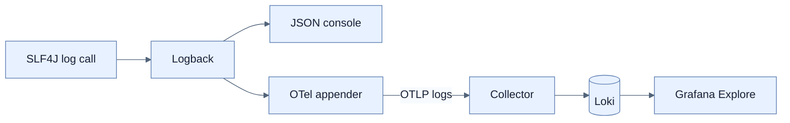
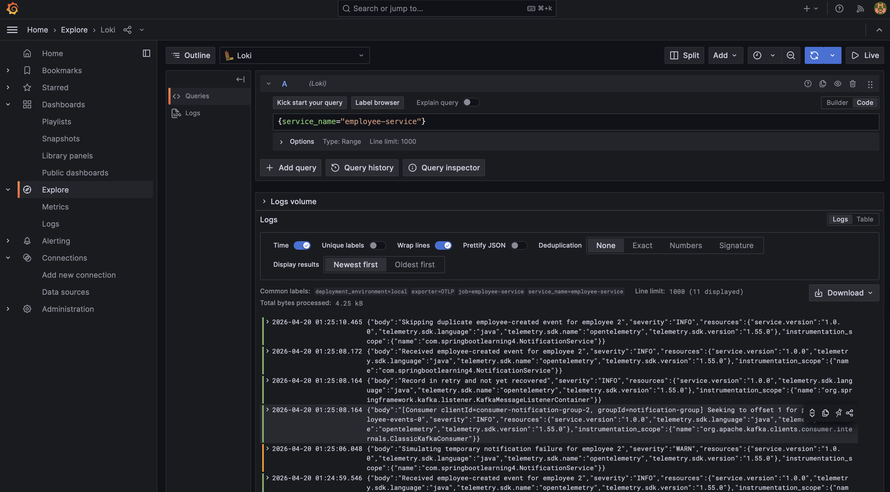

# Logback·Loki·Grafana 구조화 로깅

## 한눈에 보기

SLF4J/Logback log를 JSON으로 구조화하고 `traceId`·`spanId` 같은 MDC 값을 포함해 OpenTelemetry appender로 OTLP export한다. Collector가 resource label을 붙여 Loki에 저장하면 Grafana에서 service·level·본문으로 검색할 수 있다.

## 1. 왜 이게 필요한가

각 instance의 console text만 보면 여러 service와 retry를 가로지르는 한 요청을 모으기 어렵다. Structured fields는 parser가 안정적으로 index·filter하게 하고, 중앙 저장은 instance가 사라진 뒤에도 사건을 조사하게 한다. 단순 문자열 연결보다 placeholder와 key-value context를 쓰는 이유다.

## 2. 어떻게 동작하는가

책의 local stack은 Loki 3.4.1, OpenTelemetry Collector contrib 0.116.1, Grafana 11.4.0을 Docker Compose로 실행한다. Collector는 4317/gRPC·4318/HTTP OTLP를 받고 `service.name`, `deployment.environment`, Loki resource label을 보강한 뒤 batch로 Loki에 보낸다.

Application에는 Actuator, Boot 4 OpenTelemetry starter와 runtime OpenTelemetry Logback appender를 추가한다. Appender가 집필 시 alpha이므로 정확한 version을 pin하라고 책은 강조한다. `logging.structured.format.console: logstash`는 console JSON을, `management.opentelemetry.logging.export.otlp.endpoint`는 log export URL을 정한다. `logback-spring.xml`의 CONSOLE과 OTEL 두 appender로 local 가시성과 중앙 전송을 함께 확보하고 startup `ApplicationRunner`에서 `OpenTelemetryAppender.install(openTelemetry)`로 Boot가 구성한 instance에 연결한다.

`traceId`·`spanId` MDC capture는 tracing이 켜진 뒤 log-to-trace correlation에 사용된다. Password, token, email 같은 민감 데이터는 구조화한다고 안전해지는 것이 아니므로 기록 전 masking·허용 목록이 필요하다.

## 3. 그림으로 보기

책의 Figure 13.4는 `{service_name="employee-service"}`로 중앙 로그를 조회한 결과다.

## 4. 이 노트에 나온 용어

- **structured logging**: message와 context를 JSON 같은 machine-readable field로 기록하는 방식.
- **Logback**: Spring Boot 기본 logging implementation으로 흔히 쓰이는 Java logging backend.
- **MDC**: 현재 execution context에 key-value 값을 연결해 log에 자동 포함시키는 mapped diagnostic context.
- **Loki**: label 기반 index와 원본 log 저장·query를 제공하는 Grafana log backend.
- **OpenTelemetryAppender**: Logback event를 OpenTelemetry log record로 내보내는 appender.

## 7. 연결

- [[02-designing-an-observability-architecture]] — Collector를 포함한 전체 telemetry 경로다.
- [[05-tracing-with-opentelemetry-and-tempo]] — MDC에 들어갈 trace·span context를 만든다.
- [[06-correlating-logs-metrics-and-traces]] — log의 trace ID로 Tempo를 여는 연결이다.

## 8. 스스로 확인

- 전체 1차 정리 후: `log.info`가 Loki에서 query 가능해질 때까지 구성 요소와 metadata 변화를 설명한다.

<!-- ==== 아래는 내 영역 · 스킬 수정 금지 ==== -->

## 내 설명 시도

## 막혔던 지점

## 리뷰 이력

