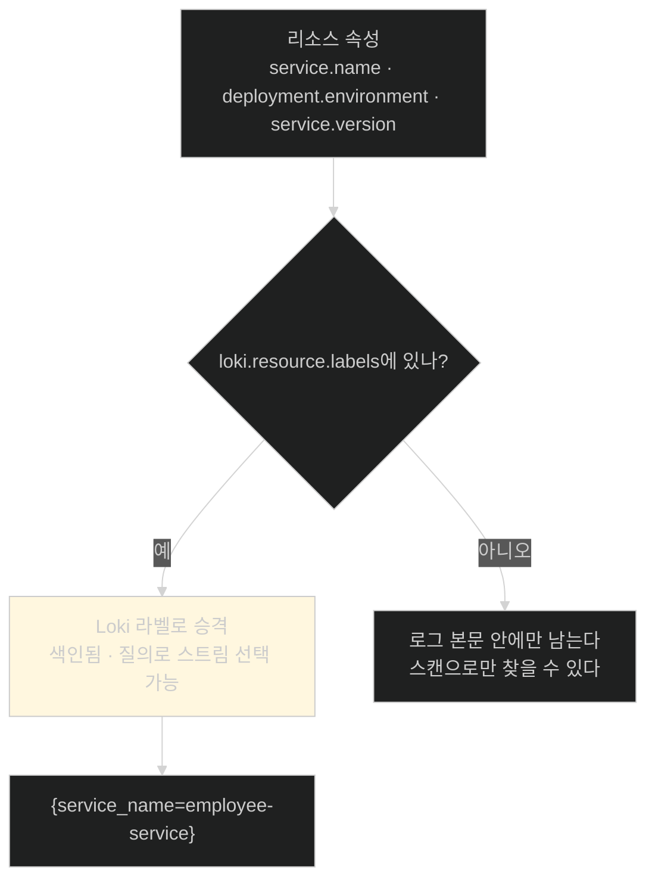
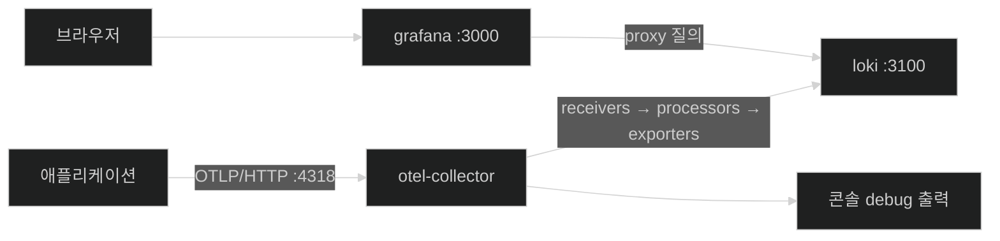

# 컨테이너 세 개와 설정 파일 두 개 — 로그 백엔드 세우기

## 한눈에 보기

| 파일 | 무엇을 정하나 |
|---|---|
| `docker-compose.yml` | loki(3100) · otel-collector(4317/4318) · grafana(3000) 세 컨테이너 |
| `otel-collector-config.yml` | 무엇을 **받고**(receivers) 어떻게 **가공하고**(processors) 어디로 **보내는가**(exporters) |
| `grafana-datasources.yml` | Grafana가 기동할 때 Loki를 **자동 등록**하도록 |

| 질문 | 핵심 답 |
|---|---|
| 4317 vs 4318 | gRPC vs HTTP. 같은 OTLP의 두 전송 방식 |
| `depends_on`이 하는 일 | 기동 **순서**를 정한다 (준비 완료를 보장하지는 않는다) |
| `loki.resource.labels` | 어떤 속성을 Loki의 **색인 라벨로 승격**할지 지정 |
| `batch` 프로세서 | 모아서 한 번에 보내 오버헤드를 줄인다 |
| `debug` 익스포터 | 콘솔에 찍어 **파이프라인이 도는지 확인**한다 |
| 데이터소스 프로비저닝 | 스택을 띄울 때마다 UI에서 손으로 연결하지 않아도 된다 |
| 이 절의 소스 | 저장소의 `ch13` 폴더 |

## 1. 왜 이게 필요한가

### 출발 장면: 로그를 어디로 보낼 것인가

[[03-structured-logging-with-loki-and-grafana]]에서 일곱 정거장을 봤다. 그중 5·6·7번(Collector·Loki·Grafana)은 **애플리케이션 밖의 프로세스**다. 애플리케이션이 로그를 내보내기 전에 받아 줄 쪽이 먼저 있어야 한다.

세 프로세스를 각각 설치하고 설정하고 순서대로 띄우는 일은 손으로 하면 번거롭다. **[[Docker-Compose]]**(= 여러 컨테이너를 한 파일에 선언해 함께 띄우는 도구)가 그 일을 파일 하나로 만든다.

## 2. 어떻게 동작하는가

### 2.1 세 서비스

```yaml
services:
   loki:
    image: grafana/loki:3.4.1
    container_name: ch13-loki
    command: ["-config.file=/etc/loki/local-config.yaml"]
    ports:
         - "3100:3100"

   otel-collector:
    image: otel/opentelemetry-collector-contrib:0.116.1
    container_name: ch13-otel-collector
    command: ["--config=/etc/otelcol/config.yml"]
    volumes:
         - ./otel-collector-config.yml:/etc/otelcol/config.yml:ro
    ports:
         - "4317:4317"
         - "4318:4318"
    depends_on:
         - loki
   grafana:
    image: grafana/grafana:11.4.0
    container_name: ch13-grafana
    ports:
         - "3000:3000"
    environment:
         GF_SECURITY_ADMIN_USER: admin
         GF_SECURITY_ADMIN_PASSWORD: admin
    volumes:
         - ./grafana-datasources.yml:/etc/grafana/provisioning/
           /datasources/datasources.yml:ro
    depends_on:
```

| 서비스 | 포트 | 역할 | 왜 이 포트인가 |
|---|---|---|---|
| **[[Loki]]** | 3100 | 로그 저장·색인 | Loki의 기본 HTTP 포트. Collector가 push하고 Grafana가 질의한다 |
| **[[OpenTelemetry-Collector]]** | 4317, 4318 | 텔레메트리 수신·가공·전달 | **[[OTLP]]**의 표준 포트 — 4317은 gRPC, 4318은 HTTP |
| **[[Grafana]]** | 3000 | 시각화 | Grafana의 기본 포트. 브라우저로 접속한다 |

두 포트를 다 여는 이유가 있다. 같은 OTLP라도 **전송 방식이 둘**이고, 클라이언트마다 편한 쪽이 다르다. 이 장의 애플리케이션은 HTTP(4318)를 쓴다.

**[[볼륨-마운트]]**(= 호스트 파일을 컨테이너 안 경로에 연결하는 것)가 두 곳에 있다. `:ro`는 읽기 전용이라는 뜻이다. 이미지를 다시 만들지 않고 설정만 바꿔 재시작할 수 있게 해 준다.

`depends_on`은 **기동 순서**를 정한다. Collector가 Loki보다 먼저 떠서 로그를 전달하려다 실패하는 상황을 줄인다. 다만 이것은 "컨테이너가 시작됐다"까지만 보장하고 "서비스가 요청을 받을 준비가 됐다"를 보장하지는 않는다.

> **원문 오류.** grafana의 볼륨 경로가 `/etc/grafana/provisioning//datasources/datasources.yml`로 **슬래시가 중복**돼 있고, 마지막 `depends_on:` 아래 항목이 잘려 있다. 본문 설명으로는 Grafana도 Loki에 의존한다.

### 2.2 Collector 설정 — 받고, 가공하고, 보낸다

```yaml
receivers:
 otlp:
   protocols:
      grpc:
                     endpoint: 0.0.0.0:4317
      http:
                     endpoint: 0.0.0.0:4318

processors:
 resource:
   attributes:
      - key: service.name
                     value: employee-service
                     action: upsert
      - key: deployment.environment
                     value: local
                     action: upsert
      - key: loki.resource.labels
                     value: service.name, deployment.environment
                     action: insert
 batch:

exporters:
 loki:
   endpoint: http://loki:3100/loki/api/v1/push
 debug:
   verbosity: basic

service:
 pipelines:
   logs:
      receivers: [otlp]
      processors: [resource, batch]
      exporters: [loki, debug]
```

구조가 네 부분이고, 각각이 하나의 질문에 답한다.

| 부분 | 답하는 질문 | 이 설정에서 |
|---|---|---|
| **[[리시버]]**(= 데이터를 받아들이는 입구) | **어떻게 받나** | OTLP를 gRPC·HTTP 양쪽으로 |
| **[[프로세서]]**(= 내보내기 전에 가공하는 단계) | **무엇을 바꾸나** | 리소스 속성 추가 + 배칭 |
| **[[익스포터]]**(= 내보내는 출구) | **어디로 보내나** | Loki + 콘솔 |
| **[[파이프라인]]**(= 셋을 이어 붙인 처리 경로) | **어떻게 잇나** | logs 파이프라인 하나 |

`0.0.0.0`으로 바인딩하는 이유는 컨테이너 안에서 **모든 네트워크 인터페이스**로 들어오는 요청을 받기 위해서다. `localhost`로 두면 컨테이너 밖에서 도달할 수 없다.

### 2.3 `resource` 프로세서의 세 항목

이 부분이 이 절에서 가장 배울 게 많다. 세 항목이 서로 다른 일을 한다.

| key | action | 하는 일 |
|---|---|---|
| `service.name` | `upsert` | "이 텔레메트리는 employee-service의 것"이라는 메타데이터를 붙인다(있으면 덮고 없으면 추가) |
| `deployment.environment` | `upsert` | 배포 환경 표시 |
| `loki.resource.labels` | `insert` | **앞의 두 속성을 Loki의 색인 라벨로 승격하라**는 지시 |

세 번째가 특별하다. 이것은 데이터에 붙는 값이 아니라 **Loki 익스포터에게 주는 명령**이다.

**[[라벨-승격]]**(= 리소스 속성 일부를 로그 저장소의 색인 대상 라벨로 올리는 것)이 왜 필요한지는 [[03-structured-logging-with-loki-and-grafana]]에서 본 Loki의 성질에서 나온다. Loki는 **라벨만 색인**한다. 라벨이 아닌 속성은 질의로 스트림을 고를 때 쓸 수 없다.



승격을 **두 개만** 한 것도 판단이다. 라벨 조합마다 별개의 스트림이 만들어지므로 라벨이 늘면 저장소 부담이 급격히 커진다. 그래서 **질의에 자주 쓸 것만** 올린다.

이 판단의 결과는 [[03c-verifying-logs-in-grafana]]의 화면에서 직접 확인된다 — Grafana의 `Common labels` 줄에 `deployment_environment=local`과 `service_name=employee-service`가 찍혀 있다. 점(`.`)이 밑줄(`_`)로 바뀐 것도 Loki 라벨 이름 규칙 때문이다.

### 2.4 나머지 둘

**[[배칭]]**(= 여러 건을 모아 한 번에 내보내는 것)을 하는 `batch` 프로세서는 설정값이 하나도 없다. 기본값으로 충분하다는 뜻이고, 하는 일은 명확하다 — 로그 한 줄마다 네트워크 왕복을 하면 오버헤드가 크므로 모아서 보낸다.

`debug` 익스포터는 로그를 **콘솔에 찍는다.** 저장이 목적이 아니라 **파이프라인이 실제로 도는지 확인**하는 용도다. Loki에 아무것도 안 보일 때 "Collector까지는 왔는가"를 여기서 가른다. `verbosity: basic`은 요약만 찍는 수준이다.

익스포터를 둘 다 지정한 것(`exporters: [loki, debug]`)이 이 점을 보여 준다. **같은 데이터가 두 곳으로 동시에 나간다.**

### 2.5 Grafana가 알아서 연결하게 만들기

```yaml
apiVersion: 1
datasources:
    - name: Loki
     type: loki
     access: proxy
     url: http://loki:3100
     isDefault: true
     editable: true
```

**[[데이터소스-프로비저닝]]**(= Grafana가 기동할 때 설정 파일을 읽어 데이터 소스를 자동 등록하는 것)이다.

| 항목 | 뜻 |
|---|---|
| `access: proxy` | 브라우저가 아니라 **Grafana 서버가** Loki에 요청한다 |
| `url: http://loki:3100` | 컨테이너 이름으로 접근한다 — Docker 네트워크 안의 이름 |
| `isDefault: true` | Explore를 열면 자동으로 선택된다 |
| `editable: true` | UI에서 나중에 고칠 수 있다 |

`access: proxy`가 중요한 이유가 있다. 브라우저가 직접 `http://loki:3100`에 접근한다면 그 이름은 **브라우저 쪽에서 해석되지 않는다.** Docker 네트워크 안의 이름이기 때문이다. Grafana 서버가 대신 요청하므로 컨테이너 이름이 통한다.

책이 짚는 실질적 이점은 이것이다 — **스택을 띄울 때마다 손으로 설정할 필요가 없다.** 팀원이 저장소를 받아 `docker compose up` 한 번이면 같은 환경이 선다.

## 3. 그림으로 보기



| 설정 파일 | 바꾸면 영향받는 것 |
|---|---|
| `docker-compose.yml` | 어떤 프로세스가 뜨고 어느 포트가 열리는가 |
| `otel-collector-config.yml` | **텔레메트리가 어떻게 흐르는가** — 이 장에서 가장 자주 고친다 |
| `grafana-datasources.yml` | Grafana가 무엇을 볼 수 있는가 |

뒤의 두 절([[04a-setting-up-prometheus-for-metrics]], [[05a-setting-up-grafana-tempo]])이 **같은 세 파일에 항목을 계속 더해 간다.** 구조가 반복되므로 한 번 이해하면 나머지는 빠르다.

## 4. 이 노트에 나온 용어

| 용어 | 한 줄 뜻 | 정의 위치 |
|---|---|---|
| Docker Compose | 여러 컨테이너를 한 파일로 띄우는 도구 | [[_glossary#Docker-Compose]] |
| 볼륨 마운트 | 호스트 파일을 컨테이너 경로에 연결 | [[_glossary#볼륨-마운트]] |
| Loki | 라벨만 색인하는 로그 저장 시스템 | [[_glossary#Loki]] |
| OpenTelemetry Collector | 텔레메트리를 가공·라우팅하는 중간 프로세스 | [[_glossary#OpenTelemetry-Collector]] |
| Grafana | 통합 탐색·시각화 도구 | [[_glossary#Grafana]] |
| 리시버 | Collector가 데이터를 받는 입구 | [[_glossary#리시버]] |
| 프로세서 | 내보내기 전 가공 단계 | [[_glossary#프로세서]] |
| 익스포터 | 데이터를 내보내는 출구 | [[_glossary#익스포터]] |
| 파이프라인 | 리시버·프로세서·익스포터를 이은 경로 | [[_glossary#파이프라인]] |
| 배칭 | 여러 건을 모아 한 번에 전송 | [[_glossary#배칭]] |
| 라벨 승격 | 속성을 색인 라벨로 올리는 것 | [[_glossary#라벨-승격]] |
| 데이터소스 프로비저닝 | 기동 시 데이터 소스 자동 등록 | [[_glossary#데이터소스-프로비저닝]] |
| OTLP | OpenTelemetry의 전송 프로토콜 | [[_glossary#OTLP]] |

## 5. 자주 헷갈리는 것

**"4317과 4318 중 하나만 열면 된다"** — 클라이언트가 어느 쪽을 쓸지에 달렸다. 둘 다 열어 두면 선택의 여지가 생긴다.

**"`depends_on`이 준비 완료를 보장한다"** — **시작 순서만** 보장한다. Loki가 요청을 받을 준비가 됐는지는 별개이며, 그래서 초기 몇 초간 전송이 실패할 수 있다.

**"리소스 속성을 추가하면 자동으로 라벨이 된다"** — 되지 않는다. `loki.resource.labels`에 명시한 것만 승격된다.

**"라벨은 많을수록 좋다"** — 반대다. 라벨 조합마다 스트림이 생기므로 고유 값이 많은 속성을 올리면 Loki가 무너진다.

**"`debug` 익스포터는 지워도 된다"** — 지워도 동작하지만, **파이프라인이 도는지 확인할 수단**을 잃는다. 로컬 개발에서는 남겨 두는 편이 낫다.

## 6. 언제 안 쓰나 / 경계

- **이 구성은 로컬 개발용이다.** Grafana 자격 증명이 `admin/admin`이고 Loki가 단일 노드 로컬 설정이다.
- **`depends_on`만으로는 부족한 경우가 있다.** 운영에서는 헬스 체크 기반의 기동 조건이 필요하다.
- **Collector 설정 파일이 계속 자라난다.** 이 절에서는 logs 파이프라인 하나지만 [[04a-setting-up-prometheus-for-metrics]]와 [[05a-setting-up-grafana-tempo]]에서 metrics·traces가 더해진다.
- **비유의 한계.** Collector 설정은 "공장의 컨베이어 라인"에 가깝다 — 투입구(리시버), 가공 공정(프로세서), 출하구(익스포터)가 벨트(파이프라인)로 이어진다. 다만 이 비유는 **같은 물건이 여러 출하구로 동시에 나간다**는 점을 담지 못한다. `exporters: [loki, debug]`처럼 하나의 파이프라인이 복수의 목적지로 **복제해서** 보낸다. 공장이라기보다 방송에 가까운 구조다.

## 7. 연결

- [[03-structured-logging-with-loki-and-grafana]] — 그 노트의 5·6·7번 정거장을 이 노트가 실제로 세운다.
- [[03b-instrumenting-the-application-for-logging]] — 여기서 연 4318 포트로 애플리케이션이 로그를 보내도록 설정한다.
- [[04a-setting-up-prometheus-for-metrics]] — 같은 세 파일에 메트릭용 항목을 더한다. 구조가 그대로 반복된다.

## 8. 스스로 확인

1. 4317과 4318이 각각 무엇이며, 왜 둘 다 여는가?
2. Collector 설정의 네 부분이 각각 어떤 질문에 답하는가?
3. `0.0.0.0`으로 바인딩하는 이유는?
4. `loki.resource.labels`가 다른 두 항목과 성격이 어떻게 다른가?
5. 승격할 라벨을 두 개만 고른 것이 왜 판단인가?
6. `access: proxy`가 아니면 무엇이 깨지는가?
7. `debug` 익스포터가 진단에 쓰이는 구체적 상황을 하나 들 수 있는가?
8. 컨베이어 라인 비유가 깨지는 지점은 어디인가?


> 여덟 문항을 스스로 답한 **뒤에** [[_03a-setting-up-the-logging-infrastructure]]에서 모범답안과 대조한다. 먼저 열면 이 문항들은 다시 인출 문제로 쓸 수 없다.

<!-- ==== 아래는 내 영역 · 스킬 수정 금지 ==== -->

## 내 설명 시도


## 막혔던 지점


## 리뷰 이력
