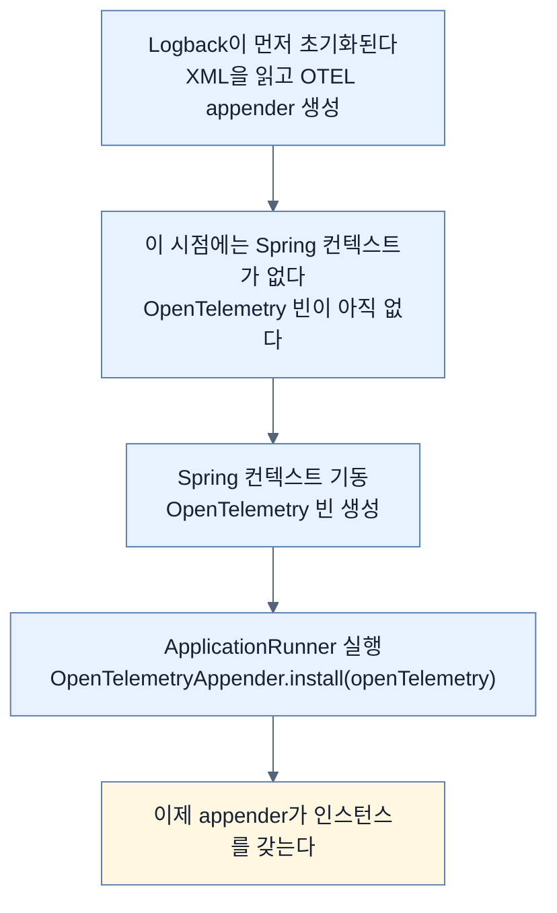
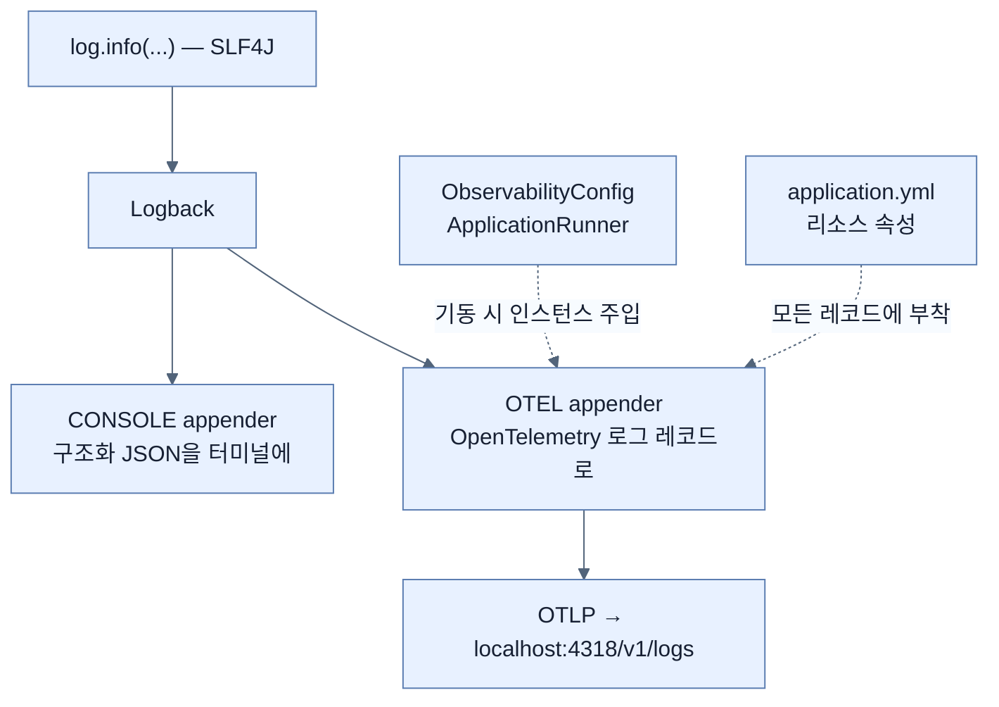

# System.out에서 파이프라인으로 — 애플리케이션 계측하기

## 한눈에 보기

| 무엇을 | 어떻게 |
|---|---|
| 의존성 | actuator · opentelemetry + 각 test 스타터, 그리고 **수동으로** logback appender |
| 왜 수동인가 | OTel Logback appender는 Initializr에 없고 **alpha 배포판**이다 |
| 설정 | `application.yml` — 앱 이름, Actuator 노출, 리소스 속성, OTLP 로그 엔드포인트, 구조화 로깅 |
| 트레이싱은 | `management.tracing.enabled: false` — **일부러 꺼 둔다** |
| Logback | `logback-spring.xml`에 CONSOLE + OTEL 두 appender |
| 마지막 배선 | `OpenTelemetryAppender.install(openTelemetry)`를 `ApplicationRunner`에서 |
| 코드 변경 | `System.out` → SLF4J `log.info/warn/error` |
| 지금 로그에 없는 것 | **traceId·spanId** — 트레이싱을 켜야 채워진다 |

## 1. 왜 이게 필요한가

### 출발 장면: 백엔드는 섰는데 아무것도 안 들어온다

[[03a-setting-up-the-logging-infrastructure]]로 Loki·Collector·Grafana가 떴다. Grafana를 열어 Loki를 조회하면 — **비어 있다.**

당연하다. 애플리케이션이 아직 아무것도 보내지 않았다. 지금 Employee 애플리케이션의 로그는 두 가지 문제를 갖고 있다.

| 문제 | 구체적으로 |
|---|---|
| **어디로도 안 나간다** | 콘솔에만 찍힌다. 프로세스가 죽으면 사라진다 |
| **형태가 문장이다** | `System.out.println("Skipping duplicate event...")` — 필드가 없다 |

책이 Note로 정의하는 **[[계측]]**(= 애플리케이션이 텔레메트리를 생산하도록 코드나 설정을 더하는 일)이 이 절의 일이다. 코드가 하던 일은 그대로 두고, **그 일에 대해 말하게** 만든다.

## 2. 어떻게 동작하는가

### 2.1 의존성 넷 + 하나

Chapter 12의 Employee 애플리케이션을 그대로 재사용하고 좌표만 `ch13`으로 바꾼다. Initializr에서 고르는 것은 둘이다 — **Spring Boot Actuator**와 **OpenTelemetry**.

```xml
<dependency>
     <groupId>org.springframework.boot</groupId>
     <artifactId>spring-boot-starter-actuator</artifactId>
</dependency>
<dependency>
     <groupId>org.springframework.boot</groupId>
     <artifactId>spring-boot-starter-opentelemetry</artifactId>
</dependency>
<dependency>
     <groupId>org.springframework.boot</groupId>
     <artifactId>spring-boot-starter-actuator-test</artifactId>
     <scope>test</scope>
</dependency>
<dependency>
     <groupId>org.springframework.boot</groupId>
     <artifactId>spring-boot-starter-opentelemetry-test</artifactId>
     <scope>test</scope>
</dependency>
```

| 아티팩트 | 하는 일 |
|---|---|
| `spring-boot-starter-actuator` | **[[Actuator]]**(= 운영용 기능을 모아 둔 Spring Boot 모듈). 헬스 체크·메트릭·관측 자동 설정의 토대이고, **트레이싱 지원이 통합되는 자리**이기도 하다 |
| `spring-boot-starter-opentelemetry` | Spring Boot 4의 **[[OpenTelemetry]]** 지원. 책에 따르면 Spring 팀이 밝힌 **공식적인 방법**이며 Initializr에 올라 있다. Micrometer 기반 관측 모델과 OTLP 내보내기를 지원한다 |
| `spring-boot-starter-actuator-test` | Actuator 동작을 테스트에서 검증할 수 있게 한다 |
| `spring-boot-starter-opentelemetry-test` | 텔레메트리 동작을 테스트에서 검증할 수 있게 한다 |

test 스타터가 둘이나 있다는 사실이 [[../../part-2-creating-an-application-with-spring-boot/chapter-5-testing-with-spring-boot/01-junit-6-and-focused-test-starters|Chapter 5]]의 집중형 test starter 전략과 이어진다.

**다섯 번째는 손으로 넣는다.**

```xml
<dependency>
     <groupId>io.opentelemetry.instrumentation</groupId>
     <artifactId>opentelemetry-logback-appender-1.0</artifactId>
     <version>2.26.1-alpha</version>
     <scope>runtime</scope>
</dependency>
```

이유가 둘이다. Initializr에 없고, **[[alpha-릴리스]]**(= API가 아직 바뀔 수 있는 초기 배포판)로 배포된다.

이것이 **[[로그-appender]]**(= Logback이 로그 이벤트를 실제로 내보내는 출구) 역할을 한다. SLF4J와 Logback으로 쓴 로그를 OpenTelemetry 로그 레코드로 바꿔 OTLP로 내보낸다.

책의 경고가 실무적이다 — alpha라 릴리스마다 바뀔 수 있으니 **버전 `2.26.1-alpha`를 정확히 고정하고, 의존성 자동 갱신 도구가 손대지 못하게 설정하라.** 자동 업그레이드가 도는 프로젝트에서 이 한 줄이 조용히 올라가면 로그 파이프라인이 통째로 멈출 수 있다.

### 2.2 `application.yml` — 무엇을 켜고 무엇을 끄는가

```yaml
spring:
 application:
   name: employee-service
management:
 endpoints:
   web:
     exposure:
          include: health,info
 tracing:
   enabled: false
 opentelemetry:
   resource-attributes:
     service.name: ${spring.application.name}
     service.version: 1.0.0
     deployment.environment: local
   logging:
     export:
          otlp:
           endpoint: http://localhost:4318/v1/logs
 otlp:
   metrics:
     export:
          enabled: false
logging:
 level:
   root: info
   com.learningspringboot4: info
 structured:
   format:
        console: logstash
```

| 설정 | 하는 일 | 왜 지금 이 값인가 |
|---|---|---|
| `spring.application.name` | 앱 이름을 정한다 | 이 값이 텔레메트리 메타데이터로 재사용돼 **모든 신호에서 같은 이름**이 된다 |
| `endpoints.web.exposure.include: health,info` | Actuator 엔드포인트 두 개만 연다 | 필요한 것만 노출 |
| **`tracing.enabled: false`** | 트레이싱을 **끈다** | **로그에 집중하려고 일부러** 껐다 |
| `opentelemetry.resource-attributes` | **[[리소스-속성]]**(= 이 텔레메트리를 누가 만들었는지 나타내는 메타데이터) 세 개 | Collector가 라벨로 승격할 재료 |
| `opentelemetry.logging.export.otlp.endpoint` | 로그를 보낼 **[[OTLP]]** 주소 | [[03a-setting-up-the-logging-infrastructure]]에서 연 4318 |
| **`otlp.metrics.export.enabled: false`** | 메트릭 내보내기를 **끈다** | 같은 이유 — 지금은 로그만 |
| `logging.level.*` | 로그 레벨 | — |
| `logging.structured.format.console: logstash` | 콘솔을 **[[구조화-로깅]]**으로 | 아래 참고 |

**두 개를 일부러 껐다**는 점이 이 설정의 교육적 핵심이다. 세 신호를 한꺼번에 켜면 무엇이 어디서 나오는지 구분이 안 된다. 로그만 켜서 파이프라인을 확인하고([[03c-verifying-logs-in-grafana]]), 그다음 메트릭([[04a-setting-up-prometheus-for-metrics]]), 그다음 트레이스([[05b-enabling-trace-export-and-kafka-propagation]]) 순으로 하나씩 켠다.

`service.name`이 `${spring.application.name}`을 참조하는 것도 의도적이다. 이름을 두 군데 적으면 언젠가 어긋나고, 그러면 **로그의 서비스 이름과 메트릭의 서비스 이름이 달라져** 상관관계가 끊긴다.

**[[logstash-포맷]]**(= Spring Boot가 지원하는 구조화 로그 형식 중 하나)은 선택지 중 하나다. `ecs`(Elastic Common Schema)와 `gelf`(Graylog Extended Log Format)도 있고, **수집·분석 플랫폼에 맞춰** 고른다.

### 2.3 Logback — 두 출구

```xml
<?xml version="1.0" encoding="UTF-8"?>
<configuration>
    <include resource="org/springframework/boot
        /logging/logback/defaults.xml"/>
    <include resource="org/springframework/boot
        /logging/logback/structured-console-appender.xml"/>

    <appender name="OTEL" class="io.opentelemetry.instrumentation
        .logback.appender.v1_0.OpenTelemetryAppender">
        <captureMdcAttributes>traceId,spanId</captureMdcAttributes>
        <captureKeyValuePairAttributes>
              true
        </captureKeyValuePairAttributes>
        <captureLoggerContext>
              true
        </captureLoggerContext>
    </appender>

    <root level="INFO">
        <appender-ref ref="CONSOLE"/>
        <appender-ref ref="OTEL"/>
    </root>
</configuration>
```

**[[Logback]]** 설정이 두 출구를 만든다.

| appender | 어디로 | 왜 필요한가 |
|---|---|---|
| `CONSOLE` | 터미널(구조화 JSON) | **로컬 개발에서 눈으로 본다.** 파이프라인이 안 될 때도 여기는 보인다 |
| `OTEL` | OpenTelemetry 파이프라인 | Collector → Loki로 나간다 |

`<root>`에 둘을 함께 등록했으므로 **같은 로그가 두 곳으로 동시에** 나간다. [[03a-setting-up-the-logging-infrastructure]]의 `exporters: [loki, debug]`와 같은 패턴이다.

`<captureMdcAttributes>traceId,spanId</captureMdcAttributes>`가 이 장의 뒷부분을 예약해 둔다. **[[MDC]]**(= 실행 컨텍스트에 붙는 key-value 저장소)에서 **[[traceId]]**와 **[[spanId]]**를 꺼내 로그 레코드에 싣겠다는 선언이다.

책이 정직하게 밝힌다 — **지금은 트레이싱이 꺼져 있어 이 값들이 로그에 나타나지 않을 수 있다.** 트레이싱을 켜면([[05b-enabling-trace-export-and-kafka-propagation]]) 이 설정이 **저절로** 로그와 트레이스를 이어 준다. 미리 적어 두는 것이 나중에 고치지 않아도 되는 방법이다.

### 2.4 마지막 배선 한 조각

`logback-spring.xml`은 appender를 **선언**했지만, 그 appender가 실제로 쓸 OpenTelemetry 인스턴스는 아직 연결되지 않았다.

```java
@Configuration
public class ObservabilityConfig {
             @Bean
             public ApplicationRunner openTelemetryLogbackAppenderInstaller(
                 OpenTelemetry openTelemetry) {
                 return args -> OpenTelemetryAppender.install(openTelemetry);
             }
}
```

왜 이 조각이 필요한지는 **생명주기의 어긋남** 때문이다.



Logback은 Spring보다 **먼저** 뜬다. 로깅은 Spring 자신의 기동 과정에서도 필요하기 때문이다. 그래서 XML만으로는 Spring이 만든 빈을 appender에 넣을 수 없고, 컨텍스트가 준비된 뒤 **[[ApplicationRunner]]**(= 컨텍스트 준비 직후 한 번 실행되는 콜백)로 뒤늦게 꽂아 준다.

### 2.5 코드에서 `System.out` 걷어내기

```java
@RestController
@RequestMapping("/employees")
public class EmployeeController {

     private static final Logger log =
          LoggerFactory.getLogger(EmployeeController.class);

     @PostMapping
     public ResponseEntity<Employee> create(@RequestBody Employee employee) {
          log.info("Received request to create employee with role {}",
              roleForLog(employee));
          Employee saved = service.createEmployee(employee);
          log.info("Returning created employee {}", saved.getId());
          return ResponseEntity.ok(saved);
     }
}
```

| 요소 | 하는 일 |
|---|---|
| `LoggerFactory.getLogger(EmployeeController.class)` | 이 클래스용 **[[SLF4J]]**(= 로깅 구현체를 감추는 자바 표준 파사드) 로거. 클래스 이름이 로그의 출처 필드가 된다 |
| `log.info(...)` | 요청 흐름의 시작과 끝에 사건을 남긴다 |
| `{}` **[[파라미터-플레이스홀더]]** | 문자열 연결 대신. 아래 참고 |

플레이스홀더를 쓰는 이유를 책은 "효율적이고 더 깔끔한 구조화 레코드를 만든다"고 요약한다. 구체적으로는 두 가지다.

1. **레벨이 꺼져 있으면 문자열을 만들지도 않는다.** `log.debug("x " + expensive())`는 DEBUG가 꺼져 있어도 `expensive()`를 부르지만, `log.debug("x {}", expensive())`는... 인자 평가는 일어나지만 **문자열 연결과 포맷팅은 생략된다.**
2. **메시지 템플릿과 값이 분리된 채 기록된다.** 구조화 로깅에서 이 분리가 유지되면 "같은 종류의 로그"를 값과 무관하게 묶을 수 있다.

책은 Note로 `EmployeeService`·`NotificationService`·`NotificationDeadLetterListener`도 같은 방식으로 고쳤다고 밝힌다. 레벨 선택 원칙도 함께 준다 — **정상 사건은 `log.info()`, 경고 상황은 `log.warn()`, 오류는 `log.error()`.**

> **원문 불일치 두 가지.** (1) 이 Note는 모든 `System.out`을 SLF4J로 바꿨다고 하지만, [[04b-adding-custom-business-metrics-with-micrometer]]에 인쇄된 `NotificationService`의 중복 이벤트 분기에는 `System.out.println`이 **그대로 남아 있다.** (2) 설정은 패키지를 `com.learningspringboot4`로 적지만, [[03c-verifying-logs-in-grafana]]의 실제 화면에는 `com.springbootlearning4.NotificationService`로 찍혀 있다. `logging.level.com.learningspringboot4: info` 필터가 실제 패키지와 맞지 않는다.

## 3. 그림으로 보기



| 이 절에서 켠 것 | 끈 것 | 언제 켜나 |
|---|---|---|
| 로그 OTLP 내보내기 | 트레이싱 | [[05b-enabling-trace-export-and-kafka-propagation]] |
| 구조화 콘솔 출력 | 메트릭 내보내기 | [[04a-setting-up-prometheus-for-metrics]] |
| MDC의 traceId·spanId 포착 **설정** | (값 자체는 아직 없음) | 트레이싱을 켜면 자동으로 |

## 4. 이 노트에 나온 용어

| 용어 | 한 줄 뜻 | 정의 위치 |
|---|---|---|
| 계측 | 텔레메트리를 생산하도록 코드·설정을 더하는 일 | [[_glossary#계측]] |
| Actuator | 운영용 기능을 모은 Spring Boot 모듈 | [[_glossary#Actuator]] |
| OpenTelemetry | 텔레메트리 표준 | [[_glossary#OpenTelemetry]] |
| alpha 릴리스 | API가 바뀔 수 있는 초기 배포판 | [[_glossary#alpha-릴리스]] |
| 로그 appender | Logback이 로그를 내보내는 출구 | [[_glossary#로그-appender]] |
| 리소스 속성 | 텔레메트리 생산자를 나타내는 메타데이터 | [[_glossary#리소스-속성]] |
| 구조화 로깅 | 기계가 파싱 가능한 필드 집합 | [[_glossary#구조화-로깅]] |
| logstash 포맷 | Spring Boot의 구조화 로그 형식 중 하나 | [[_glossary#logstash-포맷]] |
| Logback | Spring Boot의 기본 로깅 구현체 | [[_glossary#Logback]] |
| MDC | 실행 컨텍스트의 key-value 저장소 | [[_glossary#MDC]] |
| traceId | 요청 전체를 식별하는 값 | [[_glossary#traceId]] |
| spanId | 작업 단위 하나의 식별자 | [[_glossary#spanId]] |
| ApplicationRunner | 컨텍스트 준비 직후 실행되는 콜백 | [[_glossary#ApplicationRunner]] |
| SLF4J | 로깅 구현체를 감추는 자바 파사드 | [[_glossary#SLF4J]] |
| 파라미터 플레이스홀더 | `{}`로 값을 끼워 넣는 SLF4J 문법 | [[_glossary#파라미터-플레이스홀더]] |
| OTLP | OpenTelemetry의 전송 프로토콜 | [[_glossary#OTLP]] |

## 5. 자주 헷갈리는 것

**"트레이싱을 껐으니 나중에 설정을 다시 고쳐야 한다"** — `logback-spring.xml`의 `captureMdcAttributes`는 **미리 적어 두었다.** 트레이싱을 켜면 값이 자동으로 채워진다.

**"`ObservabilityConfig`는 없어도 된다"** — 없으면 OTEL appender가 인스턴스를 못 받아 **조용히 아무것도 내보내지 않는다.** Logback이 Spring보다 먼저 뜨기 때문에 생기는 필수 배선이다.

**"alpha 의존성이니 최신으로 올리는 게 좋다"** — 반대다. API가 바뀌므로 **고정**하고 자동 갱신을 막아야 한다.

**"`System.out.println`도 어차피 콘솔에 찍히니 같다"** — Logback을 거치지 않으므로 **파이프라인에 아예 실리지 않는다.** 레벨 필터도, 구조화도, traceId도 적용되지 않는다.

**"구조화 로깅을 켜면 터미널이 읽기 어려워진다"** — 실제로 그렇다. 로컬 가독성과 기계 파싱 가능성의 맞바꿈이며, 책은 파이프라인 쪽을 택했다.

## 6. 언제 안 쓰나 / 경계

- **로그 레벨 필터의 패키지 이름이 맞아야 한다.** 이 장의 설정처럼 실제 패키지와 다르면 그 필터는 아무 일도 하지 않는다.
- **alpha appender에 운영을 걸기는 이르다.** 책도 릴리스마다 바뀔 수 있다고 경고한다.
- **콘솔과 OTLP로 이중 출력하면 비용이 두 배다.** 로컬에서는 유용하지만 운영에서는 한쪽만 남기는 경우가 많다.
- **비유의 한계.** 계측은 "기계에 센서를 붙이는 것"에 가깝다. 기계가 하던 일은 그대로고 상태를 말하게 될 뿐이다. 다만 이 비유는 **센서를 붙이는 데 드는 비용**을 가볍게 보이게 한다. 실제로는 로그 한 줄마다 문자열 포맷·직렬화·네트워크 전송이 일어나고, 레벨과 샘플링으로 그 양을 조절하는 것이 이 장 내내 반복되는 주제다.

## 7. 연결

- [[03a-setting-up-the-logging-infrastructure]] — 여기서 연 4318 포트로 이 노트의 애플리케이션이 로그를 보낸다.
- [[03c-verifying-logs-in-grafana]] — 이 절의 설정이 실제로 동작하는지 Grafana에서 확인한다.
- [[05b-enabling-trace-export-and-kafka-propagation]] — 여기서 꺼 둔 트레이싱을 켜면 `captureMdcAttributes`가 자동으로 traceId를 채운다.

## 8. 스스로 확인

1. "계측한다"의 정의를 말하고, 이 절이 코드의 **동작**을 바꾸지 않는다는 것을 설명할 수 있는가?
2. 다섯 번째 의존성만 손으로 넣는 이유 두 가지는?
3. alpha 의존성에 대한 책의 지침이 일반적인 "최신을 쓰라"와 반대인 이유는?
4. 트레이싱과 메트릭을 일부러 꺼 두는 것이 왜 교육적 선택인가?
5. `service.name`이 `${spring.application.name}`을 참조하는 것이 막아 주는 사고는?
6. `ObservabilityConfig`가 필요한 이유를 초기화 순서로 설명할 수 있는가?
7. `System.out.println`과 `log.info`의 차이를 파이프라인 관점에서 네 가지 말할 수 있는가?
8. 센서 비유가 깨지는 지점은 어디인가?

<!-- ==== 아래는 내 영역 · 스킬 수정 금지 ==== -->

## 내 설명 시도


## 막혔던 지점


## 리뷰 이력
