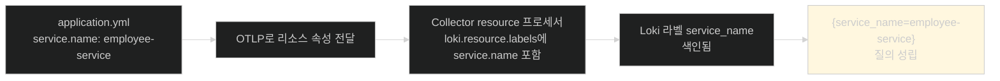
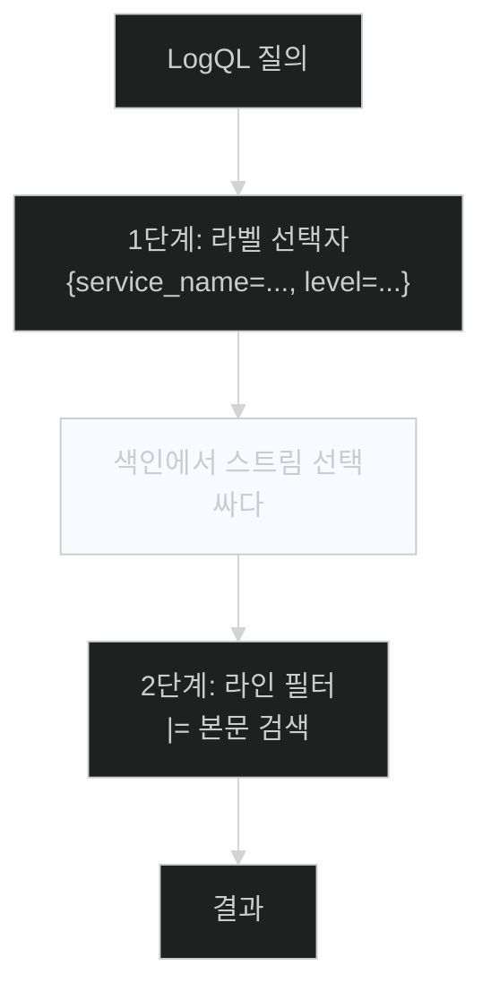

# 라벨로 좁히고 본문을 훑는다 — Grafana에서 로그 확인하기

## 한눈에 보기

| 단계 | 명령·동작 |
|---|---|
| 1 | `docker compose up -d` — 백엔드 스택 기동 |
| 2 | `./mvnw spring-boot:run` — 애플리케이션 기동 |
| 3 | `curl -X POST /employees` — 로그를 만들 사건 발생 |
| 4 | `localhost:3000` → admin/admin → **Explore** → Loki |
| 5 | `{service_name="employee-service"}` 질의 |

| 질문 | 핵심 답 |
|---|---|
| 왜 `service_name`으로 고르나 | Collector가 **라벨로 승격**해 둔 속성이라 색인돼 있다 |
| 왜 점이 밑줄이 됐나 | `service.name` → `service_name` — Loki 라벨 이름 규칙 |
| 레벨 필터 | `{service_name="employee-service", level="ERROR"}` |
| 본문 검색 | `{service_name="employee-service"} \|= "employee"` |
| 두 질의의 차이 | 앞은 **색인 조회**, 뒤는 **좁힌 뒤 스캔** |

## 1. 왜 이게 필요한가

### 출발 장면: 설정을 다 했는데 진짜 도는지 모른다

[[03a-setting-up-the-logging-infrastructure]]와 [[03b-instrumenting-the-application-for-logging]]에서 설정 파일 다섯 개를 고쳤다. 컨테이너 셋, 의존성 다섯, YAML 두 개, XML 하나, 자바 클래스 하나.

**어느 한 곳만 틀려도 로그는 Loki에 도착하지 않는다.** 그리고 대부분의 경우 **오류가 나지 않는다** — 그냥 아무것도 안 보인다.

| 어긋날 수 있는 곳 | 증상 |
|---|---|
| OTLP 엔드포인트 포트 오타 | 조용히 실패 |
| `ObservabilityConfig` 누락 | 조용히 실패 |
| Collector의 exporter 설정 오류 | 조용히 실패 |
| `loki.resource.labels` 누락 | 로그는 오는데 **질의로 못 찾는다** |

그래서 **끝에서 확인하는 절차**가 필요하다. 이 절이 그 절차다.

## 2. 어떻게 동작하는가

### 2.1 사건을 만든다

```bash
% docker compose up -d
% ./mvnw spring-boot:run
```

```bash
curl -X POST http://localhost:8080/employees \
     -H 'Content-Type: application/json' \
     -d '{
          "name": "Wanderson Xesquevixos",
          "email": "wanderson@example.com",
          "role": "ENGINEER"
     }'
```

이 요청 하나가 [[03b-instrumenting-the-application-for-logging]]에서 심은 `log.info` 두 줄을 실행시키고, Kafka 이벤트를 발행하고, 비동기 알림 흐름까지 돌린다. **여러 컴포넌트에서 로그가 나온다**는 점이 중요하다 — 한 요청이 만든 로그가 여러 클래스에 흩어진다.

### 2.2 라벨로 스트림을 고른다

Grafana(`localhost:3000`, admin/admin)에서 **[[Explore]]**(= 대시보드 없이 즉석 질의를 던지는 화면)를 열고 Loki를 고른 뒤 질의를 던진다.

```text
{service_name="employee-service"}
```

이 짧은 질의에 [[03a-setting-up-the-logging-infrastructure]]의 설계 결정이 전부 담겨 있다.



**[[리소스-속성]]**으로 선언한 값이 **[[라벨-승격]]**을 거쳐 색인 라벨이 됐기 때문에 이 질의가 동작한다. 승격하지 않았다면 로그는 저장돼 있어도 이 방식으로는 고를 수 없다.

점이 밑줄로 바뀐 것(`service.name` → `service_name`)은 **[[Loki]]**의 라벨 이름 규칙 때문이다. OpenTelemetry의 속성 이름과 Loki의 라벨 이름이 표기 규칙이 달라 변환된다.

### 2.3 실제로 보이는 것

![[_assets/lsb4-p365-fig13-4-structured-logs-in-grafana-loki.png]]

화면에서 확인되는 것이 셋이다.

**첫째, `Common labels` 줄.**

```text
deployment_environment=local   exporter=OTLP   job=employee-service   service_name=employee-service
```

`deployment_environment`와 `service_name`이 바로 우리가 `loki.resource.labels`에 적어 승격시킨 둘이다. **설정이 실제로 먹었다는 직접 증거**다. `exporter=OTLP`와 `job`은 Loki 익스포터가 자동으로 붙인 것이다.

**둘째, 로그 본문이 JSON이다.**

```json
{"body":"Skipping duplicate employee-created event for employee 2","severity":"INFO","resources":{"service.version":"1.0.0","telemetry.sdk.language":"java","telemetry.sdk.name":"opentelemetry","telemetry.sdk.version":"1.55.0"},"instrumentation_scope":{"name":"com.springbootlearning4.NotificationService"}}
```

**[[구조화-로깅]]**의 결과다. `severity`로 필터할 수 있고 `instrumentation_scope.name`으로 어느 클래스에서 나왔는지 안다. `resources` 안에는 `service.version`처럼 **승격하지 않은** 리소스 속성이 들어 있다 — 라벨은 아니지만 본문에는 남는다는 것을 보여 준다.

**셋째, 여러 컴포넌트의 로그가 한 화면에 있다.** `NotificationService`, `KafkaMessageListenerContainer`, `ClassicKafkaConsumer`가 섞여 있다. 애플리케이션 코드와 프레임워크 로그가 같은 파이프라인으로 나온다.

> **원문 불일치.** [[03b-instrumenting-the-application-for-logging]]의 설정은 패키지를 `com.learningspringboot4`로 지정하는데, 이 화면의 `instrumentation_scope`에는 **`com.springbootlearning4`**로 찍혀 있다. `logging.level.com.learningspringboot4: info` 필터가 실제 패키지와 맞지 않는다는 뜻이다.

### 2.4 두 종류의 질의

책이 주는 나머지 두 질의는 성격이 다르다.

```text
{service_name="employee-service", level="ERROR"}
{service_name="employee-service"} |= "employee"
```

| 질의 | 방식 | 비용 |
|---|---|---|
| 라벨 추가 (`level="ERROR"`) | **색인 조회** — 해당 스트림만 읽는다 | 싸다 |
| 본문 검색 (`\|= "employee"`) | 스트림을 좁힌 뒤 **본문을 스캔** | 스캔 범위에 비례 |

**[[LogQL]]**(= Loki의 질의 언어)의 문법이 이 두 단계를 그대로 반영한다. 중괄호 안은 라벨 선택자, 그 뒤의 `|=`·`!=`·`|~` 등은 라인 필터다.

이 구조가 Loki의 성질을 그대로 드러낸다. **먼저 라벨로 최대한 좁히고, 그다음에 본문을 훑는다.** 라벨 선택자 없이 본문만 검색하는 질의는 사실상 전체 스캔이 되어 느리다.

책의 결론이 간결하다 — **"이것으로 검색 가능한 로깅 시스템을 갖게 됐다."** 이 절 처음의 "세 대에 접속해 `grep`하던" 상황이 질의 한 줄로 바뀌었다.

## 3. 그림으로 보기



| 확인 항목 | 무엇을 증명하나 | 어긋나면 |
|---|---|---|
| Grafana에 로그가 보인다 | 파이프라인 7단계 전부 동작 | 어디선가 끊겼다 |
| `Common labels`에 `service_name` | 라벨 승격 설정이 먹었다 | `loki.resource.labels` 확인 |
| 본문이 JSON | 구조화 로깅이 켜졌다 | `logging.structured.format` 확인 |
| `severity` 필드 존재 | 레벨 필터가 가능하다 | — |
| **traceId가 없다** | 트레이싱이 꺼져 있다 (**정상**) | [[05b-enabling-trace-export-and-kafka-propagation]]에서 켠다 |

## 4. 이 노트에 나온 용어

| 용어 | 한 줄 뜻 | 정의 위치 |
|---|---|---|
| LogQL | Loki의 질의 언어 | [[_glossary#LogQL]] |
| Explore | Grafana의 즉석 질의 화면 | [[_glossary#Explore]] |
| Loki | 라벨만 색인하는 로그 저장 시스템 | [[_glossary#Loki]] |
| 라벨 승격 | 속성을 색인 라벨로 올리는 것 | [[_glossary#라벨-승격]] |
| 리소스 속성 | 텔레메트리 생산자를 나타내는 메타데이터 | [[_glossary#리소스-속성]] |
| 구조화 로깅 | 기계가 파싱 가능한 필드 집합 | [[_glossary#구조화-로깅]] |
| Grafana | 통합 탐색·시각화 도구 | [[_glossary#Grafana]] |

## 5. 자주 헷갈리는 것

**"로그가 안 보이면 애플리케이션이 로그를 안 남긴 것이다"** — 일곱 정거장 중 어디서든 끊길 수 있다. 콘솔에는 보이는데 Grafana에 없다면 3번 이후가 문제다.

**"라벨을 더 넣으면 질의가 편해진다"** — 편해지지만 라벨 조합마다 스트림이 생겨 Loki가 무거워진다.

**"`|=`도 색인을 쓴다"** — 쓰지 않는다. 라벨로 좁힌 **스트림 안을 스캔**한다.

**"traceId가 안 보이는 건 설정이 틀린 것이다"** — 이 시점에서는 **정상**이다. 트레이싱을 꺼 뒀기 때문이다.

## 6. 언제 안 쓰나 / 경계

- **`docker compose up -d`만으로는 준비 완료가 보장되지 않는다.** Loki가 뜨는 데 몇 초 걸리므로 그 사이 전송이 실패할 수 있다. 로그가 비어 보이면 잠시 뒤 다시 질의해 본다.
- **이 검증은 로그 신호 하나만 본다.** 메트릭과 트레이스는 아직 꺼져 있어 이 화면에 나타나지 않는다.
- **Explore는 조사용이지 상시 감시용이 아니다.** 반복해서 볼 질의는 대시보드로 만든다([[04c-verifying-metrics-in-prometheus-and-grafana]]).
- **비유의 한계.** LogQL의 두 단계는 "도서관에서 책 찾기"에 가깝다 — 먼저 서가 번호(라벨)로 구역을 좁히고, 그 구역의 책들을 넘겨 본다(라인 필터). 다만 이 비유는 **서가 번호를 누가 정했는가**를 흐린다. 여기서는 [[03a-setting-up-the-logging-infrastructure]]에서 우리가 직접 골랐고, 고르지 않은 속성으로는 구역을 좁힐 수 없다. 도서관과 달리 분류 체계 자체가 설정의 산물이다.

## 7. 연결

- [[03a-setting-up-the-logging-infrastructure]] — 그 노트의 `loki.resource.labels` 두 줄이 이 화면의 `Common labels`로 나타난다.
- [[03b-instrumenting-the-application-for-logging]] — 그 노트가 심은 `log.info`가 이 화면의 로그 줄이 된다.
- [[04-metrics-with-micrometer-prometheus-and-grafana]] — 로그로는 "얼마나 자주"를 알 수 없다는 한계에서 다음 신호로 넘어간다.

## 8. 스스로 확인

1. 설정이 틀렸을 때 대부분 오류가 아니라 "아무것도 안 보임"으로 나타나는 이유는?
2. `{service_name="employee-service"}` 질의가 성립하기까지 거친 네 단계를 말할 수 있는가?
3. `service.name`이 `service_name`이 된 이유는?
4. `Common labels` 줄에서 무엇을 확인할 수 있는가?
5. `resources` 안에 `service.version`이 있는데 라벨에는 없는 이유는?
6. 라벨 필터와 라인 필터의 비용 차이는 어디서 오는가?
7. 이 시점에 traceId가 없는 것이 정상인 이유는?
8. 도서관 비유가 깨지는 지점은 어디인가?


> 여덟 문항을 스스로 답한 **뒤에** [[_03c-verifying-logs-in-grafana]]에서 모범답안과 대조한다. 먼저 열면 이 문항들은 다시 인출 문제로 쓸 수 없다.

<!-- ==== 아래는 내 영역 · 스킬 수정 금지 ==== -->

## 내 설명 시도


## 막혔던 지점


## 리뷰 이력
