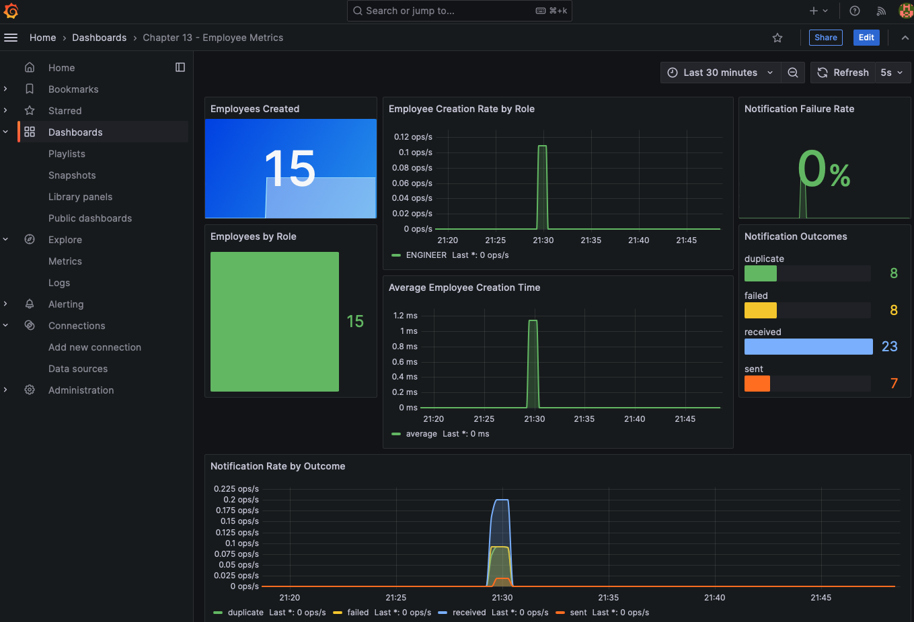

# Micrometer·Prometheus·Grafana 메트릭

## 한눈에 보기

Micrometer가 JVM·HTTP metric과 custom business metric을 기록해 OTLP로 Collector에 보내고, Collector의 Prometheus exporter를 Prometheus가 scrape한다. Counter는 누적 횟수, Timer는 횟수와 latency 분포를 나타내며 tag는 제한된 차원으로 집계한다.

## 1. 왜 이게 필요한가

CPU·request rate만으로는 “직원이 몇 명 생성됐고 notification이 왜 실패하는가”를 알 수 없다. Business metric은 technical health와 실제 업무 결과를 연결한다. `employee.created.count`, `employee.create.time`, `employee.notification.count{outcome=...}`를 함께 보면 synchronous 생성과 Kafka 후속 처리의 throughput·latency·failure를 한 dashboard에서 볼 수 있다.

## 2. 어떻게 동작하는가

Prometheus는 5초마다 Collector의 `:9464` exporter endpoint를 scrape하고, Grafana는 Prometheus data source를 조회한다. Application은 OTLP metrics export를 `http://localhost:4318/v1/metrics`, step 5초로 활성화한다.

```java
return Timer.builder("employee.create.time")
    .tag("role", role)
    .register(meterRegistry)
    .record(() -> createEmployeeAndPublishEvent(employee, role));

meterRegistry.counter("employee.created.count", "role", role).increment();
meterRegistry.counter("employee.notification.count", "outcome", outcome).increment();
```

Dot name은 Prometheus export에서 `employee_created_count_total`처럼 변환될 수 있다. `sum by (role)(employee_created_count_total)`로 role별 집계하고 outcome별 received·duplicate·failed·sent를 비교한다. Role처럼 값 종류가 제한된 tag가 좋고 employee ID·email처럼 거의 매번 다른 값은 time series explosion을 일으키므로 metric label로 쓰지 않는다.

## 3. 그림으로 보기


책의 Figure 13.7은 생성 수·role별 rate·평균 생성 시간·notification outcome을 한 화면에 묶는다.



## 4. 이 노트에 나온 용어

- **MeterRegistry**: Micrometer meter를 생성·등록·export하는 중심 registry.
- **Counter**: 감소하지 않는 event 누적 횟수를 기록하는 metric.
- **Timer**: operation 횟수와 실행 시간을 함께 기록하는 metric.
- **tag**: metric time series를 분류·filter하는 key-value dimension.
- **cardinality**: tag가 가질 수 있는 서로 다른 값 조합의 수.

## 7. 연결

- [[01-three-pillars-of-observability]] — metrics가 전체 경향에 강한 이유다.
- [[05-tracing-with-opentelemetry-and-tempo]] — 같은 operation의 개별 실행 경로를 본다.
- [[chapter-12-messaging-and-asynchronous-communication-in-spring-boot-4/05-reliability-patterns-retries-dlt-idempotency|Kafka 신뢰성]] — retry·duplicate·DLT를 business metric으로 측정한다.

## 8. 스스로 확인

- 전체 1차 정리 후: Counter와 Timer 선택, tag cardinality 제한, OTLP push와 Prometheus scrape의 관계를 설명한다.

<!-- ==== 아래는 내 영역 · 스킬 수정 금지 ==== -->

## 내 설명 시도


## 막혔던 지점


## 리뷰 이력


