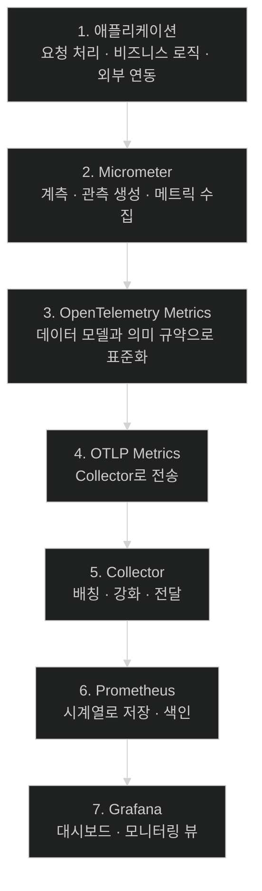
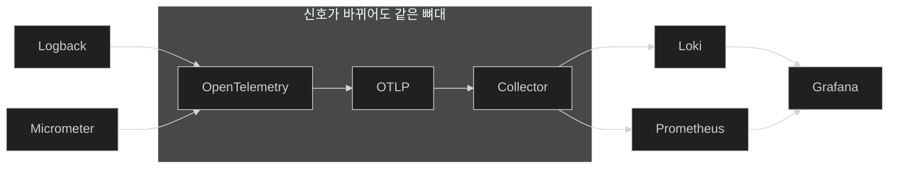

# 얼마나 자주, 얼마나 오래 — 메트릭이 지나는 일곱 정거장

## 한눈에 보기

| 정거장 | 하는 일 |
|---|---|
| 1. 애플리케이션 | 요청 처리·비즈니스 로직·외부 호출을 실행 |
| 2. Micrometer | **관측을 만들고 메트릭을 수집**해 내보낼 준비를 한다 |
| 3. OpenTelemetry Metrics | 메트릭 데이터 모델과 의미 규약으로 표준화 |
| 4. OTLP Metrics | Collector로 내보낸다 |
| 5. Collector | 배칭·강화 후 백엔드로 전달 |
| 6. Prometheus | **시계열**로 저장·색인 |
| 7. Grafana | 대시보드로 시각화 |

| 질문 | 핵심 답 |
|---|---|
| 로그와 무엇이 다른가 | 로그는 **무슨 일이 있었나**, 메트릭은 **얼마나 자주·얼마나 오래·정상인가** |
| 왜 Loki로는 안 되나 | 메트릭에는 **시계열 데이터베이스**가 필요하다 |
| 구조는 로그와 같은가 | **거의 같다.** 2번과 6번만 다르다 |

## 1. 왜 이게 필요한가

### 출발 장면: 로그를 보고 있는데 "정상인지"를 모른다

[[03c-verifying-logs-in-grafana]]에서 Grafana에 로그가 뜬다. 화면에 이런 줄이 있다.

```text
Returning created employee 3
```

성공했다. 그런데 다음 질문에 답할 수 없다.

| 질문 | 로그로 답할 수 있나 |
|---|---|
| 이 요청이 얼마나 걸렸나 | 시작·끝 로그의 시각 차로 **추정**은 된다 |
| 그게 평소보다 느린가 | **불가능** — 비교 대상이 없다 |
| 오늘 몇 건이 생성됐나 | 로그를 세면 되지만 **비싸다** |
| 알림 실패율이 오르고 있나 | 실패 로그를 세고 성공 로그를 세고 나눠야 한다 |
| 지난주 대비 어떤가 | 사실상 불가능 |

문제는 로그가 **개별 사건의 기록**이라는 데 있다. 집계를 하려면 매번 사건 전부를 훑어야 한다. 사건이 하루 백만 건이면 "실패율"을 구하는 일이 백만 줄 스캔이 된다.

**[[메트릭]]**(= 시간에 따라 수집되는 수치 측정값)은 반대 방향이다. **집계된 상태로 저장**한다. 개별 사건은 버리고 "5초 동안 12건, 평균 43ms"만 남긴다.

책의 대비가 정확하다 — **"[[로그]]는 무슨 일이 있었는지 말하고, 메트릭은 얼마나 자주 일어났는지, 얼마나 걸렸는지, 시간에 따라 정상적으로 동작하는지를 말한다."**

## 2. 어떻게 동작하는가

### 2.1 일곱 정거장 — 로그와 거의 같다



[[03-structured-logging-with-loki-and-grafana]]의 일곱 정거장과 나란히 놓으면 **딱 두 칸만 다르다.**

| 정거장 | 로그 | 메트릭 |
|---|---|---|
| 1 | 애플리케이션 | 애플리케이션 |
| 2 | **Logback** | **[[Micrometer]]** |
| 3 | OpenTelemetry (Logs) | OpenTelemetry (Metrics) |
| 4 | OTLP | OTLP |
| 5 | Collector | Collector |
| 6 | **Loki** | **[[Prometheus]]** |
| 7 | Grafana | Grafana |

이 반복이 [[02-designing-an-observability-architecture]]가 말한 통합 모델의 실질적 이득이다. **파이프라인의 뼈대는 신호가 바뀌어도 그대로**이고, 양 끝(생산자와 저장소)만 갈아 끼운다. 그래서 [[04a-setting-up-prometheus-for-metrics]]는 [[03a-setting-up-the-logging-infrastructure]]와 **같은 세 파일에 항목을 더하는** 작업이 된다.

### 2.2 2번 정거장 — Micrometer

로그에서 Logback이 있던 자리에 **[[Micrometer]]**(= 특정 모니터링 시스템에 묶이지 않고 계측할 수 있게 해 주는 파사드)가 온다.

Micrometer가 하는 일을 책은 네 가지로 적는다.

| 하는 일 | 뜻 |
|---|---|
| 계측한다 | 애플리케이션 코드에 측정 지점을 만든다 |
| 관측을 만든다 | [[02-designing-an-observability-architecture]]의 Observation |
| 메트릭을 수집한다 | 카운터·타이머 값을 메모리에 누적한다 |
| 내보낼 준비를 한다 | 주기적으로 스냅숏을 떠서 넘긴다 |

세 번째와 네 번째의 구분이 중요하다. **메트릭은 사건마다 나가지 않는다.** 메모리에 쌓였다가 정해진 주기로 한 번에 나간다. [[04a-setting-up-prometheus-for-metrics]]의 `step: 5s`가 그 주기다.

이것이 로그와의 근본적 차이다. 로그는 사건 하나가 레코드 하나이지만, 메트릭은 **수많은 사건이 숫자 몇 개로 접힌다.**

### 2.3 6번 정거장 — 왜 Loki가 아닌가

Loki가 로그를 저장하는데 메트릭도 거기 넣으면 안 될까. 안 된다. **[[시계열-데이터베이스]]**(= "시각 → 수치" 쌍을 저장하고 구간 질의·집계에 최적화된 저장소)가 필요하기 때문이다.

| | 로그 저장소(Loki) | 시계열 DB(Prometheus) |
|---|---|---|
| 저장 단위 | 텍스트 줄 + 라벨 | **(시각, 숫자) 쌍** + 라벨 |
| 최적화 대상 | 스트림 선택 후 스캔 | **구간 집계·비율 계산** |
| 대표 질의 | "이 서비스의 ERROR 로그" | "지난 1분간 초당 몇 건" |
| 데이터 압축 | 텍스트 압축 | 숫자 특화 압축(델타·XOR) |

마지막 줄이 실질적이다. 5초마다 값 하나씩 한 달을 쌓으면 51만 8천 개인데, 시계열 DB는 연속한 숫자의 차이만 저장하는 식으로 이것을 극도로 줄인다. 텍스트 저장소로는 불가능한 압축이다.

책의 표현대로 **"Loki는 로그를 맡지만 메트릭에는 시간에 따른 수치를 저장할 수 있는 시계열 데이터베이스가 필요하다."**

### 2.4 전체를 한 문장으로

책이 이 절을 요약한 문장이 파이프라인 전체를 담고 있다.

> 애플리케이션이 **Micrometer**를 통해 메트릭을 기록하고, **OpenTelemetry**가 표준화해 **OTLP**로 내보내고, **Collector**가 처리하고, **Prometheus**가 저장하고, **Grafana**가 시각화한다.

각 컴포넌트가 정확히 하나의 책임만 갖는다는 점이 읽힌다. 그래서 어느 하나를 바꿔도 나머지가 영향을 받지 않는다.

## 3. 그림으로 보기



| 축 | 로그 | 메트릭 |
|---|---|---|
| 저장 단위 | 사건 하나 = 레코드 하나 | **여러 사건 = 숫자 몇 개** |
| 전송 시점 | 사건 발생 시(배칭됨) | **주기적 스냅숏** |
| 데이터 양 | 트래픽에 비례해 폭증 | 메트릭 개수 × 태그 조합에 비례 |
| 비용이 터지는 조건 | 로그를 너무 많이 남길 때 | **태그 카디널리티가 높을 때** |
| 잘 답하는 질문 | "그때 무슨 일이 있었나" | "지금 정상인가, 추세가 어떤가" |

## 4. 이 노트에 나온 용어

| 용어 | 한 줄 뜻 | 정의 위치 |
|---|---|---|
| 메트릭 | 시간에 따른 수치 측정값 | [[_glossary#메트릭]] |
| Micrometer | 벤더 중립 계측 파사드 | [[_glossary#Micrometer]] |
| 시계열 데이터베이스 | 시각-수치 쌍에 최적화된 저장소 | [[_glossary#시계열-데이터베이스]] |
| Prometheus | 메트릭 시계열 저장·질의 시스템 | [[_glossary#Prometheus]] |
| OpenTelemetry | 텔레메트리 표준 | [[_glossary#OpenTelemetry]] |
| OTLP | OpenTelemetry의 전송 프로토콜 | [[_glossary#OTLP]] |
| OpenTelemetry Collector | 텔레메트리를 가공·라우팅하는 중간 프로세스 | [[_glossary#OpenTelemetry-Collector]] |
| Grafana | 통합 탐색·시각화 도구 | [[_glossary#Grafana]] |
| 로그 | 사건의 기록 | [[_glossary#로그]] |

## 5. 자주 헷갈리는 것

**"로그를 집계하면 메트릭이다"** — 계산상으로는 가능하지만 **비용이 다르다.** 메트릭은 애초에 집계된 상태로 저장되므로 질의가 싸다.

**"메트릭이 로그보다 낫다"** — 답하는 질문이 다르다. 메트릭은 "무엇이 잘못됐나"를 알려 주지만 "왜"는 로그에만 있다.

**"메트릭도 사건마다 전송된다"** — 주기적으로 스냅숏을 떠서 보낸다. 그래서 매우 짧은 스파이크는 놓칠 수 있다.

**"시계열 DB는 그냥 숫자용 DB다"** — 시간축 특화 압축과 구간 집계가 핵심이다. 일반 DB로는 같은 규모를 감당하기 어렵다.

## 6. 언제 안 쓰나 / 경계

- **메트릭은 개별 요청을 되짚지 못한다.** "p99가 나빠졌다"까지가 한계이고 "그 요청이 어느 것인가"는 트레이스의 몫이다([[05-tracing-with-opentelemetry-and-tempo]]).
- **주기 사이의 급변은 사라진다.** 5초 주기라면 그보다 짧은 스파이크는 평균에 묻힌다.
- **태그가 많아지면 비용이 폭발한다.** 이 위험은 [[04b-adding-custom-business-metrics-with-micrometer]]와 [[05b-enabling-trace-export-and-kafka-propagation]]에서 카디널리티 주제로 다시 나온다.
- **비유의 한계.** 로그와 메트릭의 관계는 "일지와 계기판"에 가깝다. 일지는 사건을 적고 계기판은 현재 수치를 보여 준다. 다만 이 비유는 **계기판이 일지에서 만들어지지 않는다**는 점을 흐린다. 자동차 계기판은 센서를 직접 읽지만, 여기서는 계기판과 일지가 **같은 관측에서 동시에** 파생된다. 그래서 계기판의 눈금 하나에서 그 순간의 일지로 곧장 넘어갈 수 있고, 그것이 [[06-correlating-logs-metrics-and-traces]]의 주제다.

## 7. 연결

- [[01-three-pillars-of-observability]] — 세 기둥 중 두 번째로 넘어오는 지점이다.
- [[03c-verifying-logs-in-grafana]] — 그 노트가 남긴 "얼마나 자주인지는 모른다"는 한계가 이 노트의 출발점이다.
- [[04a-setting-up-prometheus-for-metrics]] — 이 흐름의 5·6·7번을 실제로 세운다. 로그 때와 같은 세 파일을 고친다.

## 8. 스스로 확인

1. 로그로 답할 수 없는 질문 다섯 개를 이 애플리케이션에서 들 수 있는가?
2. "집계된 상태로 저장한다"가 질의 비용에 어떤 차이를 만드는가?
3. 로그와 메트릭의 일곱 정거장에서 다른 칸은 어디이며, 그것이 왜 좋은 설계인가?
4. Micrometer가 하는 네 가지 중 "수집"과 "내보낼 준비"의 차이는?
5. 메트릭을 Loki에 넣으면 안 되는 이유를 저장 구조로 설명할 수 있는가?
6. 5초 주기 전송이 놓칠 수 있는 것은?
7. 일지와 계기판 비유가 깨지는 지점은 어디인가?


> 일곱 문항을 스스로 답한 **뒤에** [[_04-metrics-with-micrometer-prometheus-and-grafana]]에서 모범답안과 대조한다. 먼저 열면 이 문항들은 다시 인출 문제로 쓸 수 없다.

<!-- ==== 아래는 내 영역 · 스킬 수정 금지 ==== -->

## 내 설명 시도


## 막혔던 지점


## 리뷰 이력
